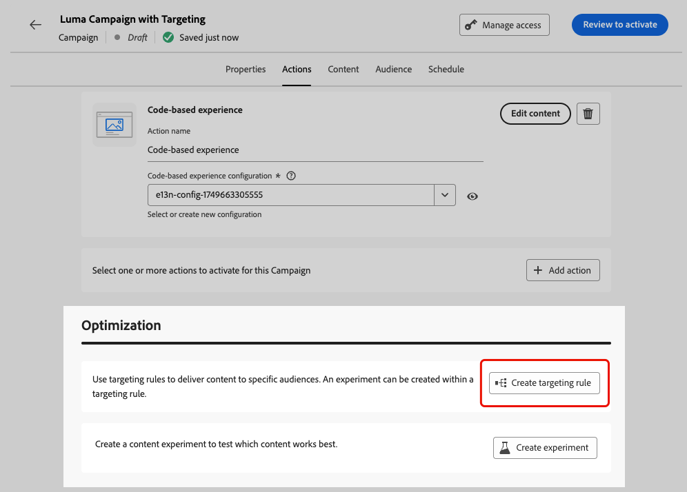

# キャンペーンの最適化 {#message-optimization}

最適化を使用すると、キャンペーンのオーディエンスにパーソナライズされ最適化されたコンテンツを配信でき、<!--based on marketer-defined advanced decision configurations. This ensures that the right message reaches the right audience at the right time in order to maximize the effectiveness of your campaigns. (Removed for now as Decisioning is not yet supported)--> エンゲージメントと成功を最大限に高めて <!--customized and --> 効果的なキャンペーンを作成できます。

最適化を使用すると、次のことができます。

* [ ターゲティング ](#targeting) ルールの活用
* 実行 [ コンテンツ実験 ](#experimentation)
* 1 つのキャンペーン内での実験とターゲティングの両方の [ 詳細な組み合わせ ](#combination) の使用

キャンペーンがライブになると、プロファイルは定義された条件に照らして評価され、一致条件に基づいて、キャンペーンの適切なエクスペリエンスまたはコンテンツで配信されます。

実験とターゲティングの違いの概要を次に示します。

* 実験は、トラフィック配分に基づいてコンテンツを配信する際の、ランダムな分割で行われ&#x200B;ます。
* ターゲティングでは、決定論的手法を使用して、ユーザープロファイル、オーディエンスメンバーシップまたはコンテキストベースのルールに基づいてコンテンツを配信します。

{width="110%" zoomable="yes"}

## ターゲティングの活用 {#targeting}

ターゲティングは、ユーザープロファイル属性またはコンテキスト属性に基づいて、特定のオーディエンスセグメントにパーソナライズされたコンテンツを提供します。

メッセージのコンテンツをランダムに割り当てる実験とは異なり、ターゲティングは、コンテンツを適切なオーディエンスに配信するという点で決定論的です。

ターゲティングを使用すると、次の条件に基づいて特定のルールを定義できます。

* **場所などのユーザープロファイル属性** ジオターゲティング）、年齢または環境設定。 例えば、米国のユーザーには「ゴールデンゲート」プロモーションが表示され、フランスのユーザーには「エッフェル塔」プロモーションが表示されます。

* **コンテキストデータ**：デバイスタイプ（例： デバイスターゲティング）、時間帯またはセッションの詳細。 例えば、デスクトップユーザーはデスクトップ用に最適化されたコンテンツを受信し、モバイルユーザーはモバイル用に最適化されたコンテンツを受信します。

* **オーディエンス**：特定のオーディエンスメンバーシップを持つプロファイルを含めたり除外したりするために使用できます。

キャンペーンでターゲティングを設定するには、次の手順に従います。

1. キャンペーンの作成. [詳細情報](../campaigns/create-campaign.md) <!--Add link to API triggered?-->

1. **[!UICONTROL アクション]** タブから、少なくとも 1 つのアクションを選択します。

1. 「**[!UICONTROL メッセージの最適化]**」セクションで、「**[!UICONTROL ターゲティング]**」を選択します。

   {width=85%}

1. ルールビルダーを使用して条件を定義します。 例えば、米国居住者のルール、フランス居住者のルール、インド居住者のルールを定義します。

   {width=85%}

1. 必要に応じて「**[!UICONTROL フォールバックコンテンツを有効にする]** を選択します。 フォールバックコンテンツを使用すると、ターゲティングルールが認定されていない場合に、オーディエンスがデフォルトコンテンツを受け取ることができます。 このオプションを選択しない場合、上記で定義されたターゲティングルールに該当しないオーディエンスにはコンテンツが届きません。

1. ターゲティングルールの設定を保存します。

1. キャンペーンの「**[!UICONTROL アクション]**」タブに戻り、「**[!UICONTROL コンテンツを編集]**」を選択します。

1. ターゲティングルールの設定で定義した各グループに適したコンテンツを設計します。

   {width=85%}

   この例では、米国居住者向けの特定のコンテンツをデザインします。フランス居住者向けの別のコンテンツと、インド居住者向けの別のコンテンツです。

1. キャンペーンを [ アクティブ化 ](review-activate-campaign.md) します。

キャンペーンがライブになると、米国居住者に特定のメッセージを、フランス居住者に異なるメッセージを送信するために、ターゲットごとにカスタマイズされたコンテンツが送信されます。

<!--Default content:

* If no targeting rules match, default content can be delivered.

* If default content is not enabled, passthrough behavior ensures lower-priority campaigns are evaluated.-->

## 実験を使用 {#experimentation}

実験を使用すると、複数のバージョンのコンテンツをテストし、事前定義された成功指標に基づいて最もパフォーマンスが高いコンテンツを判断できます。

キャンペーンで実験を設定するには、次の手順に従います。

キャンペーンで次のプロモーションメッセージをテストするとします。

* **処理 A**:「次回購入が 20% オフ」
* **処理 B**:「50 ドルを超える注文の送料無料」
* **治療 C**:「10 ドルのギフトカードを手に入れよう」

実験を設定し、最も多くの購入を促進するメッセージを特定するには、次の手順に従います。

1. キャンペーンの作成. [詳細情報](../campaigns/create-campaign.md) <!--Add link to API triggered?-->

1. 「**[!UICONTROL アクション]**」タブから、少なくとも 2 つのインバウンドアクション（例：[ コードベースのエクスペリエンス ](../code-based/get-started-code-based.md) および [ アプリ内 ](../in-app/get-started-in-app.md) を選択します。

1. 「**[!UICONTROL メッセージの最適化]**」セクションで、「**[!UICONTROL 実験]**」を選択します。

   {width=85%}

1. 必要に応じてコンテンツ実験を設計および設定します。 [詳細情報](../content-management/content-experiment.md)

   {width=85%}

   実験を定義すると、そのキャンペーンに挿入されたすべてのアクションに適用されます。つまり、同じ顧客には、すべてのサーフェスで同じオファーが表示されます。

   >[!NOTE]
   >
   >他のアクションを選択することもできます。キャンペーンに追加されたすべてのアクションに実験が適用されます。

1. キャンペーンを [ アクティブ化 ](review-activate-campaign.md) します。

キャンペーンがライブになると、ユーザーには様々なコンテンツのバリエーションがランダムに割り当てられます。 [!DNL Journey Optimizer] では、どのバリエーションがより多くの購入を促進し、実用的なインサイトを提供するかを追跡します。

[ 実験キャンペーンレポート ](../reports/campaign-global-report-cja-experimentation.md) を使用して、キャンペーンが成功したかどうかを追跡します。

## ターゲティングと実験を組み合わせる {#combination}

また、Journey Optimizerでは、ターゲティングと実験を 1 つのキャンペーン内で組み合わせて、より高度な戦略を作成できます。

ターゲティングを使用して複数のバリアントを作成でき、各バリアントに対して、実験を使用して各コンテンツをさらに最適化できます。 これにより、実験が各ターゲティングルールに固有になり、キャンペーン内のバリアントをまたいで行われなくなります。

例えば、米国の顧客に対して「50% オフのプロモーション」と「$50」のギフトカードをテストし、ヨーロッパの顧客に対して「50 ユーロを超える注文の送料無料」や「次回購入の 20% オフ」など、別のテストを実行できます。

キャンペーンでターゲティングと実験の両方を組み合わせるには、次の手順に従います。

1. 複数のターゲティングルールを定義するキャンペーンを作成します。 [詳細情報](#targeting)

   {width=85%}

1. 最初のターゲティングルールの実験を作成します。

1. 必要に応じてコンテンツ実験を設計および設定します。 [詳細情報](../content-management/content-experiment.md)

   {width=85%}

   実験が定義されると、最初のターゲティングルールにのみ適用されます。

1. キャンペーンの「**[!UICONTROL アクション]**」タブに戻り、「**[!UICONTROL コンテンツを編集]**」を選択します。

1. 最初のターゲティングルールで定義したグループに対して、実験の各バリアントに特定のコンテンツを定義できます。

   キャンペーンに複数のインバウンドアクションを追加した場合、ターゲティングと実験の同じ組み合わせが各アクションに適用されます。 ただし、各アクションのバリアントごとに特定のコンテンツを定義する必要があります。

   {width=85%}

1. 他のターゲティングルールでも同様に続行し、各バリアントに対応するコンテンツをデザインします。

1. 変更を保存し、キャンペーンを [ アクティブ化 ](review-activate-campaign.md) します。

キャンペーンがライブになると、各ターゲットグループのユーザーには、属するグループに定義されている様々なコンテンツのバリエーションがランダムに割り当てられます。

<!--
## Reporting on Message optimization

E.g. explaining how a marketer can look at the report to determine which treatment (e.g. which message content) is performing the best for the targeting audience
-->

