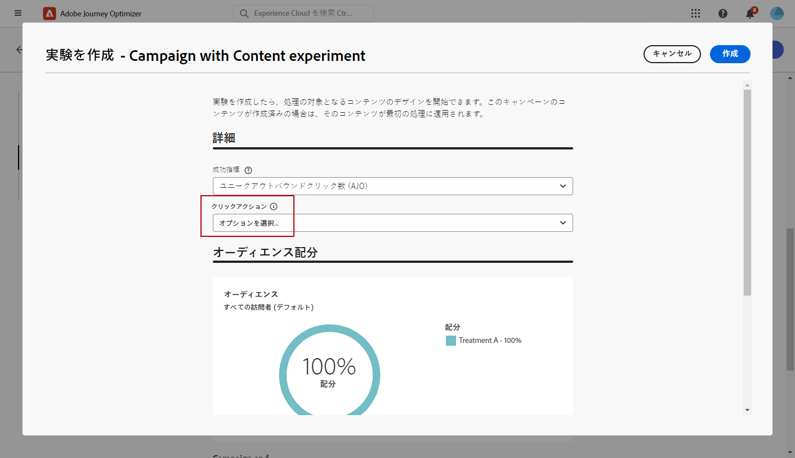
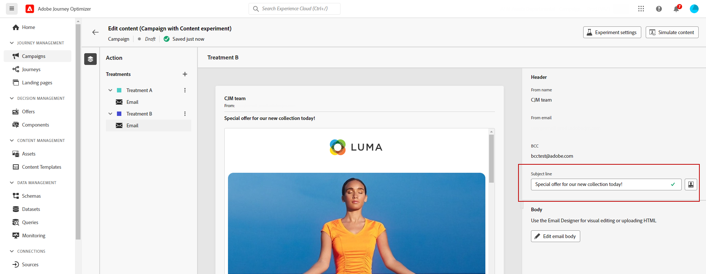

# コンテンツ実験を作成 {#content-experiment}

>[!CONTEXTUALHELP]
>id="ajo_campaigns_content_experiment"
>title="コンテンツ実験"
>abstract="複数の処理を定義してオーディエンスに最適な組み合わせを決定するために、メッセージのコンテンツ、件名、送信者を変更することを選択できます。"

>[!NOTE]
>
>コンテンツ実験を開始する前に、レポート設定がカスタムデータセットに対応するよう設定されていることを確認します。詳しくは、[この節](reporting-configuration.md)を参照してください。

Journey Optimizer のコンテンツ実験を使用すると、複数の配信処理を定義して、ターゲットオーディエンスに最適なパフォーマンスを発揮する配信を測定できます。配信コンテンツ、件名または送信者を変更できます。関心のあるオーディエンスが各処理にランダムに割り当てられて、指定の指標に関して最も効果が高い処理が判断されます。

次の例では、配信ターゲットが 2 つのグループ（それぞれがターゲット母集団の 45％を表す）に分割されています。10％の除外グループは配信を受け取りません。

ターゲットオーディエンスの各ユーザーには、1 つのバージョンのメール（件名は次の 2 つのいずれか）が届きます。

* 1 つは、新しいコレクションと画像に関する 10％のオファーを直接プロモーションするものです。
* もう 1 つは、画像なしで 10％オフを指定せずに、特別なオファーを広告するだけのものです。

ここでの目標は、受信した実験に応じて、受信者がメールとやり取りするかどうかを確認することです。 そのため、このコンテンツ実験の主な目標指標として「**[!UICONTROL メール開封数]**」を選択します。

## キャンペーンの作成 {#campaign-experiment}

1. **[!UICONTROL キャンペーン]**&#x200B;ページから、「**[!UICONTROL キャンペーンを作成]**」をクリックします。

   

<!--
1. In the **[!UICONTROL Properties]** section, choose your **[!UICONTROL Campaign type]**:

    * **[!UICONTROL Scheduled]**: designed to send marketing messages and can be executed immediately or at a specified date.

    * **[!UICONTROL API-Triggered]**: designed to send transactional messages, such as password reset notifications or cart abandonment reminders. 
    
        To execute an API-triggered campaign, you will need to make an API call. [Learn more](api-triggered-campaigns.md)
-->
1. チャネルを選択したあと、この配信に使用する「**[!UICONTROL サーフェス]**」を選択して、「**[!UICONTROL 作成]**」をクリックします。詳しくは、[チャネルサーフェス](../configuration/channel-surfaces.md)ページを参照してください。

   この例では、メールを使用してキャンペーンを送信することを選択します。

   

1. 配信の&#x200B;**[!UICONTROL プロパティ]**&#x200B;を次のように設定します。
   * **[!UICONTROL 名前]**
   * **[!UICONTROL 説明]**

1. ターゲットとするオーディエンスを定義します。それには、「**[!UICONTROL オーディエンスを選択]**」ボタンをクリックして、使用可能な Adobe Experience Platform オーディエンスのリストを表示します。[詳しくは、オーディエンスを参照してください](../audience/about-audiences.md)。

   「**[!UICONTROL ID 名前空間]**」フィールドで、選択したオーディエンスから個人を識別するために使用する名前空間を選択します。[詳細情報](get-started-experiment.md#content-experiment-work)

   

1. 「**[!UICONTROL アクショントラッキング]**」セクションで、配信に対する受信者の反応を追跡するかどうかを指定します。クリック数や開封数を追跡できます。

   キャンペーンが実行されると、キャンペーンレポートからトラッキング結果にアクセスできるようになります。

1. キャンペーンを特定の日付に実行したり、繰り返し実行したりするには、「**[!UICONTROL スケジュール]**」セクションを設定します。 [詳細情報](create-campaign.md)

1. 「**[!UICONTROL コンテンツを編集]**」をクリックして、配信のパーソナライズを開始します。

   

1. **[!UICONTROL コンテンツを編集]**&#x200B;ウィンドウから、処理 A のパーソナライズを開始します。

   この処理では、件名に特別なオファーを直接指定し、パーソナライゼーションを加えます。

   

## コンテンツ実験の設定 {#configure-experiment}

>[!CONTEXTUALHELP]
>id="ajo_campaigns_content_experiment_dimension"
>title="ディメンション"
>abstract="特定のクリック数や、特定のページのビュー数など、実験で追跡する特定のディメンションを選択します。"

>[!CONTEXTUALHELP]
>id="ajo_campaigns_content_experiment_success_metric"
>title="成功指標"
>abstract="成功指標は、実験で最もパフォーマンスの高い処理を追跡および評価するために使用します。使用する前に、特定の指標に合わせてデータセットを設定してください。"

1. メッセージをパーソナライズしたら、キャンペーンの概要ページで「**[!UICONTROL 実験を作成]**」をクリックして、コンテンツ実験の設定を開始します。

   

1. 実験に設定する&#x200B;**[!UICONTROL 成功指標]**&#x200B;を選択します。

   この実験では、「**[!UICONTROL メール開封数]**」を選択して、件名にプロモーションコードが含まれている場合にプロファイルがメールを開くかどうかをテストします。

   

1. アプリ内または web チャネルを使用して実験をセットアップし、「**[!UICONTROL インバウンドクリック数]**」、「**[!UICONTROL ユニークインバウンドクリック数]**」、「**[!UICONTROL ページビュー数]**」、「**[!UICONTROL ユニークページビュー数]**」のいずれかの指標を選択する場合、**[!UICONTROL クリックアクション]**&#x200B;ドロップダウンで、特定のページのクリック数とビュー数を正確に追跡および監視できます。

   

1. 「**[!UICONTROL 処理を追加]**」をクリックして、新しい処理を必要な数だけ作成します。

   

1. 処理の「**[!UICONTROL タイトル]**」を変更して、区別しやすくします。

1. 配信に&#x200B;**[!UICONTROL 除外]**&#x200B;グループを追加することを選択します。このグループは、このキャンペーンからコンテンツを受け取りません。

   切り替えバーをオンにすると、母集団の 10%が自動的に取得されます。必要に応じて、この割合を調整できます。

   

1. その後、各&#x200B;**[!UICONTROL 処理]**&#x200B;に正確な割合を割り当てるか、**[!UICONTROL 等しく分布]**&#x200B;切り替えバーをオンにするかを選択できます。

   

1. 設定が完了したら、「**[!UICONTROL 作成]**」をクリックします。

## 処理の設計 {#treatment-experiment}

1. **[!UICONTROL コンテンツを編集]**&#x200B;ウィンドウで、処理 B を選択してコンテンツを変更します。

   ここでは、「**[!UICONTROL 件名]**」でオファーを指定しないようにします。

   

1. 「**[!UICONTROL メール本文を編集]**」をクリックして、処理 B をさらにパーソナライズします。

   

1. 処理を設計したら、「**[!UICONTROL その他のアクション]**」をクリックして、処理に関連するオプション（「**[!UICONTROL 名前変更]**」、「**[!UICONTROL 複製]**」および「**[!UICONTROL 削除]**」）にアクセスします。

   

1. 必要に応じて、 **[!UICONTROL 実験の設定]**&#x200B;メニューにアクセスして、処理の設定を変更します。

   

1. メッセージコンテンツを定義したら、「**[!UICONTROL コンテンツをシミュレート]**」ボタンをクリックして配信のレンダリングを制御したり、テストプロファイルでパーソナライズ設定を確認したります。[詳細情報](../content-management/preview-test.md)

1. コンテンツ実験の準備が整ったら、キャンペーンの概要ページで「**[!UICONTROL アクティブ化するレビュー]**」をクリックして、キャンペーンの概要を表示できます。パラメーターが正しくない、または見つからない場合は、警告が表示されます。

   

1. キャンペーンが正しく設定されていることを確認し、「**[!UICONTROL アクティブ化]**」をクリックしてキャンペーンを開始します。

   

実験とキャンペーンを設定したら、キャンペーンのレポートを使用して、問題なく配信できたかどうかを追跡できます。[詳細情報](../reports/campaign-global-report.md#experimentation-report)
