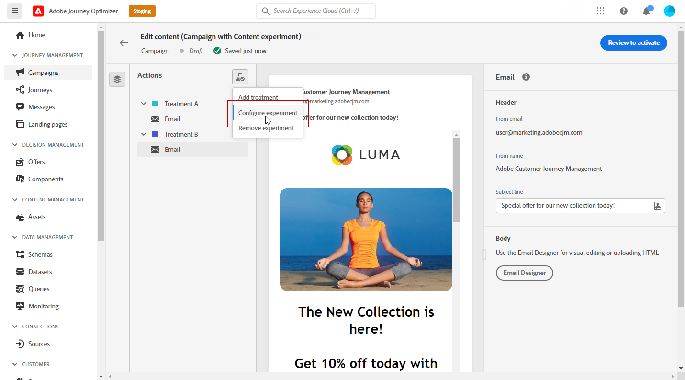
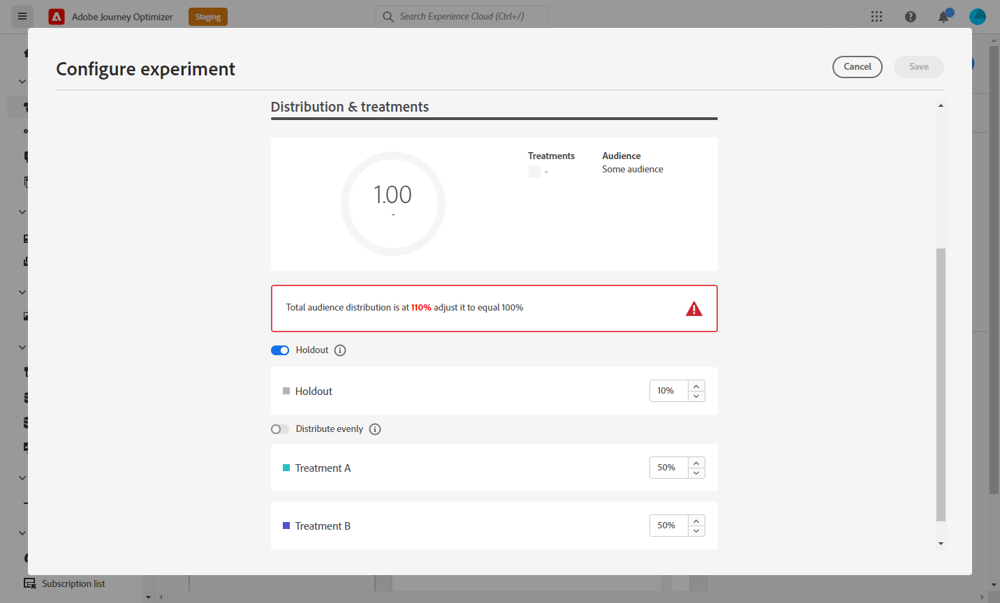
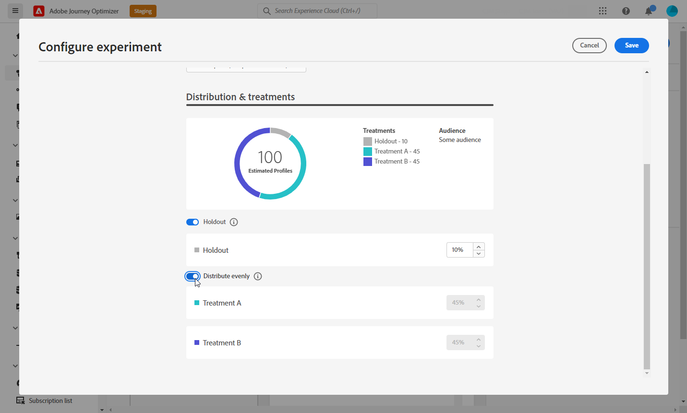

# コンテンツ実験の作成 {#content-experiment}

>[!AVAILABILITY]
>
>この **コンテンツ実験** 機能は、現在、一連の組織（限定提供）でのみ使用できます。 詳しくは、アドビ担当者にお問い合わせください。

Journey Optimizer Content Experiment を使用して、複数の配信トリートメントを定義します。 関心のあるオーディエンスは、関心の指標に関してどれが最も効果が高いかを判断するために、各処理にランダムに割り当てられます。メールのコンテンツ、件名、送信者を変更できます。

>[!NOTE]
>
>コンテンツ実験を開始する前に、レポート設定がカスタムデータセットに対して設定されていることを確認します。 詳しくは、[この節](reporting-configuration.md)を参照してください。

次の例では、配信ターゲットが 2 つのグループ（それぞれがターゲット母集団の 45％を表す）に分割されています。10％の除外グループは配信を受け取りません。

ターゲットオーディエンスの各ユーザーには、1 つのバージョンのメールが届き、件名は次の 2 つのいずれかに該当します。

* 1 つは、新しいコレクションと画像に関する 10％のオファーを直接プロモーションするものです。
* もう 1 つは、画像なしで 10％オフを指定せずに、特別なオファーを広告するだけのものです。

ここでの目標は、受信した実験に応じて、受信者がメールとやり取りするかどうかを確認することです。 そのため、このコンテンツ実験の主な目標指標として「**[!UICONTROL メール開封数]**」を選択します。

## キャンペーンを作成 {#campaign-experiment}

1. 次の **[!UICONTROL キャンペーン]** ページ、クリック **[!UICONTROL キャンペーンを作成]**.

   

1. 「**[!UICONTROL メール]**」を選択し、この配信に使用する「**[!UICONTROL サーフェス]**」を選択します。詳しくは、[チャネルサーフェス](../configuration/channel-surfaces.md)ページを参照してください。

   

1. 「**[!UICONTROL 作成]**」をクリックします。

1. 配信の&#x200B;**[!UICONTROL プロパティ]**&#x200B;を設定します。
   * **[!UICONTROL タイトル]**
   * **[!UICONTROL 説明]**
   * **[!UICONTROL カテゴリ]**：**[!UICONTROL マーケティング]**／**[!UICONTROL トランザクション]**

1. コンテンツ実験を開始するには、「**[!UICONTROL コンテンツ実験]**」オプションを切り替えます。この **[!UICONTROL コンテンツ実験]** メニューが表示されます。

   

1. 配信の&#x200B;**[!UICONTROL オーディエンス]**&#x200B;と&#x200B;**[!UICONTROL スケジュール]**&#x200B;のパラメーターを設定します。[詳細情報](create-campaign.md)

1. 「**[!UICONTROL コンテンツを編集]**」をクリックして、様々な&#x200B;**[!UICONTROL 処理]**&#x200B;のパーソナライズを開始します。

   

## 処理の作成 {#treatment-experiment}

1. **[!UICONTROL コンテンツを編集]**&#x200B;ウィンドウから、処理 A メールの&#x200B;**[!UICONTROL 件名]**&#x200B;を追加し、「**[!UICONTROL 保存]**」をクリックします。

   この処理では、件名にオファーを直接指定します。

   

1. 「**[!UICONTROL E メール デザイナー]**」をクリックし、配信のパーソナライズを開始します。

   

1. メールをデザインしたら、「**[!UICONTROL 保存]**」をクリックして&#x200B;**[!UICONTROL コンテンツを編集]**&#x200B;ウィンドウに戻り、処理 B を作成します。

1. 「**[!UICONTROL その他のアクション]**」ボタンから、「**[!UICONTROL 複製]**」をクリックします。

   また、「**[!UICONTROL コンテンツ実験]**」ボタンをクリックして詳細オプションにアクセスし、「**[!UICONTROL 処理を追加]**」をクリックして、新しい処理を最初から開始することもできます。

   

1. 処理の&#x200B;**[!UICONTROL タイトル]**&#x200B;を変更し、より区別しやすくします。

   

1. 新しく作成した&#x200B;**[!UICONTROL 処理]**&#x200B;にリンクされたメール配信を選択します。

1. 配信の&#x200B;**[!UICONTROL 件名]**&#x200B;を追加します。

   この処理では、**[!UICONTROL 件名]**&#x200B;にオファーを指定しないことを選択します。

   

1. 必要に応じて、「**[!UICONTROL E メールデザイナー]**」をクリックして、処理 B の配信をさらにパーソナライズします。

処理がパーソナライズされたら、コンテンツ実験の設定を開始できます。

## Content Experiment の設定 {#configure-experiment}

1. 両方の配信がパーソナライズされている場合は、**[!UICONTROL コンテンツを編集]**&#x200B;ウィンドウから「**[!UICONTROL コンテンツ実験を設定]**」を選択します。

   

1. 実験に設定する目標を選択します。

   この実験では、件名にプロモーションコードが含まれている場合に受信者がメールを開くかどうかをテストするために、「**[!UICONTROL メール開封数]**」を選択します。

   

1. 配信に&#x200B;**[!UICONTROL 除外]**&#x200B;グループを追加することを選択します。このグループは、このキャンペーンからコンテンツを受け取りません。

   切り替えバーをオンにすると、母集団の 10%が自動的に取得されます。必要に応じて、この割合を調整できます。

   

1. その後、各&#x200B;**[!UICONTROL 処理]**&#x200B;に正確な割合を割り当てるか、**[!UICONTROL 等しく分布]**&#x200B;切り替えバーをオンにするかを選択できます。

   

1. 設定したら「**[!UICONTROL 保存]**」をクリックします。

1. コンテンツ実験の準備が整ったら、「**[!UICONTROL アクティブ化するレビュー]**」をクリックして、キャンペーンの概要を表示できます。パラメーターが正しくない、または見つからない場合は、警告が表示されます。

   

1. キャンペーンが正しく設定されていることを確認し、「**[!UICONTROL アクティブ化]**」をクリックしてキャンペーンを開始します。

   

実験とキャンペーンを設定したら、キャンペーンレポートで配信の成功をフォローできます。

## 目標レポート {#objectives-global}

>[!AVAILABILITY]
>
>コンテンツ実験機能は現在、一連の組織でのみ使用できます（使用制限があります）。詳しくは、アドビ担当者にお問い合わせください。

キャンペーンレポートの「**[!UICONTROL 目標]**」タブを使用すると、1 つの特定の指標をターゲット設定することで、配信のレポートをより細かく調整できます。

一覧表示された&#x200B;**[!UICONTROL 目標]**&#x200B;は、追加情報を取得するためのシステムへの接続を定義する&#x200B;**[!UICONTROL データセット]**&#x200B;にリンクされています。ビルトインの&#x200B;**[!UICONTROL 目標]**&#x200B;リストが用意されていますが、新しい&#x200B;**[!UICONTROL データセット]**&#x200B;を追加することで独自の目標を追加できます。詳細な手順については、次を参照してください。 [セクション](reporting-configuration.md).

ターゲットにする目標を選択した後、2 つの&#x200B;**[!UICONTROL パフォーマンスの概要]**&#x200B;および&#x200B;**[!UICONTROL キャンペーン目的]**&#x200B;ウィジェットには、配信パフォーマンスの詳細な概要が表示されます。

**[!UICONTROL キャンペーン目的]**&#x200B;ウィジェットを使用して、主な目標を別の指標と比較することもできます。

必要に応じて、各ウィジェットのサイズを変更することや削除することができます。詳しくは、この[節](../reports/global-report.md#modify-dashboard)を参照してください。

## 実験レポート {#experimentation-global}

>[!AVAILABILITY]
>
>コンテンツ実験機能は現在、一連の組織でのみ使用できます（使用制限があります）。詳しくは、アドビ担当者にお問い合わせください。

キャンペーンの&#x200B;**[!UICONTROL グローバルレポート]**&#x200B;の「**[!UICONTROL 実験]**」タブには、各バリアントのパフォーマンスや最も優れたパフォーマンス関する情報が表示されます。

最も高いパフォーマンスを定義するには、しばらく時間がかかる場合があり、このアイコン  が表示されます。

**[!UICONTROL 実験結果]**&#x200B;ウィジェットは、各バリアントのパフォーマンスの詳細を説明します。ベースラインを変更するには、**[!UICONTROL ベースライン]**&#x200B;ドロップダウンから処理の 1 つを選択します。最も優れた処理には、星のアイコンが表示されます。

このテーブルは、次の指標を表しています。

* **[!UICONTROL プロファイル]**：この処理の対象となるプロファイルの数。

* **[!UICONTROL ユニークアウトバウンドクリック数]**：アウトバウンドチャネルでのクリック総数。

* **[!UICONTROL プロファイルあたりのカウント]**：実験の目的の指標の合計値を、プロファイル数で割った値です。

* **[!UICONTROL 信頼区間]**：ベースラインと最もパフォーマンスの高い処理との間のパフォーマンスの差の割合。[詳細情報](../campaigns/experiment-calculations.md#confidence-intervals)。

* **[!UICONTROL 平均上昇率]**：ベースラインに対する特定の処理のコンバージョン率における改善の割合。 [詳細情報](../campaigns/experiment-calculations.md#understand-lift)

* **[!UICONTROL 信頼性]**：ある処理がベースライン処理と同じであることを示す証拠。[詳細情報](../campaigns/experiment-calculations.md#understand-confidence)

これらの結果の詳細と解釈について詳しくは、[このページ](../campaigns/get-started-experiment.md#interpret-results)を参照してください。
