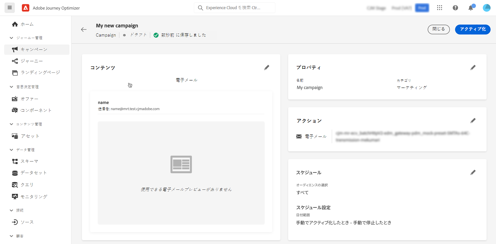

# キャンペーンの作成 {#create-campaign}

>[!NOTE]
>
>新しいキャンペーンを作成する前に、サーフェスチャネル（メッセージプリセット）と Adobe Experience Platform セグメントが使用できる状態になっていることを確認します。詳しくは、以下の節を参照してください。
>
>* [チャネルサーフェスの作成](../configuration/channel-surfaces.md)
>* [セグメントの基本を学ぶ](../segment/about-segments.md)

## 最初のキャンペーンを作成 {#create}

1. **[!UICONTROL キャンペーン]**&#x200B;メニューにアクセスし、「**[!UICONTROL キャンペーンを作成]**」をクリックします。

   >[!NOTE]
   >
   >また、既存のライブキャンペーンを複製して新しいキャンペーンを作成することもできます。 [詳細情報](modify-stop-campaign.md#duplicate)

   

<!--1. In the **[!UICONTROL Properties]** section, specify when you want to execute the campaign:

    * **[!UICONTROL Scheduled]**: execute the campaign immediately or on a specified date. Scheduled campaigns are aimed at sending **marketing** type messages.
    * **[!UICONTROL API-triggered]**: execute the campaign using an API call. API-triggered campaigns are aimed at sending **transactional** messages, i.e. messages sent out following an action performed by an individual: password reset, card abandonment etc. [Learn how to trigger a campaign using APIs](api-triggered-campaigns.md)-->

1. 「**[!UICONTROL アクション]**」セクションで、メッセージの送信に使用するチャネルとチャネルサーフェスを選択し、「**[!UICONTROL 作成]**」をクリックします。

   サーフェスは、[システム管理者](../start/path/administrator.md)によって定義された設定です。ヘッダーパラメーター、サブドメイン、モバイルアプリなど、メッセージを送信するためのすべての技術的なパラメーターが含まれています。 [詳細情報](../configuration/channel-surfaces.md)。

   

   >[!NOTE]
   >
   >ドロップダウンリストには、マーケティングキャンペーンタイプと互換性のあるチャネルサーフェスのみが表示されます。

<!--Only channel surfaces compatible with the campaign type (marketing or transactional) are listed in the drop-down list.-->

1. キャンペーンのタイトルと説明を指定します。

   <!--To test the content of your message, toggle the **[!UICONTROL Content experiment]** option on. This allows you to test multiple variables of a delivery on populations samples, in order to define which treatment has the biggest impact on the targeted population.[Learn more about content experiment](../campaigns/content-experiment.md).-->

1. 「**[!UICONTROL アクション]**」セクションで、キャンペーンで送信するメッセージを設定します。

   1. 「**[!UICONTROL コンテンツを編集]**」ボタンをクリックして、メッセージコンテンツを設定およびデザインします。 [メッセージについて詳しくはこちらを参照](../messages/get-started-content.md)してください。

      メッセージコンテンツを作成する詳細な手順については、次のページを参照してください。

      * [E メールの作成](../messages/create-email.md)
      * [プッシュ通知の作成](../messages/create-push.md)
      * [SMS メッセージの作成](../messages/create-sms.md)
   1. コンテンツを定義したら、 **[!UICONTROL コンテンツをシミュレート]** ボタンを使用して、コンテンツをテストプロファイルでプレビューおよびテストします。 [詳細情報](../design/preview.md)。

   1. 矢印をクリックして、キャンペーン作成画面に戻ります。

      

   1. 内 **[!UICONTROL アクションのトラッキング]** セクションで、受信者が配信に対する反応を追跡するかどうかを指定します。クリック数や開封数を追跡できます。

      キャンペーンが実行されると、キャンペーンレポートからトラッキング結果にアクセスできるようになります。[キャンペーンレポートについて詳しくはこちらを参照](../reports/campaign-global-report.md)

1. ターゲットとするオーディエンスを定義します。それには、「**[!UICONTROL オーディエンスを選択]**」ボタンをクリックして、使用可能な Adobe Experience Platform セグメントのリストを表示します。[セグメントについて詳しくはこちらを参照](../segment/about-segments.md)

   <!-- NOTE For API-triggered campaigns, the audience needs to be set via API call. [Learn more](api-triggered-campaigns.md)-->

   「**[!UICONTROL ID 名前空間]**」フィールドで、選択したセグメントから個人を識別するために使用する名前空間を選択します。[名前空間について詳しくはこちらを参照](../event/about-creating.md#select-the-namespace)

   

   >[!NOTE]
   >
   >様々な ID の中から選択した ID（名前空間）を持たないセグメントに属する個人は、キャンペーンのターゲットになりません。

   <!--If you are are creating an API-triggered campaign, the **[!UICONTROL cURL request]** section allows you to retrieve the **[!UICONTROL Campaign ID]** to use in the API call. [Learn more](api-triggered-campaigns.md)-->

1. 特定の日付または繰り返し頻度でキャンペーンを実行するには、 **[!UICONTROL スケジュール]** 」セクションに入力します。 [キャンペーンのスケジュール方法を説明します](#schedule)

キャンペーンの準備が整ったら、キャンペーンを確認してパブリッシュできます。 [詳細情報](#review-activate)

## キャンペーンのレビューとアクティブ化 {#review-activate}

キャンペーンを設定したら、アクティブ化する前にそのパラメーターとコンテンツをレビューする必要があります。それには、次の手順に従います。

1. キャンペーンの設定画面で、「**[!UICONTROL アクティブ化するレビュー]**」をクリックして、キャンペーンの概要を表示します。

   概要では、必要に応じてキャンペーンを変更し、パラメーターが正しくないか、または見つからないかを確認できます。

   >[!IMPORTANT]
   >
   >エラーが発生した場合は、キャンペーンを有効化できません。 続行する前にエラーを解決します。

   

1. キャンペーンが正しく設定されていることを確認してから、「**[!UICONTROL アクティブ化]**」をクリックします。

   

1. これで、キャンペーンがアクティブ化されます。 ステータスは次のとおりです。 **[!UICONTROL ライブ]**&#x200B;または **[!UICONTROL 予定]** 開始日を入力した場合。 [キャンペーンのステータスについて詳しくはこちらを参照](get-started-with-campaigns.md#statuses).

   キャンペーンに設定されたメッセージは、即座に、または指定した日付に送信されます。

   >[!NOTE]
   >
   >この **[!UICONTROL 完了]** ステータスは、キャンペーンがアクティブ化されてから 3 日後、または繰り返し実行されている場合はキャンペーンの終了日に自動的に割り当てられます。
   >
   >終了日が指定されていない場合、キャンペーンは **[!UICONTROL ライブ]** ステータス。 変更するには、キャンペーンを手動で停止する必要があります。 [キャンペーンの停止方法についてはこちらを参照](modify-stop-campaign.md)

1. キャンペーンがアクティブ化されると、キャンペーンを開いて、いつでもその情報を確認できます。概要では、ターゲットプロファイルの数と、配信されたアクションおよび失敗したアクションの数に関する統計情報を取得できます。

   「**[!UICONTROL レポート]**」ボタンをクリックして、専用レポートでさらに統計情報を取得することもできます。[詳細情報](../reports/campaign-global-report.md)

   

## キャンペーンのスケジュール設定 {#schedule}

デフォルトでは、キャンペーンは手動でアクティブ化した後に開始し、メッセージが 1 回送信され次第終了します。

キャンペーンのメッセージを送信する頻度を定義できます。 これをおこなうには、 **[!UICONTROL アクショントリガー]** オプションを使用して、キャンペーンを毎日、毎週または毎月のどれで実行するかを指定できます。

有効化直後にキャンペーンを実行しない場合は、 **[!UICONTROL キャンペーン開始]** オプション。 この  **[!UICONTROL キャンペーン終了]** 「 」オプションを使用すると、繰り返しキャンペーンの実行を停止するタイミングを指定できます。

