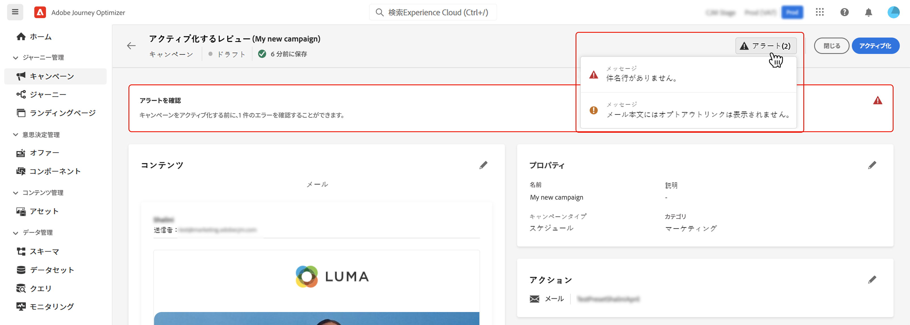

# キャンペーンの作成 {#create-campaign}

>[!NOTE]
>
>新しいキャンペーンを作成する前に、メッセージプリセットとAdobe Experience Platformセグメントが使用できる状態になっていることを確認します。 詳しくは、次の節を参照してください。
>
>* [メッセージプリセットの作成](../configuration/message-presets.md)
>* [セグメントの基本を学ぶ](../segment/about-segments.md)

## キャンペーンの設定 {#configure}

キャンペーンを作成する手順は次のとおりです。

1. 次にアクセス： **[!UICONTROL キャンペーン]** メニュー、次に「 **[!UICONTROL キャンペーンを作成]**.

   

<!--1. In the **[!UICONTROL Properties]** section, specify when you want to execute the campaign:

    * **[!UICONTROL Scheduled]**: execute the campaign immediately or on a specified date,
    * **[!UICONTROL API-triggered]**: execute the campaign using an API call. In this case, profiles to be targeted and triggers for actions need to be set via the API call.-->

1. 内 **[!UICONTROL アクション]** 「 」セクションで、メッセージの送信に使用するチャネルとメッセージの表面（メッセージプリセット）を選択します。

   

1. キャンペーンのタイトルと説明を指定します。

   <!--To test the content of your message, toggle the **[!UICONTROL Content experiment]** option on. This allows you to test multiple variables of a delivery on populations samples, in order to define which treatment has the biggest impact on the targeted population.[Learn more about content experiment](../campaigns/content-experiment.md).-->

   

1. 内 **[!UICONTROL アクション]** 「 」セクションで、キャンペーンと共に送信するメッセージを設定します。

   1. 次をクリック： **[!UICONTROL コンテンツを編集]** ボタンをクリックし、メッセージを設定およびデザインします。 [メッセージの設定方法を説明します](../messages/get-started-content.md).

      コンテンツの準備が整ったら、矢印をクリックしてキャンペーンの作成画面に戻ります。

      

   1. 内 **[!UICONTROL アクションのトラッキング]** 「 」セクションで、受信者の配信に対する反応を追跡するかどうかを指定します。

      トラッキング結果には、キャンペーンが実行されると、キャンペーンレポートからアクセスできるようになります。 [キャンペーンレポートの詳細を説明します](campaign-global-report.md)

      

1. ターゲットとするオーディエンスを定義します。 これをおこなうには、 **[!UICONTROL オーディエンスを選択]** ボタンをクリックして、使用可能なAdobe Experience Platformセグメントのリストを表示します。 [セグメントの詳細](../segment/about-segments.md)

   

   <!--By default, the targeted audience for in-app messages includes all the users of the selected mobile application.-->

   内 **[!UICONTROL ID 名前空間]** 「 」フィールドで、選択したセグメントから個人を識別するために使用する名前空間を選択します。 [名前空間の詳細を説明します](../event/about-creating.md#select-the-namespace)

   

   >[!NOTE]
   >
   >異なる ID の中で選択された ID（名前空間）を持たないセグメントに属する個人は、キャンペーンのターゲットにされません。 <!--info vue dans section journeys, read segment-->

   <!--If you are creating a campaign to send an in-app message, you can choose how and when the message will be shown to the audience using existing mobile app triggers.-->
   <!-- where are triggers configured?-->

1. キャンペーンの開始日と終了日を設定します。

   デフォルトでは、キャンペーンは、手動でアクティブ化された後に開始し、メッセージが 1 回送信されたときにスーンとして終了するように設定されています。

1. さらに、キャンペーンに設定されたアクションの実行頻度を設定できます。

   

キャンペーンの準備が整ったら、レビューおよびパブリッシュできます ( [キャンペーンの確認とアクティブ化](#review-activate)) をクリックします。

## キャンペーンの確認とアクティブ化 {#review-activate}

キャンペーンを設定したら、パラメーターと内容を確認してから、キャンペーンをアクティブ化する必要があります。 それをおこなうには、次の手順に従います。

1. キャンペーンの設定画面で、「 **[!UICONTROL 有効化するレビュー]** ：キャンペーンの概要を表示します。

   概要では、必要に応じてキャンペーンを変更し、パラメーターが正しくないか、見つからないかを確認できます。

   >[!IMPORTANT]
   >
   >エラーが発生した場合、キャンペーンを有効化できません。 続行する前にエラーを解決します。

   

1. キャンペーンが正しく設定されていることを確認し、 **[!UICONTROL 有効化]**.

   

1. キャンペーンがアクティブ化され、 **[!UICONTROL ライブ]** ステータス ( または **[!UICONTROL 予定]**  （開始日を指定した場合）。 [キャンペーンのステータスの詳細を説明します](get-started-with-campaigns.md#statuses)

   キャンペーンに設定されたメッセージは、指定した日付に即座に実行されます。

   >[!NOTE]
   >
   >キャンペーンがアクティブ化されると、メッセージが実行された後も「ライブ」ステータスが維持されます。 ステータスを変更するには、手動で停止する必要があります。 [キャンペーンの停止方法を説明します](modify-stop-campaign.md)

1. キャンペーンがアクティブ化されると、その情報を開くことでいつでも確認できます。 概要を使用すると、ターゲットプロファイルの数と、配信されたアクションと失敗したアクションの数に関する統計を取得できます。

   また、 **[!UICONTROL レポート]** 」ボタンをクリックします。 [詳細情報](campaign-global-report.md)

   

   >[!IMPORTANT]
   >
   >キャンペーンで作成されるメッセージは、次のものに固有です。 [!DNL Journey Optimizer] キャンペーン機能を使用します。 作成すると、キャンペーンからのみアクセス可能になり、 **[!UICONTROL メッセージ]** メニュー