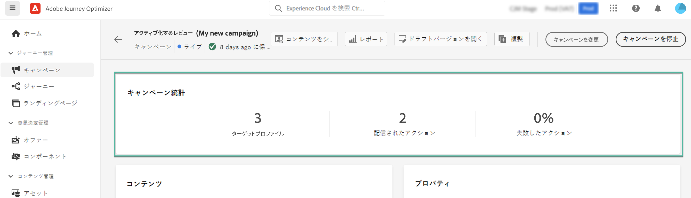

# キャンペーンの作成 {#create-campaign}

>[!NOTE]
>
>新しいキャンペーンを作成する前に、サーフェスチャネル（例：メッセージプリセット）とAdobe Experience Platformセグメントを使用できる状態にしておく必要があります。 詳しくは、次の節を参照してください。
>
>* [チャネルサーフェスの作成](../configuration/channel-surfaces.md)
>* [セグメントの基本を学ぶ](../segment/about-segments.md)

## キャンペーンの設定 {#configure}

キャンペーンを作成する手順は次のとおりです。

1. 次にアクセス： **[!UICONTROL キャンペーン]** メニュー、次に「 **[!UICONTROL キャンペーンを作成]**.

   

1. 内 **[!UICONTROL プロパティ]** 「 」セクションで、いつキャンペーンを実行するかを指定します。

   * **[!UICONTROL 予定]**:すぐに、または指定した日付にキャンペーンを実行します。 スケジュールされたキャンペーンの対象は送信です。 **マーケティング** メッセージを入力します。
   * **[!UICONTROL API トリガー]**:API 呼び出しを使用してキャンペーンを実行します。 API トリガーキャンペーンは、送信を対象としています **トランザクション** メッセージとは、個人が実行したアクションの後に送信されたメッセージのことです。パスワードのリセット、カードの放棄など [API を使用してキャンペーンをトリガーする方法を説明します](api-triggered-campaigns.md)

1. 内 **[!UICONTROL アクション]** 「 」セクションで、メッセージの送信に使用するチャネルとチャネルサーフェスを選択し、「 」をクリックします。 **[!UICONTROL 作成]**.

   

   >[!NOTE]
   >
   >ドロップダウンリストには、キャンペーンのタイプ（マーケティングまたはトランザクション）と互換性のあるチャネルサーフェスのみが表示されます。

1. キャンペーンのタイトルと説明を指定します。

   <!--To test the content of your message, toggle the **[!UICONTROL Content experiment]** option on. This allows you to test multiple variables of a delivery on populations samples, in order to define which treatment has the biggest impact on the targeted population.[Learn more about content experiment](../campaigns/content-experiment.md).-->

1. 内 **[!UICONTROL アクション]** 「 」セクションで、キャンペーンと共に送信するメッセージを設定します。

   1. 次をクリック： **[!UICONTROL コンテンツを編集]** ボタンをクリックし、メッセージコンテンツを設定およびデザインします。 [メッセージの詳細情報](../messages/get-started-content.md)。

      コンテンツの準備が整ったら、矢印をクリックしてキャンペーンの作成画面に戻ります。

      

   1. 内 **[!UICONTROL アクションのトラッキング]** 「 」セクションで、受信者の配信に対する反応を追跡するかどうかを指定します。

      トラッキング結果には、キャンペーンが実行されると、キャンペーンレポートからアクセスできるようになります。 [キャンペーンレポートの詳細を説明します](campaign-global-report.md)

1. ターゲットとするオーディエンスを定義します。 これをおこなうには、 **[!UICONTROL オーディエンスを選択]** ボタンをクリックして、使用可能なAdobe Experience Platformセグメントのリストを表示します。 [セグメントの詳細](../segment/about-segments.md)

   >[!NOTE]
   >
   >API トリガーキャンペーンの場合、オーディエンスは API 呼び出しを介して設定する必要があります。 [詳細情報](api-triggered-campaigns.md)

   内 **[!UICONTROL ID 名前空間]** 「 」フィールドで、選択したセグメントから個人を識別するために使用する名前空間を選択します。 [名前空間の詳細を説明します](../event/about-creating.md#select-the-namespace)

   

   >[!NOTE]
   >
   >異なる ID の中で選択された ID（名前空間）を持たないセグメントに属する個人は、キャンペーンのターゲットにされません。

1. キャンペーンの開始日と終了日を設定します。 デフォルトでは、キャンペーンは、手動でアクティブ化された後に開始し、メッセージが 1 回送信されたときにスーンとして終了するように設定されています。

1. さらに、キャンペーンに設定されたアクションの実行頻度を指定できます。

   >[!NOTE]
   >
   >API トリガーキャンペーンの場合、API を介してアクションがトリガーされるので、特定の日時に繰り返しを含むスケジュールは使用できません。 ただし、開始日と終了日は、がウィンドウの後に API 呼び出しがよりも前におこなわれた場合に、それらの呼び出しがエラーになることを確認するのに関連しています。

   

1. API トリガーキャンペーンを作成している場合、 **[!UICONTROL cURL リクエスト]** 「 」セクションでは、 **[!UICONTROL キャンペーン ID]** を API 呼び出しで使用する場合に使用します。 [詳細情報](api-triggered-campaigns.md)

キャンペーンの準備が整ったら、レビューおよびパブリッシュできます ( [キャンペーンの確認とアクティブ化](#review-activate)) をクリックします。

## キャンペーンの確認とアクティブ化 {#review-activate}

キャンペーンを設定したら、パラメーターと内容を確認してから、キャンペーンをアクティブ化する必要があります。 それをおこなうには、次の手順に従います。

1. キャンペーンの設定画面で、「 **[!UICONTROL 有効化するレビュー]** ：キャンペーンの概要を表示します。

   概要では、必要に応じてキャンペーンを変更し、パラメーターが正しくないか、見つからないかを確認できます。

   >[!IMPORTANT]
   >
   >エラーが発生した場合、キャンペーンを有効化できません。 続行する前にエラーを解決します。

   

1. キャンペーンが正しく設定されていることを確認し、 **[!UICONTROL 有効化]**.

   

1. キャンペーンがアクティブ化され、 **[!UICONTROL ライブ]** ステータス ( または **[!UICONTROL 予定]**  （開始日を指定した場合）。 [キャンペーンのステータスの詳細を説明します](get-started-with-campaigns.md#statuses)

   キャンペーンに設定されたメッセージは、指定した日付に即座に実行されます。

   >[!NOTE]
   >
   >キャンペーンがアクティブ化されると、メッセージが実行された後も「ライブ」ステータスが維持されます。 ステータスを変更するには、手動で停止する必要があります。 [キャンペーンの停止方法を説明します](modify-stop-campaign.md)

1. キャンペーンがアクティブ化されると、その情報を開くことでいつでも確認できます。 概要を使用すると、ターゲットプロファイルの数と、配信されたアクションと失敗したアクションの数に関する統計を取得できます。

   また、 **[!UICONTROL レポート]** 」ボタンをクリックします。 [詳細情報](campaign-global-report.md)

   

## その他のリソース

* [キャンペーンの基本を学ぶ](get-started-with-campaigns.md)
* [API でトリガーされるキャンペーンの作成](api-triggered-campaigns.md)
* [キャンペーンの変更または停止](modify-stop-campaign.md)
* [キャンペーンのライブレポート](campaign-live-report.md)
* [キャンペーンのグローバルレポート](campaign-global-report.md)
