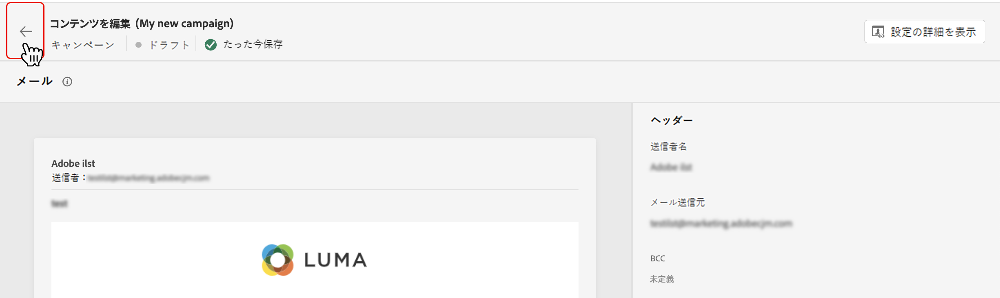

# キャンペーンの作成 {#create-campaign}

>[!NOTE]
>
>新しいキャンペーンを作成する前に、サーフェスチャネル（メッセージプリセット）と Adobe Experience Platform セグメントが使用できる状態になっていることを確認します。詳しくは、以下の節を参照してください。
>
>* [チャネルサーフェスの作成](../configuration/channel-surfaces.md)
>* [セグメントの基本を学ぶ](../segment/about-segments.md)

## 最初のキャンペーンを作成 {#create}

1. **[!UICONTROL キャンペーン]**&#x200B;メニューにアクセスし、「**[!UICONTROL キャンペーンを作成]**」をクリックします。

   >[!NOTE]
   >
   >また、既存のライブキャンペーンを複製して新しいキャンペーンを作成することもできます。[詳細情報](modify-stop-campaign.md#duplicate)

   

1. 「**[!UICONTROL プロパティ]**」セクションで、キャンペーンを実行するタイミングを指定します。

   * **[!UICONTROL スケジュール済み]**：キャンペーンをすぐに実行するか、指定日に実行します。スケジュール済みキャンペーンは、**マーケティング**&#x200B;タイプのメッセージを送信することを目的としています。
   * **[!UICONTROL API トリガー]**：API 呼び出しを使用してキャンペーンを実行します。API トリガーキャンペーンは、**トランザクション**&#x200B;メッセージ、つまり、個人が実行したアクション（パスワードのリセット、カードの放棄など）に続いて送信されるメッセージを送信することを目的としています。[API を使用してキャンペーンをトリガーする方法についてはこちらを参照](api-triggered-campaigns.md)

1. 「**[!UICONTROL アクション]**」セクションで、メッセージの送信に使用するチャネルとチャネルサーフェスを選択し、「**[!UICONTROL 作成]**」をクリックします。

   サーフェスは、[システム管理者](../start/path/administrator.md)によって定義された設定です。ヘッダーパラメーター、サブドメイン、モバイルアプリなど、メッセージを送信するためのすべての技術的なパラメーターが含まれています。 [詳細情報](../configuration/channel-surfaces.md)。

   

   >[!NOTE]
   >
   >マーケティングキャンペーンタイプと互換性のあるチャネルサーフェスのみがドロップダウンリストに一覧表示されます。

1. キャンペーンのタイトルと説明を指定します。

   <!--To test the content of your message, toggle the **[!UICONTROL Content experiment]** option on. This allows you to test multiple variables of a delivery on populations samples, in order to define which treatment has the biggest impact on the targeted population.[Learn more about content experiment](../campaigns/content-experiment.md).-->

1. 「**[!UICONTROL アクション]**」セクションで、キャンペーンで送信するメッセージを設定します。

   1. 「**[!UICONTROL コンテンツを編集]**」ボタンをクリックして、メッセージコンテンツを設定およびデザインします。 [メッセージについて詳しくはこちらを参照](../messages/get-started-content.md)してください。

      メッセージコンテンツを作成する詳細な手順については、次のページを参照してください。

      * [メールの作成](../messages/create-email.md)
      * [プッシュ通知の作成](../messages/create-push.md)
      * [SMS メッセージの作成](../messages/create-sms.md)
   1. コンテンツを定義したら、**[!UICONTROL コンテンツをシミュレート]**&#x200B;ボタンを使用して、コンテンツをテストプロファイルでプレビューおよびテストします。[詳細情報](../design/preview.md)。

   1. 矢印をクリックして、キャンペーン作成画面に戻ります。

      

   1. 「**[!UICONTROL アクションのトラッキング]**」セクションで、受信者が配信に対する反応を追跡するかどうかを指定します。クリック数や開封数を追跡できます。

      キャンペーンが実行されると、キャンペーンレポートからトラッキング結果にアクセスできるようになります。[キャンペーンレポートについて詳しくはこちらを参照](../reports/campaign-global-report.md)

1. ターゲットとするオーディエンスを定義します。それには、「**[!UICONTROL オーディエンスを選択]**」ボタンをクリックして、使用可能な Adobe Experience Platform セグメントのリストを表示します。[セグメントについて詳しくはこちらを参照](../segment/about-segments.md)

   >[!NOTE]
   >
   >API トリガーキャンペーンの場合、オーディエンスは API 呼び出しを使用して設定する必要があります。[詳細情報](api-triggered-campaigns.md)

   「**[!UICONTROL ID 名前空間]**」フィールドで、選択したセグメントから個人を識別するために使用する名前空間を選択します。[名前空間について詳しくはこちらを参照](../event/about-creating.md#select-the-namespace)

   

   >[!NOTE]
   >
   >様々な ID の中から選択した ID（名前空間）を持たないセグメントに属する個人は、キャンペーンのターゲットになりません。

   <!--If you are are creating an API-triggered campaign, the **[!UICONTROL cURL request]** section allows you to retrieve the **[!UICONTROL Campaign ID]** to use in the API call. [Learn more](api-triggered-campaigns.md)-->

1. キャンペーンを特定の日付に実行したり、繰り返し実行したりするには、「**[!UICONTROL スケジュール]**」セクションを設定します。 [キャンペーンのスケジュール設定方法を学ぶ](#schedule)

1. カスタムまたはコアのデータ使用ラベルをキャンペーンに割り当てるには、「**[!UICONTROL アクセスを管理]**」ボタンをクリックします。 [オブジェクトレベルのアクセス制御（OLA）の詳細](../administration/object-based-access.md)

キャンペーンの準備が整ったら、キャンペーンをレビューして公開できます。 [詳細情報](#review-activate)

## キャンペーンのスケジュール設定 {#schedule}

デフォルトでは、キャンペーンは手動でアクティブ化した後に開始され、メッセージが 1 回送信された直後に終了します。

キャンペーンのメッセージを送信する頻度を定義できます。これを行うには、キャンペーンの作成画面にある「**[!UICONTROL アクショントリガー]**」オプションを使用して、キャンペーンの実行頻度を日単位、週単位または月単位のいずれにするかを指定します。

アクティブ化直後にキャンペーンを実行しない場合は、「**[!UICONTROL キャンペーン開始]**」オプションを使用して、メッセージを送信する日時を指定することができます。「**[!UICONTROL キャンペーン終了]**」オプションを使用すると、繰り返しキャンペーンの実行を停止するタイミングを指定できます。

## 迅速配信モード {#rapid-delivery}

>[!CONTEXTUALHELP]
>id="ajo_campaigns_rapid_delivery"
>title="迅速配信モード"
>abstract="迅速配信モードプッシュチャネルで 3,000 万件未満のオーディエンスサイズに高速メッセージ送信を実行できます。"

以前はジャーニーのバーストモードと呼ばれていた迅速配信モードは、キャンペーンを通じて大量のプッシュメッセージを非常に高速に送信できるようにする [!DNL Journey Optimizer] アドオンです。

迅速配信は、メッセージ配信の遅延がビジネス上重要な場合、携帯電話に緊急のプッシュアラートを送信するときに使用します（ニュースチャネルアプリをインストールしたユーザーにニュース速報を流すなど）。

迅速配信モードを使用する際のパフォーマンスについて詳しくは、[Adobe Journey Optimizer 製品の説明](https://helpx.adobe.com/jp/legal/product-descriptions/adobe-journey-optimizer.html)を参照してください。

### 前提条件 {#prerequisites}

迅速配信メッセージには、次の要件があります。

* 迅速配信は&#x200B;**[!UICONTROL スケジュール済み]**&#x200B;キャンペーンでのみ使用でき、API トリガーキャンペーンでは使用できません。
* プッシュメッセージはパーソナライズできません。
* ターゲットオーディエンスに含まれるプロファイルの数は 3,000 万未満にする必要があります。
* 迅速配信モードを使用すると、最大 5 つのキャンペーンを同時に実行できます。

### 迅速配信モードの有効化

1. プッシュ通知キャンペーンを作成し、「**[!UICONTROL 迅速配信]**」オプションをオンに切り替えます。

1. メッセージコンテンツを設定し、ターゲットにするオーディエンスを選択します。[キャンペーンの作成方法について学ぶ](#create)

   >[!IMPORTANT]
   >
   >メッセージコンテンツにパーソナライゼーションが含まれていないことと、オーディエンスに含まれるプロファイルの数が 3,000 万未満であることを確認します。

1. 通常どおり、キャンペーンをレビューしてアクティブ化します。テストモードでは、メッセージは迅速配信モードで送信されません。[キャンペーンのレビューとアクティブ化の方法について学ぶ](review-activate-campaign.md)
