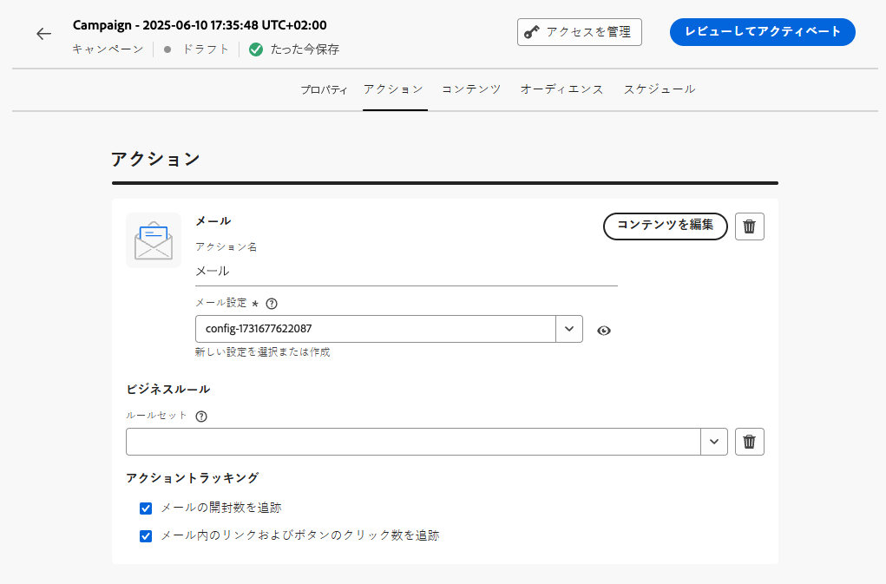

# キャンペーンの作成 {#create-campaign}

>[!NOTE]
>
>新しいキャンペーンを作成する前に、サーフェスチャネル（メッセージプリセット）と Adobe Experience Platform オーディエンスが使用できる状態になっていることを確認します。詳しくは、以下の節を参照してください。
>
>* [チャネルサーフェスの作成](../configuration/channel-surfaces.md)
>* [オーディエンスの基本を学ぶ](../audience/about-audiences.md)

新しいキャンペーンを作成するには、**[!UICONTROL Campaigns]** メニューにアクセスし、「**[!UICONTROL キャンペーンの作成]**」をクリックします。また、既存のライブキャンペーンを複製して新しいキャンペーンを作成することもできます。([詳細情報](modify-stop-campaign.md#duplicate))

## キャンペーンのタイプとチャネルを選択 {#campaigntype}

>[!CONTEXTUALHELP]
>id="ajo_campaigns_campaign_type"
>title="キャンペーンのタイプ"
>abstract="**スケジュール済みキャンペーン**&#x200B;は、即時または指定した日付に実行され、マーケティングタイプのメッセージを送信することを目的としています。**API トリガー**&#x200B;のキャンペーンは、API 呼び出しを使用して実行されます。これらは、マーケティングメッセージ（ユーザーの同意が必要なプロモーションメッセージ）またはトランザクションメッセージ（特定のコンテキストで登録解除済みのプロファイルにも送信できる非商用メッセージ）を送信することを目的としています。"

>[!CONTEXTUALHELP]
>id="ajo_campaigns_campaign_category"
>title="キャンペーンカテゴリ"
>abstract="スケジュール済みキャンペーンを作成している場合は、**マーケティング**&#x200B;タイプが自動的に選択されます。API トリガーのキャンペーンの場合、**マーケティング**&#x200B;メッセージ（ユーザーの同意が必要なプロモーションメッセージ）を送信するか、**トランザクション**&#x200B;メッセージ（特定のコンテキストで登録解除済みのプロファイルにも送信できる非商用メッセージ）を送信するかを選択します。"

1. 「**[!UICONTROL プロパティ]**」セクションで、キャンペーンを実行する方法を指定します。次の 2 種類のキャンペーンを使用できます。

   * **[!UICONTROL スケジュール済み]**：キャンペーンを即時または指定日に実行します。スケジュール済みキャンペーンは、**マーケティング**&#x200B;メッセージを送信することを目的としています。ユーザーインターフェイスから設定および実行されます。

   * **[!UICONTROL API トリガー]**：API 呼び出しを使用してキャンペーンを実行します。API トリガーキャンペーンは、**マーケティング**&#x200B;メッセージまたは&#x200B;**トランザクション**&#x200B;メッセージのいずれか、つまり、個人が実行したアクション（パスワードのリセット、買い物かごの購入など）に続いて送信されるメッセージを送信することを目的としています。[API を使用してキャンペーンをトリガーする方法についてはこちらを参照してください](api-triggered-campaigns.md)

1. スケジュール済みキャンペーンを作成している場合は、**マーケティング**&#x200B;タイプが自動的に選択されます。API トリガーキャンペーンの場合は、**マーケティング**&#x200B;メッセージを送信するか、**トランザクション**&#x200B;メッセージを送信するかを選択します。

1. 「**[!UICONTROL アクション]**」セクションで、メッセージの送信に使用するチャネルとチャネルサーフェスを選択します。

   サーフェスは、[システム管理者](../start/path/administrator.md)によって定義された設定です。ヘッダーパラメーター、サブドメイン、モバイルアプリなど、メッセージを送信するためのすべての技術的なパラメーターが含まれています。 [詳細情報](../configuration/channel-surfaces.md)。

   マーケティングキャンペーンタイプと互換性のあるチャネルサーフェスのみがドロップダウンリストに一覧表示されます。

   

   >[!NOTE]
   >
   >プッシュ通知キャンペーンを作成している場合、**[!UICONTROL 迅速配信モード]**&#x200B;を有効にできます。これは、大量のプッシュメッセージを非常に高速に送信できる Journey Optimizer アドオンです。[詳細情報](../push/create-push.md#rapid-delivery)

1. 「**[!UICONTROL 作成]**」をクリックして、キャンペーンを作成します。

## キャンペーンのプロパティの定義 {#create}

1. 「**[!UICONTROL プロパティ]**」セクションで、キャンペーンの名前と説明を指定します。

   <!--To test the content of your message, toggle the **[!UICONTROL Content experiment]** option on. This allows you to test multiple variables of a delivery on populations samples, in order to define which treatment has the biggest impact on the targeted population.[Learn more about content experiment](../campaigns/content-experiment.md).-->

1. 「**タグ**」フィールドを使用すると、Adobe Experience Platform 統合タグをキャンペーンに割り当てることができます。これにより、キャンペーンを簡単に分類し、キャンペーンリストからの検索を改善できます。[タグの操作方法については、こちらを参照してください](../start/search-filter-categorize.md#tags)

1. カスタムまたはコアのデータ使用ラベルをキャンペーンに割り当てるには、「**[!UICONTROL アクセスを管理]**」ボタンをクリックします。 [オブジェクトレベルのアクセス制御（OLA）の詳細](../administration/object-based-access.md)

## メッセージの作成とトラッキングの設定 {#content}

「**[!UICONTROL アクション]**」セクションで、キャンペーンで送信するメッセージを作成します。

1. 「**[!UICONTROL コンテンツを編集]**」ボタンをクリックして、メッセージコンテンツを設定およびデザインします。

   メッセージコンテンツを作成する詳細な手順については、次のページを参照してください。

   <table style="table-layout:fixed">
    <tr style="border: 0;">
    <td>
    
    
<a href="../email/create-email.md"><strong>メールの作成</strong>
    

    

    </td>
    <td>
    
    

    <a href="../push/create-push.md"><strong>プッシュ通知の作成</strong></a>
    

    

    </td>
    <td>
    
    

    <a href="../sms/create-sms.md"><strong>SMS メッセージの作成</strong></a>
    

    

    </td>
    </tr>
    </table>

1. コンテンツを定義したら、**[!UICONTROL コンテンツをシミュレート]**&#x200B;ボタンを使用して、テストプロファイルを使用してコンテンツをプレビューおよびテストします([詳細情報](../content-management/preview-test.md))。

1. 矢印をクリックして、キャンペーン作成画面に戻ります。

   

1. 「**[!UICONTROL アクションのトラッキング]**」セクションで、受信者が配信に対する反応を追跡するかどうかを指定します。クリック数や開封数を追跡できます。

   キャンペーンが実行されると、キャンペーンレポートからトラッキング結果にアクセスできるようになります。[キャンペーンレポートについて詳しくはこちらを参照](../reports/campaign-global-report.md)

## オーディエンスを定義 {#audience}

「**[!UICONTROL オーディエンスを選択]**」ボタンを使用して、使用可能な Adobe Experience Platform オーディエンスのリストを表示します。[詳しくは、オーディエンスを参照してください](../audience/about-audiences.md)。

>[!IMPORTANT]
>
>[オーディエンス構成](../audience/get-started-audience-orchestration.md)と[カスタムアップロード（CSV ファイル）オーディエンス](https://experienceleague.adobe.com/docs/experience-platform/segmentation/ui/overview.html?lang=ja#import-audience)からのオーディエンスと属性の使用は、現在、Healthcare Shield または Privacy and Security Shield では使用できません。
>
>API トリガーキャンペーンの場合、オーディエンスは API 呼び出しを使用して設定する必要があります。

「**[!UICONTROL ID 名前空間]**」フィールドで、選択したセグメントから個人を識別するために使用する名前空間を選択します。

様々な ID の中から選択した ID（名前空間）を持たないセグメントに属する個人は、キャンペーンのターゲットになりません。[名前空間について詳しくはこちらを参照](../event/about-creating.md#select-the-namespace)

<!--If you are are creating an API-triggered campaign, the **[!UICONTROL cURL request]** section allows you to retrieve the **[!UICONTROL Campaign ID]** to use in the API call. [Learn more](api-triggered-campaigns.md)-->

## キャンペーンのスケジュール {#schedule}

>[!CONTEXTUALHELP]
>id="ajo_campaigns_schedule"
>title="キャンペーンスケジュール"
>abstract="デフォルトでは、キャンペーンは手動でアクティブ化すると開始され、メッセージが 1 回送信されるとすぐに終了します。ただし、メッセージを送信する特定の日時を柔軟に設定できます。さらに、繰り返しキャンペーンまたは API トリガーキャンペーンの終了日を指定できます。アクショントリガーでは、環境設定に応じてメッセージ送信頻度を設定することもできます。"

>[!CONTEXTUALHELP]
>id="ajo_campaigns_schedule_start"
>title="キャンペーン開始"
>abstract="メッセージを送信する日時を指定します。"

>[!CONTEXTUALHELP]
>id="ajo_campaigns_schedule_end"
>title="キャンペーン終了"
>abstract="繰り返しキャンペーンの実行を停止するタイミングを指定します。"

>[!CONTEXTUALHELP]
>id="ajo_campaigns_schedule_triggers"
>title="キャンペーンのアクショントリガー"
>abstract="キャンペーンのメッセージを送信する頻度を定義します。"

デフォルトでは、キャンペーンは手動でアクティブ化した後に開始され、メッセージが 1 回送信された直後に終了します。

キャンペーンのメッセージを送信する頻度を定義できます。これを行うには、キャンペーンの作成画面にある「**[!UICONTROL アクショントリガー]**」オプションを使用して、キャンペーンの実行頻度を日単位、週単位または月単位のいずれにするかを指定します。

アクティブ化直後にキャンペーンを実行しない場合は、「**[!UICONTROL キャンペーン開始]**」オプションを使用して、メッセージを送信する日時を指定することができます。「**[!UICONTROL キャンペーン終了]**」オプションを使用すると、繰り返しキャンペーンの実行を停止するタイミングを指定できます。

キャンペーンの準備が整ったら、キャンペーンをレビューして公開できます。 ([詳細情報](review-activate-campaign.md))
