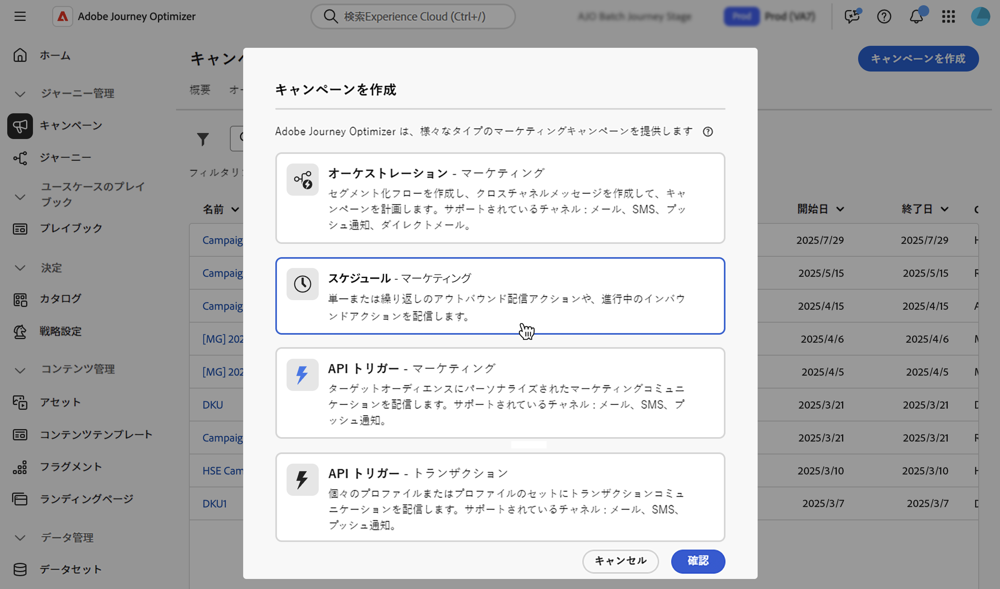

# キャンペーンの作成 {#create-campaign}

新しいキャンペーンを作成するには、左側のパネルで **[!UICONTROL キャンペーン]** メニューを参照し、「**[!UICONTROL キャンペーンを作成]**」をクリックします。 また、既存のライブキャンペーンを複製して新しいキャンペーンを作成することもできます。[ 詳細を表示する ](modify-stop-campaign.md#duplicate)。

開始する前に、[ このページ ](get-started-with-campaigns.md#before-starting-campaign-prerequisites) でキャンペーンの前提条件を確認してください。

## キャンペーンタイプを選択 {#campaigntype}

>[!CONTEXTUALHELP]
>id="ajo_campaigns_campaign_type"
>title="キャンペーンのタイプ"
>abstract="**スケジュール済みキャンペーン**&#x200B;は、即時または指定した日付に実行され、マーケティングタイプのメッセージを送信することを目的としています。**API トリガー**&#x200B;のキャンペーンは、API 呼び出しを使用して実行されます。これらは、マーケティングメッセージ（ユーザーの同意が必要なプロモーションメッセージ）またはトランザクションメッセージ（特定のコンテキストで登録解除済みのプロファイルにも送信できる非商用メッセージ）を送信することを目的としています。"

新しいキャンペーンを作成する場合は、まずキャンペーンのタイプを選択する必要があります。 次の 3 種類のキャンペーンを使用できます。

1. **[!UICONTROL スケジュール型 – マーケティング]** – これらのキャンペーンは、即時または指定日に実行されます。 スケジュール済みキャンペーンは、**マーケティング** メッセージを送信したり、インバウンドアクションを作成したりすることを目的としています。 ユーザーインターフェイスから設定および実行されます。

1. **[!UICONTROL API トリガー – マーケティング]** – これらのキャンペーンは、API 呼び出しを使用して実行されます。 このタイプのキャンペーンを選択すると、パーソナライズされたマーケティングコミュニケーションをターゲットオーディエンスに送信できます。  [詳しくは、API を使用してキャンペーンをトリガーする方法について参照してください。](api-triggered-campaigns.md)

1. **[!UICONTROL API トリガー – トランザクション]** - API トリガー – マーケティングキャンペーンと同じように、これらのキャンペーンは API 呼び出しを使用して実行されます。 API トリガートランザクションキャンペーンは、**トランザクション** メッセージ、つまり、個人が実行したアクション（パスワードのリセットリクエスト、買い物かごの購入など）に続いて送信されるメッセージを送信することを目的としています。  [詳しくは、API を使用してキャンペーンをトリガーする方法について参照してください。](api-triggered-campaigns.md)

   

## キャンペーンのプロパティの定義 {#create}

キャンペーンを作成したら、プロパティを定義する必要があります。 次の手順に従います。

1. **[!UICONTROL プロパティ]** セクションで、キャンペーンの名前と説明を入力します。

   <!--To test the content of your message, toggle the **[!UICONTROL Content experiment]** option on. This allows you to test multiple variables of a delivery on populations samples, in order to define which treatment has the biggest impact on the targeted population.[Learn more about content experiment](../content-management/content-experiment.md).-->

1. （オプション）「**タグ**」フィールドを使用して、Adobe Experience Platform統合タグをキャンペーンに割り当てます。 これにより、キャンペーンを簡単に分類し、キャンペーンリストからの検索を改善できます。[ タグの操作方法については、こちらを参照してください ](../start/search-filter-categorize.md#tags)。

1. （任意）アクセスラベルに基づいて、このキャンペーンへのアクセスを制限できます。 アクセス制限を追加するには、このページの上部にある **[!UICONTROL アクセスを管理]** ボタンを参照します。 権限のあるラベルのみを選択してください。 [ オブジェクトレベルのアクセス制御の詳細情報 ](../administration/object-based-access.md)。

## キャンペーンオーディエンスの定義 {#audience}

これで、キャンペーンのオーディエンスを選択できます。 オーディエンスとは、類似の行動や特徴を共有する人々の集まりです。

>[!IMPORTANT]
>
>* [オーディエンス構成](../audience/get-started-audience-orchestration.md)からのオーディエンスおよび属性は現在、Healthcare Shield または Privacy and Security Shield では使用できません。
>
>* API トリガーキャンペーンの場合、オーディエンスは API 呼び出しを使用して設定する必要があります。

スケジュールされたマーケティングキャンペーンのターゲットとなる母集団を定義するには、次の手順に従います。

1. 「**オーディエンス**」セクションで、「**[!UICONTROL オーディエンスを選択]**」ボタンをクリックして、使用可能な Adobe Experience Platform オーディエンスのリストを表示します。オーディエンスについて詳しくは、[ この節 ](../audience/about-audiences.md) を参照してください。

1. 「**[!UICONTROL ID タイプ]**」フィールドで、選択したオーディエンスから個人を識別するために使用するキーのタイプを選択します。 既存の ID タイプを使用することも、Adobe Experience Platform ID サービスを使用して新しい ID タイプを作成することもできます。 標準 ID 名前空間の一覧については、[ このページ ](https://experienceleague.adobe.com/en/docs/experience-platform/identity/features/namespaces#standard){target="_blank"} を参照してください。

   1 つのキャンペーンで使用できる ID タイプは 1 つだけです。 様々な ID の中から選択した ID タイプを持たないセグメントに属する個人は、キャンペーンのターゲットにすることはできません。

   

   ID タイプと名前空間について詳しくは、[Adobe Experience Platform ドキュメント ](https://experienceleague.adobe.com/docs/experience-platform/identity/home.html?lang=ja){target="_blank"} を参照してください。

   <!--If you are are creating an API-triggered campaign, the **[!UICONTROL cURL request]** section allows you to retrieve the **[!UICONTROL Campaign ID]** to use in the API call. [Learn more](api-triggered-campaigns.md)-->

## チャネルを選択 {#channel}

これで、チャネルとその設定を選択できます。 次の手順に従います。

1. 「**[!UICONTROL アクション]**」セクションで、通信チャネルを選択します。

   使用可能なチャネルのリストは、ライセンスモデルやアドオンによって異なります。 API トリガーキャンペーンの場合は、メール、SMS、プッシュ通知の各チャネルのみを使用できます。

1. チャネル設定を選択します。

   設定は、[システム管理者](../start/path/administrator.md)によって定義されます。ヘッダーパラメーター、サブドメイン、モバイルアプリなど、メッセージを送信するためのすべての技術的なパラメーターが含まれています。 [詳細情報](../configuration/channel-surfaces.md)。

   マーケティングキャンペーンタイプと互換性のあるチャネル設定のみがドロップダウンリストに一覧表示されます。

   

   >[!NOTE]
   >
   >プッシュ通知キャンペーンを作成している場合、**[!UICONTROL 迅速配信モード]**&#x200B;を有効にできます。これは、大量のプッシュメッセージを非常に高速に送信できる Journey Optimizer アドオンです。[詳細情報](../push/create-push.md#rapid-delivery)

## コンテンツの編集 {#content}

**[!UICONTROL コンテンツを編集]** ボタンからメッセージのコンテンツを定義できるようになりました。 コンテンツの作成プロセスは、選択したチャネルによって異なります。

メッセージコンテンツを作成する詳細な手順については、次のページを参照してください。

<table style="table-layout:fixed"><tr style="border: 0;">
<td>

<a href="../email/create-email.md"><strong>メール</strong></a>
</td>
<td>

<a href="../sms/create-sms.md"><strong>SMS</strong></a>
</td>
<td>

<a href="../push/create-push.md"><strong> プッシュ通知 </strong></a>
</td>
<td>

<a href="../direct-mail/create-direct-mail.md"><strong>ダイレクトメール</strong></a>
</td>
</tr></table>

<table style="table-layout:fixed"><tr style="border: 0;">
<td>

<a href="../in-app/create-in-app.md"><strong> アプリ内 </strong></a>
</td>
<td>

<a href="../web/create-web.md"><strong>Web</strong></a>
</td>
<td>

<a href="../code-based/create-code-based.md"><strong>コードベースのエクスペリエンス</strong></a>
</td>
<td>

<a href="../content-card/create-content-card.md"><strong> コンテンツカード </strong></a>
</td>
</tr></table>

コンテンツを定義したら、**[!UICONTROL コンテンツをシミュレート]**&#x200B;ボタンを使用して、テストプロファイルを使用してコンテンツをプレビューおよびテストします[詳細情報](../content-management/preview-test.md)。キャンペーンの作成画面に戻るには、左矢印をクリックします。

メッセージコンテンツ自体に加えて、次の設定を行うことができます。

1. （オプション）「**[!UICONTROL コンテンツ実験]**」セクションでは、「**[!UICONTROL 実験を作成]**」ボタンを使用して、どのコンテンツがより効果的かをテストできます。 コンテンツ実験機能について詳しくは、[ この節 ](../content-management/content-experiment.md) を参照してください。

1. 「**[!UICONTROL アクショントラッキング]**」セクションで、配信に対する受信者の反応を追跡するかどうかを指定します。クリック数や開封数を追跡できます。

   キャンペーンが実行されると、キャンペーンレポートからトラッキング結果にアクセスできます。 [キャンペーンレポートについて詳しくはこちらを参照](../reports/campaign-global-report-cja.md)

## キャンペーンのスケジュール {#schedule}

>[!CONTEXTUALHELP]
>id="ajo_campaigns_schedule"
>title="キャンペーンスケジュール"
>abstract="デフォルトでは、キャンペーンは手動によるアクティブ化で開始し、メッセージが 1 回送信された直後に終了します。 メッセージを送信する特定の日時を柔軟に設定できます。 さらに、繰り返しキャンペーンまたは API トリガーキャンペーンの終了日を指定できます。アクショントリガーでは、環境設定に応じてメッセージ送信頻度を設定することもできます。"

>[!CONTEXTUALHELP]
>id="ajo_campaigns_schedule_start"
>title="キャンペーン開始"
>abstract="メッセージを送信する日時を指定します。"

>[!CONTEXTUALHELP]
>id="ajo_campaigns_schedule_end"
>title="キャンペーン終了"
>abstract="繰り返しキャンペーンの実行を停止するタイミングを指定します。"

>[!CONTEXTUALHELP]
>id="ajo_campaigns_schedule_triggers"
>title="キャンペーンのアクショントリガー"
>abstract="キャンペーンのメッセージを送信する頻度を定義します。"

デフォルトでは、スケジュール済みキャンペーンは手動でアクティブ化すると開始され、メッセージが 1 回送信されるとすぐに終了します。

アクティブ化直後にキャンペーンを実行しない場合は、「**[!UICONTROL キャンペーン開始]**」オプションを使用して、メッセージを送信する日時を指定することができます。「**[!UICONTROL キャンペーン終了]**」オプションを使用すると、キャンペーンの実行を停止するタイミングを指定できます。

メール、SMS およびプッシュ通知キャンペーンの場合、キャンペーンのメッセージを送信する頻度を定義できます。 これを行うには、キャンペーンの作成画面にある「**[!UICONTROL アクショントリガー]**」オプションを使用して、キャンペーンの実行頻度を日単位、週単位または月単位のいずれにするかを指定します。

## その他の設定 {#settings}

設定の中には、キャンペーン用に選択された通信チャネルに固有のものや、特定のユースケースに使用されるものもあります。 次に、それらについて説明します。

* メールの場合は、特定の IP ウォームアッププランのアクティベーションキャンペーンを作成できます。 詳しくは、[この節](../configuration/ip-warmup-campaign.md)を参照してください。
* Web、アプリ内およびコードベースのチャネルの場合、キャンペーンに優先度スコアを割り当てることができます。 詳しくは、[この節](../conflict-prioritization/priority-scores.md)を参照してください。
* コンテンツカードキャンペーンの場合は、トリガーとなるイベントと条件を配信ルールで選択できます。 詳しくは、[この節](../content-card/create-content-card.md)を参照してください。
* アプリ内メッセージの場合は、「**[!UICONTROL トリガーを編集]**」ボタンを使用して、メッセージをトリガーにするイベントと条件を選択できます。 詳しくは、[この節](../in-app/create-in-app.md)を参照してください。

## 次の手順 {#next}

キャンペーンの設定とコンテンツの準備が整ったら、レビューしてアクティブ化できます。 [詳細情報](review-activate-campaign.md)
