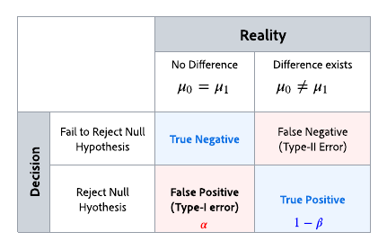

# 統計指標について {#experiment-calculations}

>[!AVAILABILITY]
>
>コンテンツ実験機能は、現在、一連の組織（限定提供）でのみ使用できます。 詳しくは、アドビ担当者にお問い合わせください。

この記事では、Adobe Journey Optimizerで Experiment を実行する際に使用される統計指標について説明します。 実験では、高度な統計的手法を使用して **信頼性シーケンス** および **信頼性**：必要に応じて実験を実行し、結果を継続的に監視できます。

この記事では、実験の仕組みを説明し、Adobeの **任意の時間の有効な信頼性シーケンス**.

エキスパートユーザー向けの技術的な詳細と参照について詳しくは、 [このページ](https://experienceleague.adobe.com/docs/journey-optimizer/assets/confidence_sequence_technical_details.pdf?lang=en).

## 統計的テストとエラーの制御 {#statistical-testing}

上の表に示すように、多くの統計的推論手法は、次の 2 種類のエラーを制御するように設計されています。

* **偽陽性（Type-I エラー）**:は、実際には真の場合に、null 仮説を誤って拒否したことになります。 オンライン実験の観点から言えば、結果指標は同じであったにもかかわらず、治療ごとに異なると誤って結論付けられる。
    実験を実行する前に、通常、しきい値を選択します `$\alpha$`. 実験が実行された後、 `$p$-value` が計算され、を拒否します。 `null if $p < \alpha$`. 一般的に使用されるしきい値は、 `$\alpha = 0.05$`つまり、長い目で見ると、100 個の実験のうち 5 個が偽陽性であると予想されます。

* **偽陰性（Type-II 誤り）**:は、偽であるにもかかわらず、null 仮説を却下できなかったことを意味します。 実験の場合、実際には異なる場合に、null 仮説を拒否しないことを意味します。 このタイプのエラーを制御するには、通常、実験で特定の電力を保証するのに十分なユーザーが必要です。 `$1 - \beta$`（つまり、1 から型 II エラーの確率を引いた値）。

ほとんどの統計的推論手法では、決定する効果のサイズとエラー許容値 (`$\alpha$` および `$\beta$`) を事前に設定しておきます。 ただし、Adobe Journey Optimizerの手法は、任意のサンプルサイズに対して、継続的に結果を確認できるように設計されています。

## Adobeの統計的手法：任意の時間の有効な信頼性シーケンス

A **信頼性シーケンス** は、 **信頼区間**&#x200B;例えば、実験を 100 回繰り返し、実験に入る新規ユーザーごとに、平均指標とそれに関連する 95%信頼性シーケンスの推定値を計算する場合などです。 95%信頼シーケンスは、実行した 100 件の実験のうち 95 件の指標の真の値を含みます。 95%の信頼区間は、同じ 95%の範囲を保証するために、実験ごとに 1 回だけ計算できます。新しいユーザーが 1 人もいない したがって、信頼性シーケンスを使用すると、偽陽性エラー率を増やすことなく、実験を継続的に監視できます。

以下のアニメーションに、1 つの実験に対する信頼性シーケンスと信頼区間の違いを示します。

**信頼性シーケンス** 統計的有意性のしきい値に基づいて null 仮説を却下するか否かではなく、治療間の手段の違いの正確な推定に焦点を当て、仮説テストの代わりに実験の焦点を推定に移す。

しかし、 `$p$-values`または **信頼性**、および **信頼区間**、 **信頼性シーケンス** いつでも有効な `$p$-values`または任意の時点で有効な信頼性。 信頼性のような数量の慣れ親しみを考えると、Adobeは **信頼性シーケンス** そして、そのレポートにおける有効な信頼性。

理論的基礎 **信頼性シーケンス** マーティンゲールと呼ばれるランダム変数の配列の研究から得られる。 主な結果は以下の通りですが、専門家の留意点は次のとおりです。

    信頼シーケンスは、信頼区間の安全な順次類似物として解釈できます。実験のデータを好きな時間に見て解釈し、安全に停止、または実験を続行できます。 対応する任意の時間の有効な信頼性 (「$p$-value」) も、解釈に安全です。

信頼性シーケンスは「任意の時間に有効」なので、同じサンプルサイズで使用される固定水平線手法よりも控えめな方法であることに注意する必要があります。 信頼シーケンスの範囲は、一般に信頼区間の計算よりも広くなりますが、どの時間でも有効な信頼性は、固定水平線の信頼性の計算よりも小さくなります。 この保守主義の利点は、常に安全に結果を解釈できることです。

## 実験の最終的な結果を宣言する

Adobeは、実験レポートを表示するたびに、この時点まで実験に累積したデータを分析し、有効な信頼が少なくとも 1 つの処理のしきい値 95%を超えると、いつでも実験が「決定的」と宣言します。

この時点で、（コンバージョン率またはプロファイル正規化された指標値に基づいて）最もパフォーマンスの高い治療がレポート画面の上部に強調表示され、表形式レポートに星印が表示されます。 この決定では、95%を超える信頼性を持つ治療とベースラインのみが考慮されます。

2 つ以上の処理がある場合、ボンフェローニ補正リンクを使用して複数の比較問題を修正し、ファミリー単位の誤り率を制御します。 このシナリオでは、信頼性が 95%を超え、信頼区間が重複する複数の処理が存在する可能性もあります。 この場合、Adobeは、コンバージョン率（またはプロファイルに正規化された指標値）が最も高いパフォーマンスを示す指標を宣言します。
