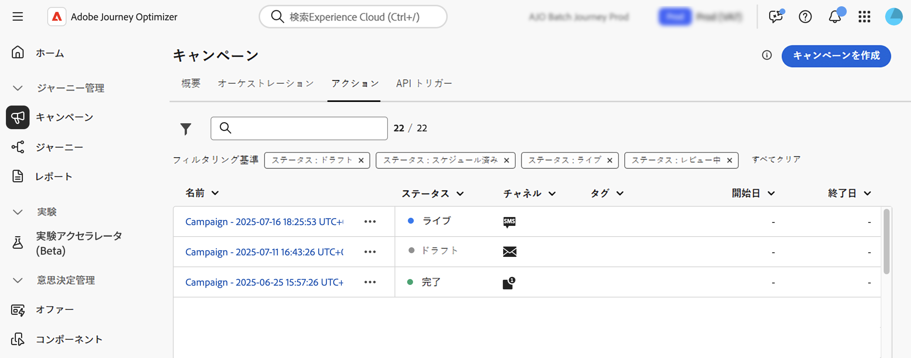
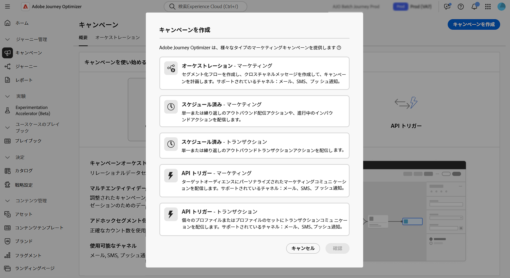

# キャンペーンの基本を学ぶ {#get-started-campaigns}

>[!CONTEXTUALHELP]
>id="ajo_campaigns_schedule"
>title="キャンペーンスケジュール"
>abstract="デフォルトでは、キャンペーンは手動でアクティブ化すると開始され、メッセージが 1 回送信されるとすぐに終了します。メッセージを送信する特定の日付を柔軟に設定できます。さらに、繰り返しのアクションキャンペーンの終了日を指定できます。アクショントリガーでは、環境設定に応じてメッセージ送信頻度を設定することもできます。"

>[!CONTEXTUALHELP]
>id="ajo_campaigns_schedule_start"
>title="キャンペーン開始"
>abstract="メッセージを送信する日時を指定します。"

>[!CONTEXTUALHELP]
>id="ajo_campaigns_schedule_end"
>title="キャンペーン終了"
>abstract="繰り返しキャンペーンの実行を停止するタイミングを指定します。"

>[!CONTEXTUALHELP]
>id="ajo_campaigns_schedule_triggers"
>title="キャンペーンのアクショントリガー"
>abstract="キャンペーンのメッセージを送信する頻度を定義します。"

>[!CONTEXTUALHELP]
>id="ajo_campaigns_throttling"
>title="レート制御"
>abstract="目的のレート制限を指定して、キャンペーンのレート制御を設定します。この機能は、ランディングページやカスタマーケアプラットフォームなどのダウンストリームシステムの過負荷を防ぐのに特に役立ちます。"

>[!CONTEXTUALHELP]
>id="ajo_homepage_card3"
>title="キャンペーンの作成"
>abstract="**Adobe Journey Optimizer** を使用すると、様々なチャネルを使用して、特定のオーディエンスに 1 回限りのコンテンツを配信できます。ジャーニーを使用する場合、アクションは順番に実行されます。キャンペーンでは、アクションは指定したスケジュールに基づいて同時にまたは即時に実行されます。"

>[!CONTEXTUALHELP]
>id="campaigns_list"
>title="キャンペーン"
>abstract="キャンペーンを作成して、様々なチャネルで特定のオーディエンスに 1 回限りのコンテンツを配信します。キャンペーンを作成する前に、チャネル設定と Adobe Experience Platform オーディエンスが使用できる状態になっていることを確認します。"

>[!CONTEXTUALHELP]
>id="ajo_campaigns_campaign_type"
>title="キャンペーンタイプ"
>abstract="キャンペーンのタイプを選択します。使用可能なチャネルは、選択したタイプによって異なります。 **スケジュールキャンペーン**（アクションキャンペーン）- 特定の時間に実行するようにスケジュールできる、シンプルな 1 回限りのバッチ通信に最適です。 **API トリガーキャンペーン** - API 呼び出しを通じてアクティブ化され、外部システムから直接、自動化されたイベントベースのメッセージングを有効にします。 **オーケストレーションキャンペーン** - 視覚的なドラッグ＆ドロップキャンバスを提供し、オーディエンスのセグメント化からチャネルをまたいでパーソナライズされたメッセージの配信まで、複雑なマルチステップのマーケティングワークフローをデザインおよび自動化します。"

>[!CONTEXTUALHELP]
>id="ajo_campaigns_create_orchestration"
>title="キャンペーン"
>abstract="セグメント化フローを作成し、クロスチャネルメッセージを作成して、キャンペーンを計画します。サポートされているチャネル：メール、SMS、プッシュ通知。"

>[!CONTEXTUALHELP]
>id="ajo_campaigns_create_scheduled_marketing"
>title="キャンペーン"
>abstract="単一または繰り返しのアウトバウンド配信アクションや、進行中のインバウンドアクションを配信します。"

>[!CONTEXTUALHELP]
>id="ajo_campaigns_create_scheduled_transactional"
>title="キャンペーン"
>abstract="単一または繰り返しのアウトバウンドトランザクションアクションを配信します。"

>[!CONTEXTUALHELP]
>id="ajo_campaigns_create_api_marketing"
>title="キャンペーン"
>abstract="ターゲットオーディエンスにパーソナライズされたマーケティングコミュニケーションを配信します。サポートされているチャネル：メール、SMS、プッシュ通知。"

>[!CONTEXTUALHELP]
>id="ajo_campaigns_create_api_transactional"
>title="キャンペーン"
>abstract="個々のプロファイルまたはプロファイルのセットにトランザクションコミュニケーションを配信します。サポートされているチャネル：メール、SMS、プッシュ通知。"

[!DNL Journey Optimizer] キャンペーンを使用して、複数のチャネルで特定のオーディエンスに 1 回限りのコンテンツを配信します。アクションを段階的に実行するジャーニーとは異なり、キャンペーンは、アクションを即座に、または定義されたスケジュールに従って同時実行します。

## キャンペーンタイプ

[!DNL Journey Optimizer] では、3 つのキャンペーンタイプをサポートしています。各タイプは異なるユースケースに適合し、異なるチャネルをサポートします。 各キャンペーンタイプで使用できるチャネルについて詳しくは、この節の表 [ ジャーニーとキャンペーンのチャネル）を参照してください ](../channels/gs-channels.md#channels)

>[!BEGINTABS]

>[!TAB オーケストレーションキャンペーン]

**オーケストレーションキャンペーン**&#x200B;は、チャネルをまたいだブランド主導の洗練されたマーケティングキャンペーンを強化し、エンゲージメント、収益、顧客の忠誠度を大規模に促進します。

クロスチャネルマーケティングは不可欠ですが、調整されたキャンペーンはこれをシームレスにします。視覚的なドラッグ＆ドロップインターフェイスを使用すると、複数のチャネルをまたいで、セグメント化からメッセージ配信まで、複雑なマーケティングワークフローをデザインおよび自動化できます。すべてが、速度、コントロール、効率のために作成された、1 つの直感的な環境で実行されます。

➡️ [オーケストレーションキャンペーンの操作方法について説明します](../orchestrated/gs-orchestrated-campaigns.md)。

>[!TAB アクションキャンペーン（またはスケジュール済みキャンペーン）]

**アクションキャンペーン**&#x200B;は、スケジュール済みキャンペーンとも呼ばれ、シンプルなアドホックバッチ通信を実現します。

* **スケジュール済み - マーケティング** - プロモーションオファー、エンゲージメントキャンペーン、お知らせ、法律上の注意、またはポリシーの更新など、マーケティングのユースケースに対応します。受信者はオプトインしている必要があります。
* **スケジュール済み – トランザクション** - マーケティングキャンペーンとは異なり、トランザクションキャンペーンでは受信者がオプトインする必要はありません。 このカテゴリは、中断、緊急事態、キャンセルに関連する通信に使用します。 サポートされるチャネル：メール、SMS、プッシュ通知。

➡️ [アクションキャンペーンの操作方法について説明します](create-campaign.md)。

>[!TAB API トリガーキャンペーン]

**API トリガーキャンペーン**&#x200B;を使用すると、API 呼び出しを使用してキャンペーンの実行をトリガーできます。これらの通信は送信できますが、パスワードのリセットなどのプロファイル属性を使用するだけでなく、REST API ペイロードであるトリガー内のリアルタイムコンテキストデータを使用したパーソナライゼーションが必要になる場合があります。

* **API トリガー - マーケティング** - ターゲットオーディエンスに対してパーソナライズされたマーケティングコミュニケーションを送信します。
* **API トリガー - トランザクション** - 個人が実行したアクションの後にメッセージを送信します（パスワードのリセットリクエスト、買い物かごのアイテムの購入など）。

➡️ [API トリガーキャンペーンの操作方法について説明します](api-triggered-campaigns.md)。

>[!ENDTABS]

## 前提条件 {#prerequisites}

キャンペーンを使用する前に、以下の前提条件を確認してください。

* **オーディエンス**&#x200B;キャンペーンを作成する前に、オーディエンスが使用可能になっている必要があります。[オーディエンスの基本を学ぶ](../audience/about-audiences.md)。

* **チャネル設定** - チャネルを選択できるようにするには、対応するチャネル設定（例：プリセット）を作成し、使用可能にする必要があります。[詳しくは、チャネル設定の指定方法を参照してください](../configuration/channel-surfaces.md)。

* **権限** - キャンペーンを使用できるのは、以下に示す適切な権限を持つユーザーのみです。キャンペーンの機能にアクセスできない場合は、管理者に連絡して必要な権限をリクエストしてください。[詳しくは、Journey Optimizer のビルトインの役割を参照してください。](../administration/ootb-product-profiles.md)

  | キャンペーンタイプ | 権限 |
  |----------------------------|----------------------------------------------------------------------------|
  | **アクションキャンペーン** | キャンペーン管理者 キャンペーン承認者 キャンペーンマネージャー キャンペーンビューアー |
  | **API トリガーキャンペーン** | キャンペーン管理者 キャンペーン承認者 キャンペーンマネージャー キャンペーンビューアー |
  | **オーケストレーションキャンペーン** | オーケストレーションキャンペーン管理者 オーケストレーションキャンペーン承認者 オーケストレーションキャンペーンマネージャー オーケストレーションキャンペーンビューアー |

  +++キャンペーン関連の役割の割り当て方法を説明します

   1. [!DNL Permissions] 製品でユーザーに役割を割り当てるには、「**[!UICONTROL 役割]**」タブに移動し、上で詳しく説明したビルトインのキャンペーン関連の&#x200B;**[!UICONTROL 役割]**&#x200B;のいずれかを選択します。

   1. 「**[!UICONTROL ユーザー]**」タブで「**[!UICONTROL ユーザーを追加]**」をクリックします。

   1. ユーザーの名前またはメールアドレスを入力するか、リストからユーザーを選択して、「**[!UICONTROL 保存]**」をクリックします。

      まだユーザーを作成していない場合は、[ユーザーの追加についてのドキュメント](https://experienceleague.adobe.com/ja/docs/experience-platform/access-control/ui/users)を参照してください。

  これにより、ユーザーをインスタンスへリダイレクトするメールがユーザーに送られます。

  +++

## さらに深く掘り下げましょう

これで、[!DNL Journey Optimizer] のキャンペーンについて理解できたので、これらのドキュメントの節をより深く掘り下げて、最初のキャンペーンの作成を開始します。

<table style="table-layout:fixed"><tr style="border: 0; text-align: center;">
<td> <a href="create-campaign.md">アクションキャンペーン</a></td>
<td> <a href="api-triggered-campaigns.md">API トリガーキャンペーン</a></td>
<td><a href="../orchestrated/gs-orchestrated-campaigns.md">調整されたキャンペーン</a></td>
</tr></table>
