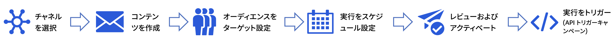

# キャンペーンの基本を学ぶ {#get-started-campaigns}

>[!CONTEXTUALHELP]
>id="campaigns_list"
>title="キャンペーン"
>abstract="キャンペーンを作成して、様々なチャネルをまたいで特定のセグメントに 1 回限りのコンテンツを配信します。 キャンペーンを作成する前に、チャネルサーフェス（例：メッセージプリセット）とAdobe Experience Platformセグメントが使用可能になっていることを確認します。"

Journey Optimizerキャンペーンを使用すると、様々なチャネルを使用して、特定のセグメントに 1 回限りのコンテンツを配信できます。 ジャーニーを使用する場合、アクションは順に実行されます。 キャンペーンでは、アクションは即座に、または指定したスケジュールに基づいて、同時に実行されます。

キャンペーンを作成して、プロモーションオファー、エンゲージメントキャンペーン、お知らせ、法律上の注意事項、ポリシーの更新などのマーケティングユースケース向けに、シンプルなアドホックバッチ通信を送信します。

キャンペーンを作成する主な手順は次のとおりです。

➡️ [この機能をビデオで確認](#video)

<!--You can create two types of campaigns:

* **Scheduled campaigns** allow for simple ad-hoc batch communications for marketing use cases like promotional offers, engagement campaigns, announcements, legal notices, or policy updates.
* **API Triggered Campaigns** allow for simple transactional/operational messages with REST APIs (password reset, card abandonment, etc.), where the need may involve personalization using profile attributes and contextual data from payload.-->

## 開始する前に {#campaign-prerequisites}

Journey Optimizerで最初のキャンペーンの作成を開始する前に、次の前提条件を確認してください。

1. **適切な権限が必要です**. キャンペーンは、キャンペーン関連の **[!UICONTROL 製品プロファイル]** （Campaign 管理者、Campaign 承認者、Campaign マネージャー、Campaign ビューアなど）。

   キャンペーンにアクセスできない場合は、権限を拡張する必要があります。 次にアクセスできる場合： [Adobe Admin Console](https://adminconsole.adobe.com/)組織の場合は、次の手順に従います。{target=&quot;_blank&quot;} そうでない場合は、Journey Optimizer管理者に問い合わせてください。

   +++キャンペーン権限の割り当て方法を説明します

   対応する **[!UICONTROL 製品プロファイル]** をユーザーに送信します。

   1. 送信者 [Adobe Admin Console](https://adminconsole.adobe.com/){target=&quot;_blank&quot;}、 [!DNL Adobe Experience Platform] 製品。

   1. 次を参照： **[!UICONTROL 製品プロファイル]** 」タブで、組み込みのキャンペーン関連の 1 つを選択します。 **[!UICONTROL 製品プロファイル]**:Campaign 管理者、Campaign 承認者、Campaign マネージャー、または Campaign ビューア。

      Journey Optimizer campaign の詳細 **[!UICONTROL 製品プロファイル]** および **[!UICONTROL 権限]**, [このページを参照してください。](../administration/ootb-product-profiles.md).

      

   1. クリック **[!UICONTROL ユーザーを追加]** 選択したユーザーに割り当てるには **[!UICONTROL 製品プロファイル]**.

      

   1. ユーザーの名前、グループまたは電子メールアドレスを入力し、 **[!UICONTROL 保存]**.
   これで、 **[!UICONTROL キャンペーン]**.

+++

1. **オーディエンスが必要です**. オーディエンスセグメントは、キャンペーンを作成する前に使用可能にする必要があります。 オーディエンス作成の詳細を表示 [このページ](../segment/about-segments.md).
1. **チャンネルサーフェスが必要です**. チャネルを選択するには、対応するチャネルサーフェス（プリセット）を作成し、使用可能にする必要があります。 チャネルサーフェスの詳細を説明します [このページ](../configuration/channel-surfaces.md).

## キャンペーンへのアクセス {#access}

キャンペーンは、**[!UICONTROL キャンペーン]**&#x200B;メニューからアクセスできます。

デフォルトでは、リストには&#x200B;**[!UICONTROL ドラフト]**、**[!UICONTROL スケジュール済み]**、**[!UICONTROL ライブ]**&#x200B;ステータスのすべてのキャンペーンが表示されます。停止、完了およびアーカイブされたキャンペーンを表示するには、フィルターをクリアする必要があります。

## キャンペーンのステータス {#statuses}

キャンペーンには複数のステータスがあります。

* **[!UICONTROL ドラフト]**：キャンペーンは編集中で、アクティブ化されていません。
* **[!UICONTROL アクティブ化中]**：キャンペーンをアクティブ化中です。
* **[!UICONTROL ライブ]**：キャンペーンはアクティブ化されています。
* **[!UICONTROL 予定]**:キャンペーンは、特定の開始日にアクティブ化されるように設定されています。
* **[!UICONTROL 停止]**：キャンペーンは手動で停止されました。これ以降は、アクティブ化または再利用できません。 [詳細情報](modify-stop-campaign.md#stop)
* **[!UICONTROL 完了]**：キャンペーンは完了しています。このステータスは、キャンペーンがアクティブ化されてから 3 日後に、またはキャンペーンが繰り返し実行されている場合はキャンペーンの終了日に、自動的に割り当てられます。
* **[!UICONTROL アーカイブ済み]**：キャンペーンはアーカイブされています。

>[!NOTE]
>
>ドラフトバージョンを開くアイコン ( **[!UICONTROL ライブ]** または **[!UICONTROL 予定]** 「 」ステータスは、キャンペーンの新しいバージョンが作成済みで、まだアクティブ化されていないことを示します。 [詳細情報](modify-stop-campaign.md#modify)。

## チュートリアルビデオ {#video}

最初のキャンペーンの作成方法を学びます。

>[!VIDEO](https://video.tv.adobe.com/v/346680?quality=12)
