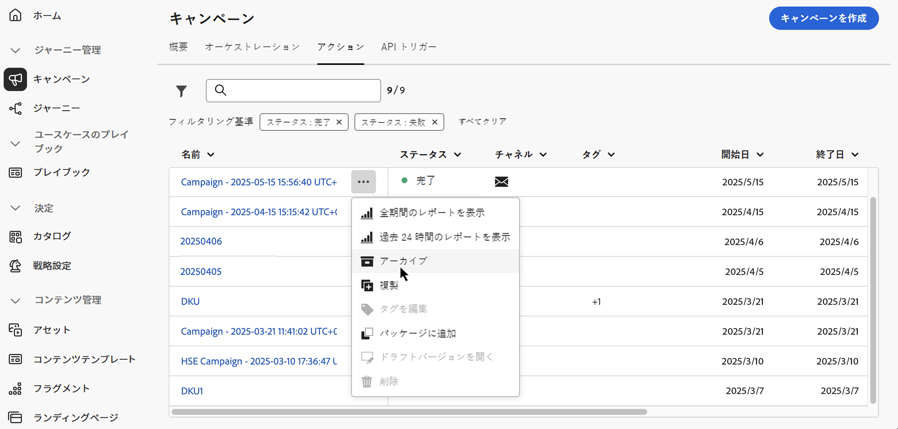
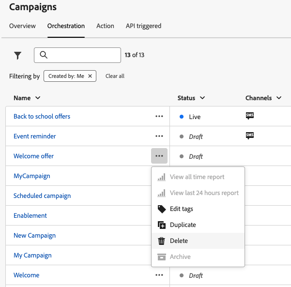

# キャンペーンへのアクセスと管理 {#manage-campaigns}

キャンペーンを開始する前に、[この節](get-started-with-campaigns.md#permissions)に記載されている次の前提条件を確認してください。これらの前提条件が満たされたら、キャンペーンの作成を開始できます。

* **キャンペーンへのアクセス**。[キャンペーンリスト](#access)または[キャンペーンカレンダー](#calendar)からキャンペーンにアクセスできます。

* **キャンペーンを作成**&#x200B;します。作成手順は、[キャンペーンのタイプ](get-started-with-campaigns.md#get-started-with-campaigns)によって異なります。詳しくは、[アクションキャンペーン](../campaigns/create-campaign.md)、[API トリガーキャンペーン](../campaigns/api-triggered-campaigns.md)または[オーケストレーションキャンペーン](../orchestrated/create-orchestrated-campaign.md)を作成する方法を参照してください。

* **キャンペーンのプロパティを定義**&#x200B;します。詳しくは、[アクションキャンペーン](../campaigns/campaign-properties.md)、[API トリガーキャンペーン](../campaigns/api-triggered-campaign-properties.md)または[オーケストレーションキャンペーン](../orchestrated/create-orchestrated-campaign.md)のプロパティを設定する方法を参照してください。

* **キャンペーンチャネルとコンテンツを定義**&#x200B;します。詳しくは、[アクションキャンペーン](../campaigns/campaign-content.md)、[API トリガーキャンペーン](../campaigns/api-triggered-campaign-content.md)または[オーケストレーションキャンペーン](../orchestrated/orchestrate-activities.md)のコンテンツを定義する方法を参照してください。

* **キャンペーンのスケジュール** - スケジュール済みキャンペーンは、[キャンペーンカレンダー](#calendar)で確認できます。

次に、キャンペーンを実行する前に、テストを開始し、改善と調整を行います。キャンペーンが公開されたら、キャンペーンを監視して、レポートにアクセスできます。

すべてのキャンペーンのステータスとアラートについて詳しくは、[この節](#statuses)を参照してください。

## キャンペーンへのアクセス {#access}

>[!CONTEXTUALHELP]
>id="ajo_targeting_workflow_list"
>title="調整されたキャンペーンの在庫"
>abstract="この画面では、調整されたキャンペーンの完全なリストにアクセスし、現在のステータス、前回／次回の実行日を確認して、新しい調整されたキャンペーンを作成できます。"

>[!CONTEXTUALHELP]
>id="ajo_orchestration_campaign_action"
>title="アクション"
>abstract="この節では、調整されたキャンペーン内で使用されるすべてのアクションを示します。"

キャンペーンは、**[!UICONTROL キャンペーン]**&#x200B;メニューからアクセスできます。以下のタブを使用して、**アクション**&#x200B;キャンペーン、**API トリガー**&#x200B;キャンペーン、**オーケストレーション**&#x200B;キャンペーンなどのタイプ別にキャンペーンを参照します。詳しくは、[キャンペーンのタイプ](get-started-with-campaigns.md#get-started-with-campaigns)を参照してください。使用可能なタイプは、ライセンス契約と権限によって異なります。

>[!BEGINTABS]

>[!TAB アクションキャンペーン]

「**[!UICONTROL アクション]**」タブを選択して、アクションキャンペーンのリストにアクセスします。

デフォルトでは、リストには&#x200B;**[!UICONTROL ドラフト]**、**[!UICONTROL スケジュール済み]**、**[!UICONTROL ライブ]**&#x200B;ステータスのすべてのキャンペーンが表示されます。停止、完了およびアーカイブされたキャンペーンを表示するには、フィルターをクリアする必要があります。

>[!TAB API トリガーキャンペーン]

「**[!UICONTROL API トリガー]**」タブを選択して、API トリガーキャンペーンのリストにアクセスします。

デフォルトでは、リストには&#x200B;**[!UICONTROL ドラフト]**、**[!UICONTROL スケジュール済み]**、**[!UICONTROL ライブ]**&#x200B;ステータスのすべてのキャンペーンが表示されます。停止、完了およびアーカイブされたキャンペーンを表示するには、フィルターをクリアする必要があります。

>[!TAB 調整されたキャンペーン]

「**[!UICONTROL オーケストレーション]**」タブを選択して、調整されたキャンペーンのリストにアクセスします。

{zoomable="yes"}{zoomable="yes"}

リスト内の調整された各キャンペーンには、キャンペーンの現在の[ステータス](#status)、関連付けられたチャネルとタグ、最終変更日時などの情報が表示されます。 ボタンをクリックすると、表示される列をカスタマイズできます。

>[!ENDTABS]

また、検索バーとフィルターを使用して、リスト内での検索を簡単にすることができます。例えば、キャンペーンをフィルタリングして、特定のチャネルまたはタグに関連付けられたキャンペーンや、特定の日付範囲中に作成されたキャンペーンのみを表示できます。

キャンペーン在庫の  ボタンを使用すると、以下に説明する様々な操作を実行できます。

* **[!UICONTROL 全期間のレポートを表示]**／**[!UICONTROL 過去 24 時間のレポートを表示]** - レポートにアクセスして、キャンペーンの影響とパフォーマンスを測定および視覚化します。詳しくは、[キャンペーンレポート](../reports/campaign-global-report-cja.md)を参照してください。
* **[!UICONTROL タグを編集]** - キャンペーンに関連付けられたタグを編集します。詳しくは、[キャンペーンでのタグの使用](../start/search-filter-categorize.md#add-tags-to-an-object)を参照してください。
* **[!UICONTROL 複製]** - このオプションを使用して、例えば、停止済みのオーケストレーションキャンペーンの実行に、キャンペーンを複製します。[詳細情報](#duplicate-a-campaign)
* **[!UICONTROL 削除]** - このオプションを使用して、キャンペーンを削除します。[詳細情報](#delete-a-campaign)
* **[!UICONTROL アーカイブ]** - キャンペーンをアーカイブします。すべてのアーカイブ済みキャンペーンは、最終変更日から 30 日後にローリング再スケジュールで削除されます。このアクションは、**[!UICONTROL ドラフト]**&#x200B;キャンペーンを除くすべてのキャンペーンで使用できます。詳しくは、[キャンペーンのアーカイブ](#archive-a-campaign)を参照してください。

アクションおよび API トリガーキャンペーンの場合は、以下の追加アクションを使用できます。

* **[!UICONTROL パッケージに追加]** - キャンペーンを別のサンドボックスに書き出すには、パッケージに追加します。詳しくは、[別のサンドボックスへのオブジェクトの書き出し](../configuration/copy-objects-to-sandbox.md)を参照してください。
* **[!UICONTROL ドラフトバージョンを開く]** - キャンペーンの新しいバージョンが作成され、まだアクティブ化されていない場合は、このアクションを使用して、そのドラフトバージョンにアクセスできます。

## キャンペーンのライフサイクル {#statuses}

Adobe Journey Optimizer では、各キャンペーンはインターフェイスのステータスに反映されるライフサイクルを通じて移動します。使用可能なステータスは、キャンペーンのタイプ（アクション、API トリガー、オーケストレーション）によって異なります。以下のタブを使用して、各キャンペーンタイプに固有のライフサイクルとステータスを探索します。

>[!BEGINTABS]

>[!TAB アクションキャンペーン]

* **[!UICONTROL ドラフト]**：キャンペーンは編集中で、アクティブ化されていません。
* **[!UICONTROL スケジュール済み]**：キャンペーンは、特定の開始日にアクティブ化されるように設定されています。
* **[!UICONTROL ライブ]**：キャンペーンはアクティブ化されています。
* **[!UICONTROL レビュー中]**：キャンペーンは、公開するために承認用に送信されています。[詳しくは、承認の操作方法を参照してください](../test-approve/gs-approval.md)。
* **[!UICONTROL 停止]**：キャンペーンは手動で停止されました。この設定になっている場合は、それ以上アクティブ化したり再利用したりすることはできません。[キャンペーンの停止方法を学ぶ](manage-campaigns.md#stop)
* **[!UICONTROL 完了]**：キャンペーンは完了しています。このステータスは、キャンペーンがアクティブ化されてから 3 日後に、またはキャンペーンが繰り返し実行される設定になっている場合はキャンペーンの終了日に、自動的に割り当てられます。
* **[!UICONTROL 失敗]**：キャンペーンの実行に失敗しました。ログを確認して、問題を特定します。
* **[!UICONTROL アーカイブ済み]**：キャンペーンはアーカイブされています。[キャンペーンのアーカイブ方法を学ぶ](manage-campaigns.md#archive)

>[!NOTE]
>
>**[!UICONTROL ライブ]**&#x200B;または&#x200B;**[!UICONTROL スケジュール済み]**&#x200B;ステータスの横にある「ドラフトバージョンを開く」アイコンは、アクションキャンペーンまたは API トリガーキャンペーンの新しいバージョンが作成され、まだアクティブ化されていないことを示しています。

>[!TAB API トリガーキャンペーン]

* **[!UICONTROL ドラフト]**：キャンペーンは編集中で、アクティブ化されていません。
* **[!UICONTROL スケジュール済み]**：キャンペーンは、特定の開始日にアクティブ化されるように設定されています。
* **[!UICONTROL ライブ]**：キャンペーンはアクティブ化されています。
* **[!UICONTROL レビュー中]**：キャンペーンは、公開するために承認用に送信されています。[詳しくは、承認の操作方法を参照してください](../test-approve/gs-approval.md)。
* **[!UICONTROL 停止]**：キャンペーンは手動で停止されました。この設定になっている場合は、それ以上アクティブ化したり再利用したりすることはできません。[キャンペーンの停止方法を学ぶ](manage-campaigns.md#stop)
* **[!UICONTROL 完了]**：キャンペーンは完了しています。このステータスは、キャンペーンがアクティブ化されてから 3 日後に、またはキャンペーンが繰り返し実行される設定になっている場合はキャンペーンの終了日に、自動的に割り当てられます。
* **[!UICONTROL 失敗]**：キャンペーンの実行に失敗しました。ログを確認して、問題を特定します。
* **[!UICONTROL アーカイブ済み]**：キャンペーンはアーカイブされています。[キャンペーンのアーカイブ方法を学ぶ](manage-campaigns.md#archive)

>[!NOTE]
>
>**[!UICONTROL ライブ]**&#x200B;または&#x200B;**[!UICONTROL スケジュール済み]**&#x200B;ステータスの横にある「ドラフトバージョンを開く」アイコンは、アクションキャンペーンまたは API トリガーキャンペーンの新しいバージョンが作成され、まだアクティブ化されていないことを示しています。

>[!TAB 調整されたキャンペーン]

* **[!UICONTROL ドラフト]**：調整されたキャンペーンが作成されています。まだ公開されていません。
* **[!UICONTROL 公開中]**：調整されたキャンペーンを公開中です。
* **[!UICONTROL ライブ]**：調整されたキャンペーンが公開され、実行中です。
* **[!UICONTROL スケジュール済み]**：調整されたキャンペーンの実行がスケジュールされています。
* **[!UICONTROL 完了]**：調整されたキャンペーンの実行は完了しています。キャンペーンがエラーなしでメッセージの送信を完了してから最大 3 日後に、完了ステータスが自動的に割り当てられます。
* **[!UICONTROL クローズ済み]**：このステータスは、繰り返しキャンペーンがクローズされた際に表示されます。キャンペーンはすべてのアクティビティが完了するまで引き続き実行しますが、それ以上のプロファイルはキャンペーンにエントリできません。
* **[!UICONTROL アーカイブ済み]**：キャンペーンはアーカイブされています。すべてのアーカイブ済みキャンペーンは、最終変更日から 30 日後にローリング再スケジュールで削除されます。必要に応じて、アーカイブ済みキャンペーンを複製して、引き続き作業できます。
* **[!UICONTROL 停止済み]**：調整されたキャンペーンの実行が停止されています。キャンペーンを再度開始するには、複製する必要があります。

>[!ENDTABS]

1 つのキャンペーン内でエラーが発生した場合、キャンペーンのステータスの横に警告アイコンが表示されます。アラートに関する情報を表示するには、アラートをクリックします。これらのアラートは、キャンペーンメッセージが公開されていない場合または選択した設定が正しくない場合など、様々な状況で発生する場合があります。

## キャンペーンカレンダー {#calendar}

>[!CONTEXTUALHELP]
>id="ajo_campaigns_view"
>title="キャンペーンリストとカレンダー表示"
>abstract="[!DNL Journey Optimizer]では、キャンペーンリストに加えて、キャンペーンのカレンダー表示が提供され、キャンペーンのスケジュールが明確に視覚的に表現されます。これらのボタンを使用すると、リスト表示とカレンダー表示をいつでも切り替えることができます。"

[!DNL Journey Optimizer] では、キャンペーンリストに加えて、キャンペーンのカレンダー表示が提供され、キャンペーンのスケジュールが明確に視覚的に表現されます。

キャンペーンの表現方法：

* デフォルトでは、カレンダーグリッドには、選択した週のすべてのライブキャンペーンとスケジュールされたキャンペーンが表示されます。追加のフィルターオプションを使用すると、完了、停止、終了したアクティブ化や、特定のタイプまたはチャネルのアクティブ化を表示できます。
* ドラフトキャンペーンは表示されません。
* 複数日にまたがるキャンペーンは、カレンダーグリッドの上部に表示されます。
* 開始時間を指定していない場合は、最も近い手動アクティブ化時刻を使用してカレンダーに配置されます。
* キャンペーンの期間は 1 時間として表示されますが、実際の送信時間または完了時間は反映されません。

キャンペーンカレンダーに移動するには：

1.  アイコンをクリックして、キャンペーンカレンダーにアクセスします。

1. 週間を移動するには、カレンダーの上にある矢印ボタンまたは日付セレクターを使用します。

   カレンダーには、現在の週にスケジュールされているすべてのキャンペーンが表示されます。

   

1.  アイコンをクリックして、数日間または数週間にまたがる項目の表示を切り替えます。

   

1.  アイコンをクリックして、最大 3 つの外部カレンダーを管理および追加します。

   

1. イベント名、開始日および終了日を含む CSV ファイルをドラッグ＆ドロップします。

   アップロードされたイベントは、組織内のすべてのユーザーが閲覧でき、ジャーニーカレンダーとキャンペーンカレンダーの両方に表示されます。

   +++CSV 形式は次のようになります。

   | 列 1 | 列 2 | 列 3 |
   |-|-|-|
   | イベント名 | 開始日（mm/dd/yy 形式） | 終了日（mm/dd/yy 形式） |

   +++

1. 必要に応じて、追加した外部カレンダーを表示するか非表示にしたり、削除したりできます。

   

1. キャンペーンの詳細を確認するには、ビジュアルブロックをクリックして詳細を開きます。情報パネルが開き、タイプ、レポートへのアクセス、割り当てたタグなど、キャンペーンに関する様々な情報が表示されます。

   

## 繰り返しアクションキャンペーンの変更と停止 {#modify}

### アクションキャンペーンの変更

繰り返しアクションキャンペーンの新しいバージョンを変更および作成するには、次の手順に従います。

1. アクションキャンペーンを開き、「**[!UICONTROL キャンペーンを変更]**」ボタンをクリックします。

1. キャンペーンの新しいバージョンが作成されます。ライブバージョンを確認するには、「**[!UICONTROL ライブバージョンを開く]**」をクリックします。

   

   キャンペーンリストで、ドラフトバージョンが進行中のアクティブ化されたキャンペーンは、**[!UICONTROL ステータス]**&#x200B;列に特定のアイコンで表示されます。このアイコンをクリックして、キャンペーンのドラフトバージョンを開きます。

   

1. 変更の準備が整ったら、新しいバージョンのキャンペーンをアクティブ化できます（[キャンペーンのレビューとアクティブ化](create-campaign.md#review-activate)を参照）。

   >[!IMPORTANT]
   >
   >ドラフトをアクティブ化すると、キャンペーンのライブバージョンが置き換えられます。

### アクションキャンペーンの停止 {#stop}

繰り返しキャンペーンを停止するには、キャンペーンを開いてから「**[!UICONTROL キャンペーンを停止]**」ボタンをクリックします。

>[!IMPORTANT]
>
>キャンペーンを停止しても、その時点で送信中のキャンペーンは停止されませんが、スケジュール済みの送信や、送信中のキャンペーンの次回の送信は停止されます。

## キャンペーンのアーカイブ {#archive}

時間が経過すると、キャンペーンのリストは増え続け、最終的には完了済みのキャンペーンと停止済みのキャンペーンを参照するのが難しくなります。

これを防ぐには、不要になった完了済みのキャンペーンと停止済みのキャンペーンをアーカイブします。これを行うには、「...」ボタンをクリックし、「**[!UICONTROL アーカイブ]**」を選択します。

アーカイブされたキャンペーンは、リスト内の専用フィルターを使用して取得できます。

## キャンペーンの削除 {#delete}

キャンペーンを削除するには、省略記号  ボタンを使用して、「**[!UICONTROL 削除]**」を選択します。

{width="70%" align="left"}

>[!IMPORTANT]
>
>このオプションは、**[!UICONTROL ドラフト]**&#x200B;キャンペーンでのみ使用できます。

## キャンペーンの複製 {#duplicate}

キャンペーンを複製するには（例えば、キャンペーンが停止されている場合）、省略記号  ボタンを使用して、「**[!UICONTROL 複製]**」を選択します。

キャンペーンの名前を入力して確定します。

キャンペーンが作成され、キャンペーンリストに追加されます。
