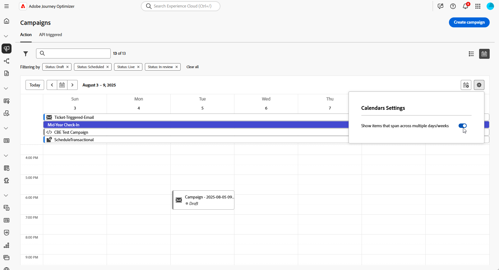

# キャンペーンへのアクセスと管理 {#manage-campaigns}

>[!CONTEXTUALHELP]
>id="ajo_targeting_workflow_list"
>title="調整されたキャンペーンの在庫"
>abstract="この画面では、調整されたキャンペーンの完全なリストにアクセスし、現在のステータス、前回／次回の実行日を確認して、新しい調整されたキャンペーンを作成できます。"

>[!CONTEXTUALHELP]
>id="ajo_orchestration_campaign_action"
>title="アクション"
>abstract="この節では、調整されたキャンペーン内で使用されるすべてのアクションを示します。"

Adobe Journey Optimizerでキャンペーンにアクセス、整理、管理する方法について説明します。 このガイドでは、キャンペーンの検索からステータスの理解、一般的な操作の実行、Campaign ワークスペースの保守に至るまで、すべてをカバーします。

## クイックスタート：一般的なタスク {#quick-tasks}

必要な場所に直接ジャンプ：

* **新しいキャンペーンの作成** → [ キャンペーンタイプを選択 ](get-started-with-campaigns.md#campaign-types)
   * [アクションキャンペーンを作成](create-campaign.md)
   * [API トリガーキャンペーンを作成](api-triggered-campaigns.md)
   * [オーケストレーションされたキャンペーンの作成](../orchestrated/gs-orchestrated-campaigns.md)
* **既存のキャンペーンを検索** → [ 検索とフィルター ](#access)
* **キャンペーンパフォーマンスの表示** → [ キャンペーンレポート ](../reports/campaign-global-report-cja.md)
* **キャンペーンのスケジュール設定** →[ カレンダーの使用 ](#calendar)
* **競合の管理** → [ 競合管理ガイド ](../conflict-prioritization/gs-conflict-prioritization.md)

## キャンペーンへのアクセスと参照 {#access}

キャンペーンは、**[!UICONTROL キャンペーン]**&#x200B;メニューからアクセスできます。以下のタブを使用して、**アクション**&#x200B;キャンペーン、**API トリガー**&#x200B;キャンペーン、**オーケストレーション**&#x200B;キャンペーンなどのタイプ別にキャンペーンを参照します。詳しくは、[キャンペーンのタイプ](get-started-with-campaigns.md#campaign-types)を参照してください。使用可能なタイプは、ライセンス契約と権限によって異なります。

>[!BEGINTABS]

>[!TAB アクションキャンペーン]

「**[!UICONTROL アクション]**」タブを選択して、アクションキャンペーンのリストにアクセスします。

デフォルトでは、リストには&#x200B;**[!UICONTROL ドラフト]**、**[!UICONTROL スケジュール済み]**、**[!UICONTROL ライブ]**&#x200B;ステータスのすべてのキャンペーンが表示されます。停止、完了およびアーカイブされたキャンペーンを表示するには、フィルターをクリアする必要があります。

>[!TAB API トリガーキャンペーン]

「**[!UICONTROL API トリガー]**」タブを選択して、API トリガーキャンペーンのリストにアクセスします。

デフォルトでは、リストには&#x200B;**[!UICONTROL ドラフト]**、**[!UICONTROL スケジュール済み]**、**[!UICONTROL ライブ]**&#x200B;ステータスのすべてのキャンペーンが表示されます。停止、完了およびアーカイブされたキャンペーンを表示するには、フィルターをクリアする必要があります。

>[!TAB 調整されたキャンペーン]

「**[!UICONTROL オーケストレーション]**」タブを選択して、調整されたキャンペーンのリストにアクセスします。

{zoomable="yes"}

リスト内のオーケストレーションされた各キャンペーンには、キャンペーンの現在の [ ステータス ](#statuses)、関連するチャネルとタグ、前回の変更日時などの情報が表示されます。  ボタンをクリックすると、表示される列をカスタマイズできます。

>[!ENDTABS]

### キャンペーンの検索とフィルタリング {#search-filter}

また、検索バーとフィルターを使用して、リスト内での検索を簡単にすることができます。例えば、キャンペーンをフィルタリングして、特定のチャネルまたはタグに関連付けられたキャンペーンや、特定の日付範囲中に作成されたキャンペーンのみを表示できます。

## Campaign 操作 {#operations}

キャンペーンインベントリの「その他のアクション」ボタンを表示する  ボタンを使用すると、様々な操作を実行できます。

### 使用可能なアクション

**すべてのキャンペーンタイプに対して：**

* **[!UICONTROL 全期間のレポートを表示]**／**[!UICONTROL 過去 24 時間のレポートを表示]** - レポートにアクセスして、キャンペーンの影響とパフォーマンスを測定および視覚化します。[ キャンペーンレポートの詳細については、こちらを参照してください→](../reports/campaign-global-report-cja.md)
* **[!UICONTROL タグを編集]** - キャンペーンに関連付けられたタグを編集します。[ タグ→の使用方法を学ぶ ](../start/search-filter-categorize.md#add-tags)
* **[!UICONTROL 複製]** - このオプションを使用して、例えば、停止済みのオーケストレーションキャンペーンの実行に、キャンペーンを複製します。[→の複製の詳細情報 ](#duplicate-a-campaign)
* **[!UICONTROL 削除]** - このオプションを使用して、キャンペーンを削除します。[→の削除の詳細情報 ](#delete-a-campaign)
* **[!UICONTROL アーカイブ]** - キャンペーンをアーカイブします。すべてのアーカイブ済みキャンペーンは、最終変更日から 30 日後にローリングスケジュールで削除されます。このアクションは、**[!UICONTROL ドラフト]**&#x200B;キャンペーンを除くすべてのキャンペーンで使用できます。[ ア→ットのアーカイブの詳細情報 ](#archive-a-campaign)

**アクションおよび API トリガーキャンペーンのみ：**

* **[!UICONTROL パッケージに追加]** - キャンペーンを別のサンドボックスに書き出すには、パッケージに追加します。[ オブジェクトを→に書き出す方法を学ぶ ](../configuration/copy-objects-to-sandbox.md)
* **[!UICONTROL ドラフトバージョンを開く]** - キャンペーンの新しいバージョンが作成され、まだアクティブ化されていない場合は、このアクションを使用して、そのドラフトバージョンにアクセスできます。

## キャンペーンステータスについて {#statuses}

各キャンペーンは、インターフェイスのステータスによって反映されるライフサイクルを進めます。 これらのステータスを理解することで、使用可能なアクションと次に行うアクションを把握できます。

| ステータス | アクションキャンペーン | API トリガーキャンペーン | 調整されたキャンペーン | 意味 | 次のアクション |
|--------|:----------------:|:-----------------------:|:----------------------:|---------------|--------------|
| **[!UICONTROL ドラフト]** | ✅ | ✅ | ✅ | 編集中、アクティブ化されていません | 編集を続行または [ キャンペーンをアクティブ化 ](review-activate-campaign.md) |
| **[!UICONTROL スケジュール型]** | ✅ | ✅ | ✅ | 特定の開始日用に設定 | ローンチを待つか [ 必要に応じて変更 ](#modify)、または [ カレンダーで表示 ](#calendar) |
| **[!UICONTROL ライブ]** | ✅ | ✅ | ✅ | アクティブ化して実行中 | [ パフォーマンスの監視 ](../reports/campaign-global-report-cja.md)、必要に応じて [ 新しいバージョンの作成 ](#modify) |
| **[!UICONTROL レビュー中]** | ✅ | ✅ | — | 承認用に送信 | [ 承認 ](../test-approve/gs-approval.md) または変更を待つ |
| **[!UICONTROL 停止]** | ✅ | ✅ | ✅ | 手動で停止し、再アクティブ化できません | [ 複製して再利用 ](#duplicate-a-campaign) |
| **[!UICONTROL 完了]** | ✅ | ✅ | ✅ | 実行完了（アクティベーション後または繰り返し処理の終了日に自動的に割り当てられる） | [ レポートの表示 ](../reports/campaign-global-report-cja.md)、[ アーカイブ ](#archive-a-campaign) または [ 複製 ](#duplicate-a-campaign) |
| **[!UICONTROL 失敗]** | ✅ | ✅ | — | 実行できませんでした | ログを確認し、問題を修正 [ 複製して再試行 ](#duplicate-a-campaign) |
| **[!UICONTROL アーカイブ済み]** | ✅ | ✅ | ✅ | アーカイブ済み（30 日後に自動削除） | 必要に応じて、[filter を使用して取得 ](#access) ます。 |
| **[!UICONTROL 閉じる]** | — | — | ✅ | 繰り返しキャンペーンがクローズされました。新規エントリは許可されません（すべてのアクティビティが完了するまで継続されます） | 完了まで待つ |
| **[!UICONTROL パブリッシュ]** | — | — | ✅ | 公開中 | 公開が完了するのを待ちます |

>[!NOTE]
>
>アクションおよび API トリガーキャンペーンの場合、「ライブ」または **[!UICONTROL スケジュール済み]** ステータスの横にある「ドラフトバージョンを開く **[!UICONTROL アイコンは、新しいバージョンが作成され、まだアクティベートされてい]** いことを示します。

### エラー指標

1 つのキャンペーン内でエラーが発生した場合、キャンペーンのステータスの横に警告アイコンが表示されます。アラートに関する情報を表示するには、アラートをクリックします。これらのアラートは、キャンペーンメッセージが公開されていない場合または選択した設定が正しくない場合など、様々な状況で発生する場合があります。

>[!NOTE]
>
>Assets/画像は、フラグメント/インラインメッセージで最初に公開されてから最大 2 年間（730 日）配信されたコンテンツでアクセスできます。 この有効期限の後（730 日後の任意の時間）に、さらに 2 年間アクセスできるようにするには、再公開が必要です。 最初の公開から 730 日以内に行われた再公開では、アセット/画像の有効期限が次の 730 日に延長されません。

## キャンペーンカレンダー {#calendar}

>[!CONTEXTUALHELP]
>id="ajo_campaigns_view"
>title="キャンペーンリストとカレンダー表示"
>abstract="[!DNL Journey Optimizer]では、キャンペーンリストに加えて、キャンペーンのカレンダー表示が提供され、キャンペーンのスケジュールが明確に視覚的に表現されます。これらのボタンを使用すると、リスト表示とカレンダー表示をいつでも切り替えることができます。"

[!DNL Journey Optimizer] では、キャンペーンリストに加えて、キャンペーンのカレンダー表示が提供され、キャンペーンのスケジュールが明確に視覚的に表現されます。

### カレンダーの仕組み

キャンペーンの表現方法：

* デフォルトでは、カレンダーグリッドには、選択した週のすべてのライブキャンペーンとスケジュールされたキャンペーンが表示されます。追加のフィルターオプションを使用すると、完了、停止、終了したアクティブ化や、特定のタイプまたはチャネルのアクティブ化を表示できます。
* ドラフトキャンペーンは表示されません。
* 複数日にまたがるキャンペーンは、カレンダーグリッドの上部に表示されます。
* 開始時間を指定していない場合は、最も近い手動アクティブ化時刻を使用してカレンダーに配置されます。
* キャンペーンの期間は 1 時間として表示されますが、実際の送信時間または完了時間は反映されません。

### カレンダーの操作

1.  アイコンをクリックして、キャンペーンカレンダーにアクセスします。

1. 週間を移動するには、カレンダーの上にある矢印ボタンまたは日付セレクターを使用します。

   カレンダーには、現在の週にスケジュールされているすべてのキャンペーンが表示されます。

   

1.  アイコンをクリックして、数日間または数週間にまたがる項目の表示を切り替えます。

   

1.  アイコンをクリックして、最大 3 つの外部カレンダーを管理および追加します。

   

1. イベント名、開始日および終了日を含む CSV ファイルをドラッグ＆ドロップします。

   アップロードされたイベントは、組織内のすべてのユーザーが閲覧でき、ジャーニーカレンダーとキャンペーンカレンダーの両方に表示されます。

   +++CSV 形式は次のようになります。

   | 列 1 | 列 2 | 列 3 |
   |-|-|-|
   | イベント名 | 開始日（mm/dd/yy 形式） | 終了日（mm/dd/yy 形式） |

   +++

1. 必要に応じて、追加した外部カレンダーを表示するか非表示にしたり、削除したりできます。

   

1. キャンペーンの詳細を確認するには、ビジュアルブロックをクリックして詳細を開きます。情報パネルが開き、タイプ、レポートへのアクセス、割り当てたタグなど、キャンペーンに関する様々な情報が表示されます。

   

## 繰り返しアクションキャンペーンの変更と停止 {#modify}

### アクションキャンペーンの変更

繰り返しアクションキャンペーンの新しいバージョンを変更および作成するには、次の手順に従います。

1. アクションキャンペーンを開き、「**[!UICONTROL キャンペーンを変更]**」ボタンをクリックします。

1. キャンペーンの新しいバージョンが作成されます。ライブバージョンを確認するには、「**[!UICONTROL ライブバージョンを開く]**」をクリックします。

   

   キャンペーンリストで、ドラフトバージョンが進行中のアクティブ化されたキャンペーンは、**[!UICONTROL ステータス]**&#x200B;列に特定のアイコンで表示されます。このアイコンをクリックして、キャンペーンのドラフトバージョンを開きます。

   

1. 変更の準備が整ったら、新しいバージョンのキャンペーンをアクティブ化できます（[キャンペーンのレビューとアクティブ化](review-activate-campaign.md)を参照）。

   >[!IMPORTANT]
   >
   >ドラフトをアクティブ化すると、キャンペーンのライブバージョンが置き換えられます。

**関連トピック：**
* [キャンペーンプロパティ](campaign-properties.md)
* [Campaign アクション](campaign-action.md)
* [Campaign コンテンツ](campaign-content.md)
* [キャンペーンオーディエンス](campaign-audience.md)
* [キャンペーンスケジュール](campaign-schedule.md)

### アクションキャンペーンの停止 {#stop}

繰り返しキャンペーンを停止するには、キャンペーンを開いてから「**[!UICONTROL キャンペーンを停止]**」ボタンをクリックします。

>[!IMPORTANT]
>
>キャンペーンを停止しても、その時点で進行中の送信は停止しませんが、スケジュール済みの送信や次回の送信（進行中の送信がある場合）が停止します。

## キャンペーンのアーカイブ {#archive-a-campaign}

時間が経過すると、キャンペーンのリストは増え続け、最終的には完了済みのキャンペーンと停止済みのキャンペーンを参照するのが難しくなります。

これを防ぐには、不要になった完了済みのキャンペーンと停止済みのキャンペーンをアーカイブします。これを行うには、「...」ボタンをクリックし、「**[!UICONTROL アーカイブ]**」を選択します。

アーカイブされたキャンペーンは、リスト内の専用フィルターを使用して取得できます。

## キャンペーンの削除 {#delete-a-campaign}

キャンペーンを削除するには、省略記号  ボタンを使用し、「**[!UICONTROL 削除]** を選択します。

{width="70%" align="left"}

>[!IMPORTANT]
>
>このオプションは、**[!UICONTROL ドラフト]**&#x200B;キャンペーンでのみ使用できます。

## キャンペーンの複製 {#duplicate-a-campaign}

例えば、キャンペーンを停止した場合にキャンペーンを複製するには、省略記号  ボタンを使用して、「複製 **[!UICONTROL を選択し]** す。

キャンペーンの名前を入力して確定します。

キャンペーンが作成され、キャンペーンリストに追加されます。

## その他のリソース

* **はじめに** - [ キャンペーンの基本を学ぶ ](get-started-with-campaigns.md) | [ 最初のアクションキャンペーンを作成 ](create-campaign.md) | [API トリガーキャンペーンガイド ](api-triggered-campaigns.md) | [ オーケストレートキャンペーンガイド ](../orchestrated/gs-orchestrated-campaigns.md)

* **Campaign 設定** - [Campaign プロパティ ](campaign-properties.md) | [ キャンペーンのアクションとチャネル ](campaign-action.md) | [Campaign コンテンツデザイン ](campaign-content.md) | [ キャンペーンオーディエンスの選択 ](campaign-audience.md) | [ キャンペーンスケジュール ](campaign-schedule.md)

* **高度な機能** - [ 承認ワークフロー ](../test-approve/gs-approval.md) | [ 競合管理と優先順位付け ](../conflict-prioritization/gs-conflict-prioritization.md) | [ チャネル別のフリークエンシーキャップ ](../conflict-prioritization/channel-capping.md) | [ 優先度スコア ](../conflict-prioritization/priority-scores.md) | [ キャンペーンを他のサンドボックスにエクスポート ](../configuration/copy-objects-to-sandbox.md)

* **監視と最適化** - [ キャンペーンレポート（CJA） ](../reports/campaign-global-report-cja.md) | [ アラートの設定 ](../reports/alerts.md)

* **組織** - [ タグの操作 ](../start/search-filter-categorize.md) | [ 権限の管理 ](../administration/ootb-product-profiles.md)
