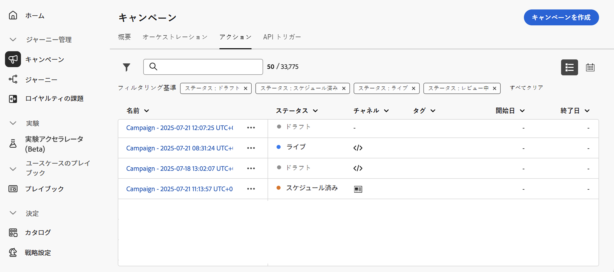

# キャンペーンの管理 {#modify-stop-campaign}

キャンペーンがアクティブ化されると、いつでも変更や停止を行うことができます。 これらの操作は、定期実行のみを使用したキャンペーンで使用できます。

さらに、ライブキャンペーン (1 回または定期的に実行することもあります) を複製して新規に作成し、完了または停止したキャンペーンをアーカイブすることもできます。

## キャンペーンへのアクセス {#access}

キャンペーンには、 **[!UICONTROL Campaigns]** メニューからアクセスできます。

初期設定では、の、、および **[!UICONTROL Live]** ステータスが表示されたすべてのキャンペーンが **[!UICONTROL Draft]** **[!UICONTROL Scheduled]** リストに表示されます。

停止、完了およびアーカイブされたキャンペーンを表示するには、フィルターをオフにする必要があります。

## キャンペーンの状態 {#statuses}

キャンペーンには複数の状態があります。

* **[!UICONTROL Draft]**: キャンペーンが編集されています。アクティブ化されていません。
* **[!UICONTROL Activating]**: キャンペーンがアクティブになっています。
* **[!UICONTROL Live]**: キャンペーンが有効になりました。
* **[!UICONTROL Scheduled]**: キャンペーンが特定の開始日にアクティブ化されるように設定されています。
* **[!UICONTROL Stopped]**: キャンペーンは手動で停止されました。 これにより、そのファイルをアクティブ化または再利用することはできません。 [キャンペーンの停止方法について学習します。](modify-stop-campaign.md#stop)
* **[!UICONTROL Completed]**: キャンペーンが完了しました。 キャンペーンがアクティブになった後、またはキャンペーンが定期的に実行された後は、自動的にこの状態が割り当てられます。
* **[!UICONTROL Archived]**: キャンペーンがアーカイブされています。 [キャンペーンのアーカイブ方法について](modify-stop-campaign.md#archive)

>[!NOTE]
>
>または状態の横に **[!UICONTROL Live]** ある「下書きバージョンを開く」アイコンは **[!UICONTROL Scheduled]** 、新規バージョンのキャンペーンが作成され、まだアクティブになっていないことを示します。 [詳しく ](modify-stop-campaign.md#modify) は、こちらを参照してください。

## 定期的なキャンペーンの変更 {#modify}

定期的なキャンペーンの新しいバージョンを変更して作成するには、次の手順を実行します。

1. キャンペーンを開き、ボタンを **[!UICONTROL Modify campaign]** クリックします。

1. キャンペーンの新しいバージョンが作成されます。 ライブバージョンを確認するには、をクリック **[!UICONTROL Open live version]** します。

   

   キャンペーンリストには、特定のアイコン **[!UICONTROL Status]** が表示された状態で、進行中の下書きバージョンのキャンペーンがアクティブになります。 キャンペーンの下書きバージョンを開くには、このアイコンをクリックします。

   

1. 変更が完了したら、新バージョンのキャンペーンを有効にすることができます (キャンペーン ](create-campaign.md#review-activate) のレビューとアクティブ化を参照してください [ )。

   >[!IMPORTANT]
   >
   >下書きをアクティブにすると、ライブバージョンのキャンペーンが置き換えられます。

## 定期的なキャンペーンの停止 {#stop}

定期的なキャンペーンを停止するには、「戻る」ボタンをクリック **[!UICONTROL Stop campaign]** します。

>[!IMPORTANT]
>
>キャンペーンを停止しても、実行中の送信は停止されませんが、送信が既に完了している場合は、定期的な送信が中止されます。

<!-- inbound campaign (inapp): can stop and resume -->

## キャンペーンの複製 {#duplicate}

ライブキャンペーンを複製すると、新規にキャンペーンを作成することができます。 これを行うには、キャンペーンを開き、をクリック **[!UICONTROL Duplicate]** します。

## キャンペーンのアーカイブ {#archive}

時間の経過と共に、キャンペーンのリストは増え続け、最終的に完了して停止したキャンペーンを参照することが困難になります。

これを防ぐために、必要のない、完了したキャンペーンや停止したキャンペーンをアーカイブすることもできます。 これを行うには、「楕円」ボタンをクリックしてから、を選択 **[!UICONTROL Archive]** します。

これにより、アーカイブされたキャンペーンをリスト内の専用のフィルターを使用して取得できます。 [キャンペーンへのアクセス方法について学習します。](get-started-with-campaigns.md#access)
