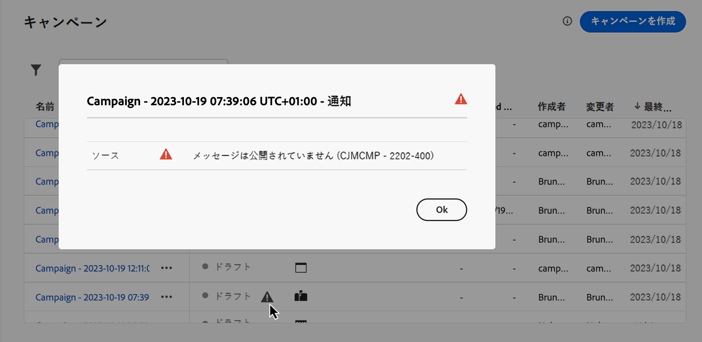
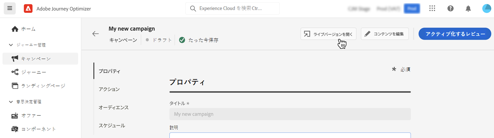

# キャンペーンの管理 {#modify-stop-campaign}

キャンペーンがアクティブ化されると、いつでも変更または停止できます。これらの操作は、繰り返し実行されるキャンペーンでのみ使用できます。

さらに、ライブキャンペーン（1 回実行または繰り返し実行）を複製して新しいキャンペーンを作成し、完了または停止したキャンペーンをアーカイブできます。

## キャンペーンへのアクセス {#access}

>[!CONTEXTUALHELP]
>id="ajo_campaigns_view"
>title="キャンペーンリストとカレンダー表示"
>abstract="[!DNL Journey Optimizer]では、キャンペーンリストに加えて、キャンペーンのカレンダー表示が提供され、キャンペーンのスケジュールが明確に視覚的に表現されます。これらのボタンを使用すると、リスト表示とカレンダー表示をいつでも切り替えることができます。"

キャンペーンは、**[!UICONTROL キャンペーン]**&#x200B;メニューからアクセスできます。

デフォルトでは、リストには&#x200B;**[!UICONTROL ドラフト]**、**[!UICONTROL スケジュール済み]**、**[!UICONTROL ライブ]**&#x200B;ステータスのすべてのキャンペーンが表示されます。停止、完了およびアーカイブされたキャンペーンを表示するには、フィルターをクリアする必要があります。

また、キャンペーンのタイプとチャネルや、キャンペーンの作成時にキャンペーンに割り当てられたタグに基づいてリストをフィルタリングすることもできます。 [キャンペーンにタグを割り当てる方法について詳しくは、こちらを参照してください](create-campaign.md#create)

## キャンペーンカレンダー {#calendar}

[!DNL Journey Optimizer] では、キャンペーンリストに加えて、キャンペーンのカレンダービューが提供され、キャンペーンのスケジュールが明確に視覚的に表現されます。

>[!AVAILABILITY]
>
>カレンダー表示は現在、一連の組織でのみ使用できます（使用制限あり）。 アクセスをリクエストするには、[ このフォーム ](https://forms.cloud.microsoft/r/FC49afuJVi){target=”_blank”} を使用します。
>
>この機能は積極的に開発されています。 トップメニューの「**[!UICONTROL Betaのフィードバック]**」ボタンを使用して、入力やリクエストをお待ちしています。

カレンダーには、現在の週にスケジュールされているすべてのキャンペーンが表示されます。 週間を移動するには、カレンダーの上にある矢印ボタンを使用します。

キャンペーンの表現方法：

* デフォルトでは、カレンダーグリッドには、選択した週のすべてのライブキャンペーンとスケジュールされたキャンペーンが表示されます。 追加のフィルターオプションで、完了、停止、完了したアクティベーション、または特定のタイプやチャネルのアクティベーションを表示できます。
* ドラフトキャンペーンは表示されません。
* 複数日にまたがるキャンペーンは、カレンダーグリッドの上部に表示されます。
* 開始時間が指定されていない場合、最も近い手動アクティベーション時間を使用してカレンダーに配置されます。
* キャンペーンは 1 時間の期間として表示されますが、実際の送信時間または完了時間は反映されません。

キャンペーンの詳細を表示するには、視覚的なブロックをクリックして詳細を開きます。

特定のキャンペーンの詳細を表示するには、リストから選択します。 情報ウィンドウが開き、タイプ、レポートへのアクセス、割り当てられたタグなど、キャンペーンに関する様々な情報が表示されます。

## キャンペーンのステータスとアラート {#statuses}

キャンペーンには複数のステータスがあります。

* **[!UICONTROL ドラフト]**：キャンペーンは編集中で、アクティブ化されていません。
* **[!UICONTROL アクティブ化中]**：キャンペーンをアクティブ化中です。
* **[!UICONTROL 処理中]***（メールキャンペーンのみ）*：オーディエンスの書き出しが完了し、キャンペーンを公開中です。
* **[!UICONTROL ライブ]**：キャンペーンはアクティブ化されています。
* **[!UICONTROL スケジュール済み]**：キャンペーンは、特定の開始日にアクティブ化されるように設定されています。
* **[!UICONTROL 停止]**：キャンペーンは手動で停止されました。この設定になっている場合は、それ以上アクティブ化したり再利用したりすることはできません。[キャンペーンの停止方法を学ぶ](modify-stop-campaign.md#stop)
* **[!UICONTROL 完了]**：キャンペーンは完了しています。このステータスは、キャンペーンがアクティブ化されてから 3 日後に、またはキャンペーンが繰り返し実行される設定になっている場合はキャンペーンの終了日に、自動的に割り当てられます。
* **[!UICONTROL アーカイブ済み]**：キャンペーンはアーカイブされています。[キャンペーンのアーカイブ方法を学ぶ](modify-stop-campaign.md#archive)

>[!NOTE]
>
>**[!UICONTROL ライブ]**&#x200B;または&#x200B;**[!UICONTROL スケジュール済み]**&#x200B;ステータスの横にある「ドラフトバージョンを開く」アイコンは、キャンペーンの新しいバージョンが作成され、まだアクティブ化されていないことを示しています。[詳細情報](modify-stop-campaign.md#modify)。

1 つのキャンペーン内でエラーが発生した場合、キャンペーンのステータスの横に警告アイコンが表示されます。アラートに関する情報を表示するには、アラートをクリックします。これらのアラートは、キャンペーンメッセージが公開されていない場合または選択した設定が正しくない場合など、様々な状況で発生する場合があります。

## 繰り返しキャンペーンの変更 {#modify}

繰り返しキャンペーンの新しいバージョンを変更および作成するには、次の手順に従います。

1. キャンペーンを開き、「**[!UICONTROL キャンペーンを変更]**」ボタンをクリックします。

1. キャンペーンの新しいバージョンが作成されます。ライブバージョンを確認するには、「**[!UICONTROL ライブバージョンを開く]**」をクリックします。

   

   キャンペーンリストで、ドラフトバージョンが進行中のアクティブ化されたキャンペーンは、**[!UICONTROL ステータス]**&#x200B;列に特定のアイコンで表示されます。このアイコンをクリックして、キャンペーンのドラフトバージョンを開きます。

   

1. 変更の準備が整ったら、新しいバージョンのキャンペーンをアクティブ化できます（[キャンペーンのレビューとアクティブ化](create-campaign.md#review-activate)を参照）。

   >[!IMPORTANT]
   >
   >ドラフトをアクティブ化すると、キャンペーンのライブバージョンが置き換えられます。

## 繰り返しキャンペーンの停止 {#stop}

繰り返しキャンペーンを停止するには、キャンペーンを開いてから「**[!UICONTROL キャンペーンを停止]**」ボタンをクリックします。

>[!IMPORTANT]
>
>キャンペーンを停止しても、その時点で進行中の送信は停止しませんが、スケジュール済みの送信（進行中の送信がある場合は次回の送信）が停止します。

<!-- inbound campaign (inapp): can stop and resume -->

## キャンペーンの複製 {#duplicate}

ライブキャンペーンを複製して、新しいキャンペーンを作成できます。これを行うには、キャンペーンを開き、「**[!UICONTROL 複製]**」をクリックします。

## キャンペーンのアーカイブ {#archive}

時間が経過すると、キャンペーンのリストは増え続け、最終的には完了済みのキャンペーンと停止済みのキャンペーンを参照するのが難しくなります。

これを防ぐには、不要になった完了済みのキャンペーンと停止済みのキャンペーンをアーカイブします。これを行うには、「...」ボタンをクリックし、「**[!UICONTROL アーカイブ]**」を選択します。

アーカイブされたキャンペーンは、リスト内の専用フィルターを使用して取得できます。[キャンペーンへのアクセス方法を学ぶ](get-started-with-campaigns.md#access)
