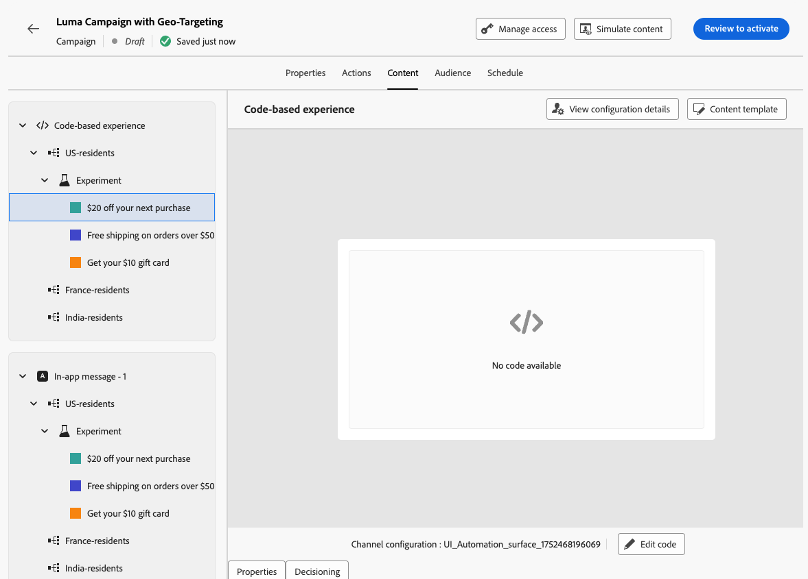

# ターゲティングと実験を組み合わせ {#combination}

Journey Optimizer では、単一のジャーニーまたはキャンペーン内でターゲティングと実験を組み合わせて、より高度な戦略を作成することもできます。

実際、ターゲティングを使用して複数のバリエーションを作成し、各バリアントに対して、実験を使用して各コンテンツをさらに最適化できます。これにより、実験が各ターゲティングルールに固有となり、複数のバリアントにまたがらないようにします。

例えば、米国のお客様に対しては「50％オフのプロモーション」と「50 ドルのギフトカード」を比較してテストし、ヨーロッパのお客様に対しては「50 ユーロを超える注文で送料無料」と「次回購入時に 20％オフ」などの異なるテストを実行できます。

ジャーニーまたはキャンペーンでターゲティングと実験の両方を組み合わせるには、次の手順に従います。

1. 複数のターゲティングルールを定義するジャーニーまたはキャンペーンを作成します。[詳細情報](optimization-targeting.md)

   {width=85%}

1. 最初のターゲティングルールの実験を作成します。

1. 必要に応じて、コンテンツ実験を設計および設定します。[詳細情報](../content-management/content-experiment.md)

   {width=85%}

   実験を定義すると、最初のターゲティングルールにのみ適用されます。

1. 「**[!UICONTROL アクション]**」タブに戻り、「**[!UICONTROL コンテンツを編集]**」を選択します。

1. 最初のターゲティングルールで定義したグループに対して、実験の各バリアントに特定のコンテンツを定義できます。

   ジャーニーまたはキャンペーンに複数のインバウンドアクションを追加した場合、各アクションに同じターゲティングと実験の組み合わせが適用されます。 ただし、各アクションのバリアントごとに特定のコンテンツを定義する必要があります。

   {width=85%}

1. 他のターゲティングルールについても同様に進め、各バリアントに対応するコンテンツを設計します。

1. 変更を保存し、ジャーニーまたはキャンペーンを[アクティブ化](review-activate-campaign.md)します。

ジャーニー／キャンペーンがライブになると、各ターゲットグループのユーザーには、所属するグループに定義した様々なコンテンツのバリエーションがランダムに割り当てられます。

<!--
## Reporting on Message optimization

E.g. explaining how a marketer can look at the report to determine which treatment (e.g. which message content) is performing the best for the targeting audience
-->

