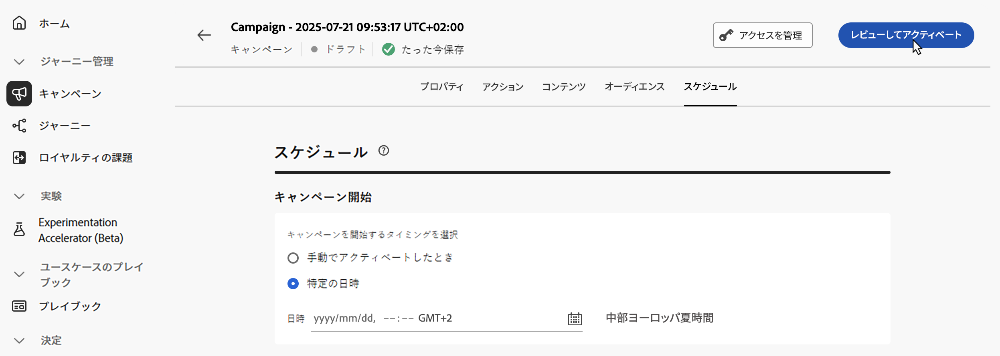
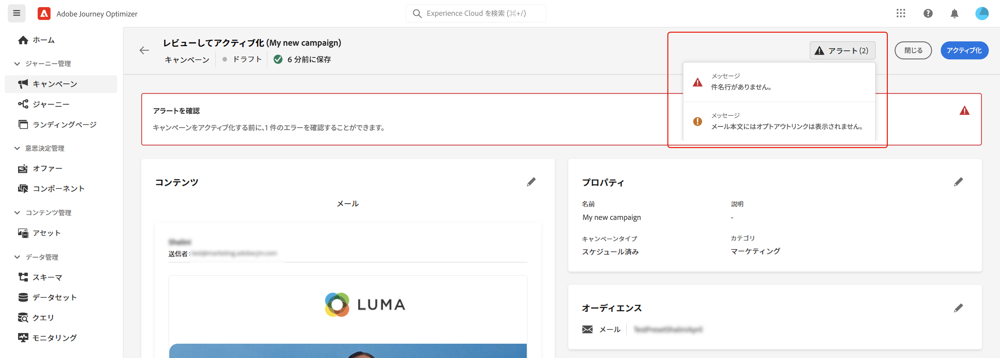
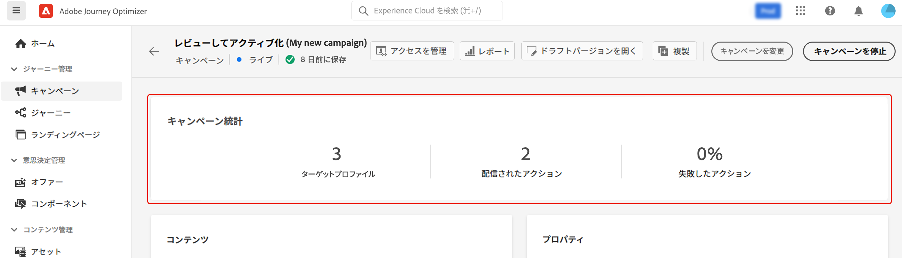

# アクションキャンペーンのレビューとアクティブ化 {#action-campaign-review}

アクションキャンペーンを設定したら、アクティブ化する前にそのパラメーターとコンテンツをレビューする必要があります。 これを行うには、次の手順に従います。

>[!IMPORTANT]
>
> キャンペーンが承認ポリシーの対象となっている場合、キャンペーンを送信できるようにするには、承認をリクエストする必要があります。 [詳細情報](../test-approve/gs-approval.md)

1. キャンペーンの設定画面で、「**[!UICONTROL アクティブ化するレビュー]**」をクリックして、キャンペーンの概要を表示します。

   

1. キャンペーン設定の概要が表示され、パラメーターが正しくないか、欠落しているかを確認し、必要に応じてキャンペーンを変更できます。

   エラーが発生した場合は、キャンペーンをアクティブ化できません。 続行する前にエラーを解決します。

   

1. キャンペーンがコンテンツで[決定ポリシー](../experience-decisioning/create-decision.md)を使用する場合、各ポリシーの構造を確認し、キャンペーンの概要から技術的な詳細を直接コピーできます。 [詳細情報](../experience-decisioning/use-decision-policy.md#decision-policy-summary)

1. キャンペーンが正しく設定されていることを確認してから、「**[!UICONTROL アクティブ化]**」をクリックします。

1. キャンペーンがアクティブ化されました。 ステータスは&#x200B;**[!UICONTROL ライブ]**、開始日を入力した場合は&#x200B;**[!UICONTROL スケジュール済み]**&#x200B;です。 キャンペーンで設定されたメッセージは、すぐに送信されるか、指定日に送信されます。

   **[!UICONTROL 完了]**&#x200B;ステータスは、キャンペーンがアクティブ化されてから 3 日後、または繰り返し実行されている場合はキャンペーンの終了日に自動的に割り当てられます。 [詳しくは、キャンペーンのステータスを参照してください](manage-campaigns.md#statuses)。

   終了日が指定されていない場合、キャンペーンは&#x200B;**[!UICONTROL ライブ]**&#x200B;ステータスのままとなります。 変更するには、キャンペーンを手動で停止する必要があります。 [キャンペーンの停止方法についてはこちらを参照](manage-campaigns.md)

1. キャンペーンがアクティブ化されると、キャンペーンを開いて、いつでもその情報を確認できます。 概要では、ターゲットプロファイルの数と、配信されたアクションおよび失敗したアクションの数に関する統計情報を取得できます。

   「**[!UICONTROL レポート]**」ボタンをクリックして、専用レポートでさらに統計情報を取得することもできます。 [詳細情報](../reports/campaign-global-report-cja.md)

   
