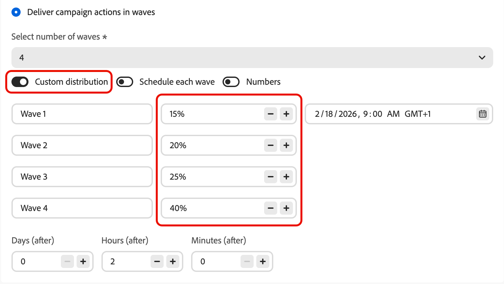
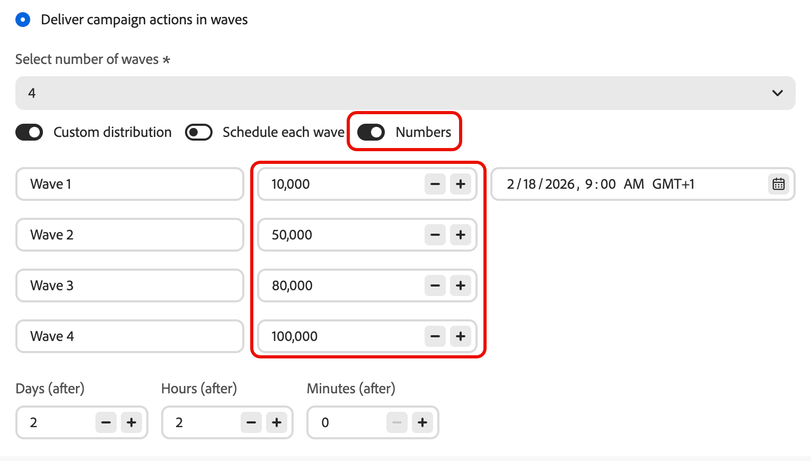
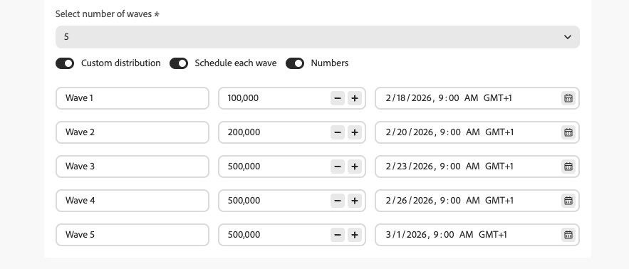

# キャンペーンでウェーブを使用して送信 {#send-using-waves}

アウトバウンドキャンペーンメッセージの配信を複数のバッチ（ウェーブ）に分割し、時間の経過と共にスケジュールできます。 ウェーブ送信は、負荷の分散、ダウンストリームの過剰なシステム（コールセンターやランディングページなど）の回避、配信品質と送信者のレピュテーションのサポートに役立ちます（特に大量の送信の場合）。

<!--
>[!CAUTION]
>
>Wave sending applies to **outbound** actions only (Email, SMS, Push, Direct mail).-->

Journey Optimizerでは、ウェーブの数、サイズ（オーディエンスのパーセンテージまたは絶対数）、および各ウェーブの実行時間を定義できます。

## 制限とガードレール {#limitations-guardrails}

* Wave 送信は、**アウトバウンド** アクション（メール、SMS、プッシュ、ダイレクトメール）にのみ適用されます。
* 少なくとも **2 ウェーブ** を定義する必要があり、最大 **10 ウェーブ** を追加できます。
* 2 つのウェーブの開始間の最小間隔は **30 分** です。
* ウェーブ開始をキャンペーン開始より前または過去にすることはできません。

## ウェーブ送信の設定 {#configure-wave-sending}

キャンペーンでウェーブを送信する方法とタイミングを設定するには、次の手順に従います。

1. アウトバウンドアクション [ 例：メール、SMS、プッシュ）を含む ](create-campaign.md) アクションキャンペーン）を作成または開きます。

1. キャンペーンの「**[!UICONTROL スケジュール]**」タブで、「**[!UICONTROL キャンペーンアクションをウェーブで配信]**」を選択します。

   {width="100%"}

   >[!NOTE]
   >
   >「**[!UICONTROL キャンペーンのアクションをウェーブで配信]**」オプションは、キャンペーンの **[!UICONTROL アクション]** タブでアウトバウンドアクションが選択されている場合にのみ表示されます。 [詳細情報](campaign-action.md)

1. 送信するウェーブの数を設定します（例：4）。

   >[!NOTE]
   >
   >少なくとも 2 つのウェーブを定義する必要があり、最大 10 個のウェーブを追加できます。

1. 以下に説明するように、ウェーブサイズとタイミングを定義する方法を選択します。

### 等しい波 {#equal-waves}

デフォルトでは、オーディエンスは同じサイズのウェーブに分割されます。 最初のウェーブの時間をスケジュールし、各ウェーブの開始間の固定間隔（例：2 時間）を設定します。

{width="80%"}

>[!NOTE]
>
>2 つのウェーブの開始間の最小間隔は **30 分** です。

次に、システムは自動的に後続のウェーブのスケジュールを設定します（例えば、最初のウェーブ :00 午前 9 時、2 番目のウェーブは午前 11:00、3 番目のウェーブは午後 1:00、4 番目のウェーブは午後 3:00）。

### カスタム配分 {#custom-distribution}

**[!UICONTROL カスタム配分]** オプションを選択して、各ウェーブのサイズを合計オーディエンスの割合（例：15%、20%、25%、40%）として定義します。

{width="80%"}

**[!UICONTROL 数値]** を選択して、各ウェーブのサイズをプロファイルの絶対数として定義します（例：10,000、50,000）。

{width="80%"}

>[!NOTE]
>* 割合を使用する場合は、すべてのウェーブの合計が 100% である必要があります。 そうでない場合は、警告が表示されます。
>* 数値を使用する場合、システムはカバレッジを検証しません。ウェーブサイズが対象オーディエンスをカバーしていることを確認します。 [詳細情報](#faq)

### カスタムスケジュール {#custom-schedule}

**[!UICONTROL 各ウェーブをスケジュール]** を選択して、各ウェーブの特定の開始日時を定義します。 波は、均等に配置する必要はありません（例えば、午前 9:00、午前 11:00、午後 5:00、午後 8:30）。

{width="80%"}

>[!NOTE]
>
>2 つのウェーブの開始間の最小間隔は **30 分** です。

## ユースケース {#use-cases}

Wave 送信は、送信するメッセージのタイミングと数を制御するのに役立ちます。これにより、配信品質の向上、送信者のレピュテーションの保護、運用能力に合わせた送信が可能になります。 次のシナリオでは、ウェーブの使用を検討します。

* **コールセンターまたは応答管理：** 下流チーム（カスタマーケアなど）が応答を処理できるように、1 日または 1 時間に送信するメッセージ数を制限します。 例えば、コールセンターの処理能力に合わせて、1 日に 20 メッセージを送信します。

  {width="75%"}

* **大量のキャンペーンと配信品質：** 非常に大きなキャンペーンを 1 回で送信することは避けます。 送信者の評判を維持し、スパムとしてフラグ付けされるリスクを軽減するために、配信を時間の経過と共に分散させる。

  {width="75%"}

* **ランプアップ：** 新しいプラットフォームまたは IP を使用する場合は、ボリュームを徐々に増やし（例えば、最初のウェーブで 10%、次に 15%、20% など）、評判を徐々に構築します。

  {width="75%"}

## よくある質問 {#faq}

+++ 波のサイズの合計がオーディエンスの合計と等しくない場合はどうなりますか？

* ウェーブサイズの合計がオーディエンス **超える** 場合（例えば、最初のウェーブで 10 万をスケジュールし、オーディエンスが 10 万の場合）、最初のウェーブは完全なオーディエンスに送信され、残りのウェーブには送信先が残っていません。これらのウェーブは実行されません。
* 合計がオーディエンス **下** の場合（例えば、100,000 のオーディエンスに対して 40,000 件のプロファイルを合計した 4 つのウェーブを定義）、それらのウェーブに含まれるプロファイルのみがメッセージを受信します。 残りのオーディエンスは通信を受信せず、後のウェーブでは再試行されません。

+++

+++ 個々のウェーブに異なるセグメントや条件を割り当てることはできますか？

ウェーブのサイズとタイミングのみを定義できます。 受信者の選択はキャンペーン全体で同じです。個々のウェーブに異なるセグメントや条件を割り当てることはできません。

+++

## 次の手順 {#next}

* [ アクションキャンペーンのスケジュール ](campaign-schedule.md) – 開始日、終了日、頻度およびレート制御を設定します。
* [ キャンペーンのレビューとアクティブ化 ](review-activate-campaign.md) - キャンペーンを確認して運用を開始します。
