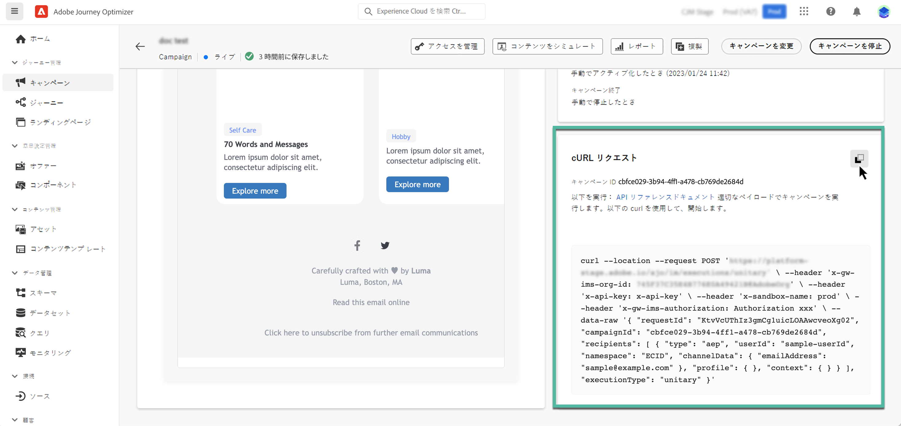

# API トリガーキャンペーンの実行 {#execute}

キャンペーンがアクティブ化されたら、生成されたサンプル cURL リクエストを取得、それを API で使用してペイロードを作成し、キャンペーンをトリガーする必要があります。

## 必読 {#must-read}

* **キャンペーンの開始日や終了日** - キャンペーンを作成する際に特定の開始日や終了日を設定している場合、そのキャンペーンはこれらの日付以外では実行されず、API 呼び出しは失敗します。

* **呼び出しタイムアウト** - Interactive Message Execution REST API の呼び出しには、60 秒のタイムアウトがあります。ただし、予期しないタイムアウトが発生した場合は、配信の保証に内部再試行が行われます。

## キャンペーンのトリガー {#trigger}

1. キャンペーンを開き、「**[!UICONTROL cURL リクエスト]**」セクションからペイロードリクエストをコピー＆ペーストします。このペイロードには、メッセージで使用されるすべてのパーソナライゼーション（プロファイルとコンテキスト）変数が含まれます。キャンペーンがライブになったら使用できます。

   

   >[!IMPORTANT]
   >
   >cURL セクションのエンドポイントは、標準のキャンペーンと[高スループットキャンペーン](../campaigns/api-triggered-high-throughput.md)で異なります。

1. この API への cURL リクエストを使用して、ペイロードを作成し、キャンペーンをトリガーします。詳しくは、[Interactive Message Execution API ドキュメント](https://developer.adobe.com/journey-optimizer-apis/references/messaging/#tag/execution)を参照してください。このドキュメントには、標準および高スループットキャンペーンのすべてのエンドポイントが一覧表示されます。

   API 呼び出しの例について詳しくは、[このページ](https://developer.adobe.com/journey-optimizer-apis/references/messaging-samples/)も参照してください。

## トラブルシューティング {#troubleshooting}

### Azure Cosmos DB 認証エラー（500 内部サーバーエラー） {#cosmosdb-auth-errors}

API トリガーキャンペーンをトリガーするときに **500 内部サーバーエラーが発生した場合** システムログに Azure Cosmos DB からの **403 Forbidden** エラーが次のようなメッセージで表示されます。

_Azure Cosmos DB サービスがアカウントのデフォルト ID の AAD 認証トークンを取得できないので、アカウントへのアクセスは現在取り消されています」_

このエラーは通常、Cosmos DB 認証に必要な Azure サービスプリンシパルが無効、削除、または誤った設定で発生します。

+++この問題を解決するには

1. **Azure サービスプリンシパルの確認** - Azure サービスプリンシパルまたは管理 ID が有効になっており、Azure Active Directory で無効または削除されていないことを確認します。

1. **権限の確認** - サービスプリンシパルが、Azure Key Vault および Cosmos DB リソースへのアクセスに必要な権限を持っていることを確認します。 Azure Cosmos DB で認証するには、サービスプリンシパルに適切な役割が割り当てられている必要があります。

1. **Azure Cosmos DB CMK の設定を確認する** – 顧客管理キー（CMK）を使用している場合、AAD トークンの取得を復元する手順について詳しくは、[Azure Cosmos DB CMK トラブルシューティングガイド ](https://learn.microsoft.com/en-us/azure/cosmos-db/cmk-troubleshooting-guide#azure-active-directory-token-acquisition-error){target="_blank"} を参照してください。

1. **再度有効化してテスト** – 設定を修正した後、サービスプリンシパルが無効だった場合は再度有効にし、トランザクションキャンペーン API 呼び出しを再テストして、認証が成功し、メッセージが配信されたことを確認します。

>[!NOTE]
>
>この問題は通常、設定の誤りや、Cosmos DB 認証に必要な Azure サービスプリンシパルの誤った無効化が原因で発生します。 サービスプリンシパルを有効にし、適切に設定したままにすると、今後このエラーが発生しなくなります。

+++
