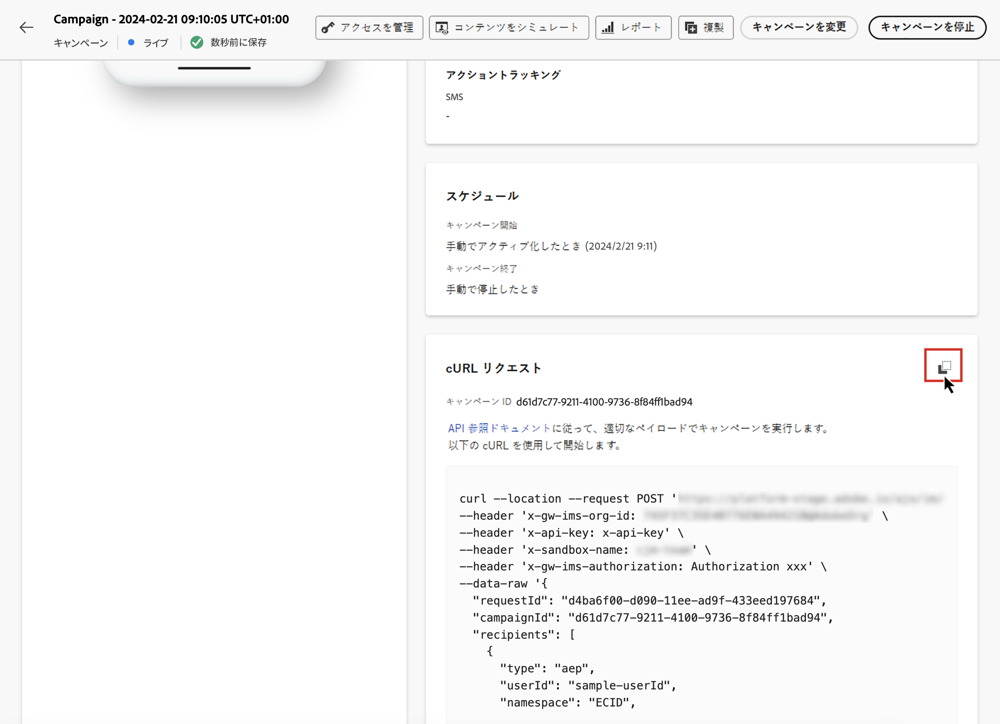

# API トリガーキャンペーンの実行 {#execute}

キャンペーンがアクティブ化されたら、生成されたサンプル cURL リクエストを取得、それを API で使用してペイロードを作成し、キャンペーンをトリガーする必要があります。

## 必読 {#must-read}

* **キャンペーンの開始日/終了日** - キャンペーンを作成する際に特定の開始日や終了日を設定している場合、そのキャンペーンはこれらの日付以外では実行されず、API 呼び出しは失敗します。

* **呼び出しタイムアウト** - インタラクティブメッセージ実行 REST API の呼び出しのタイムアウトは 60 秒です。 ただし、予期しないタイムアウトが発生した場合に配信を保証するために内部再試行が行われます。

## キャンペーンのトリガー {#trigger}

1. キャンペーンを開き、「**[!UICONTROL cURL リクエスト]**」セクションからペイロードリクエストをコピー＆ペーストします。このペイロードには、メッセージで使用されるすべてのパーソナライゼーション（プロファイルとコンテキスト）変数が含まれます。キャンペーンがライブになったら使用できます。

   

1. この API への cURL リクエストを使用して、ペイロードを作成し、キャンペーンをトリガーします。詳しくは、 [Interactive Message Execution API ドキュメント](https://developer.adobe.com/journey-optimizer-apis/references/messaging/#tag/execution)を参照してください。

   API 呼び出しの例について詳しくは、[このページ](https://developer.adobe.com/journey-optimizer-apis/references/messaging-samples/)も参照してください。
