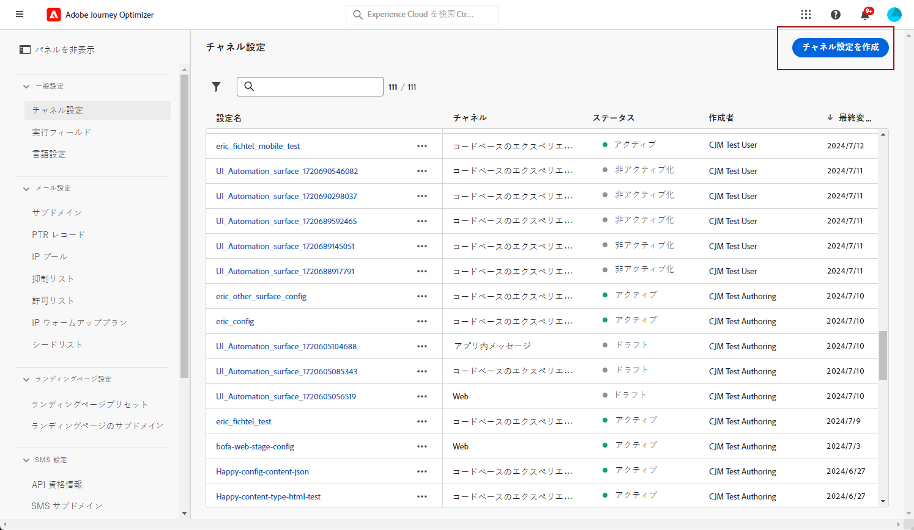
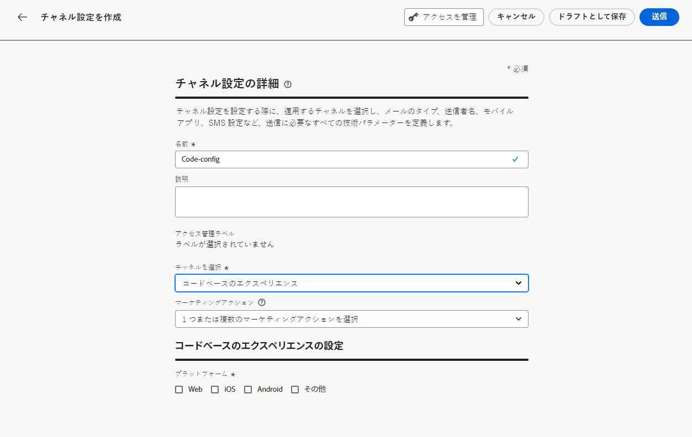
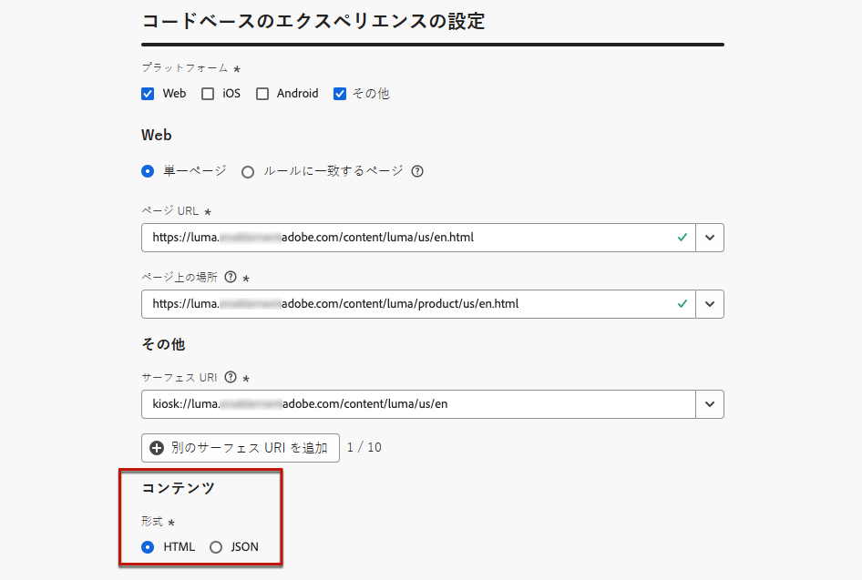
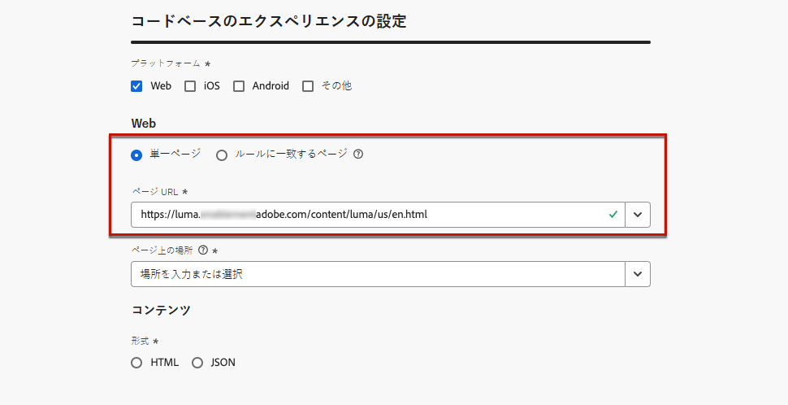
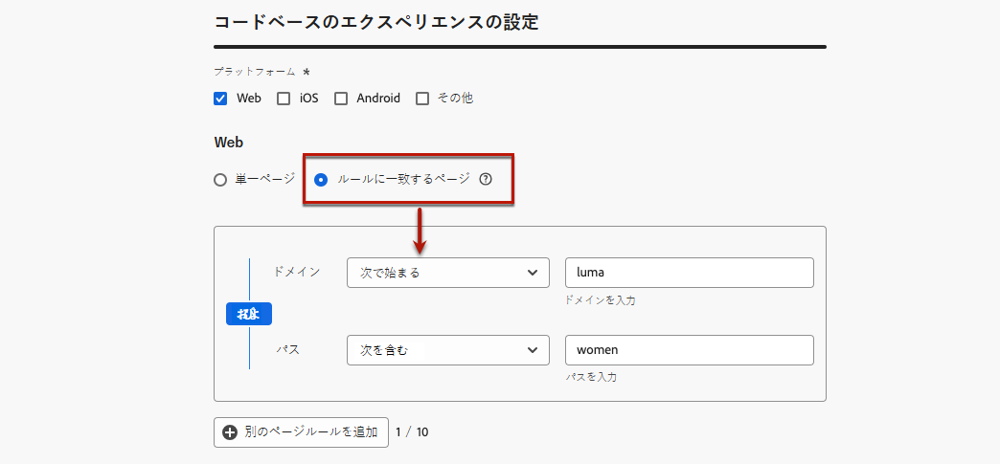
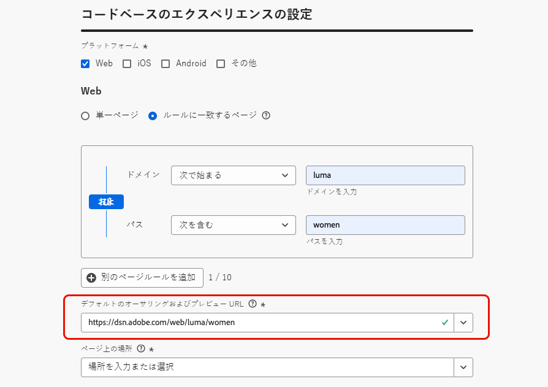
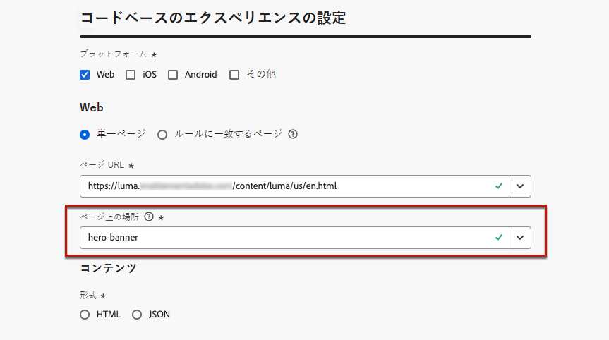
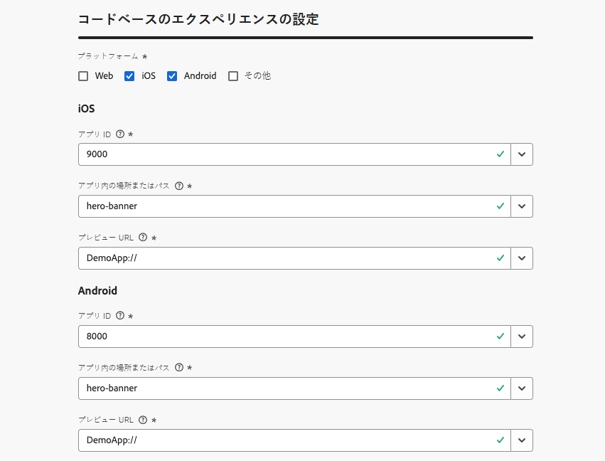
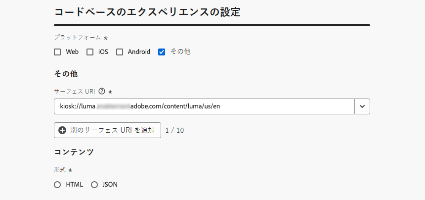

# コードベースのエクスペリエンスの設定 {#code-based-configuration}

>[!CONTEXTUALHELP]
>id="ajo_code_based_surface"
>title="コードベースのエクスペリエンス設定の定義"
>abstract="コードベースの設定では、アプリケーション実装内の URI によって一意に識別される、コンテンツが配信および使用されるアプリケーション内のパスと場所を定義します。"

[エクスペリエンスの構築](create-code-based.md)の前に、アプリケーション内でコンテンツを配信する場所と使用する場所を定義する、コードベースのエクスペリエンス設定を作成する必要があります。

コードベースのエクスペリエンス設定では、サーフェス（基本的には変更をレンダリングする場所）を参照する必要があります。選択したプラットフォームに応じて、場所／パスまたはフルサーフェス URI を入力する必要があります。[詳細情報](code-based-surface.md)

## コードベースのエクスペリエンス設定を作成 {#create-code-based-configuration}

>[!CONTEXTUALHELP]
>id="ajo_admin_location"
>title="ページまたはアプリ内の特定の場所を示します"
>abstract="このフィールドでは、ユーザーがアクセスするページ内またはアプリ内の正確な宛先を指定します。web ページ内の特定のセクション、またはアプリのナビゲーション構造内の深いページである可能性があります。"

>[!CONTEXTUALHELP]
>id="ajo_admin_default_mobile_url"
>title="コンテンツの作成およびプレビュー用の URL の定義"
>abstract="このフィールドは、ルールによって生成または一致したページに、コンテンツの効果的な作成とプレビューの両方に不可欠な、指定された URL があることを保証します。"

コードベースのエクスペリエンスチャネル設定を作成するには、次の手順に従います。

1. **[!UICONTROL チャネル]**／**[!UICONTROL 一般設定]**／**[!UICONTROL チャネル設定]**&#x200B;メニューにアクセスし、「**[!UICONTROL チャネル設定を作成]**」をクリックします。

   

1. 設定の名前と説明（オプション）を入力します。

   >[!NOTE]
   >
   > 名前は、文字（A ～ Z）で始める必要があります。使用できるのは英数字のみです。アンダースコア（`_`）、ドット（`.`）、ハイフン（`-`）も使用できます。

1. 設定にカスタムまたはコアのデータ使用ラベルを割り当てるには、「**[!UICONTROL アクセスを管理]**」を選択します。[ オブジェクトレベルのアクセス制御（OLAC）の詳細情報 ](../administration/object-based-access.md)

1. この設定を使用してメッセージに同意ポリシーを関連付けるには、**[!UICONTROL マーケティングアクション]**&#x200B;を選択します。顧客の環境設定に従うために、そのマーケティングアクションに関連付けられているすべての同意ポリシーが活用されます。[詳細情報](../action/consent.md#surface-marketing-actions)

1. **コードベースのエクスペリエンス**&#x200B;チャネルを選択します。

   

1. コードベースのエクスペリエンスを適用するプラットフォームを選択します。

   * [Web](#web)
   * [iOS／Android](#mobile)
   * [その他](#other)

   >[!NOTE]
   >
   >複数のプラットフォームを選択できます。複数のプラットフォームを選択すると、選択したすべてのページまたはアプリにコンテンツが配信されます。

1. この特定の場所でアプリケーションで想定される形式を選択します。これは、キャンペーンやジャーニーでコードベースのエクスペリエンスを作成する際に使用されます。

   

1. 「**[!UICONTROL 送信]**」をクリックして変更を保存します。

キャンペーンやジャーニーで[コードベースのエクスペリエンスを作成](create-code-based.md)する際に、この設定を選択できるようになりました。

>[!NOTE]
>
>アプリ実装チームは、明示的な API または SDK 呼び出しを行って、選択したコードベースのエクスペリエンス設定で定義されたサーフェスのコンテンツを取得する責任があります。お客様による様々な実装について詳しくは、[ この節 ](code-based-implementation-samples.md) を参照してください。

### Web プラットフォーム {#web}

>[!CONTEXTUALHELP]
>id="ajo_admin_default_web_url"
>title="コンテンツのオーサリングおよびプレビュー用の URL の定義"
>abstract="このフィールドは、ルールによって生成または一致したページに、コンテンツの効果的な作成とプレビューの両方に不可欠な、指定された URL があることを保証します。"

Web プラットフォームのコードベースのエクスペリエンス設定を定義するには、次の手順に従います。

1. 次のいずれかのオプションを選択します。

   * **[!UICONTROL 単一ページ]** - 単一ページにのみ変更を適用する場合は、**[!UICONTROL ページ URL]** を入力します。

     

   * **[!UICONTROL ルールに一致するページ]** - 同じルールに一致する複数の URL をターゲットにするには、1 つ以上のルールを作成します。[詳細情報](../web/web-configuration.md#web-page-matching-rule)

     <!--This could be used to apply changes universally across a website, such as updating a hero banner across all pages or adding a top image to display on every product page.-->

     例えば、Luma web サイトのすべての女性向け製品ページに表示される要素を編集する場合は、**[!UICONTROL ドメイン]**／**[!UICONTROL 次で始まる]**／`luma` および&#x200B;**[!UICONTROL ページ]**／**[!UICONTROL 次を含む]**／`women` を選択します。

     

1. プレビュー URL には、次の内容が適用されます。

   * 単一ページの URL を入力した場合は、その URL がプレビューに使用されます。別の URL を入力する必要はありません。
   * [ルールに一致するページ](../web/web-configuration.md#web-page-matching-rule)を選択した場合は、ブラウザーでエクスペリエンスをプレビューするのに使用される&#x200B;**[!UICONTROL デフォルトのオーサリングおよびプレビュー URL]** を入力する必要があります。[詳細情報](test-code-based.md#preview-on-device)

     

1. 「**[!UICONTROL ページ上の場所]**」フィールドでは、ユーザーのアクセスを許可するページ内の正確な宛先を指定します。これは、「ヒーローバナー」や「製品パネル」など、サイトのナビゲーション構造内のページ上の特定のセクションである場合があります。

   >[!CAUTION]
   >
   >このフィールドに入力した文字列またはパスは、アプリまたはページの実装で宣言されたものと一致する必要があります。これにより、指定したアプリまたはページ内の目的の場所にコンテンツが配信されます。[詳細情報](code-based-surface.md#uri-composition)

   

### モバイルプラットフォーム（iOS および Android） {#mobile}

>[!CONTEXTUALHELP]
>id="ajo_admin_app_id"
>title="アプリ ID を入力"
>abstract="アプリケーションの運用環境内での正確な識別と設定用にアプリ ID を入力し、シームレスな統合と機能を実現します。"

>[!CONTEXTUALHELP]
>id="ajo_admin_mobile_url_preview"
>title="コンテンツをプレビューする URL を入力"
>abstract="このフィールドは、アプリケーション内のデバイスでコンテンツのシミュレーションとプレビューを直接有効にするのに不可欠です。"

モバイルプラットフォームのコードベースのエクスペリエンス設定を定義するには、次の手順に従います。

1. **[!UICONTROL アプリ ID]** を入力します。これにより、アプリの運用環境内での正確な識別と設定が可能になり、シームレスな統合と機能が保証されます。

1. **[!UICONTROL アプリ内の場所またはパス]**&#x200B;を指定します。このフィールドでは、ユーザーのアクセスを許可するアプリ内の正確な宛先を指定します。これは、「ヒーローバナー」や「製品パネル」など、アプリのナビゲーション構造内の深い部分にある特定のセクションまたはページである場合があります。

   

1. デバイスでのプレビューを有効にするには、「**[!UICONTROL プレビュー URL]**」フィールドに入力します。この URL は、デバイスでプレビューをトリガーする際に使用する特定の URL をプレビューサービスに通知します。[詳細情報](test-code-based.md#preview-on-device)

   プレビュー URL は、アプリ開発者がアプリ内で設定するディープリンクです。これにより、ディープリンクスキームに一致する URL がモバイル web ブラウザーではなくアプリ内で開かれます。アプリに設定されているディープリンクスキームを取得するには、アプリ開発者にお問い合わせください。

+++  アプリ実装のディープリンクを設定する際には、次のリソースが役立ちます。

   * Android の場合：

      * [アプリコンテキストへのディープリンクの作成](https://developer.android.com/training/app-links/deep-linking)

   * iOS の場合：

      * [アプリのカスタム URL スキームの定義](https://developer.apple.com/documentation/xcode/defining-a-custom-url-scheme-for-your-app)

      * [アプリのユニバーサルリンクのサポート](https://developer.apple.com/documentation/xcode/supporting-universal-links-in-your-app)

+++

   >[!NOTE]
   >
   >エクスペリエンスのプレビュー中に問題が発生した場合は、[このドキュメント](https://experienceleague.adobe.com/ja/docs/experience-platform/assurance/troubleshooting#app-does-not-open-link)を参照してください。

### その他のプラットフォーム {#other}

その他のプラットフォーム（ビデオコンソール、TV 接続デバイス、スマート TV、キオスク、ATM、音声アシスタント、IoT デバイスなど）のコードベースのエクスペリエンス設定を定義するには、次の手順に従います。

1. 実装が web、iOS、または Android 向けではない場合や、特定の URI をターゲットにする必要がある場合は、プラットフォームとして「**[!UICONTROL その他]**」を選択します。

1. **[!UICONTROL サーフェス URI]** を入力します。サーフェス URI は、エクスペリエンスを配信するエンティティに対応する一意の ID です。[詳細情報](code-based-surface.md#surface-uri)

   

   >[!CAUTION]
   >
   >独自の実装で使用される URI と一致するサーフェス URI を入力していることを確認します。それ以外の場合は、変更を配信できません。[詳細情報](code-based-surface.md#uri-composition)

1. 必要に応じて、**[!UICONTROL 別のサーフェス URI を追加します]**。最大 10 個の URI を追加できます。

   >[!NOTE]
   >
   >複数の URI を追加すると、リストされたすべてのコンポーネントにコンテンツが配信されます。
