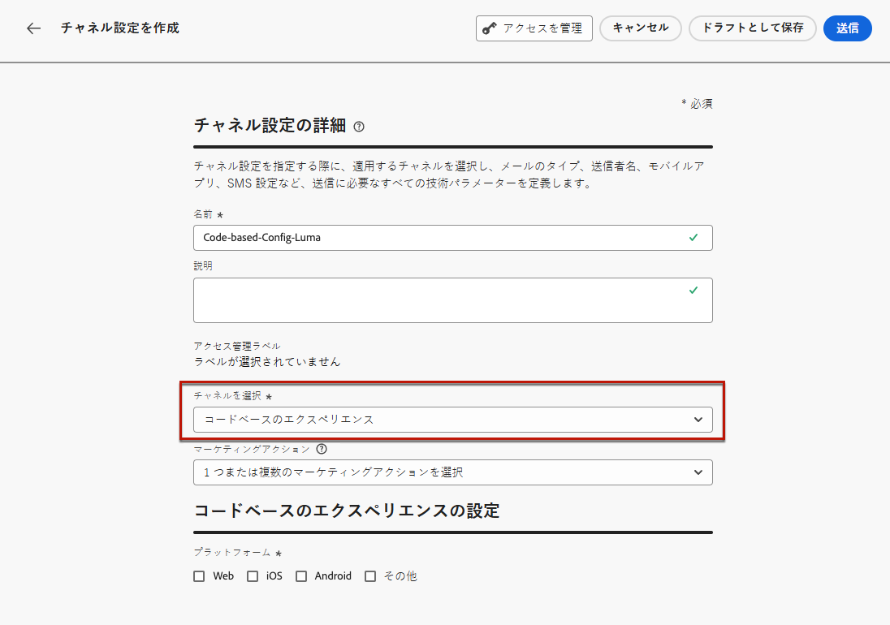
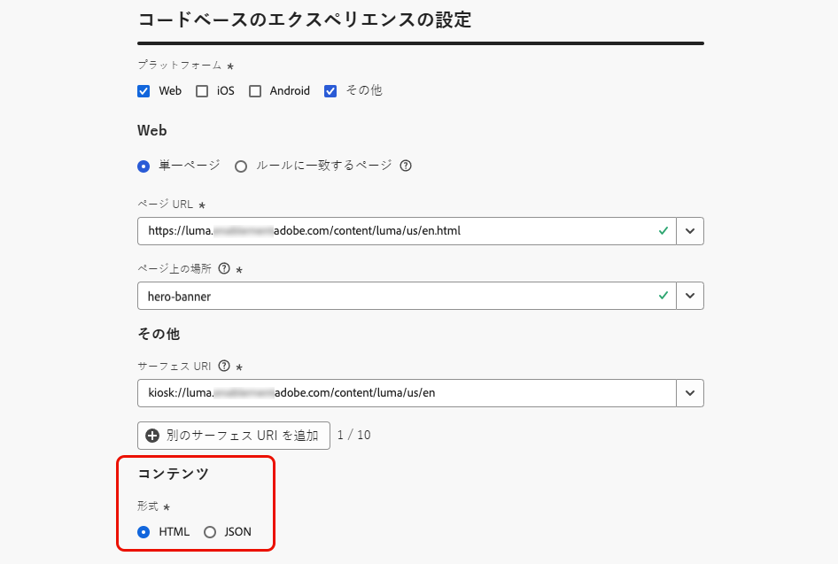

# コードベースのエクスペリエンスの設定 {#code-based-configuration}

>[!CONTEXTUALHELP]
>id="ajo_code_based_surface"
>title="コードベースのエクスペリエンス設定の定義"
>abstract="コードベースの設定では、アプリケーション実装内の URI によって一意に識別される、コンテンツが配信および使用されるアプリケーション内のパスと場所を定義します。"

[ エクスペリエンスの構築 ](create-code-based.md) の前に、コンテンツを配信する場所とアプリケーション内で使用する場所を定義する、コードベースのエクスペリエンス設定を作成する必要があります。

コードベースのエクスペリエンス設定では、サーフェス（基本的には変更をレンダリングする場所）を参照する必要があります。 選択したプラットフォームに応じて、場所/パスまたはフルサーフェス URI を入力する必要があります。 [詳細情報](#surface-definition)

## コードベースのエクスペリエンス設定を作成する {#create-code-based-configuration}

>[!CONTEXTUALHELP]
>id="ajo_admin_location"
>title="特定の場所を入力"
>abstract="このフィールドでは、ユーザーがアクセスするページ上またはアプリ内の正確な宛先を指定します。 これは、ナビゲーション構造内の特定のセクションまたはページの深さである可能性があります。"

>[!CONTEXTUALHELP]
>id="ajo_admin_default_mobile_url"
>title="コンテンツの作成およびプレビュー用の URL の定義"
>abstract="このフィールドは、ルールによって生成または一致したページに、コンテンツの効果的な作成とプレビューの両方に不可欠な、指定された URL があることを保証します。"

コードベースのエクスペリエンスチャネル設定を作成するには、次の手順に従います。

1. **[!UICONTROL チャネル]**／**[!UICONTROL 一般設定]**／**[!UICONTROL チャネル設定]**&#x200B;メニューにアクセスし、「**[!UICONTROL チャネル設定を作成]**」をクリックします。

   

1. 設定の名前と説明（オプション）を入力します。

   >[!NOTE]
   >
   > 名前は、文字（A ～ Z）で始める必要があります。使用できるのは英数字のみです。アンダースコア（`_`）、ドット（`.`）、ハイフン（`-`）も使用できます。

1. 設定にカスタムまたはコアのデータ使用ラベルを割り当てるには、「**[!UICONTROL アクセスを管理]**」を選択します。[オブジェクトレベルのアクセス制御（OLAC）について詳しくはこちらを参照してください](../administration/object-based-access.md)

1. この設定を使用してメッセージに同意ポリシーを関連付けるには、**[!UICONTROL マーケティングアクション]**&#x200B;を選択します。顧客の環境設定に従うために、そのマーケティングアクションに関連付けられているすべての同意ポリシーが活用されます。[詳細情報](../action/consent.md#surface-marketing-actions)

1. **コードベースのエクスペリエンス** チャネルを選択します。

   

1. コードベースエクスペリエンスを適用するプラットフォームを選択します。

   * [Web](#web)
   * [iOSやAndroid](#mobile)
   * [その他](#other)

   >[!NOTE]
   >
   >複数のプラットフォームを選択できます。 複数のプラットフォームを選択すると、選択したすべてのページまたはアプリにコンテンツが配信されます。

1. この特定の場所に対してアプリケーションが想定する形式を選択します。 これは、キャンペーンやジャーニーでコードベースのエクスペリエンスを作成する際に使用されます。

   

1. 「**[!UICONTROL 送信]**」をクリックして、変更を保存します。

キャンペーンとジャーニーで [ コードベースのエクスペリエンスを作成 ](create-code-based.md) する際に、この設定を選択できるようになりました。

>[!NOTE]
>
>アプリ実装チームは、選択したコードベースのエクスペリエンス設定で定義されたサーフェスのコンテンツを取得するための明示的な API または SDK 呼び出しを行う責任があります。 お客様による様々な実装について詳しくは、[ この節 ](code-based-implementation-samples.md) を参照してください。

### Web プラットフォーム {#web}

>[!CONTEXTUALHELP]
>id="ajo_admin_default_web_url"
>title="コンテンツのオーサリングおよびプレビュー用の URL の定義"
>abstract="このフィールドは、ルールによって生成または一致したページに、コンテンツの効果的な作成とプレビューの両方に不可欠な、指定された URL があることを保証します。"

Web プラットフォームのコードベースのエクスペリエンス設定を定義するには、次の手順に従います。

1. 次のいずれかのオプションを選択します。

   * **[!UICONTROL 単一ページ]** – 単一ページにのみ変更を適用する場合は、「**[!UICONTROL ページ URL]**」を入力します。

     

   * **[!UICONTROL ルールに一致するページ]** – 同じルールに一致する複数の URL をターゲットにするには、1 つ以上のルールを作成します。 [詳細情報](../web/web-configuration.md#web-page-matching-rule)

     <!--This could be used to apply changes universally across a website, such as updating a hero banner across all pages or adding a top image to display on every product page.-->

     例えば、Luma web サイトのすべての女性向け製品ページに表示される要素を編集する場合は、**[!UICONTROL ドメイン]**／**[!UICONTROL 次で始まる]**／`luma` および&#x200B;**[!UICONTROL ページ]**／**[!UICONTROL 次を含む]**／`women` を選択します。

     

1. プレビュー URL には、次の項目が適用されます。

   * 単一ページの URL を入力した場合は、その URL がプレビューに使用されます。別の URL を入力する必要はありません。
   * [ ルールに一致するページ ](../web/web-configuration.md#web-page-matching-rule) が選択されている場合、ブラウザーでエクスペリエンスをプレビューするために使用される **[!UICONTROL デフォルトのオーサリングおよびプレビュー URL]** を入力する必要があります。

     

1. **[!UICONTROL ページ上の場所]** フィールドでは、ユーザーがアクセスする web サイト内の正確な宛先を指定します。 これは、サイトのナビゲーション構造内の深い特定のセクションやページである可能性があります。

   

### モバイルプラットフォーム（iOSおよびAndroid） {#mobile}

>[!CONTEXTUALHELP]
>id="ajo_admin_app_id"
>title="アプリ ID を入力"
>abstract="アプリ ID を入力して、アプリケーションの運用環境内で正確に識別および設定し、シームレスな統合と機能を確保します。"

>[!CONTEXTUALHELP]
>id="ajo_admin_mobile_url_preview"
>title="コンテンツのプレビュー用 URL を入力"
>abstract="このフィールドは、アプリケーション内のデバイスでコンテンツのシミュレーションとプレビューを直接有効にするのに不可欠です。"

モバイルプラットフォーム用にコードベースのエクスペリエンス設定を定義するには、次の手順に従います。

1. **[!UICONTROL アプリ ID]** を入力します。 これにより、アプリの運用環境内で正確な識別と設定が可能になり、シームレスな統合と機能が保証されます。

1. **[!UICONTROL アプリ内の場所またはパス]** を指定します。 このフィールドは、ユーザーがアクセスする、アプリ内の正確な宛先を指定します。 これは、アプリのナビゲーション構造内の深い部分にある特定のセクションまたはページである可能性があります。

   {width="500"}

1. デバイスでのプレビューを有効にするには、「**[!UICONTROL プレビュー URL]**」フィールドに入力します。この URL は、プレビュー <!--on device. Learn more--> をトリガーする際に使用する特定の URL をプレビューサービスに通知します。

   プレビュー URL は、アプリ内でアプリ開発者が設定したディープリンクです。 これにより、ディープリンクスキームに一致する URL が、モバイル web ブラウザーではなくアプリ内で開くようになります。 アプリに設定されているディープリンクスキームを取得するには、アプリ開発者に問い合わせてください。

+++  アプリ実装のディープリンクを設定する際には、次のリソースが役立ちます。

   * Android の場合：

      * [アプリコンテキストへのディープリンクの作成](https://developer.android.com/training/app-links/deep-linking)

   * iOS の場合：

      * [アプリのカスタム URL スキームの定義](https://developer.apple.com/documentation/xcode/defining-a-custom-url-scheme-for-your-app)

      * [アプリのユニバーサルリンクのサポート](https://developer.apple.com/documentation/xcode/supporting-universal-links-in-your-app)

+++

   >[!NOTE]
   >
   >エクスペリエンスのプレビュー中に問題が発生した場合は、[このドキュメント](https://experienceleague.adobe.com/ja/docs/experience-platform/assurance/troubleshooting#app-does-not-open-link)を参照してください。

### その他のプラットフォーム {#other}

他のプラットフォーム（ビデオコンソール、テレビ接続デバイス、スマート TV、キオスク、ATM、音声アシスタント、IoT デバイスなど）でコードベースのエクスペリエンス設定を定義するには、次の手順に従います。

1. 実装が Web、iOS、Android用でない場合や、特定の URI をターゲットにする必要がある場合は、プラットフォームとして **[!UICONTROL その他]** を選択します。

1. **[!UICONTROL サーフェス URI]** を入力します。 [詳細情報](#surface-definition)

   

   >[!CAUTION]
   >
   >独自の実装で使用する URI と一致するサーフェス URI を入力していることを確認してください。 そうしないと、変更を配信できません。

1. 必要に応じて、**[!UICONTROL 別のサーフェス URI を追加]** します。 最大 10 個の URI を追加できます。

   >[!NOTE]
   >
   >複数の URI を追加すると、リストされているすべてのコンポーネントにコンテンツが配信されます。

## サーフェス URI とは {#surface-definition}

>[!CONTEXTUALHELP]
>id="ajo_admin_surface_uri"
>title="コンポーネントのサーフェス URI の追加"
>abstract="実装が Web、iOS、Android向けでない場合、または特定の URI をターゲットにする必要がある場合は、サーフェス URI を入力します。これは、エクスペリエンスを配信するエンティティを指す一意の ID です。 独自の実装で使用する URI と一致するサーフェス URI を入力していることを確認してください。"
>additional-url="https://experienceleague.adobe.com/en/docs/journey-optimizer/using/code-based-experience/code-based-configuration#other" text="他のプラットフォーム用にコードベースのエクスペリエンス設定を作成する"

コードベースのエクスペリエンス **サーフェス** は、ユーザーまたはシステムインタラクション用に設計された任意のエンティティで、**URI** によって一意に識別されます。 サーフェスは、アプリケーション実装で指定され、コードベースのエクスペリエンスチャネル設定で参照されるサーフェスと一致する必要があります。

サーフェスは、存在するエンティティ（タッチポイント）を持つ任意のレベルの階層で、コンテナとして見ることができます。

* Web ページ、モバイルアプリ、デスクトップアプリ、大きなエンティティ内の特定のコンテンツの場所（`div` など）または非標準の表示パターン（キオスクやデスクトップアプリのバナーなど）が考えられます。<!--In retail, a kiosk is a digital display or small structure that businesses often place in high-traffic areas to engage customers.-->

* また、非表示または抽象された表示を目的として、コンテンツ コンテナの特定の部分に拡張することもできます（サービスに配信される JSON BLOB など）。

* また、様々なクライアントサーフェス定義に一致するワイルドカードサーフェスにすることもできます（例えば、web サイトの各ページのヒーロー画像の場所を web://mydomain.com/*#hero_image のようなサーフェス URI に変換できます）。

コードベースのエクスペリエンスチャネル設定を作成する場合、選択したプラットフォームに従ってサーフェスを指定するには、次の 2 つの方法があります。

* **[!UICONTROL Web]**、**[!UICONTROL iOS]** および **[!UICONTROL Android]** プラットフォームの場合、サーフェスを構成するには、**場所またはパス** を入力する必要があります。

* プラットフォームが **[!UICONTROL その他]** の場合は、以下の例のように、完全な **サーフェス URI** を入力する必要があります。

サーフェス URI は、アプリケーション内の個別のユーザーインターフェイス要素やコンポーネントに向ける正確な識別子として機能します。 基本的に、サーフェス URI は複数のセクションで構成されます。

1. **タイプ**：web、mobileapp、atm、kiosk、tvcd、service など。
1. **プロパティ**：ページ URL またはアプリバンドル
1. **コンテナ**：ページ／アプリアクティビティ上の場所

次の表に、様々なデバイスのサーフェス URI 定義の例を示します。

**Web およびモバイル**

| タイプ | URI | 説明 |
| --------- | ----------- | ------- | 
| Web | `web://domain.com/path/page.html#element` | 特定のドメインの特定のページ内の個々の要素を表します。要素は、次の例のようなラベル（hero_banner、top_nav、menu、footer など）にすることができます。 |
| iOS アプリ | `mobileapp://com.vendor.bundle/activity#element` | ボタンや他のビュー要素など、ネイティブアプリアクティビティ内の特定の要素を表します。 |
| Android アプリ | `mobileapp://com.vendor.bundle/#element` | ネイティブアプリ内の特定の要素を表します。 |

**その他のデバイスタイプ**

| タイプ | URI | 説明 |
| --------- | ----------- | ------- | 
| Desktop | `desktop://com.vendor.bundle/#element` | ボタン、メニュー、ヒーローバナーなど、アプリケーション内の特定の要素を表します。 |
| TV アプリ | `tvcd://com.vendor.bundle/#element` | スマート TV または TV 接続デバイスアプリ内の特定の要素（バンドル ID）を表します。 |
| サービス | `service://servicename/#element` | サーバーサイドのプロセスまたは他の手動エンティティを表します。 |
| キオスク | `kiosk://location/screen#element` | 容易に追加できる、潜在的な追加サーフェスタイプの例。 |
| ATM | `atm://location/screen#element` | 容易に追加できる、潜在的な追加サーフェスタイプの例。 |

**ワイルドカードサーフェス**

| タイプ | URI | 説明 |
| --------- | ----------- | ------- | 
| ワイルドカード web | `wildcard:web://domain.com/*#element` | ワイルドカードサーフェス - 特定のドメインの下の各ページの個々の要素を表します。 |
| ワイルドカード web | `wildcard:web://*domain.com/*#element` | ワイルドカードサーフェス - 「domain.com」で終わるすべてのドメインの各ページの個々の要素を表します。 |
