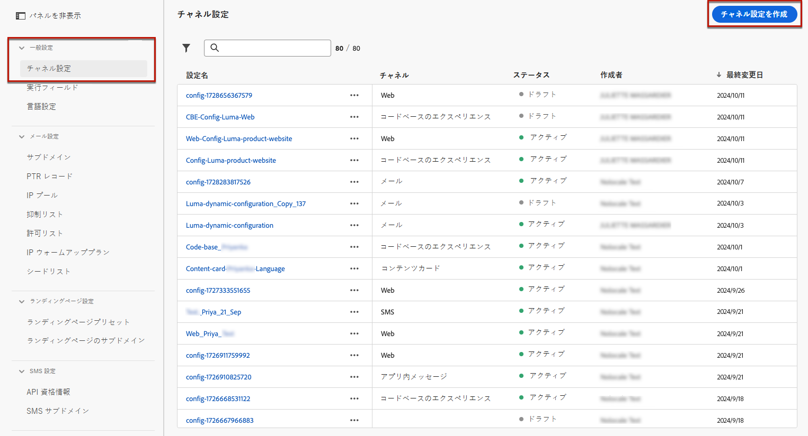

# コードベースのエクスペリエンスの設定 {#code-based-configuration}

>[!CONTEXTUALHELP]
>id="ajo_admin_app_id"
>title="アプリ ID"
>abstract="アプリの運用環境内で正確な識別と設定をに対するアプリ ID を提供し、シームレスな統合と機能を確保します。"

>[!CONTEXTUALHELP]
>id="ajo_admin_location"
>title="ページ上の場所"
>abstract="「アプリ内の場所またはパス」フィールドでは、ユーザーにアクセスさせるアプリ内の正確な宛先を指定します。これは、アプリのナビゲーション構造内の深い部分にある特定のセクションまたはページである可能性があります。"

>[!CONTEXTUALHELP]
>id="ajo_admin_surface_uri"
>title="サーフェス URI"
>abstract="サーフェス URI は、アプリケーション内の個別のユーザーインターフェイス要素またはコンポーネントを指す正確な識別子として機能します。"

>[!CONTEXTUALHELP]
>id="ajo_admin_default_mobile_url"
>title="デフォルトのオーサリングおよびプレビュー URL"
>abstract="このフィールドは、ルールによって生成または一致したページに、コンテンツの効果的な作成とプレビューの両方に不可欠な、指定された URL があることを保証します。"

>[!CONTEXTUALHELP]
>id="ajo_admin_default_web_url"
>title="デフォルトのオーサリングおよびプレビュー URL"
>abstract="このフィールドは、ルールによって生成または一致したページに、コンテンツの効果的な作成とプレビューの両方に不可欠な、指定された URL があることを保証します。"

>[!CONTEXTUALHELP]
>id="ajo_admin_mobile_url_preview"
>title="プレビュー URL"
>abstract="このフィールドは、アプリケーション内のデバイスでコンテンツのシミュレーションとプレビューを直接有効にするのに不可欠です。"

## チャネル設定の作成 {#reatte-code-based-configuration}

チャネル設定を作成するには、次の手順に従います。

1. **[!UICONTROL チャネル]**／**[!UICONTROL 一般設定]**／**[!UICONTROL チャネル設定]**&#x200B;メニューにアクセスし、「**[!UICONTROL チャネル設定を作成]**」をクリックします。

   

1. 設定の名前と説明（オプション）を入力します。

   >[!NOTE]
   >
   > 名前は、文字（A ～ Z）で始める必要があります。使用できるのは英数字のみです。アンダースコア（`_`）、ドット（`.`）、ハイフン（`-`）も使用できます。

1. 設定にカスタムまたはコアのデータ使用ラベルを割り当てるには、「**[!UICONTROL アクセスを管理]**」を選択します。[オブジェクトレベルのアクセス制御（OLAC）について詳しくは、こちらを参照してください](../administration/object-based-access.md)。

1. この設定を使用してメッセージに同意ポリシーを関連付けるには、「**[!UICONTROL マーケティングアクション]**」を選択します。顧客の環境設定に従うために、そのマーケティングアクションに関連付けられているすべての同意ポリシーが活用されます。[詳細情報](../action/consent.md#surface-marketing-actions)

1. **コードベースのエクスペリエンス**&#x200B;チャネルを選択します。

   

1. コードベースのエクスペリエンスを適用するプラットフォームを選択します。

1. Web の場合：

   * 単一ページにのみ変更を適用するには、**[!UICONTROL ページ URL]** を指定します。

   * または、**[!UICONTROL ページ一致ルール]**&#x200B;を作成して、指定したルールに一致する複数の URL をターゲットにします。例えば、すべてのページでヒーローバナーを更新したり、すべての製品ページに表示するトップ画像を追加したりするなど、web サイト全体に変更を普遍的に適用するのに使用できます。[詳細情報](../web/web-configuration.md)

1. iOS および Android の場合：

   * **[!UICONTROL アプリ ID]** と&#x200B;**[!UICONTROL アプリ内の場所またはパス]**&#x200B;を入力します。

     {width="500"}

1. 実装が web、iOS、または Android 向けではない場合や、特定の URI をターゲットにする必要がある場合は、プラットフォームとして「その他」を選択します。複数のプラットフォームを選択したり、複数の URI を追加したりすると、選択したすべてのページまたはアプリにコンテンツが配信されます。

   * **[!UICONTROL サーフェス URI]** を入力します。

   >[!CAUTION]
   >
   >コードベースのキャンペーンで使用されるサーフェス URI が、独自の実装で使用される URI と一致していることを確認します。一致していない場合、変更は実行されません。

1. デバイスでのプレビューを有効にするには、「**[!UICONTROL プレビュー URL]**」フィールドに入力します。この URL は、プレビューをトリガーする際に使用する特定の URL をプレビューサービスに通知します。

   * Web の場合：

      * 単一ページの URL を入力した場合は、その URL がプレビューに使用されます。
      * ページ一致ルールを選択した場合は、ブラウザーでエクスペリエンスをプレビューするのに使用されるデフォルトのプレビュー URL を入力する必要があります。

   * モバイルプラットフォームの場合（iOS／Android）：

      * プレビュー URL は、アプリ開発者がアプリ内で設定するディープリンクです。これにより、ディープリンクスキームに一致する URL がモバイル web ブラウザーではなくアプリ内で開かれます。アプリに設定されているディープリンクスキームを取得するには、アプリ開発者にお問い合わせください。

+++  アプリ実装のディープリンクを設定する際には、次のリソースが役立ちます。

      * Android の場合：

         * [アプリコンテキストへのディープリンクの作成](https://developer.android.com/training/app-links/deep-linking)

      * iOS の場合：

         * [アプリのカスタム URL スキームの定義](https://developer.apple.com/documentation/xcode/defining-a-custom-url-scheme-for-your-app)

         * [アプリのユニバーサルリンクのサポート](https://developer.apple.com/documentation/xcode/supporting-universal-links-in-your-app)

+++

   >[!NOTE]
   >
   >エクスペリエンスのプレビュー中に問題が発生した場合は、[このドキュメント](https://experienceleague.adobe.com/ja/docs/experience-platform/assurance/troubleshooting#app-does-not-open-link)を参照してください。

1. 特定の場所でアプリケーションで想定される形式を選択します。これは、キャンペーンやジャーニーでコードベースのエクスペリエンスを作成する際に使用されます。

1. 変更を送信します。

コードベースのエクスペリエンスを作成する際に、設定を選択できるようになりました。

## サーフェスとは {#surface-definition}

>[!CONTEXTUALHELP]
>id="ajo_code_based_surface"
>title="コードベースのエクスペリエンス設定の定義"
>abstract="コードベースの設定では、アプリケーション実装内の URI によって一意に識別される、コンテンツが配信および使用されるアプリケーション内のパスと場所を定義します。"

**コードベースのエクスペリエンスサーフェス**&#x200B;とは、ユーザーやシステムの操作用に設計されたエンティティで、URI によって一意に識別されます。サーフェスは、アプリケーション実装で指定され、コードベースのエクスペリエンスチャネル設定で作成されたサーフェスに対応している必要があります。

コードベースのエクスペリエンスチャネル設定を作成する際（web、iOS、Android プラットフォームの場合）、サーフェスを作成するパスと場所を入力する必要がありますが、プラットフォームがその他の場合は、以下の例のように、完全な URI を入力する必要があります。

つまり、サーフェスは、エンティティ（タッチポイント）が存在する階層の任意のレベルのコンテナと見なすことができます。<!--good idea to illustrate how it can be seen, but to clarify-->

* Web ページ、モバイルアプリ、デスクトップアプリ、大きなエンティティ内の特定のコンテンツの場所（`div` など）または非標準の表示パターン（キオスクやデスクトップアプリのバナーなど）が考えられます。<!--In retail, a kiosk is a digital display or small structure that businesses often place in high-traffic areas to engage customers.-->

* また、非表示または抽象された表示を目的として、コンテンツ コンテナの特定の部分に拡張することもできます（サービスに配信される JSON BLOB など）。

* また、様々なクライアントサーフェス定義に一致するワイルドカードサーフェスにすることもできます（例えば、web サイトの各ページのヒーロー画像の場所を web://mydomain.com/*#hero_image のようなサーフェス URI に変換できます）。

基本的に、サーフェス URI は複数のセクションで構成されます。
1. **タイプ**：web、mobileapp、atm、kiosk、tvcd、service など。
1. **プロパティ**：ページ URL またはアプリバンドル
1. **コンテナ**：ページ／アプリアクティビティ上の場所

次の表に、様々なデバイスのサーフェス URI 定義の例を示します。

**Web およびモバイル**

| タイプ | URI | 説明 |
| --------- | ----------- | ------- | 
| Web | `web://domain.com/path/page.html#element` | 特定のドメインの特定のページ内の個々の要素を表します。要素は、次の例のようなラベル（hero_banner、top_nav、menu、footer など）にすることができます。 |
| iOS アプリ | `mobileapp://com.vendor.bundle/activity#element` | ボタンや他のビュー要素など、ネイティブアプリアクティビティ内の特定の要素を表します。 |
| Android アプリ | `mobileapp://com.vendor.bundle/#element` | ネイティブアプリ内の特定の要素を表します。 |

**その他のデバイスタイプ**

| タイプ | URI | 説明 |
| --------- | ----------- | ------- | 
| Desktop | `desktop://com.vendor.bundle/#element` | ボタン、メニュー、ヒーローバナーなど、アプリケーション内の特定の要素を表します。 |
| TV アプリ | `tvcd://com.vendor.bundle/#element` | スマート TV または TV 接続デバイスアプリ内の特定の要素（バンドル ID）を表します。 |
| サービス | `service://servicename/#element` | サーバーサイドのプロセスまたは他の手動エンティティを表します。 |
| キオスク | `kiosk://location/screen#element` | 容易に追加できる、潜在的な追加サーフェスタイプの例。 |
| ATM | `atm://location/screen#element` | 容易に追加できる、潜在的な追加サーフェスタイプの例。 |

**ワイルドカードサーフェス**

| タイプ | URI | 説明 |
| --------- | ----------- | ------- | 
| ワイルドカード web | `wildcard:web://domain.com/*#element` | ワイルドカードサーフェス - 特定のドメインの下の各ページの個々の要素を表します。 |
| ワイルドカード web | `wildcard:web://*domain.com/*#element` | ワイルドカードサーフェス - 「domain.com」で終わるすべてのドメインの各ページの個々の要素を表します。 |
