# コードベースのエクスペリエンスで編集可能なフォームフィールドを使用する {#code-based-form-fields}

コードベースのエクスペリエンスをより柔軟に制御するために、[!DNL Journey Optimizer]では、開発チームが特定の定義済み編集可能フィールドを含むJSONまたはHTML コンテンツテンプレートを作成できます。

コードベースのエクスペリエンスを作成する場合、技術に詳しくないマーケターでも、パーソナライゼーションエディターを開いたり、ジャーニーやキャンペーン内の他のコード要素に触れたりすることなく、インターフェイス内のフィールドを直接編集できます。

この機能により、マーケティングユーザーはエクスペリエンスを簡素化でき、開発者はコードコンテンツをより詳細に制御できるようになり、エラーが発生する余地が少なくなります。

## フォームフィールドの構文について {#form-field-syntax}

HTMLまたはJSON コードペイロードの一部を編集可能にするには、式エディターで特定の構文を使用する必要があります。 これには、コードベースのエクスペリエンスにコンテンツテンプレートを適用した後にユーザーが上書きできるデフォルト値を持つ&#x200B;**変数**&#x200B;を宣言することが含まれます。

例えば、コンテンツテンプレートを作成してコードベースのエクスペリエンスに適用し、ユーザーがフレームやボタンの背景色など、異なる場所で使用される特定の色をカスタマイズできるようにするとします。

コンテンツテンプレートを作成する際は、**一意のID**&#x200B;を持つ変数（例：「*color*」）を宣言し、この色を適用するコンテンツ内の目的の場所で呼び出す必要があります。

コンテンツテンプレートをコンテンツに適用する場合、ユーザーは変数が参照される場所で使用される色をカスタマイズできます。

## HTMLまたはJSON コンテンツテンプレートへの編集可能なフィールドの追加 {#add-editable-fields}

>[!CONTEXTUALHELP]
>id="ajo_cbe_preview_form_fields"
>title="フォームフィールドのレンダリングを確認する"
>abstract="JSONやHTMLのコンテンツテンプレートでは、編集可能な特定のフィールドを定義できます。これにより、技術的な知識がなくても、コードを操作することなく、コードベースのエクスペリエンスでコンテンツを簡単に編集できます。 専用の構文を使用してこれらのフィールドを作成し、このボタンを使用してプレビューします。"

JSONまたはHTML コードの一部を編集可能にするには、まず、特定のフォームフィールドを定義できるコードベースのエクスペリエンス [ コンテンツテンプレート ](../content-management/content-templates.md)を作成することから始めます。

>[!NOTE]
>
>このステップは通常、開発者ペルソナによって実行されます。

➡️ [編集可能なフィールドをコードベースのエクスペリエンステンプレートに追加する方法については、このビデオをご覧ください](#video)

1. コンテンツテンプレートを作成し、**[!UICONTROL コードベースのエクスペリエンス]** チャネルを選択します。 [ テンプレートの作成方法を学ぶ](../content-management/create-content-templates.md)

1. オーサリングモードとして、HTMLまたはJSONを選択します。

   >[!CAUTION]
   >
   >オーサリングモードを変更すると、現在のすべてのコードが失われます。 このテンプレートに基づくコードベースのエクスペリエンスは、同じオーサリングモードを使用する必要があります。

1. [ パーソナライゼーションエディター](../personalization/personalization-build-expressions.md)を開いて、コードコンテンツを編集します。

1. 編集可能なフォームフィールド <!--To declare the variable you want users to edit-->を定義するには、左側のナビゲーションパネルの&#x200B;**[!UICONTROL ヘルパー関数]** メニューに移動し、**インライン**&#x200B;属性を追加します。 変数を宣言して呼び出す構文は、コンテンツに自動的に追加されます。

   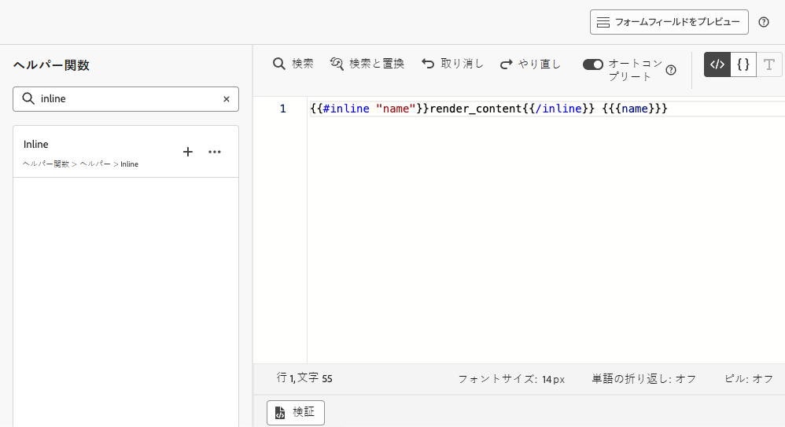{width="85%"}

1. `"name"`を一意のIDに置き換えて、編集可能なフィールドを識別します。 例えば、「imgURL」と入力します。

   >[!NOTE]
   >
   >フィールド IDは一意である必要があり、スペースを含めることはできません。 このIDは、変数の値を表示するコンテンツ内のあらゆる場所で使用する必要があります。

1. 次の表に示すパラメーターを追加して、ニーズに合わせて構文を調整します。

   | Action | パラメーター | 例 |
   | ------- | ------- | ------- |
   | **デフォルト値**&#x200B;を持つ編集可能なフィールドを宣言します。 テンプレートをコンテンツに追加する場合、このデフォルト値は、テンプレートをカスタマイズしない場合に使用されます。 | インラインタグ間にデフォルト値を追加します。 | `{{#inline "editableFieldID"}}default_value{{/inline}}` |
   | 編集可能なフィールドに&#x200B;**label**&#x200B;を定義します。 このラベルは、テンプレートのフィールドを編集するときにコードエディターに表示されます。 | `name="title"` | `{{#inline "editableFieldID" name="title"}}default_value{{/inline}}` |

   <!--
    | Action | Parameter| Example |
    | ------- | ------- | ------- |
    |Declare an editable field containing an **image source** that needs to be published.|`assetType="image"`|`{{#inline "editableFieldID" assetType="image"}}default_value{{/inline}}`|
    |Declare an editable field containing an **URL** that needs to be tracked.br/>Note that out-of-the-box "Mirror page URL" and "Unsubscribe link" predefined blocks cannot become editable fields.>|`assetType="url"`|`{{#inline "editableFieldID" assetType="url"}}default_value{{/inline}}`|
—>

1. 「**[!UICONTROL フォームフィールドをプレビュー]**」をクリックして、このテンプレートを適用するコードベースのエクスペリエンスで編集可能なフォームフィールドがどのように表示されるかを確認します。

   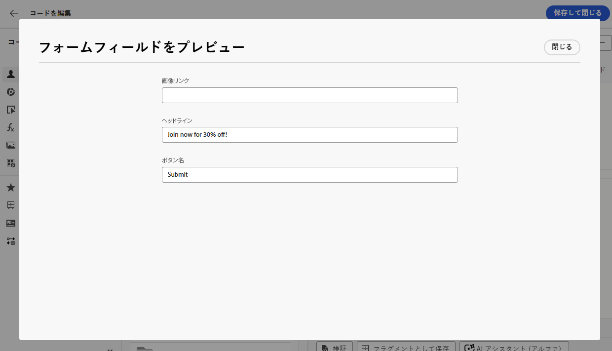{width="85%"}

1. 編集可能フィールドの値を表示するあらゆる場所で、コードの`{{{name}}}`構文を使用します。 `name`を、前に定義したフィールドの一意のIDに置き換えます。

   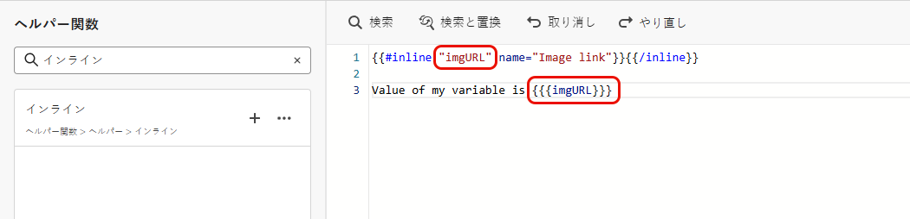{width="85%"}

1. 同様に、他の編集可能なフィールドを追加し、各フィールドを`{{#inline}}`および`{{/inline}}` タグで囲みます。

1. 定義した編集可能なフィールドに対応するIDなど、必要に応じてコードの残りの部分も編集します。 [方法を学ぶ](create-code-based.md#edit-code)

   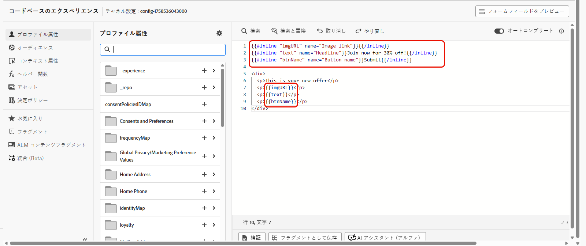

1. テンプレートを保存します。

### 編集可能なフィールドフォームでの決定ポリシーの使用 {#decision-policy-in-form-fields}

コードベースのエクスペリエンスコンテンツテンプレートを作成する場合、決定ポリシーを使用して、編集可能なフォームフィールドでオファーを活用できます。

1. [上記](#add-editable-fields)の説明に従って、コードベースのエクスペリエンステンプレートを作成します。

1. 編集画面の右側パネルの&#x200B;**[!UICONTROL 決定を表示]** アイコンを使用するか、左側のメニューの&#x200B;**[!UICONTROL 決定ポリシー]** セクションの式エディターで&#x200B;**[!UICONTROL 決定ポリシー]**&#x200B;を追加をクリックします。

   決定ポリシーの作成方法については、[このセクション ](../experience-decisioning/create-decision.md#create-decision)を参照してください。

1. 「**[!UICONTROL ポリシーを挿入]**」ボタンをクリックします。 決定ポリシーに対応するコードが追加されます。

   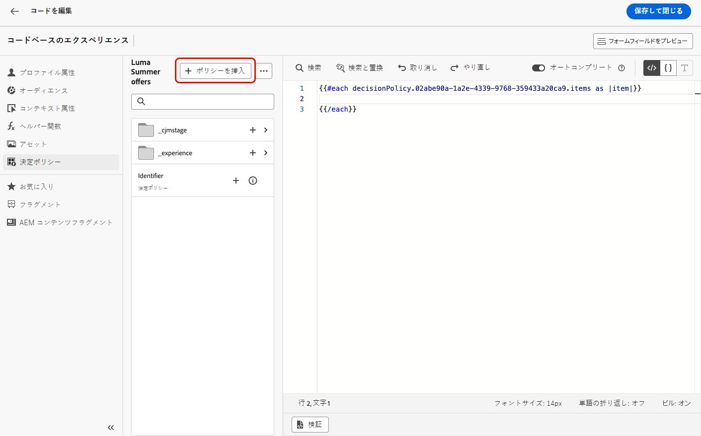

1. `{{#each}}` タグの後、追加する編集可能なフォームフィールドに対応するコードを、[上記](#add-editable-fields)で説明されている&#x200B;**インライン**&#x200B;構文を使用して挿入します。 `"name"`を一意のIDに置き換えて、編集可能なフィールドを特定します。 この例では、「title」を使用します。

   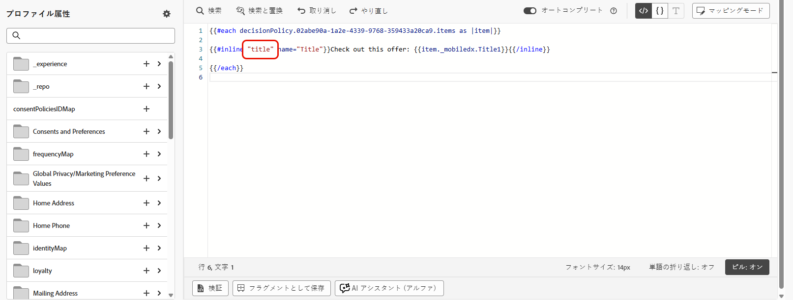{width="90%"}

1. 「**[!UICONTROL フォームフィールドをプレビュー]**」をクリックして、このテンプレートを適用するコードベースのエクスペリエンスで編集可能なフォームフィールドがどのように表示されるかを確認します。

   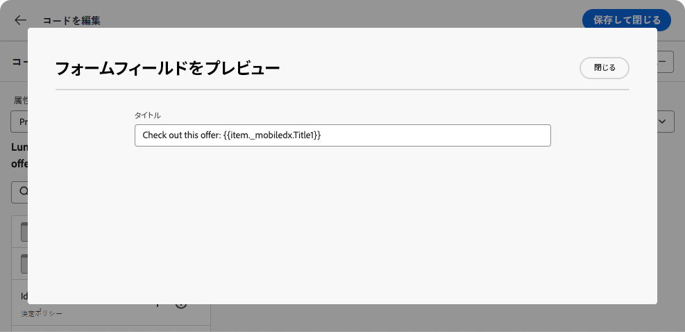{width="70%"}

1. コードの残りの部分を`{{/each}}` タグの上に挿入します。 編集可能フィールドの値を表示するあらゆる場所で、コードの`{{{name}}}`構文を使用します。 この例では、`name`を「title」に置き換えます。

   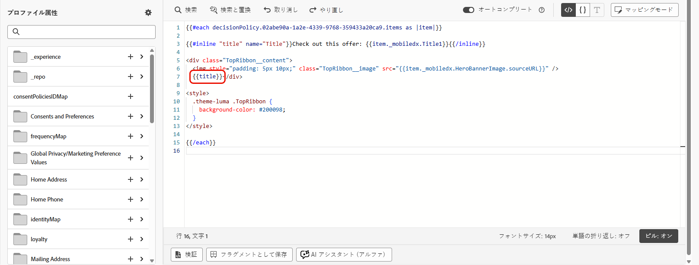{width="85%"}

1. テンプレートを保存します。

### コード例 {#code-examples}

JSONおよびHTML テンプレートの例を以下に示します。その一部は、意思決定ポリシーを含みます。

**JSON テンプレート：**

```
{{#inline "title" name="Title"}}Best gear for winter is here for you!{{/inline}} 
{{#inline "description" name="Description"}}Add description{{/inline}} 
{{#inline "imgURL" name="Image Link"}}Add link{{/inline}} 
{{#inline "number_of_items" name="Number of items"}}23{{/inline}}

{
  "title": "{{{title}}}",
  "description": "{{{description}}}",
  "imageUrl": "{{{imgURL}}}",
  "number_of_items": {{{number_of_items}}}, 
  "code": "DEFAULT"
}
```

>[!NOTE]
>
>JSON ペイロードでインラインフィールドを参照する場合：
>
>* 文字列型フィールドは、二重引用符で囲む必要があります。
>* 整数やブール値は二重引用符で囲んではいけません。 （上記の例の`number_of_items` フィールドを参照してください）。

決定を含む&#x200B;**JSON テンプレート：**

```
{ 
"offer": [ 
{{#each decisionPolicy.fff709b7-7fef-4e4e-83d7-594fbcf196c1.items as |item|}} 
{{#inline "title" name="Title"}}{{item._mobiledx.Title1}}{{/inline}} {{#inline "description" name="Description"}}{{item._mobiledx.Title2}}{{/inline}} {{#inline "imgURL" name="Image Link"}}https://luma.enablementadobe.com/content/luma/us/en/experience/warming-up/_jcr_content/root/hero_image.coreimg.jpeg{{/inline}} 

{ 
"title": "{{{title}}}", 
"description": "{{{description}}}", 
"imageUrl": "{{{imgURL}}}", 
"link": "https://lumaenablement.adobe.com/web/luma/home", "code": "DEFAULT" 
}, 
{{/each}}
] 
}
```

>[!NOTE]
>
>決定項目を使用するインラインフィールドは、`{{#each}}` タグと`{{/each}}` タグの間の決定ポリシーブロック内に配置する必要があります。

**HTML テンプレート：**

```
{{#inline "title" name="Title"}}Please enter title here{{/inline}} 
{{#inline "imgSrc" name="Image link"}}{{/inline}} 

<div class="TopRibbon__content">{{{title}}}</div> 
<style> .theme-luma .TopRibbon { background-color: #200098; }</style>
```

**決定付きのHTML テンプレート：**

```
{{#each decisionPolicy.f112884a-5654-43ad-9d6d-dbd32ae23ee6.items as |item|}} 
{{#inline "title" name="Title"}}Title is: {{item._mobiledx.Title1}}{{/inline}} 

<div class="TopRibbon__content">{{{title}}}</div> 
<style> .theme-luma .TopRibbon { background-color: #200098; }</style> 

{{/each}}
```

## コードベースのエクスペリエンスでのフォームフィールドの編集 {#edit-form-fields}

>[!CONTEXTUALHELP]
>id="ajo_code_based_form_fields"
>title="フォームフィールドとは？"
>abstract="このコードベースのエクスペリエンスには、パーソナライゼーションエディターでコードを操作しなくても容易に編集できるフォームフィールドが含まれています。"

定義済みの編集可能フォームフィールドを含むコンテンツテンプレートが作成されたので、このコンテンツテンプレートを使用してコードベースのエクスペリエンスを構築できます。

パーソナライゼーションエディターを開くことなく、コードベースのエクスペリエンスジャーニーやキャンペーンからフォームフィールドを簡単に編集できるようになります。

>[!NOTE]
>
>このステップは通常、マーケターのペルソナによって実行されます。

1. ジャーニーアクティビティまたはキャンペーン編集画面から、編集可能なフォームフィールドを含むコンテンツテンプレートを選択します。 [ コンテンツテンプレートの使用方法を学ぶ](../content-management/use-content-templates.md)

   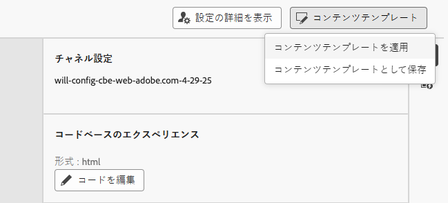{width="60%"}

   >[!CAUTION]
   >
   >選択できるテンプレートは、事前に選択したチャネル設定に基づいて、HTMLまたはJSONの範囲が設定されます。 互換性のあるテンプレートのみが表示されます。

1. 選択したコンテンツテンプレートで事前定義されたフィールドは、右側のペインで使用できます。<!--The code preview is displayed with the rest of the code.-->

   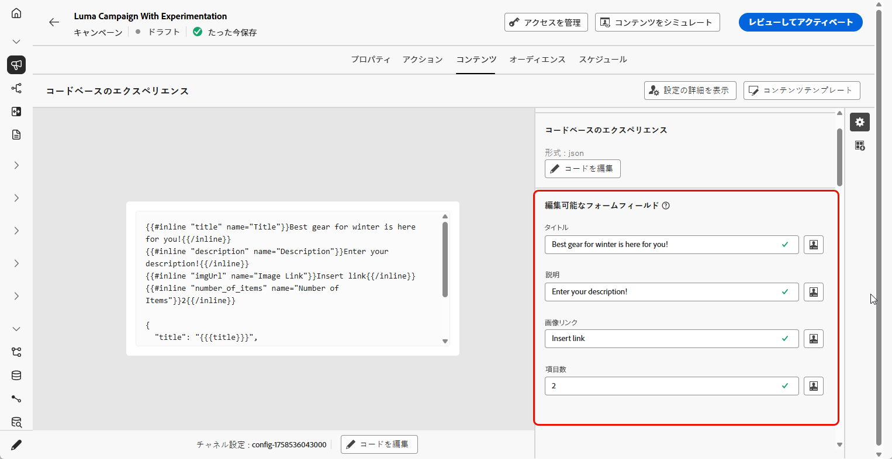

1. 「**[!UICONTROL 編集可能なフォームフィールド]**」セクションでは、次の操作を実行できます。

   * コードエディターを開かずに、編集可能なフィールド内で各値を直接編集できます。

   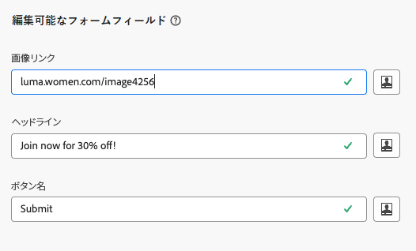{width="60%"}

   * パーソナライゼーションアイコンをクリックして、[ コードエディター](../personalization/personalization-build-expressions.md)を使用して各フィールドを編集します。

   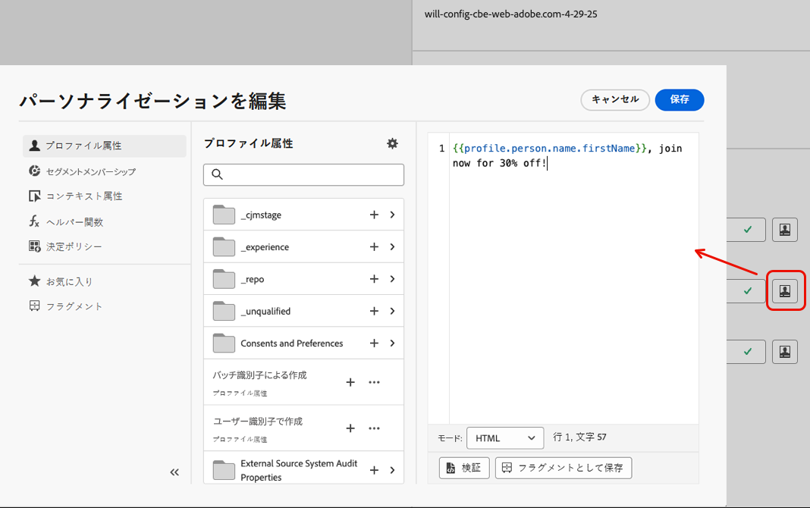{width="70%"}

   >[!NOTE]
   >
   >どちらの場合も、一度に1つのフィールドのみを編集でき、残りのコードベースのエクスペリエンスコンテンツは編集できません。

1. [決定ポリシーがコンテンツテンプレートに](#decision-policy-in-form-fields)追加された場合、[ オファーカタログスキーマ ](../experience-decisioning/catalogs.md)で使用可能なすべての属性が付属します。 決定項目は、インラインまたは式エディターを使用して編集できます。

1. 残りのコードを編集するには、「**[!UICONTROL コードを編集]**」ボタンをクリックし、編集可能なフォームフィールドを含む、コードベースのエクスペリエンスコンテンツ全体を更新します。 [詳細情報](create-code-based.md#edit-code)

## チュートリアルビデオ {#video}

コードベースのエクスペリエンスチャネルコンテンツテンプレートに編集可能フィールドを追加する方法について説明します。

>[!VIDEO](https://video.tv.adobe.com/v/3463990/?learn=on&#x26;enablevpops)
