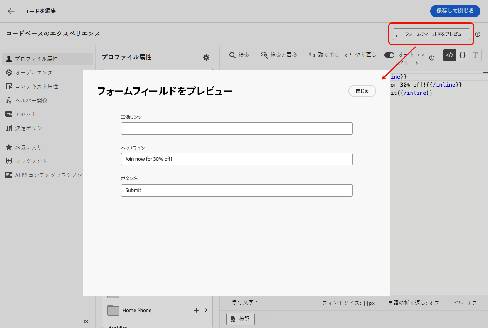
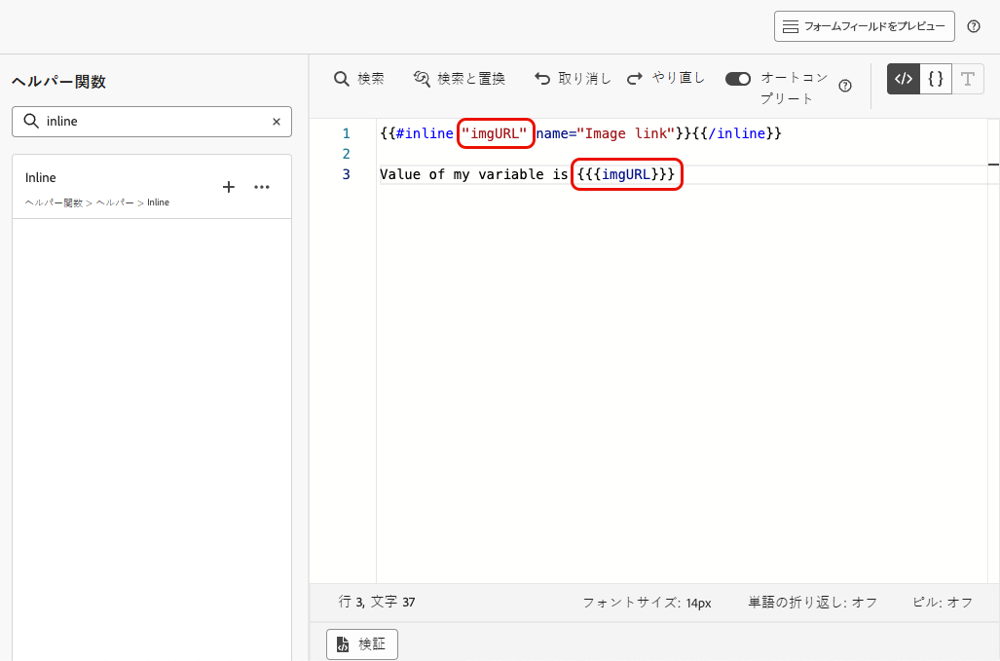
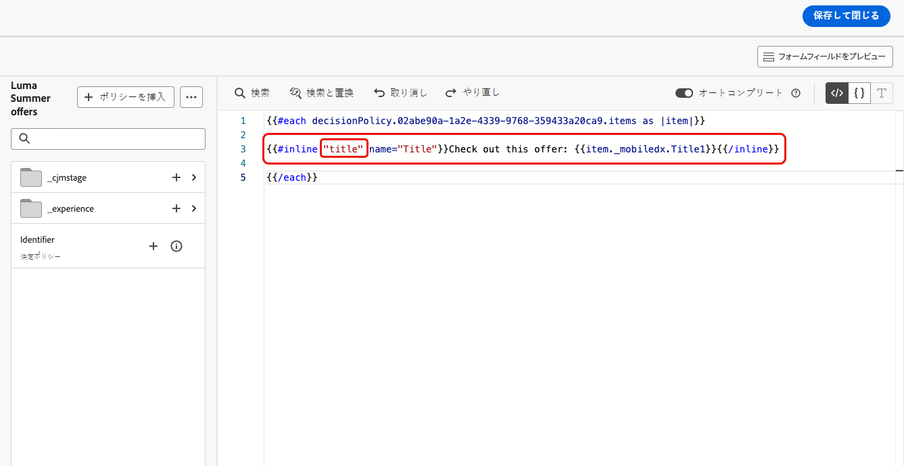
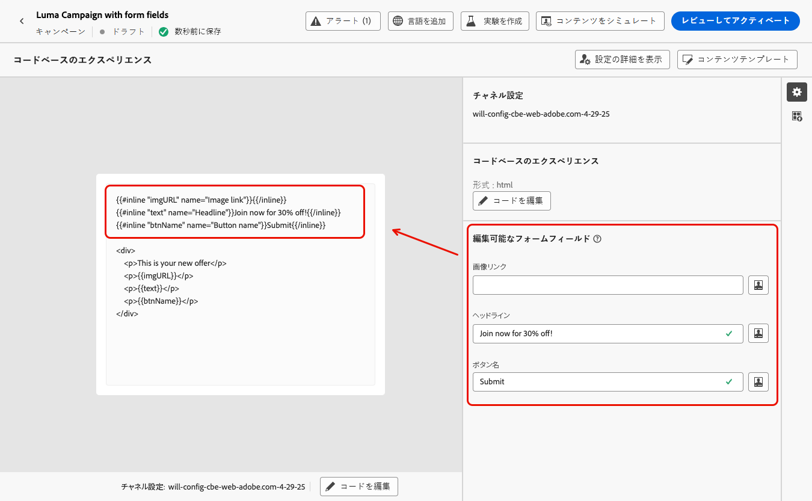

# コードベースのエクスペリエンスでの編集可能なフォームフィールドの使用 {#code-based-form-fields}

コードベースのエクスペリエンスの柔軟性と制御性を高めることを目的に、[!DNL Journey Optimizer] では開発チームが特定の事前定義済みの編集可能フィールドを含む JSON または HTML コンテンツテンプレートを作成できます。

コードベースのエクスペリエンスを作成する際、技術者以外のマーケターは、パーソナライゼーションエディターを開いたり、ジャーニーやキャンペーンの他のコード要素に触れたりする必要なく、インターフェイスでこれらのフィールドを直接編集できます。

この機能により、マーケティングユーザーに対するエクスペリエンスが簡素化されると共に、開発者はコードコンテンツをより詳細に制御できるので、エラーが発生する可能性が低くなります。

## フォームフィールドの構文について {#form-field-syntax}

HTML または JSON コードペイロードの一部を編集可能にするには、式エディターで特定の構文を使用する必要があります。これには、コンテンツテンプレートをコードベースのエクスペリエンスに適用した後にユーザーが上書きできるデフォルト値を持つ&#x200B;**変数**&#x200B;の宣言が含まれます。

例えば、コンテンツテンプレートを作成してコードベースのエクスペリエンスに適用し、フレームやボタンの背景色など、様々な場所で使用される特定の色をユーザーがカスタマイズできるようにするとします。

コンテンツテンプレートを作成する際は、「*color*」などの&#x200B;**一意の ID** を持つ変数を宣言し、この色を適用するコンテンツ内の目的の場所でその変数を呼び出す必要があります。

コンテンツテンプレートをコンテンツに適用すると、ユーザーは変数が参照される場所で使用する色をカスタマイズできます。

## HTML または JSON コンテンツテンプレートへの編集可能なフィールドの追加 {#add-editable-fields}

>[!CONTEXTUALHELP]
>id="ajo_cbe_preview_form_fields"
>title="フォームフィールドのレンダリングの確認"
>abstract="JSON または HTML コンテンツテンプレートでは、特定の編集可能なフィールドを定義できます。これにより、技術ユーザー以外がコードを操作することなく、コードベースのエクスペリエンスでコンテンツを簡単に編集できます。専用の構文を使用してこれらのフィールドを作成し、このボタンを使用してプレビューします。"

JSON または HTML コードの一部を編集可能にするには、まず、特定のフォームフィールドを定義できるコードベースのエクスペリエンス[コンテンツテンプレート](../content-management/content-templates.md)を作成します。

>[!NOTE]
>
>この手順は通常、開発者ペルソナが実行します。

➡️ [コードベースのエクスペリエンステンプレートに編集可能なフィールドを追加する方法について詳しくは、このビデオをご覧ください](#video)

1. コンテンツテンプレートを作成し、**[!UICONTROL コードベースのエクスペリエンス]**&#x200B;チャネルを選択します。[詳しくは、テンプレートの作成方法を参照してください。](../content-management/create-content-templates.md)

1. オーサリングモード（HTML または JSON）を選択します。

   >[!CAUTION]
   >
   >オーサリングモードを変更すると、現在のコードがすべて失われます。このテンプレートに基づくコードベースのエクスペリエンスでは、同じオーサリングモードを使用する必要があります。

1. [パーソナライゼーションエディター](../personalization/personalization-build-expressions.md)を開いて、コードコンテンツを編集します。

1. 編集可能なフォームフィールド<!--To declare the variable you want users to edit-->を定義するには、左側のナビゲーションパネルの&#x200B;**[!UICONTROL ヘルパー関数]**&#x200B;メニューに移動し、**インライン**&#x200B;属性を追加します。変数を宣言し呼び出す構文は、コンテンツに自動的に追加されます。

   {width="85%"}

1. `"name"` を一意の ID に置き換えて、編集可能フィールドを識別します。例えば、「imgURL」と入力します。

   >[!NOTE]
   >
   >フィールド ID は一意である必要があり、スペースを含めることはできません。コンテンツ内で変数の値を表示するすべての場所でこの ID を使用する必要があります。

1. 以下の表で説明するパラメーターを追加して、ニーズに合わせて構文を調整します。

   | アクション | パラメーター | 例 |
   | ------- | ------- | ------- |
   | 編集可能フィールドを&#x200B;**デフォルト値**&#x200B;と共に宣言します。テンプレートをコンテンツに追加する際に、カスタマイズしない場合は、このデフォルト値が使用されます。 | インラインタグの間にデフォルト値を追加します。 | `{{#inline "editableFieldID"}}default_value{{/inline}}` |
   | 編集可能フィールドの&#x200B;**ラベル**&#x200B;を定義します。このラベルは、テンプレートのフィールドを編集する際に、コードエディターに表示されます。 | `name="title"` | `{{#inline "editableFieldID" name="title"}}default_value{{/inline}}` |

   <!--
    | Action | Parameter| Example |
    | ------- | ------- | ------- |
    |Declare an editable field containing an **image source** that needs to be published.|`assetType="image"`|`{{#inline "editableFieldID" assetType="image"}}default_value{{/inline}}`|
    |Declare an editable field containing an **URL** that needs to be tracked.br/>Note that out-of-the-box "Mirror page URL" and "Unsubscribe link" predefined blocks cannot become editable fields.>|`assetType="url"`|`{{#inline "editableFieldID" assetType="url"}}default_value{{/inline}}`|
    -->

1. 「**[!UICONTROL フォームフィールドをプレビュー]**」をクリックすると、このテンプレートを適用するコードベースのエクスペリエンスで編集可能なフォームフィールドの表示方法を確認できます。

   {width="85%"}

1. コード内では、編集可能フィールドの値を表示するすべての場所で `{{{name}}}` 構文を使用します。`name` を、先ほど定義したフィールドの一意の ID に置き換えます。

   {width="85%"}

1. 同様に、他の編集可能なフィールドを追加し、各フィールドを `{{#inline}}` タグと `{{/inline}}` タグでラップします。

1. 必要に応じて、定義した編集可能なフィールドに対応する ID を含む、残りのコードを編集します。[詳細情報](create-code-based.md#edit-code)

   

1. テンプレートを保存します。

### 編集可能なフィールドフォームでの決定ポリシーの使用 {#decision-policy-in-form-fields}

コードベースのエクスペリエンスコンテンテンプレートを作成する際に、決定ポリシーを使用して、編集可能なフォームフィールドでオファーを活用できます。

1. [上記](#add-editable-fields)の説明に従って、コードベースのエクスペリエンステンプレートを作成します。

1. 編集画面の右側のパネルにある&#x200B;**[!UICONTROL 決定を表示]**&#x200B;アイコンを使用するか、式エディターの左側のメニューの「**[!UICONTROL 決定ポリシー]**」セクションから「**[!UICONTROL 決定ポリシーを追加]**」をクリックします。

   決定ポリシーの作成方法について詳しくは、[この節](../experience-decisioning/create-decision.md#add-decision)を参照してください。

1. 「**[!UICONTROL ポリシーを挿入]**」ボタンをクリックします。決定ポリシーに対応するコードが追加されます。

   

1. `{{#each}}` タグの後に、[上記](#add-editable-fields)の&#x200B;**インライン**&#x200B;構文を使用して、追加する編集可能なフォームフィールドに対応するコードを挿入します。`"name"` を一意の ID に置き換えて、編集可能フィールドを識別します。この例では、「title」を使用します。

   {width="90%"}

1. 「**[!UICONTROL フォームフィールドをプレビュー]**」をクリックすると、このテンプレートを適用するコードベースのエクスペリエンスで編集可能なフォームフィールドの表示方法を確認できます。

   {width="70%"}

1. 残りのコードを `{{/each}}` タグの上に挿入します。編集可能なフィールドの値を表示するすべての場所で、コード内で `{{{name}}}` 構文を使用します。この例では、`name` を「title」に置き換えます。

   {width="85%"}

1. テンプレートを保存します。

### コードの例 {#code-examples}

JSON テンプレートと HTML テンプレートの例を以下に示します。この一部には、決定ポリシーが含まれます。

**JSON テンプレート：**

```
{{#inline "title" name="Title"}}Best gear for winter is here for you!{{/inline}} 
{{#inline "description" name="Description"}}Add description{{/inline}} 
{{#inline "imgURL" name="Image Link"}}Add link{{/inline}} 
{{#inline "number_of_items" name="Number of items"}}23{{/inline}}

{
  "title": "{{{title}}}",
  "description": "{{{description}}}",
  "imageUrl": "{{{imgURL}}}",
  "number_of_items": {{{number_of_items}}}, 
  "code": "DEFAULT"
}
```

>[!NOTE]
>
>JSON ペイロードでインラインフィールドを参照する場合：
>
>* 文字列タイプのフィールドは、二重引用符で囲む必要があります。
>* 整数またはブール値を二重引用符で囲まないでください。（上記の例の「`number_of_items`」フィールドを参照）。

**決定を含む JSON テンプレート：**

```
{ 
"offer": [ 
{{#each decisionPolicy.fff709b7-7fef-4e4e-83d7-594fbcf196c1.items as |item|}} 
{{#inline "title" name="Title"}}{{item._mobiledx.Title1}}{{/inline}} {{#inline "description" name="Description"}}{{item._mobiledx.Title2}}{{/inline}} {{#inline "imgURL" name="Image Link"}}https://luma.enablementadobe.com/content/luma/us/en/experience/warming-up/_jcr_content/root/hero_image.coreimg.jpeg{{/inline}} 

{ 
"title": "{{{title}}}", 
"description": "{{{description}}}", 
"imageUrl": "{{{imgURL}}}", 
"link": "https://lumaenablement.adobe.com/web/luma/home", "code": "DEFAULT" 
}, 
{{/each}}
] 
}
```

>[!NOTE]
>
>決定項目を使用するインラインフィールドは、決定ポリシーブロック内（`{{#each}}` タグと `{{/each}}` タグの間）に配置する必要があります。

**HTML テンプレート：**

```
{{#inline "title" name="Title"}}Please enter title here{{/inline}} 
{{#inline "imgSrc" name="Image link"}}{{/inline}} 

<div class="TopRibbon__content">{{{title}}}</div> 
<style> .theme-luma .TopRibbon { background-color: #200098; }</style>
```

**決定を含む HTML テンプレート：**

```
{{#each decisionPolicy.f112884a-5654-43ad-9d6d-dbd32ae23ee6.items as |item|}} 
{{#inline "title" name="Title"}}Title is: {{item._mobiledx.Title1}}{{/inline}} 

<div class="TopRibbon__content">{{{title}}}</div> 
<style> .theme-luma .TopRibbon { background-color: #200098; }</style> 

{{/each}}
```

## コードベースのエクスペリエンスでのフォームフィールドの編集 {#edit-form-fields}

>[!CONTEXTUALHELP]
>id="ajo_code_based_form_fields"
>title="フォームフィールドとは？"
>abstract="このコードベースのエクスペリエンスには、パーソナライゼーションエディターでコードを操作しなくても簡単に編集できるフォームフィールドが含まれます。"

事前定義済みの編集可能なフォームフィールドを含むコンテンツテンプレートが作成されたので、このコンテンツテンプレートを使用してコードベースのエクスペリエンスを作成できます。

パーソナライゼーションエディターを開くことなく、コードベースのエクスペリエンスジャーニーまたはキャンペーンからフォームフィールドを簡単に編集できます。

>[!NOTE]
>
>この手順は通常、マーケターペルソナが実行します。

1. ジャーニーアクティビティまたはキャンペーン編集画面から、編集可能なフォームフィールドを含むコンテンツテンプレートを選択します。[詳しくは、コンテンツテンプレートの使用方法を参照してください。](../content-management/use-content-templates.md)

   {width="60%"}

   >[!CAUTION]
   >
   >選択可能なテンプレートは、事前に選択したチャネル設定に基づいて、HTML または JSON のいずれかに限定されます。互換性のあるテンプレートのみが表示されます。

1. 選択したコンテンツテンプレートで事前定義済みのフィールドは、右側のパネルで使用できます。<!--The code preview is displayed with the rest of the code.-->

   

1. 「**[!UICONTROL 編集可能なフォームフィールド]**」セクションでは、次の操作を実行できます。

   * コードエディターを開くことなく、編集可能なフィールド内で各値を直接編集します。

   {width="60%"}

   * パーソナライゼーションアイコンをクリックし、[コードエディター](../personalization/personalization-build-expressions.md)を使用して各フィールドを編集します。

   {width="70%"}

   >[!NOTE]
   >
   >どちらの場合も、一度に編集できるのは 1 つのフィールドのみで、コードベースのエクスペリエンスコンテンツの残りの部分は編集できません。

1. コンテンツテンプレートに[決定ポリシーを追加](#decision-policy-in-form-fields)した場合、[オファーカタログスキーマ](../experience-decisioning/catalogs.md)で使用可能なすべての属性が付属します。決定項目は、インラインで、または式エディターを使用して編集できます。

1. 残りのコードを編集するには、「**[!UICONTROL コードを編集]**」ボタンをクリックし、編集可能なフォームフィールドを含む、完全なコードベースのエクスペリエンスコンテンツを更新します。[詳細情報](create-code-based.md#edit-code)

## チュートリアルビデオ {#video}

コードベースのエクスペリエンスチャネルコンテンツテンプレートに編集可能なフィールドを追加する方法について説明します。

>[!VIDEO](https://video.tv.adobe.com/v/3463990/?learn=on&#x26;enablevpops)
