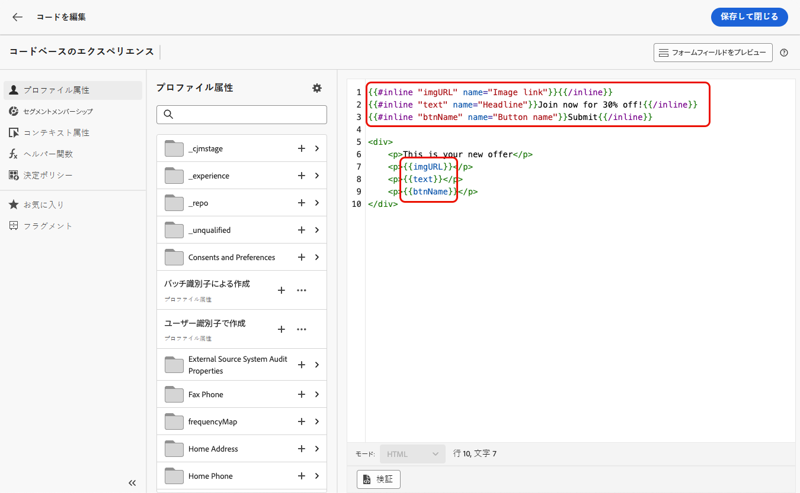
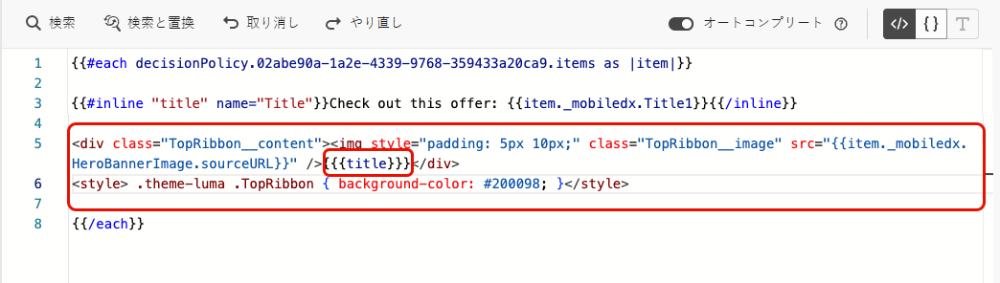

# コードベースのエクスペリエンスでの編集可能なフォームフィールドの使用 {#code-based-form-fields}

[!DNL Journey Optimizer] を使用すると、コードベースのエクスペリエンスをより柔軟に、かつ制御できるので、開発チームは、特定の事前定義済みの編集可能なフィールドを含む JSON またはHTML コンテンツテンプレートを作成できます。

コードベースのエクスペリエンスを作成する場合、技術者以外のマーケターは、パーソナライゼーションエディターを開いたり、ジャーニーやキャンペーンの他のコード要素に触れたりする必要なく、インターフェイスでこれらのフィールドを直接編集できます。

この機能により、マーケティングユーザーのエクスペリエンスが簡素化されると同時に、開発者がコードコンテンツをより詳細に制御できるので、エラーが発生する余地が少なくなります。

## フォームフィールドの構文の理解 {#form-field-syntax}

HTMLまたは JSON コードペイロードの一部を編集可能にするには、式エディターで特定の構文を使用する必要があります。 これには、ユーザーがコンテンツテンプレートをコードベースのエクスペリエンスに適用した後に上書きできるデフォルト値を使用した **変数** の宣言が含まれます。

例えば、コンテンツテンプレートを作成して、コードベースのエクスペリエンスに適用し、ユーザーがフレームやボタンの背景色など、様々な場所で使用する特定の色をカスタマイズできるようにするとします。

コンテンツテンプレートを作成する際は、例えば「*color*」などの **一意の ID** を持つ変数を宣言し、このカラーを適用するコンテンツ内の目的の場所で呼び出す必要があります。

コンテンツテンプレートをコンテンツに適用する際に、ユーザーは、変数が参照される場所で使用されるカラーをカスタマイズできます。

## HTMLまたは JSON コンテンツテンプレートへの編集可能なフィールドの追加 {#add-editable-fields}

>[!CONTEXTUALHELP]
>id="ajo_cbe_preview_form_fields"
>title="フォームフィールドのレンダリングの確認"
>abstract="JSON またはHTMLのコンテンツテンプレートでは、特定の編集可能フィールドを定義できます。これにより、技術者以外のユーザーがコードを操作しなくても、コードベースのエクスペリエンスのコンテンツを簡単に編集できます。 専用の構文を使用してこれらのフィールドを作成し、このボタンを使用してプレビューします。"

一部の JSON またはHTML コードを編集可能にするには、まず、特定のフォームフィールドを定義できるコードベースのエクスペリエンス [ コンテンツテンプレート ](../content-management/content-templates.md) を作成します。

>[!NOTE]
>
>この手順は、通常、開発者ペルソナが実行します。

➡️ [ コードベースのエクスペリエンステンプレートに編集可能なフィールドを追加する方法については、このビデオを参照してください ](#video)

1. コンテンツテンプレートを作成し、**[!UICONTROL コードベースのエクスペリエンス]** チャネルを選択します。 [詳しくは、テンプレートの作成方法を参照してください](../content-management/create-content-templates.md)

1. オーサリングモード（HTMLまたは JSON）を選択します。

   >[!CAUTION]
   >
   >オーサリングモードを変更すると、現在のコードはすべて失われます。 このテンプレートをベースとするコードベースのエクスペリエンスでは、同じオーサリングモードを使用する必要があります。

1. [ パーソナライゼーションエディター ](../personalization/personalization-build-expressions.md) を開いて、コードコンテンツを編集します。

1. 編集可能なフォームフィールドを定義するには <!--To declare the variable you want users to edit--> 左側のナビゲーションペインで **[!UICONTROL ヘルパー関数]** メニューに移動し、**inline** 属性を追加します。 変数を宣言し呼び出す構文は、コンテンツに自動的に追加されます。

   {width="85%"}

1. `"name"` を一意の ID に置き換えて、編集可能なフィールドを識別します。 たとえば、「imgURL」と入力します。

   >[!NOTE]
   >
   >フィールド ID は一意である必要があり、スペースを含めることはできません。 コンテンツ内で変数の値を表示するすべての場所でこの ID を使用する必要があります。

1. 以下の表で説明するパラメーターを追加して、ニーズに合わせて構文を調整します。

   | アクション | パラメーター | 例 |
   | ------- | ------- | ------- |
   | 編集可能フィールドを&#x200B;**デフォルト値**&#x200B;と共に宣言します。コンテンツにテンプレートを追加する際、カスタマイズしない場合は、このデフォルト値が使用されます。 | インラインタグの間にデフォルト値を追加します。 | `{{#inline "editableFieldID"}}default_value{{/inline}}` |
   | 編集可能フィールドの&#x200B;**ラベル**&#x200B;を定義します。このラベルは、テンプレートのフィールドを編集するときにコードエディターに表示されます。 | `name="title"` | `{{#inline "editableFieldID" name="title"}}default_value{{/inline}}` |

   <!--
    | Action | Parameter| Example |
    | ------- | ------- | ------- |
    |Declare an editable field containing an **image source** that needs to be published.|`assetType="image"`|`{{#inline "editableFieldID" assetType="image"}}default_value{{/inline}}`|
    |Declare an editable field containing an **URL** that needs to be tracked.br/>Note that out-of-the-box "Mirror page URL" and "Unsubscribe link" predefined blocks cannot become editable fields.>|`assetType="url"`|`{{#inline "editableFieldID" assetType="url"}}default_value{{/inline}}`|
    -->

1. **[!UICONTROL フォームフィールドをプレビュー]**」をクリックして、このテンプレートを適用するコードベースのエクスペリエンスで編集可能なフォームフィールドが表示されることを確認します。

   {width="85%"}

1. コード内では、編集可能フィールドの値を表示するすべての場所で `{{{name}}}` 構文を使用します。`name` を、先ほど定義したフィールドの一意の ID に置き換えます。

   {width="85%"}

1. 同様に、他の編集可能フィールドを追加し、それぞれを `{{#inline}}` タグと `{{/inline}}` タグでラップします。

1. 定義した編集可能フィールドに対応する ID など、必要に応じて残りのコードを編集します。 [方法についてはこちらを参照](create-code-based.md#edit-code)

   

1. テンプレートを保存します。

### 編集可能なフィールドフォームでの決定ポリシーの使用 {#decision-policy-in-form-fields}

コードベースのエクスペリエンスコンテンツテンプレートを作成する場合は、決定ポリシーを使用して、編集可能なフォームフィールドでオファーを活用できます。

1. [ 上記 ](#add-editable-fields) の説明に従って、コードベースのエクスペリエンステンプレートを作成します。

1. 編集画面の右側のパネルにある **[!UICONTROL 決定を表示]** アイコンを使用するか、左側のメニューの **[!UICONTROL 決定ポリシー]** セクションから式エディターで **[!UICONTROL 決定ポリシーを追加]** をクリックします。

   決定ポリシーを作成する方法については、[ この節 ](../experience-decisioning/create-decision.md#add-decision) を参照してください。

1. 「**[!UICONTROL ポリシーを挿入]**」ボタンをクリックします。決定ポリシーに対応するコードが追加されます。

   

1. `{{#each}}` タグの後に、追加する編集可能なフォームフィールドに対応するコードを、前述の **インライン** 構文を使用して挿入し ](#add-editable-fields) す [。 `"name"` を一意の ID に置き換えて、編集可能なフィールドを識別します。 この例では、「title」を使用します。

   {width="90%"}

1. **[!UICONTROL フォームフィールドをプレビュー]**」をクリックして、このテンプレートを適用するコードベースのエクスペリエンスで編集可能なフォームフィールドが表示されることを確認します。

   {width="70%"}

1. 残りのコードを `{{/each}}` タグの上に挿入します。 編集可能なフィールドの値を表示するすべての場所で、コードに `{{{name}}}` の構文を使用します。 この例では、`name` を「title」に置き換えます。

   {width="85%"}

1. テンプレートを保存します。

### コードの例 {#code-examples}

JSON テンプレートとHTML テンプレートの例を以下に示します。一部には決定ポリシーが含まれています。

**JSON テンプレート：**

```
{{#inline "title" name="Title"}}Best gear for winter is here for you!{{/inline}} 
{{#inline "description" name="Description"}}Add description{{/inline}} 
{{#inline "imgURL" name="Image Link"}}Add link{{/inline}} 
{{#inline "number_of_items" name="Number of items"}}23{{/inline}}

{
  "title": "{{{title}}}",
  "description": "{{{description}}}",
  "imageUrl": "{{{imgURL}}}",
  "number_of_items": {{{number_of_items}}}, 
  "code": "DEFAULT"
}
```

>[!NOTE]
>
>JSON ペイロードでインラインフィールドを参照する場合：
>
>   * 文字列タイプのフィールドは、二重引用符で囲む必要があります。
>   * 整数またはブール値を二重引用符で囲まないでください。 （上記の例の `number_of_items` フィールドを参照。）

**決定を含む JSON テンプレート：**

```
{ 
"offer": [ 
{{#each decisionPolicy.fff709b7-7fef-4e4e-83d7-594fbcf196c1.items as |item|}} 
{{#inline "title" name="Title"}}{{item._mobiledx.Title1}}{{/inline}} {{#inline "description" name="Description"}}{{item._mobiledx.Title2}}{{/inline}} {{#inline "imgURL" name="Image Link"}}https://luma.enablementadobe.com/content/luma/us/en/experience/warming-up/_jcr_content/root/hero_image.coreimg.jpeg{{/inline}} 

{ 
"title": "{{{title}}}", 
"description": "{{{description}}}", 
"imageUrl": "{{{imgURL}}}", 
"link": "https://lumaenablement.adobe.com/web/luma/home", "code": "DEFAULT" 
}, 
{{/each}}
] 
}
```

>[!NOTE]
>
>決定項目を使用するインラインフィールドは、決定ポリシーブロック内（`{{#each}}` タグと `{{/each}}` タグの間）に配置する必要があります。

**HTML テンプレート：**

```
{{#inline "title" name="Title"}}Please enter title here{{/inline}} 
{{#inline "imgSrc" name="Image link"}}{{/inline}} 

<div class="TopRibbon__content">{{{title}}}</div> 
<style> .theme-luma .TopRibbon { background-color: #200098; }</style>
```

**決定を含むHTMLテンプレート：**

```
{{#each decisionPolicy.f112884a-5654-43ad-9d6d-dbd32ae23ee6.items as |item|}} 
{{#inline "title" name="Title"}}Title is: {{item._mobiledx.Title1}}{{/inline}} 

<div class="TopRibbon__content">{{{title}}}</div> 
<style> .theme-luma .TopRibbon { background-color: #200098; }</style> 

{{/each}}
```

## コードベースのエクスペリエンスでのフォームフィールドの編集 {#edit-form-fields}

>[!CONTEXTUALHELP]
>id="ajo_code_based_form_fields"
>title="フォームフィールドとは"
>abstract="このコードベースのエクスペリエンスには、パーソナライゼーションエディターでコードを操作しなくても簡単に編集できるフォームフィールドが含まれています。"

定義済みの編集可能フォームフィールドを含むコンテンツテンプレートが作成されたので、このコンテンツテンプレートを使用してコードベースのエクスペリエンスを作成できます。

パーソナライゼーションエディターを開かなくても、コードベースのエクスペリエンスジャーニーまたはキャンペーンからフォームフィールドを簡単に編集できるようになります。

>[!NOTE]
>
>この手順は、通常、マーケターのペルソナが実行します。

1. ジャーニーアクティビティまたはキャンペーン編集画面で、編集可能なフォームフィールドを含むコンテンツテンプレートを選択します。 [詳しくは、コンテンツテンプレートの使用方法を参照してください。](../content-management/use-content-templates.md)

   {width="60%"}

   >[!CAUTION]
   >
   >選択可能なテンプレートは、事前に選択したチャネル設定に基づいてHTMLまたは JSON のいずれかを範囲が指定されます。 互換性のあるテンプレートのみが表示されます。

1. 選択したコンテンツテンプレートで事前に定義されたフィールドが、右側のパネルに表示されます。<!--The code preview is displayed with the rest of the code.-->

   

1. 「**[!UICONTROL 編集可能なフォームフィールド]**」セクションでは、次の操作を実行できます。

   * コードエディターを開かずに、編集可能なフィールド内で各値を直接編集します。

   {width="60%"}

   * パーソナライゼーションアイコンをクリックし、[ コードエディター ](../personalization/personalization-build-expressions.md) を使用して各フィールドを編集します。

   {width="70%"}

   >[!NOTE]
   >
   >どちらの場合も、一度に 1 つのフィールドのみを編集でき、残りのコードベースのエクスペリエンスコンテンツを編集することはできません。

1. [ 決定ポリシーが追加された ](#decision-policy-in-form-fields) 場合、コンテンツテンプレートには、[ オファーカタログスキーマ ](../experience-decisioning/catalogs.md) で使用できるすべての属性が付属しています。 決定項目はインラインで、または式エディターを使用して編集できます。

1. 残りのコードを編集するには、「**[!UICONTROL コードを編集]**」ボタンをクリックし、編集可能なフォームフィールドを含む完全なコードベースのエクスペリエンスコンテンツを更新します。 [詳細情報](create-code-based.md#edit-code)

## チュートリアルビデオ {#video}

コードベースのエクスペリエンスチャネルコンテンツテンプレートに編集可能なフィールドを追加する方法を説明します。

>[!VIDEO](https://video.tv.adobe.com/v/3463990/?learn=on&#x26;enablevpops)

