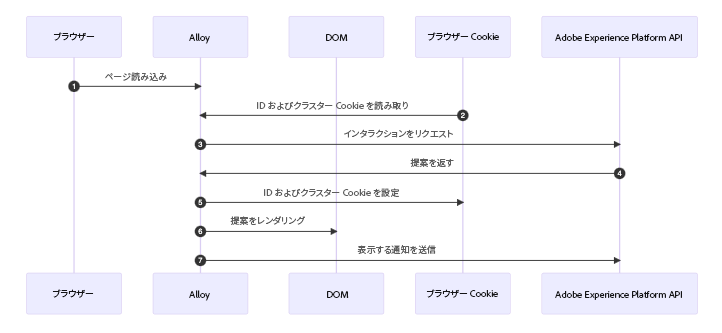
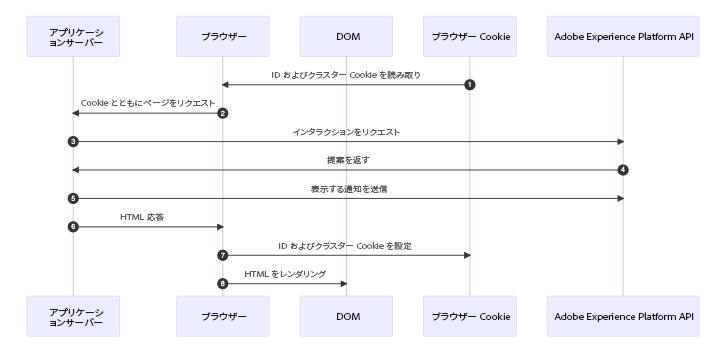

# コードベースの実装方法のサンプル {#implementation-samples}

コードベースのエクスペリエンスは、あらゆるタイプの顧客実装をサポートします。このページでは、各実装方法のサンプルを確認できます。

* [クライアントサイド](#client-side-implementation)
* [サーバーサイド](#server-side-implementation)
* [ハイブリッド](#hybrid-implementation)

>[!IMPORTANT]
>
>[このリンク](https://github.com/adobe/alloy-samples/tree/main/ajo){target="_blank"}から、様々なパーソナライゼーションや実験のユースケースのサンプル実装を確認できます。必要な実装手順とエンドツーエンドのパーソナライゼーションフローの仕組みをより深く理解するために、これらを確認および実行してください。

## クライアントサイドの実装 {#client-side-implementation}

クライアントサイドの実装がある場合、AEP Web SDK または AEP Mobile SDK のいずれかの AEP クライアント SDK を使用できます。

* [以下](#client-side-how)の手順では、サンプル **Web SDK** 実装のコードベースのエクスペリエンスジャーニーとキャンペーンによってエッジに公開されたコンテンツを取得し、パーソナライズされたコンテンツを表示するプロセスについて説明します。

* **Mobile SDK** を使用してコードベースのチャネルを実装する手順について詳しくは、[このチュートリアル](https://developer.adobe.com/client-sdks/edge/adobe-journey-optimizer/code-based/tutorial/){target="_blank"}を参照してください。

  >[!NOTE]
  >
  >モバイルユースケースのサンプル実装は、[iOS アプリ](https://github.com/adobe/aepsdk-messaging-ios/tree/main/TestApps/MessagingDemoAppSwiftUI){target="_blank"}と [Android アプリ](https://github.com/adobe/aepsdk-messaging-android/tree/main/code/testapp){target="_blank"}で利用できます。

### 仕組み – Web SDK {#client-side-how}

1. [Web SDK](https://experienceleague.adobe.com/docs/experience-platform/edge/home.html?lang=ja){target="_blank"} がページに含まれています。

1. `sendEvent` コマンドを使用して[サーフェス URI](code-based-configuration.md#surface-definition)<!--( or location/path)--> を指定し、パーソナライゼーションコンテンツを取得する必要があります。

   ```javascript
   alloy("sendEvent", {
   renderDecisions: true,
   personalization: {
       surfaces: ["#sample-json-content"],
   },
   }).then(applyPersonalization("#sample-json-content"));
   ```

1. コードベースのエクスペリエンス項目は、実装コード（[`applyPersonalization`](https://github.com/adobe/alloy-samples/blob/ac83b6927d007dc456caad2c6ce0b324c99c26c9/ajo/personalization-client-side/public/script.js){target="_blank"} メソッドを使用）により手動で適用され、決定に基づいて DOM を更新する必要があります。

1. コードベースのエクスペリエンスジャーニーとキャンペーンの場合、コンテンツがいつ表示されたかを示すために、表示イベントを手動で送信する必要があります。これは、`sendEvent` コマンドを使用して行われます。

   ```javascript
   function sendDisplayEvent(decision) {
     const { id, scope, scopeDetails = {} } = decision;
   
     alloy("sendEvent", {
   
       xdm: {
         eventType: "decisioning.propositionDisplay",
         _experience: {
           decisioning: {
             propositions: [
               {
                 id: id,
                 scope: scope,
                 scopeDetails: scopeDetails,
               },
             ],
           },
         },
       },
     });
   }
   ```

1. コードベースのエクスペリエンスジャーニーとキャンペーンの場合、ユーザーがいつコンテンツを操作したかを示すために、インタラクションイベントを手動で送信する必要があります。これは、`sendEvent` コマンドを使用して行われます。

   ```javascript
   function sendInteractEvent(label, proposition) {
     const { id, scope, scopeDetails = {} } = proposition;
   
     alloy("sendEvent", {
   
       xdm: {
         eventType: "decisioning.propositionInteract",
         _experience: {
           decisioning: {
             propositions: [
               {
                 id: id,
                 scope: scope,
                 scopeDetails: scopeDetails,
               },
             ],
             propositionEventType: {
               interact: 1
             },
             propositionAction: {
               label: label
             },
           },
         },
       },
     });
   }
   ```

### 主な所見

**Cookie**

Cookie は、ユーザー ID とクラスター情報を保持するために使用されます。クライアントサイドの実装を使用する場合、Web SDK は、リクエストのライフサイクル中にこれらの Cookie の保存と送信を自動処理します。

| Cookie | 目的 | 保存者 | 送信者 |
| ------------------------ | -------------------------------------------------------------------------- | --------- | ------- |
| kndctr_AdobeOrg_identity | ユーザー ID の詳細を含む | Web SDK | Web SDK |
| kndctr_AdobeOrg_cluster | リクエストを満たすために使用すべきエクスペリエンスエッジクラスターを示します。 | Web SDK | Web SDK |

**リクエストの配置**

提案を取得し、表示通知を送信するには、Adobe Experience Platform API へのリクエストが必要です。クライアントサイドの実装を使用する場合、Web SDK は `sendEvent` コマンドの使用時にこれらのリクエストを作成します。

| リクエスト | 作成者 |
| ---------------------------------------------- | ----------------------------------- |
| 提案を取得するためのインタラクションリクエスト | sendEvent コマンドを使用する Web SDK |
| 表示通知を送信するためのインタラクションリクエスト | sendEvent コマンドを使用する Web SDK |

**フロー図**



## サーバーサイド実装 {#server-side-implementation}

サーバーサイド実装がある場合は、いずれかの AEP Edge Network API を使用できます。

次の手順では、web ページのサンプルの Edge Network API 実装で、コードベースのエクスペリエンスジャーニーとキャンペーンによってエッジに公開されたコンテンツを取得し、パーソナライズされたコンテンツを表示するプロセスについて説明します。

### 仕組み

1. Web ページがリクエストされ、ブラウザーによって以前に保存された `kndctr_` プレフィックス付きの Cookie が含まれます。
1. アプリサーバーからページがリクエストされると、[インタラクティブデータ収集エンドポイント](https://experienceleague.adobe.com/docs/experience-platform/edge-network-server-api/data-collection/interactive-data-collection.html?lang=ja)にイベントが送信され、パーソナライゼーションコンテンツが取得されます。このサンプルアプリでは、ヘルパーメソッドをいくつか使用して、API へのリクエストの作成と送信を簡素化します（[aepEdgeClient.js](https://github.com/adobe/alloy-samples/blob/ac83b6927d007dc456caad2c6ce0b324c99c26c9/common/aepEdgeClient.js){target="_blank"} を参照）。ただし、このリクエストはイベントとクエリを含むペイロード付きの単なる `POST` です。前の手順の Cookie（使用可能な場合）は、`meta>state>entries` 配列内のリクエストに含まれます。

   ```javascript
   fetch(
     "https://edge.adobedc.net/ee/v2/interact?dataStreamId=abc&requestId=123",
     {
       headers: {
         accept: "*/*",
         "accept-language": "en-US,en;q=0.9",
         "cache-control": "no-cache",
         "content-type": "text/plain; charset=UTF-8",
         pragma: "no-cache",
         "sec-fetch-dest": "empty",
         "sec-fetch-mode": "cors",
         "sec-fetch-site": "cross-site",
         "sec-gpc": "1",
         "Referrer-Policy": "strict-origin-when-cross-origin",
         Referer: "https://localhost/",
       },
       body: JSON.stringify({
         event: {
           xdm: {
             eventType: "decisioning.propositionFetch",
             web: {
               webPageDetails: {
                 URL: "https://localhost/",
               },
               webReferrer: {
                 URL: "",
               },
             },
             identityMap: {
               FPID: [
                 {
                   id: "xyz",
                   authenticatedState: "ambiguous",
                   primary: true,
                 },
               ],
             },
             timestamp: "2022-06-23T22:21:00.878Z",
           },
           data: {},
         },
         query: {
           identity: {
             fetch: ["ECID"],
           },
           personalization: {
             schemas: [
               "https://ns.adobe.com/personalization/default-content-item",
               "https://ns.adobe.com/personalization/html-content-item",
               "https://ns.adobe.com/personalization/json-content-item",
               "https://ns.adobe.com/personalization/redirect-item",
               "https://ns.adobe.com/personalization/dom-action",
             ],
             surfaces: ["web://localhost/","web://localhost/#sample-json-content"],
           },
         },
         meta: {
           state: {
             domain: "localhost",
             cookiesEnabled: true,
             entries: [
               {
                 key: "kndctr_XXX_AdobeOrg_identity",
                 value: "abc123",
               },
               {
                 key: "kndctr_XXX_AdobeOrg_cluster",
                 value: "or2",
               },
             ],
           },
         },
       }),
       method: "POST",
     }
   ).then((res) => res.json());
   ```

1. コードベースのエクスペリエンスジャーニーとキャンペーンの JSON エクスペリエンスは、応答から読み取られ、HTML 応答の生成時に使用されます。

1. コードベースのエクスペリエンスジャーニーとキャンペーンの場合、ジャーニーまたはキャンペーンのコンテンツがいつ表示されたかを示すために、実装内で表示イベントを手動で送信する必要があります。この例では、通知はリクエストのライフサイクル中にサーバーサイドで送信されます。

   ```javascript
   function sendDisplayEvent(aepEdgeClient, req, propositions, cookieEntries) {
     const address = getAddress(req);
   
     aepEdgeClient.interact(
       {
         event: {
           xdm: {
             web: {
               webPageDetails: { URL: address },
               webReferrer: { URL: "" },
             },
             timestamp: new Date().toISOString(),
             eventType: "decisioning.propositionDisplay",
             _experience: {
               decisioning: {
                 propositions: propositions.map((proposition) => {
                   const { id, scope, scopeDetails } = proposition;
   
                   return {
                     id,
                     scope,
                     scopeDetails,
                   };
                 }),
               },
             },
           },
         },
         query: { identity: { fetch: ["ECID"] } },
         meta: {
           state: {
             domain: "",
             cookiesEnabled: true,
             entries: [...cookieEntries],
           },
         },
       },
       {
         Referer: address,
       }
     );
   }
   ```

1. HTML 応答が返されると、ID とクラスターの Cookie がアプリケーションサーバーによって応答に設定されます。

### 主な所見

**Cookie**

Cookie は、ユーザー ID とクラスター情報を保持するために使用されます。サーバーサイド実装を使用する場合、アプリケーションサーバーは、リクエストのライフサイクル中にこれらの Cookie の保存と送信を処理する必要があります。

| Cookie | 目的 | 保存者 | 送信者 |
| ------------------------ | -------------------------------------------------------------------------- | ------------------ | ------------------ |
| kndctr_AdobeOrg_identity | ユーザー ID の詳細を含む | アプリケーションサーバー | アプリケーションサーバー |
| kndctr_AdobeOrg_cluster | リクエストを満たすために使用すべきエクスペリエンスエッジクラスターを示します。 | アプリケーションサーバー | アプリケーションサーバー |

**リクエストの配置**

提案を取得し、表示通知を送信するには、Adobe Experience Platform API へのリクエストが必要です。クライアントサイドの実装を使用する場合、Web SDK は `sendEvent` コマンドの使用時にこれらのリクエストを作成します。

| リクエスト | 作成者 |
| ---------------------------------------------- | ------------------------------------------------------------ |
| 提案を取得するためのインタラクションリクエスト | Adobe Experience Platform API を呼び出すアプリケーションサーバー |
| 表示通知を送信するためのインタラクションリクエスト | Adobe Experience Platform API を呼び出すアプリケーションサーバー |

**フロー図**



## ハイブリッド実装 {#hybrid-implementation}

ハイブリッド実装を使用している場合は、以下のリンクを確認してください。

* アドビのテクニカルブログ：[Adobe Experience Platform Web SDK のハイブリッドパーソナライゼーション](https://blog.developer.adobe.com/hybrid-personalization-in-the-adobe-experience-platform-web-sdk-6a1bb674bf41){target="_blank"}
* SDKドキュメント：[Web SDK と Edge Network Server API を使用したハイブリッドパーソナライゼーション](https://experienceleague.adobe.com/docs/experience-platform/edge/personalization/hybrid-personalization.html?lang=ja){target="_blank"}
