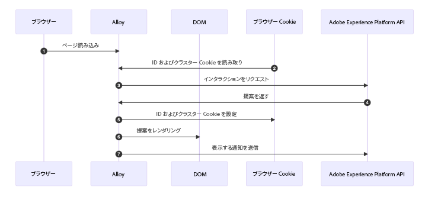
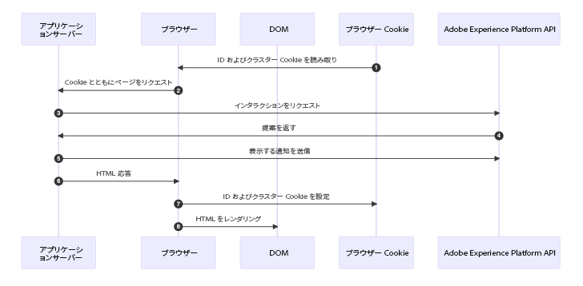

# コードベースの実装方法のサンプル {#implementation-samples}

コードベースのエクスペリエンスは、あらゆるタイプの顧客実装に対応します。 このページでは、各実装方法のサンプルを見つけることができます。

* [クライアントサイド](#client-side-implementation)
* [サーバーサイド](#server-side-implementation)
* [ハイブリッド](#hybrid-implementation)

>[!IMPORTANT]
>
>[このリンク &#x200B;](https://github.com/adobe/alloy-samples/tree/main/ajo){target="_blank"}に従って、様々なパーソナライゼーションと実験のユースケースのサンプル実装を確認してください。 必要な実装ステップと、エンドツーエンドのパーソナライゼーションフローの仕組みをより深く理解するために、これらのステップを確認して実行します。

➡️ コードベースのエクスペリエンスと決定のためのWeb SDKの設定について詳しくは、[これらのチュートリアル &#x200B;](code-based-decisioning-implementations.md#tutorials)を参照してください

## クライアントサイド実装 {#client-side-implementation}

クライアントサイド実装がある場合は、AEP クライアント SDKの1つであるAEP Web SDKまたはAEP Mobile SDKを使用できます。

* 以下の手順[は、サンプル **Web SDK**&#x200B;の実装で、エッジで公開されたコンテンツをコードベースのエクスペリエンスジャーニーおよびキャンペーンによって取得し、パーソナライズされたコンテンツを表示するプロセスを示しています。](#client-side-how)

* **モバイル SDK**&#x200B;を使用してコードベースのチャネルを実装する手順については、[このチュートリアル &#x200B;](https://developer.adobe.com/client-sdks/edge/adobe-journey-optimizer/code-based/tutorial){target="_blank"}で説明します。

  >[!NOTE]
  >
  >モバイルのユースケース向けの実装の例は、[iOS アプリ &#x200B;](https://github.com/adobe/aepsdk-messaging-ios/tree/main/TestApps/MessagingDemoAppSwiftUI){target="_blank"}および[Android アプリ &#x200B;](https://github.com/adobe/aepsdk-messaging-android/tree/main/code/testapp){target="_blank"}で利用できます。

### 仕組み – Web SDK {#client-side-how}

1. [Web SDK](https://experienceleague.adobe.com/docs/experience-platform/edge/home.html){target="_blank"}がこのページに含まれています。

1. パーソナライゼーションコンテンツを取得するには、`sendEvent` コマンドを使用し、[&#x200B; サーフェス URI](code-based-surface.md)<!--( or location/path)-->を指定する必要があります。

   ```javascript
   alloy("sendEvent", {
   renderDecisions: true,
   personalization: {
       surfaces: ["#sample-json-content"],
   },
   }).then(applyPersonalization("#sample-json-content"));
   ```

1. コードベースのエクスペリエンス項目は、決定に基づいてDOMを更新するために、（[`applyPersonalization`](https://github.com/adobe/alloy-samples/blob/ac83b6927d007dc456caad2c6ce0b324c99c26c9/ajo/personalization-client-side/public/script.js){target="_blank"} メソッドを使用して）実装コードによって手動で適用する必要があります。

1. コードベースのエクスペリエンスジャーニーおよびキャンペーンの場合、コンテンツがいつ表示されたかを示すために、表示イベントを手動で送信する必要があります。 これは、`sendEvent` コマンドを使用して実行します。

   ```javascript
   function sendDisplayEvent(decision) {
     const { id, scope, scopeDetails = {} } = decision;
   
     alloy("sendEvent", {
   
       xdm: {
         eventType: "decisioning.propositionDisplay",
         _experience: {
           decisioning: {
             propositions: [
               {
                 id: id,
                 scope: scope,
                 scopeDetails: scopeDetails,
               },
             ],
           },
         },
       },
     });
   }
   ```

1. コードベースのエクスペリエンスジャーニーおよびキャンペーンの場合、ユーザーがいつコンテンツを操作したかを示すために、インタラクションイベントを手動で送信する必要があります。 これは、`sendEvent` コマンドを使用して実行します。

   ```javascript
   function sendInteractEvent(label, proposition) {
     const { id, scope, scopeDetails = {} } = proposition;
   
     alloy("sendEvent", {
   
       xdm: {
         eventType: "decisioning.propositionInteract",
         _experience: {
           decisioning: {
             propositions: [
               {
                 id: id,
                 scope: scope,
                 scopeDetails: scopeDetails,
               },
             ],
             propositionEventType: {
               interact: 1
             },
             propositionAction: {
               id: label,
               label: label,
               tokens: proposition.items?.[0]?.characteristics?.tokens || []
             },
           },
         },
       },
     });
   }
   ```

   >[!IMPORTANT]
   >
   >`propositionAction`の`tokens` フィールドは、Adobe Journey Optimizer Decisioningでの正確なトラッキングとアトリビューションに非常に重要です。 これらのトークンを使用すると、次のことが可能になります。
   >* 意思決定アクティビティに対する適切なクリックアトリビューション
   >* 意思決定コンテンツによる顧客インタラクションの正確なレポート
   >* ユーザーエンゲージメントに基づくオファーパフォーマンスの最適化
   >
   >トークンは通常`proposition.items[0].characteristics.tokens`に見つかります。決定コンテンツでユーザーのインタラクションを追跡する場合は、常に含める必要があります。

### 重要な観察

**Cookie**

Cookieは、ユーザーIDとクラスター情報を保持するために使用されます。 クライアントサイド実装を使用する場合、Web SDKは、リクエストライフサイクル中にこれらのCookieの保存と送信を自動的に処理します。

| Cookie | 目的 | 保存者 | 送信者 |
| ------------------------ | -------------------------------------------------------------------------- | --------- | ------- |
| kndctr_AdobeOrg_identity | ユーザーIDの詳細が含まれます | Web SDK | Web SDK |
| kndctr_AdobeOrg_cluster | リクエストを処理するために使用するエクスペリエンス エッジ クラスターを示します | Web SDK | Web SDK |

**プレースメントをリクエスト**

Adobe Experience Platform APIへのリクエストは、提案を取得し、表示通知を送信するために必要です。 クライアントサイド実装を使用する場合、`sendEvent` コマンドを使用すると、Web SDKはこれらのリクエストを行います。

| リクエスト | 作成者 |
| ---------------------------------------------- | ----------------------------------- |
| 提案を取得するためのインタラクションリクエスト | sendEvent コマンドを使用したWeb SDK |
| 表示通知を送信するためのインタラクションリクエスト | sendEvent コマンドを使用したWeb SDK |

**フロー図**



## サーバーサイド実装 {#server-side-implementation}

サーバーサイド実装がある場合は、AEP Edge Network APIのいずれかを使用できます。

次の手順では、web ページのサンプル Edge Network API実装でコードベースのエクスペリエンスジャーニーとキャンペーンによってエッジに公開されたコンテンツを取得し、パーソナライズされたコンテンツを表示するプロセスについて説明します。

### 仕組み

1. Web ページが要求され、`kndctr_`が先頭に付けられたブラウザーによって以前に保存されたCookieが含まれます。
1. ページがアプリサーバーから要求されると、パーソナライゼーションコンテンツを取得するためのイベントが[&#x200B; インタラクティブデータ収集エンドポイント &#x200B;](https://experienceleague.adobe.com/docs/experience-platform/edge-network-server-api/data-collection/interactive-data-collection.html)に送信されます。 このサンプルアプリでは、いくつかのヘルパーメソッドを使用して、APIへのリクエストの作成と送信を簡素化します（[aepEdgeClient.js](https://github.com/adobe/alloy-samples/blob/ac83b6927d007dc456caad2c6ce0b324c99c26c9/common/aepEdgeClient.js){target="_blank"}を参照）。 しかし、リクエストは単なる`POST`で、イベントとクエリを含むペイロードがあります。 前の手順のCookie （使用可能な場合）は、`meta>state>entries`配列のリクエストに含まれます。

   ```javascript
   fetch(
     "https://edge.adobedc.net/ee/v2/interact?dataStreamId=abc&requestId=123",
     {
       headers: {
         accept: "*/*",
         "accept-language": "en-US,en;q=0.9",
         "cache-control": "no-cache",
         "content-type": "text/plain; charset=UTF-8",
         pragma: "no-cache",
         "sec-fetch-dest": "empty",
         "sec-fetch-mode": "cors",
         "sec-fetch-site": "cross-site",
         "sec-gpc": "1",
         "Referrer-Policy": "strict-origin-when-cross-origin",
         Referer: "https://localhost/",
       },
       body: JSON.stringify({
         event: {
           xdm: {
             eventType: "decisioning.propositionFetch",
             web: {
               webPageDetails: {
                 URL: "https://localhost/",
               },
               webReferrer: {
                 URL: "",
               },
             },
             identityMap: {
               FPID: [
                 {
                   id: "xyz",
                   authenticatedState: "ambiguous",
                   primary: true,
                 },
               ],
             },
             timestamp: "2022-06-23T22:21:00.878Z",
           },
           data: {},
         },
         query: {
           identity: {
             fetch: ["ECID"],
           },
           personalization: {
             schemas: [
               "https://ns.adobe.com/personalization/default-content-item",
               "https://ns.adobe.com/personalization/html-content-item",
               "https://ns.adobe.com/personalization/json-content-item",
               "https://ns.adobe.com/personalization/redirect-item",
               "https://ns.adobe.com/personalization/dom-action",
             ],
             surfaces: ["web://localhost/","web://localhost/#sample-json-content"],
           },
         },
         meta: {
           state: {
             domain: "localhost",
             cookiesEnabled: true,
             entries: [
               {
                 key: "kndctr_XXX_AdobeOrg_identity",
                 value: "abc123",
               },
               {
                 key: "kndctr_XXX_AdobeOrg_cluster",
                 value: "or2",
               },
             ],
           },
         },
       }),
       method: "POST",
     }
   ).then((res) => res.json());
   ```

1. コードベースのエクスペリエンスジャーニーおよびキャンペーンからのJSON エクスペリエンスは、レスポンスから読み取られ、HTML レスポンスの生成時に使用されます。

1. コードベースのエクスペリエンスジャーニーおよびキャンペーンの場合、ジャーニーまたはキャンペーンコンテンツがいつ表示されたかを示すために、実装で表示イベントを手動で送信する必要があります。 この例では、通知はリクエストライフサイクル中にサーバーサイドで送信されます。

   ```javascript
   function sendDisplayEvent(aepEdgeClient, req, propositions, cookieEntries) {
     const address = getAddress(req);
   
     aepEdgeClient.interact(
       {
         event: {
           xdm: {
             web: {
               webPageDetails: { URL: address },
               webReferrer: { URL: "" },
             },
             timestamp: new Date().toISOString(),
             eventType: "decisioning.propositionDisplay",
             _experience: {
               decisioning: {
                 propositions: propositions.map((proposition) => {
                   const { id, scope, scopeDetails } = proposition;
   
                   return {
                     id,
                     scope,
                     scopeDetails,
                   };
                 }),
               },
             },
           },
         },
         query: { identity: { fetch: ["ECID"] } },
         meta: {
           state: {
             domain: "",
             cookiesEnabled: true,
             entries: [...cookieEntries],
           },
         },
       },
       {
         Referer: address,
       }
     );
   }
   ```

1. HTML応答が返されると、IDおよびクラスタークッキーは、アプリケーションサーバーによって応答に設定されます。

### 重要な観察

**Cookie**

Cookieは、ユーザーIDとクラスター情報を保持するために使用されます。 サーバーサイド実装を使用する場合、アプリケーションサーバーは、リクエストライフサイクル中にこれらのCookieの保存と送信を処理する必要があります。

| Cookie | 目的 | 保存者 | 送信者 |
| ------------------------ | -------------------------------------------------------------------------- | ------------------ | ------------------ |
| kndctr_AdobeOrg_identity | ユーザーIDの詳細が含まれます | アプリケーションサーバー | アプリケーションサーバー |
| kndctr_AdobeOrg_cluster | リクエストを処理するために使用するエクスペリエンス エッジ クラスターを示します | アプリケーションサーバー | アプリケーションサーバー |

**プレースメントをリクエスト**

Adobe Experience Platform APIへのリクエストは、提案を取得し、表示通知を送信するために必要です。 クライアントサイド実装を使用する場合、`sendEvent` コマンドを使用すると、Web SDKはこれらのリクエストを行います。

| リクエスト | 作成者 |
| ---------------------------------------------- | ------------------------------------------------------------ |
| 提案を取得するためのインタラクションリクエスト | Adobe Experience Platform APIを呼び出すアプリケーションサーバー |
| 表示通知を送信するためのインタラクションリクエスト | Adobe Experience Platform APIを呼び出すアプリケーションサーバー |

**フロー図**



## ハイブリッド実装 {#hybrid-implementation}

ハイブリッド実装を使用している場合は、以下のリンクを参照してください。

* Adobe Tech ブログ：[Adobe Experience Platform Web SDKのハイブリッド Personalization](https://blog.developer.adobe.com/hybrid-personalization-in-the-adobe-experience-platform-web-sdk-6a1bb674bf41){target="_blank"}
* SDK ドキュメント：[Web SDKとEdge Network Server APIを使用したハイブリッドパーソナライゼーション &#x200B;](https://experienceleague.adobe.com/docs/experience-platform/edge/personalization/hybrid-personalization.html){target="_blank"}

## Adobe Experience Platform assuranceによるエッジネットワーク API呼び出しのデバッグ {#debugging-edge-api-assurance}

コードベースのエクスペリエンスにEdge Network APIを直接使用する場合（Web SDKまたはモバイルSDKを使用しない場合）、Adobe Experience Platform AssuranceでAPI呼び出しをデバッグするには、Assurance セッション IDを検証トークンヘッダーとして含めます。

1. アクティブなAdobe Experience Platform Assurance セッションからAssurance セッション IDを取得するか、Assurance APIを使用して作成します。

1. Assurance セッション IDに`x-adobe-aep-validation-token` ヘッダーを追加して、Edge Network API リクエストをAssurance セッション経由でルーティングします。

   **例：**

   ```bash
   curl -v 'https://edge.adobedc.net/ee/v1/interact?configId={DATASTREAM_ID}&requestId={REQUEST_ID}' \
   --header 'Content-Type: application/json' \
   --header 'x-adobe-aep-validation-token: {ASSURANCE_SESSION_ID}' \
   --data-raw '{
       "xdm": {
         "identityMap": {
               "ECID": [
                   {
                       "id": "{ECID_VALUE}"
                   }
               ]
           }
       },
       "events": [
           {
               "xdm": {
                   "eventType": "test",
                   "timestamp": "{TIMESTAMP}"
               }
           }
       ]
   }'
   ```

1. 設定が完了したら、Assurance セッションを開き、**[!UICONTROL Edge Delivery]** ビューを選択して、リクエストペイロード、レスポンス内容、パーソナライズ提案、エラーメッセージなど、Edge Network API リクエストとレスポンスをリアルタイムで表示します。


<!--
## Implementation guides and tutorials {#implementation-guides}

To help you get started with implementing code-based experiences, refer to the comprehensive step-by-step tutorials below:

* **Mobile SDK implementation**: Follow [this tutorial](https://developer.adobe.com/client-sdks/edge/adobe-journey-optimizer/code-based/tutorial){target="_blank"} to learn how to set up code-based experiences on mobile apps using the Adobe Experience Platform Mobile SDK.

* **Web SDK implementation**: Learn how to configure the Web SDK for decisioning and code-based experiences in [these tutorials](code-based-decisioning-implementations.md#tutorials).

* **Decisioning implementation**: To learn how to implement decisioning capabilities on a code-based campaign, follow [this use case tutorial](https://experienceleague.adobe.com/en/docs/journey-optimizer/using/decisioning/experience-decisioning/experience-decisioning-uc){target="_blank"}.
-->
