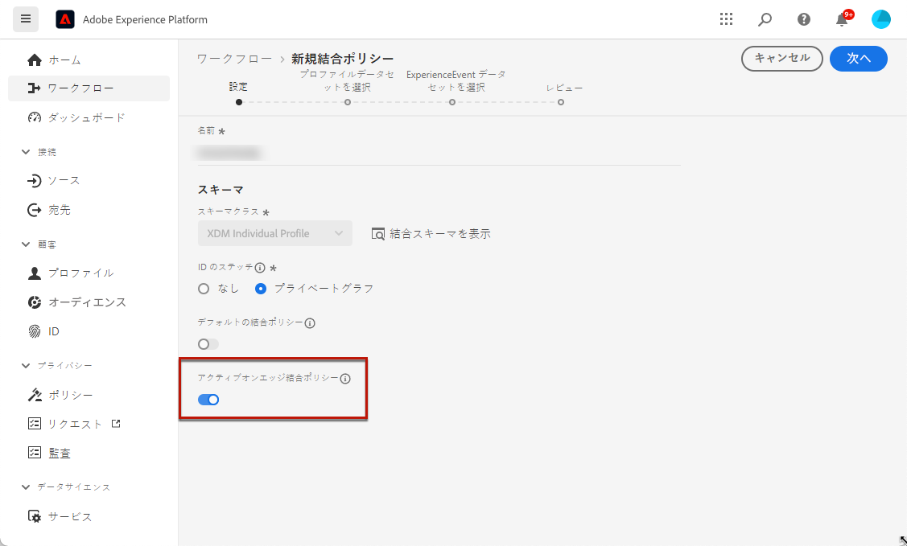

# ガードレールと前提条件 {#web-prerequisites}

[!DNL Journey Optimizer] でコードベースのエクスペリエンスアクションを使用して、アプリケーションで使用できるコードコンテンツペイロードを配信するには、次の前提条件に従います。

* アプリケーションに変更を追加するには、特定の実装が必要です。[詳細情報](#implementation-prerequisites)

* コードベースエクスペリエンスが正しく配信されるように、[こちら](#delivery-prerequisites)を参照して、Adobe Experience Platform の設定を定義します。

## 実装の前提条件 {#implementation-prerequisites}

コードベースのエクスペリエンスは、以下のオプションに示すように、あらゆるタイプの顧客実装をサポートします。プロパティには、クライアントサイド、サーバーサイドまたはハイブリッド実装のいずれかの方法を使用できます。

* クライアントサイドのみ - web ページやモバイルアプリに変更を追加するには、[Adobe Experience Platform Web SDK](https://experienceleague.adobe.com/docs/platform-learn/implement-web-sdk/overview.html?lang=ja){target="_blank"} を web サイトに実装するか、[Adobe Experience Platform Mobile SDK](https://developer.adobe.com/client-sdks/documentation/){target="_blank"} をモバイルアプリに実装する必要があります。

* ハイブリッドモード - [AEP Edge Network Server API](https://experienceleague.adobe.com/docs/experience-platform/edge-network-server-api/data-collection/interactive-data-collection.html?lang=ja){target="_blank"} を使用して、サーバーサイドでパーソナライゼーションをリクエストできます。応答は Adobe Experience Platform Web SDK に提供され、クライアントサイドで変更がレンダリングされます。詳しくは、Adobe Experience Platform [Edge Network Server API ドキュメント](https://experienceleague.adobe.com/docs/experience-platform/edge-network-server-api/overview.html?lang=ja){target="_blank"}を参照してください。ハイブリッドモードの詳細と実装サンプルについて詳しくは、[このブログ投稿](https://blog.developer.adobe.com/hybrid-personalization-in-the-adobe-experience-platform-web-sdk-6a1bb674bf41){target="_blank"}を参照してください。

* サーバーサイド - [AEP Edge Network Server API](https://experienceleague.adobe.com/docs/experience-platform/edge-network-server-api/data-collection/interactive-data-collection.html?lang=ja) {target="_blank"} を使用して、サーバーサイドでパーソナライゼーションをリクエストできます。開発チームは、応答を処理し、アプリ実装でクライアントサイドで変更をレンダリングする必要があります。

上記の各実装方法の例について詳しくは、[この節](code-based-implementation-samples.md)を参照してください。

## 配信の前提条件 {#delivery-prerequisites}

コードベースエクスペリエンスが正しく配信されるようにするには、次の設定を定義する必要があります。

* [Adobe Experience Platform データ収集](https://experienceleague.adobe.com/docs/experience-platform/edge/datastreams/overview.html?lang=ja){target="_blank"}で、**[!UICONTROL Adobe Experience Platform]** サービスの下で「**[!UICONTROL Adobe Journey Optimizer]**」オプションを有効にするなど、データストリームが定義されていることを確認します。

  これにより、Journey Optimizer インバウンドイベントが Adobe Experience Platform Edge で正しく処理されます。[詳細情報](https://experienceleague.adobe.com/docs/experience-platform/edge/datastreams/configure.html?lang=ja){target="_blank"}

  

* [Adobe Experience Platform](https://experienceleague.adobe.com/docs/experience-platform/profile/home.html?lang=ja){target="_blank"}で、「**[!UICONTROL Active-On-Edge 結合ポリシー]**」オプションが有効になっている結合ポリシーが 1 つあることを確認します。これを行うには、**[!UICONTROL 顧客r]**／**[!UICONTROL プロファイル]**／**[!UICONTROL 結合ポリシー]** Experience Platform メニューでポリシーを選択します。[詳細情報](https://experienceleague.adobe.com/docs/experience-platform/profile/merge-policies/ui-guide.html?lang=ja#configure){target="_blank"}

  この結合ポリシーは、[!DNL Journey Optimizer] インバウンドチャネルで使用すると、エッジでインバウンドキャンペーンを正しくアクティブ化して公開できます。[詳細情報](https://experienceleague.adobe.com/docs/experience-platform/profile/merge-policies/ui-guide.html?lang=ja){target="_blank"}

  

* Journey Optimizer web エクスペリエンスの配信に関するトラブルシューティングを行うには、**Adobe Experience Platform Assurance** 内の **Edge Delivery** ビューを使用できます。このプラグインを使用すると、リクエスト呼び出しを詳細に検査し、期待されるエッジ呼び出しが予想どおりに発生するかどうかを確認し、ID マップ、セグメントメンバーシップ、同意設定などのプロファイルデータを調べることができます。また、リクエストが認定されたアクティビティを確認し、認定されなかったアクティビティを特定することもできます。

  **Edge Delivery** プラグインを使用すると、インバウンド実装を効果的に理解してトラブルシューティングを行うために必要なインサイトを得ることができます。

  [詳しくは、Edge Delivery ビューを参照してください](https://experienceleague.adobe.com/ja/docs/experience-platform/assurance/view/edge-delivery)

## レポーティングの前提条件 {#experiment-prerequisites}

コードベースチャネルのレポーティングを有効にするには、アプリ実装[データストリーム](https://experienceleague.adobe.com/docs/experience-platform/datastreams/overview.html?lang=ja){target="_blank"}で使用する[データセット](../data/get-started-datasets.md)もレポーティング設定に含まれていることを確認する必要があります。

つまり、レポーティングを設定する際に、アプリデータストリームに存在しないデータセットを追加すると、アプリデータはレポートに表示されません。

レポーティング用にデータセットを追加する方法について詳しくは、[この節](../reports/reporting-configuration.md#add-datasets)を参照してください。

>[!NOTE]
>
>データセットは、[!DNL Journey Optimizer] レポートシステムによって読み取り専用で使用され、データ収集やデータの取り込みには影響しません。
