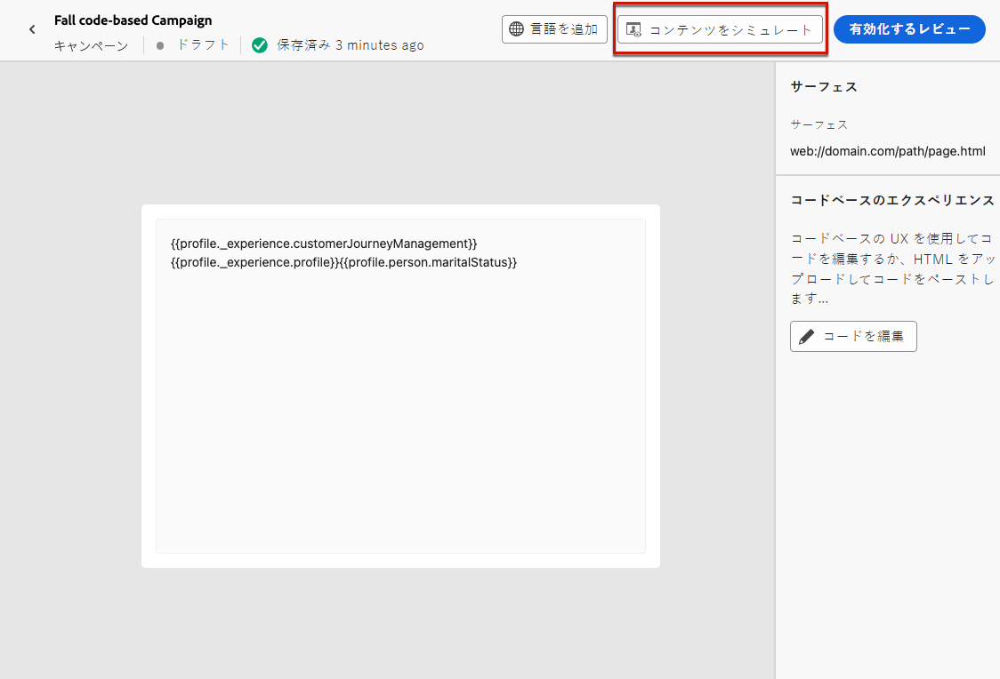
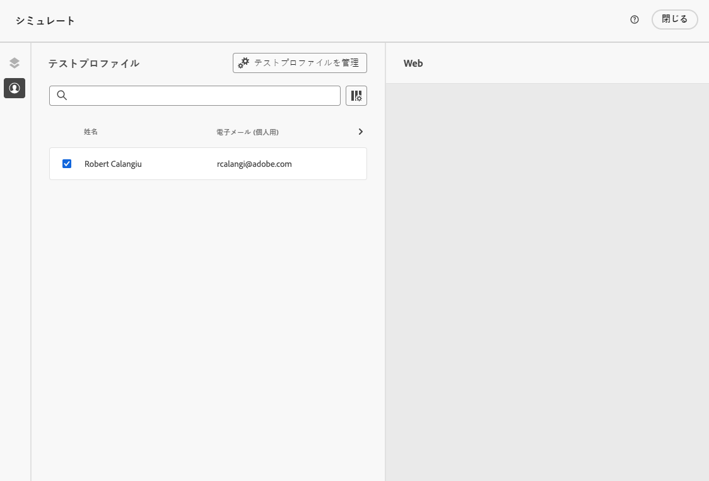
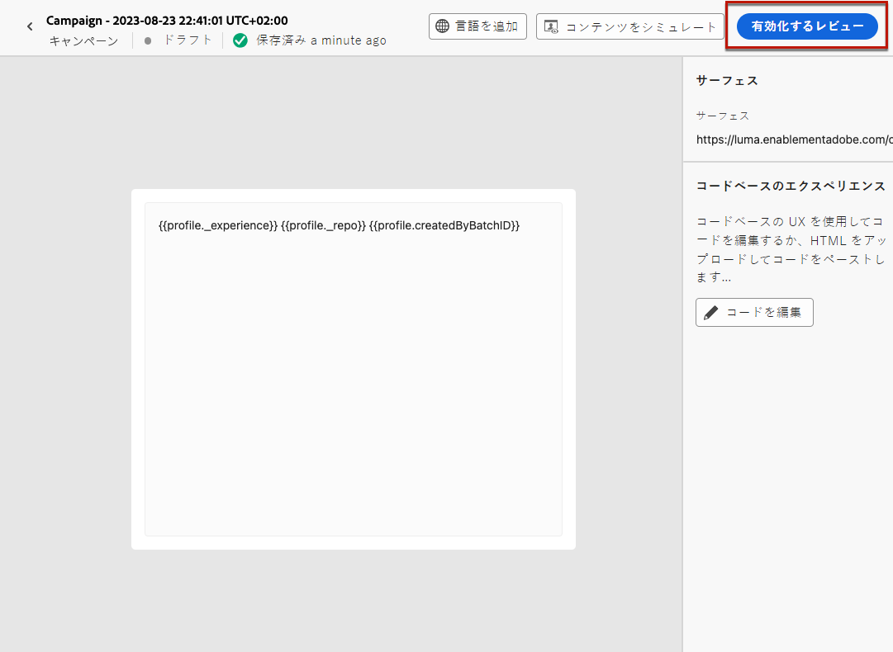
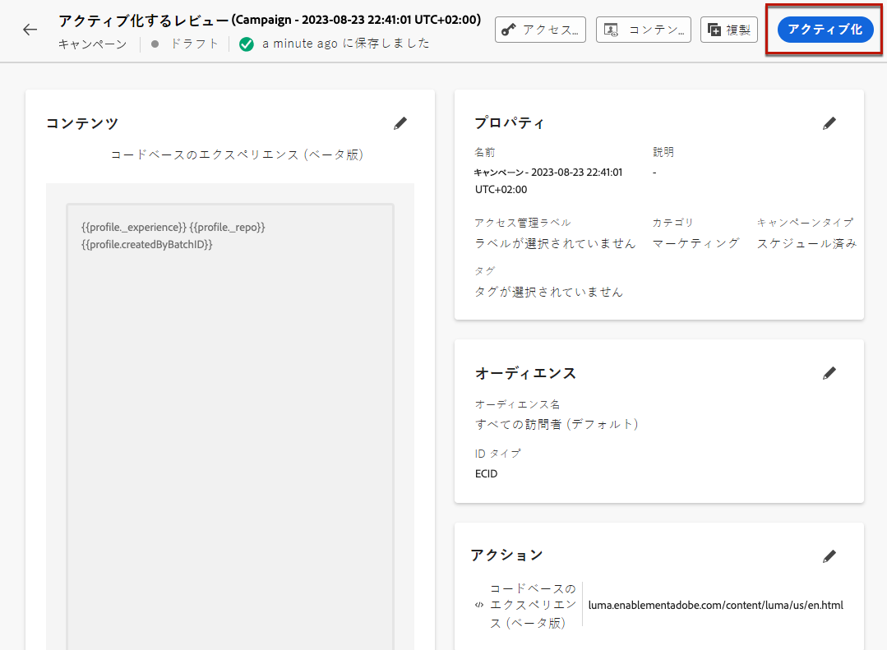
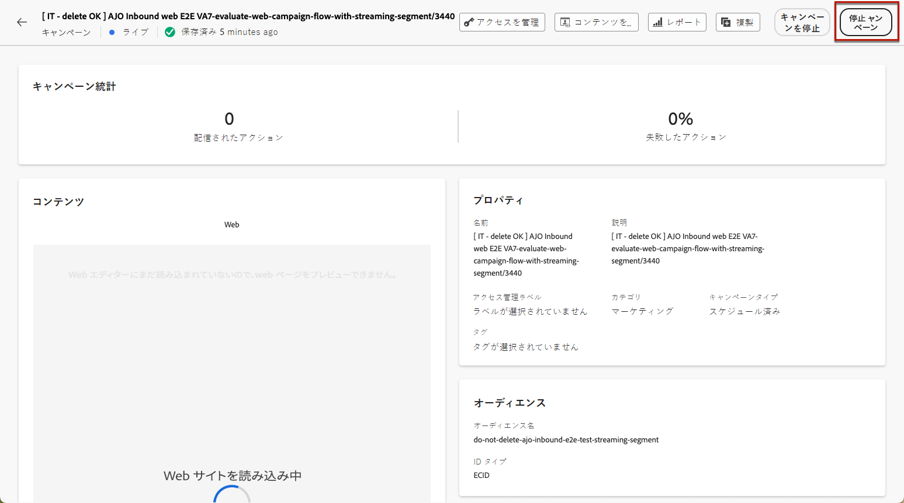
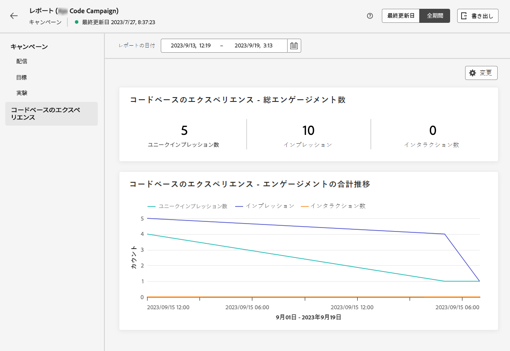

# コードベースエクスペリエンスを作成 {#create-code-based}

現在、[!DNL Journey Optimizer] では、**キャンペーン**&#x200B;にコードベースのエクスペリエンスのみを作成できます。

コードベースのエクスペリエンスに関する特定のガードレールおよびレコメンデーションについて詳しくは、[このページ](code-based-prerequisites.md)を参照してください。

## コードベースキャンペーンの作成 {#create-code-based-campaign}

キャンペーンを通じてコードベースエクスペリエンスの作成を開始するには、次の手順に従います。

1. キャンペーンの作成. [詳細情報](../campaigns/create-campaign.md)

1. **[!UICONTROL コードベースのエクスペリエンス]**&#x200B;アクションを選択します。

1. コードベースのエクスペリエンスサーフェスを入力します。[詳細情報](#surface-definition)

   

   >[!CAUTION]
   >
   >コードベースのキャンペーンで使用されるサーフェス URI が、独自の実装で使用される URI と一致していることを確認します。一致していない場合、変更は実行されません。

1. 「**[!UICONTROL 作成]**」を選択します。

1. キャンペーンのプロパティ、[オーディエンス](../audience/about-audiences.md)、[スケジュール](../campaigns/create-campaign.md#schedule)など、キャンペーンを作成する手順を完了します。キャンペーンの設定方法について詳しくは、[このページ](../campaigns/get-started-with-campaigns.md)を参照してください。

1. パーソナライゼーションエディターを使用して、必要に応じてコンテンツを編集します。[詳細情報](#edit-code)

   

## コードコンテンツの編集 {#edit-code}

>[!CONTEXTUALHELP]
>id="ajo_code_based_experience"
>title="パーソナライゼーションエディターの使用"
>abstract="このコードベースのエクスペリエンスアクションの一部として配信するコードを挿入および編集します。"
>additional-url="https://experienceleague.adobe.com/docs/journey-optimizer/using/content-management/personalization/expression-editor/personalization-build-expressions.html?lang=ja" text="パーソナライゼーションエディターの基本を学ぶ"

1. キャンペーンの編集画面で、「**[!UICONTROL コードを編集]**」を選択します。

   

1. [パーソナライゼーションエディター](../personalization/personalization-build-expressions.md)が開きます。これは、コードを作成できる非視覚的なエクスペリエンス作成インターフェイスです。

1. オーサリングモードを HTML から JSON に切り替えることも、その逆も可能です。

   

   >[!CAUTION]
   >
   >オーサリングモードを変更すると、現在のコードがすべて失われるので、作成を開始する前にモードを切り替えてください。

1. 必要に応じてコードを入力します。[!DNL Journey Optimizer] パーソナライゼーションエディターのすべてのパーソナライズ機能およびオーサリング機能を活用できます。[詳細情報](../personalization/personalization-build-expressions.md)

1. 必要に応じて、HTML または JSON 式フラグメントを追加できます。[方法についてはこちらを参照](../personalization/use-expression-fragments.md)

   また、コードコンテンツの一部をフラグメントとして保存することもできます。[方法についてはこちらを参照](../content-management/fragments.md#save-as-expression-fragment)

1. コードベースのキャンペーンでは、Offer Decisioning 機能を使用できます。左側のバーから&#x200B;**[!UICONTROL 決定]**&#x200B;アイコンを選択し、「**[!UICONTROL 決定を作成]**」をクリックします。[詳細情報](../experience-decisioning/create-decision.md)

   

   >[!NOTE]
   >
   >エクスペリエンス決定は、現在一連の組織でのみ利用可能です（限定提供）。アクセスするには、アドビ担当者にお問い合わせください。

1. 「**[!UICONTROL 保存して閉じる]**」をクリックして変更を確定します。

開発者が API または SDK 呼び出しを実行して、選択したサーフェスのコンテンツを取得すると、変更が web ページまたはアプリに適用されます。

## コードベースキャンペーンのテスト {#test-code-based-campaign}

>[!CONTEXTUALHELP]
>id="ajo_code_based_preview"
>title="コードベースエクスペリエンスのプレビュー"
>abstract="コードベースエクスペリエンスがどのように表示されるかをシミュレーションで確認します。"

変更したコードベースエクスペリエンスのプレビューを表示するには、次の手順に従います。テストプロファイルを選択してコンテンツをプレビューする方法について詳しくは、[コンテンツのプレビューとテスト](../content-management/preview-test.md)ページを参照してください。

>[!CAUTION]
>
>どのオファーが配信されるかをシミュレートするには、使用可能なテストプロファイルがある必要があります。詳細は、[テストプロファイルを作成](../audience/creating-test-profiles.md)する方法を参照してください。

1. パーソナライゼーションエディターまたはコンテンツ編集画面で、「**[!UICONTROL コンテンツをシミュレート]**」を選択します。

   

1. 「**[!UICONTROL テストプロファイルを管理]**」をクリックして、1 つ以上のテストプロファイルを選択します。

1. 変更したコードベースエクスペリエンスのプレビューが表示されます。

<!--
    

    You can also open it in the default browser, or copy the test URI to paste it in any browser. This allows you to share the link with your team and stakeholders who will be able to preview the new web experience in any browser before the campaign goes live.

    When copying the test URI, the content displayed is the one personalized for the test profile used when the content simulation was generated in [!DNL Journey Optimizer].-->

## コードベースキャンペーンのアクティブ化 {#activate-code-based-campaign}

コードベースのキャンペーンを定義し、必要に応じて[コードベースのエディター](#edit-code)を使用してコンテンツを編集したら、確認してアクティブ化することができます。次の手順に従います。

>[!NOTE]
>
>アクティブ化する前にキャンペーンのコンテンツをプレビューすることもできます。[詳細情報](#test-code-based-campaign)

1. コードベースキャンペーンから、「**[!UICONTROL アクティブ化するレビュー]**」を選択します。

   

1. コンテンツ、プロパティ、サーフェス、オーディエンス、スケジュールを必要に応じて確認および編集します。

1. 「**[!UICONTROL アクティブ化]**」を選択します。

   

   >[!NOTE]
   >
   >「**[!UICONTROL アクティブ化]**」をクリックした後、コードベースキャンペーンの変更が対象の場所でライブになるまでに最大 1 分かかる場合があります。

コードベースキャンペーンのステータスが「**[!UICONTROL ライブ]**」になり、選択したオーディエンスに対して表示されます。キャンペーンの各受信者に、変更内容が表示されます。

>[!NOTE]
>
>コードベースキャンペーンのスケジュールを定義した場合、開始日時に達するまで、**[!UICONTROL スケジュール済み]**&#x200B;ステータスになります。
>
>既に実行中の別のキャンペーンと同じページに影響を与えるコードベースのキャンペーンをアクティブ化すると、すべての変更が対象の場所で適用されます。

キャンペーンのアクティブ化について詳しくは、[この節](../campaigns/review-activate-campaign.md)を参照してください。

## コードベースキャンペーンの停止 {#stop-code-based-campaign}

コードベースキャンペーンがライブの場合、オーディエンスに変更が表示されないように停止することができます。次の手順に従います。

1. リストからライブキャンペーンを選択します。

1. 上部のメニューから、「**[!UICONTROL キャンペーンを停止]**」を選択します。

   

1. 追加した変更は、定義したオーディエンスには表示されなくなります。

>[!NOTE]
>
>コードベースキャンペーンが停止されると、再び編集またはアクティブ化することはできません。キャンペーンを複製し、複製したものをアクティブ化することのみ可能です。

## コードベースキャンペーンのレポート

キャンペーンの概要画面から、コードベースキャンペーンのレポートにアクセスできます。

グローバルレポートでは、少なくとも 2 時間前に発生したイベントを表示し、選択した期間のイベントを含めて表示します。これに対し、ライブレポートには、過去 24 時間以内に発生したイベントが焦点となり、イベント発生から最小 2 分の時間間隔で表示されます。

### コードベースのライブレポート {#live-report-code-based}

キャンペーンの&#x200B;**[!UICONTROL ライブレポート]**&#x200B;の「**[!UICONTROL コードベースエクスペリエンス]**」タブには、web ページに関連する主な情報の詳細が表示されます。[詳しくは、ライブレポートを参照してください](../reports/campaign-live-report.md)

+++ 詳しくは、コードベースエクスペリエンスのレポートで使用できる様々な指標およびウィジェットを参照してください。

**[!UICONTROL コードベースエクスペリエンスのパフォーマンス]** KPI では、次のようなコードベースエクスペリエンスに対する訪問者のエンゲージメントに関する主な情報を詳しく示します。

* **[!UICONTROL インプレッション数]**：すべてのユーザーに配信された エクスペリエンスの合計数。

* **[!UICONTROL インタラクション数]**：アプリやページに対するエンゲージメントの合計数。これには、クリックやその他のインタラクションなど、ユーザーが実行したすべてのアクションが含まれます。

**[!UICONTROL コードベースエクスペリエンスの概要]**&#x200B;グラフでは、過去 24 時間のエクスペリエンス（インプレッション数、ユニークインプレッション数、インタラクション数）の変化を確認できます。

<!--The **[!UICONTROL Interactions by element]** table details the main information relative to your visitors' engagement with the various elements on your app/pages.-->
+++

### コードベースのグローバルレポート {#global-report-code-based}

コードベースキャンペーンのグローバルレポートは、「**[!UICONTROL レポートを表示]**」ボタンを使用して、キャンペーンから直接アクセスできます。[詳しくは、グローバルレポートを参照してください](../reports/campaign-global-report.md)

キャンペーンの&#x200B;**[!UICONTROL グローバルレポート]**&#x200B;の「**[!UICONTROL コードベースエクスペリエンス]**」タブには、アプリや web ページに関連する主な情報の詳細が表示されます。

<!--image-->

+++ 詳しくは、コードベースエクスペリエンスのレポートで使用できる様々な指標およびウィジェットを参照してください。

**[!UICONTROL コードベースエクスペリエンスのパフォーマンス]** KPI では、次のようなエクスペリエンスに対する訪問者のエンゲージメントに関する主な情報を詳しく示します。

* **[!UICONTROL ユニークインプレッション数]**： エクスペリエンスが配信されたユニークユーザーの数。

* **[!UICONTROL インプレッション数]**：すべてのユーザーに配信された エクスペリエンスの合計数。

* **[!UICONTROL インタラクション数]**：アプリやページを使用したエンゲージメントの割合。これには、クリックやその他のインタラクションなど、ユーザーが実行したすべてのアクションが含まれます。

**[!UICONTROL コードベースエクスペリエンスの概要]**&#x200B;グラフでは、該当する期間のエクスペリエンス（インプレッション数、ユニークインプレッション数、インタラクション数）の変化を確認できます。

<!--The **[!UICONTROL Interactions by element]** table details the main information relative to your visitors' engagement with the various elements on your apps/pages.-->
+++

<!--
## How-to video{#video}

The video below shows how to create a code-based campaign, configure its properties, review, and publish it.

>[!VIDEO]()

-->
