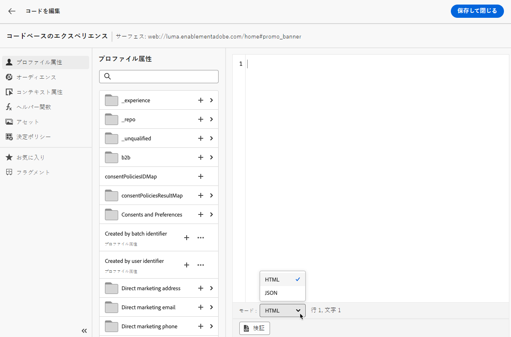
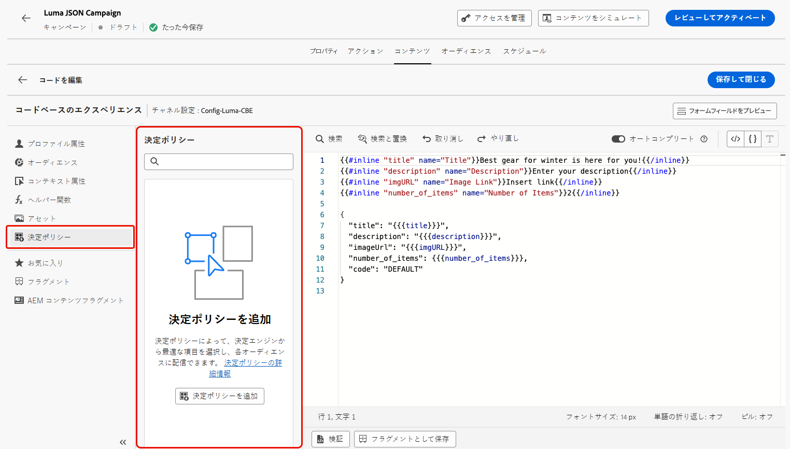
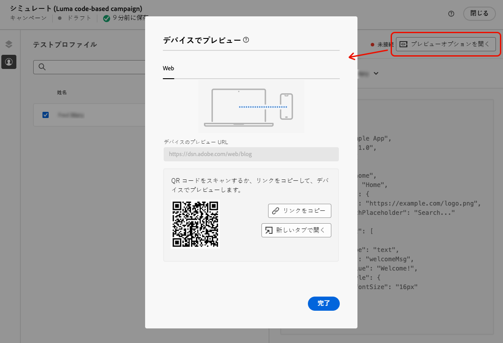
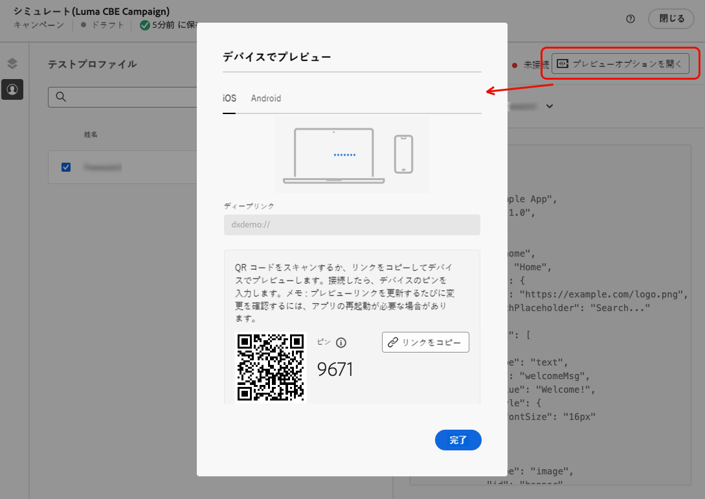
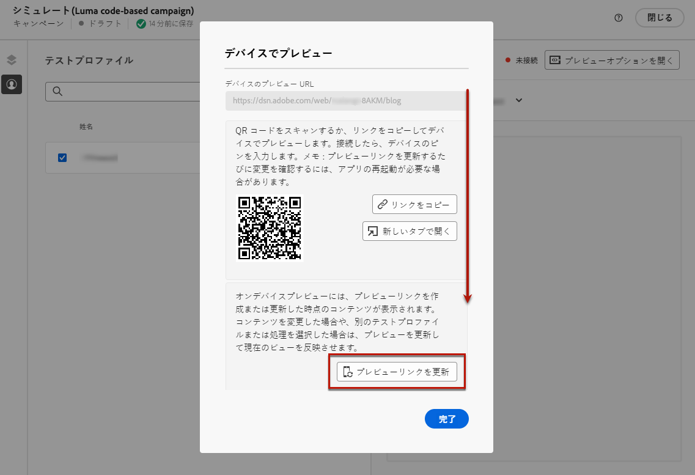
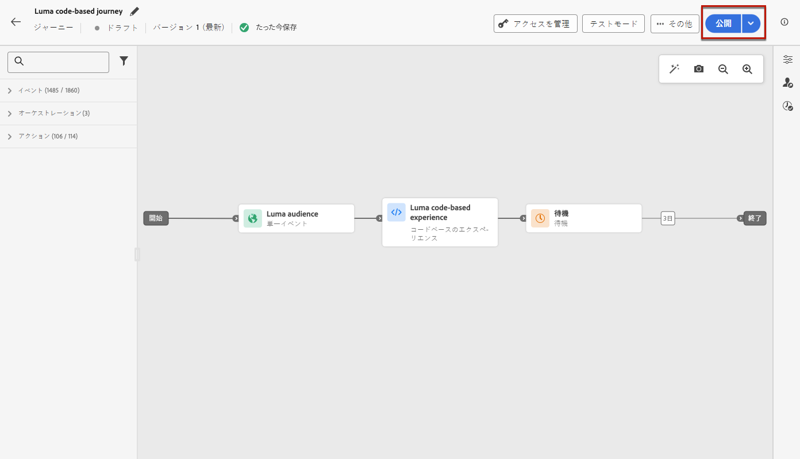
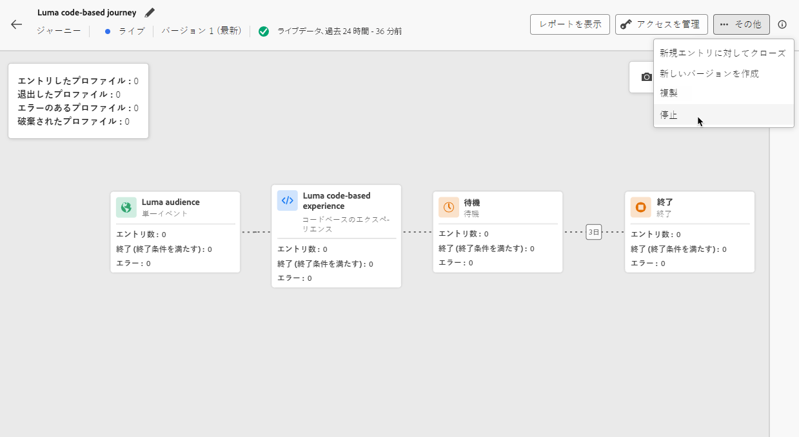

# コードベースエクスペリエンスを作成 {#create-code-based}

[!DNL Journey Optimizer] では、ジャーニーまたはキャンペーンでコードベースのエクスペリエンスを作成できます。

コードベースのエクスペリエンスに関する特定のガードレールおよびレコメンデーションについて詳しくは、[このページ](code-based-prerequisites.md)を参照してください。

## ジャーニーまたはキャンペーンを通じてコードベースのエクスペリエンスを追加 {#create-code-based-experience}

ジャーニーまたはキャンペーンを通じてコードベースのエクスペリエンスの作成を開始するには、次の手順に従います。

>[!BEGINTABS]

>[!TAB  コードベースのエクスペリエンスをジャーニーに追加する ]

**コードベースのエクスペリエンス** アクティビティをジャーニーに追加するには、次の手順に従います。

1. [ ジャーニーを作成 ](../building-journeys/journey-gs.md) します。

1. ジャーニーを[イベント](../building-journeys/general-events.md)または[オーディエンスを読み取り](../building-journeys/read-audience.md)アクティビティで開始します。

1. パレットの **[!UICONTROL アクション]** セクションから **[!UICONTROL コードベースのエクスペリエンス]** アクティビティをドラッグ&amp;ドロップします。

   

   >[!NOTE]
   >
   >**コードベースのエクスペリエンス** はインバウンドメッセージアクティビティなので、3 日間 **待機** アクティビティが付属しています。 [詳細情報](../building-journeys/wait-activity.md#auto-wait-node)

1. メッセージの&#x200B;**[!UICONTROL ラベル]**&#x200B;と&#x200B;**[!UICONTROL 説明]**&#x200B;を入力します。

1. 使用する [ コードベースのエクスペリエンス設定 ](code-based-configuration.md) を選択または作成します。

   

1. 「**[!UICONTROL コンテンツを編集]**」ボタンを選択し、パーソナライゼーションエディターを使用して必要に応じてコンテンツを編集します。 [詳細情報](#edit-code)

1. 必要に応じて、追加のアクションまたはイベントをドラッグ＆ドロップして、ジャーニーフローを完了します。[詳細情報](../building-journeys/about-journey-activities.md)

1. コードベースエクスペリエンスの準備が整ったら、設定を完了し、ジャーニーを公開してアクティブ化します。 [詳細情報](../building-journeys/publishing-the-journey.md)

ジャーニーの設定方法について詳しくは、[このページ](../building-journeys/journey-gs.md)を参照してください。

>[!TAB コードベースのエクスペリエンスキャンペーンの作成]

キャンペーンを通じて **コードベースのエクスペリエンス** の作成を開始するには、次の手順に従います。

1. キャンペーンの作成. [詳細情報](../campaigns/create-campaign.md)

1. 実施するキャンペーンのタイプを選択します。

   * **[!UICONTROL Scheduled - Marketing]**：キャンペーンをすぐに実行するか、指定日に実行します。スケジュール済みキャンペーンは、**マーケティング**&#x200B;メッセージを送信することを目的としています。ユーザーインターフェイスから設定および実行されます。

   * **[!UICONTROL API トリガー - マーケティング／トランザクション]**：API 呼び出しを使用してキャンペーンを実行します。API トリガーキャンペーンは、**マーケティング**&#x200B;メッセージまたは&#x200B;**トランザクション**&#x200B;メッセージのいずれか、つまり、個人が実行したアクション（パスワードのリセット、買い物かごの購入など）に続いて送信されるメッセージを送信することを目的としています。[API を使用してキャンペーンをトリガーする方法についてはこちらを参照してください](../campaigns/api-triggered-campaigns.md)

1. キャンペーンのプロパティ、[オーディエンス](../audience/about-audiences.md)、[スケジュール](../campaigns/create-campaign.md#schedule)など、キャンペーンを作成する手順を完了します。キャンペーンの設定方法について詳しくは、[このページ](../campaigns/get-started-with-campaigns.md)を参照してください。

1. **[!UICONTROL コードベースのエクスペリエンス]**&#x200B;アクションを選択します。

1. コードベースのエクスペリエンス設定を選択または作成します。[詳細情報](code-based-configuration.md)

   

1. パーソナライゼーションエディターを使用して、必要に応じてコンテンツを編集します。[詳細情報](#edit-code)

   <!---->

キャンペーンの設定方法について詳しくは、[このページ](../campaigns/get-started-with-campaigns.md)を参照してください。

>[!ENDTABS]

## コードコンテンツの編集 {#edit-code}

>[!CONTEXTUALHELP]
>id="ajo_code_based_experience"
>title="パーソナライゼーションエディターの使用"
>abstract="このコードベースのエクスペリエンスアクションの一部として配信するコードを挿入および編集します。"
>additional-url="https://experienceleague.adobe.com/docs/journey-optimizer/using/content-management/personalization/expression-editor/personalization-build-expressions.html?lang=ja" text="パーソナライゼーションエディターの基本を学ぶ"

1. ジャーニーアクティビティまたはキャンペーン編集画面から、「**[!UICONTROL コードを編集]**」を選択します。

   

1. [パーソナライゼーションエディター](../personalization/personalization-build-expressions.md)が開きます。これは、コードを作成できる非視覚的なエクスペリエンス作成インターフェイスです。

1. オーサリングモードを HTML から JSON に切り替えることも、その逆も可能です。

   

   >[!CAUTION]
   >
   >オーサリングモードを変更すると、現在のコードがすべて失われるので、作成を開始する前にモードを切り替えてください。

1. 必要に応じてコードを入力します。[!DNL Journey Optimizer] パーソナライゼーションエディターのすべてのパーソナライズ機能およびオーサリング機能を活用できます。[詳細情報](../personalization/personalization-build-expressions.md)

1. 必要に応じて、HTML または JSON 式フラグメントを追加できます。[方法についてはこちらを参照](../personalization/use-expression-fragments.md)

   また、コードコンテンツの一部をフラグメントとして保存することもできます。[方法についてはこちらを参照](../content-management/fragments.md#save-as-expression-fragment)

1. コードベースのエクスペリエンスでは、エクスペリエンス判定機能を使用できます。 左側のバーから **[!UICONTROL 決定ポリシー]** アイコンを選択し、「**[!UICONTROL 決定ポリシーを追加]**」をクリックします。 [詳細情報](../experience-decisioning/create-decision.md)

   

   >[!NOTE]
   >
   >エクスペリエンス決定は、現在一連の組織でのみ利用可能です（限定提供）。アクセスするには、アドビ担当者にお問い合わせください。

1. 「**[!UICONTROL 保存して閉じる]**」をクリックして変更を確定します。

開発者が API または SDK 呼び出しを実行して、チャネル設定で定義されたサーフェスのコンテンツを取得すると、変更が web ページまたはアプリに適用されます。

## コードベースエクスペリエンスのテスト {#test-code-based-experience}

>[!CONTEXTUALHELP]
>id="ajo_code_based_preview"
>title="コードベースエクスペリエンスのプレビュー"
>abstract="コードベースエクスペリエンスがどのように表示されるかをシミュレーションで確認します。"

変更したコードベースエクスペリエンスのプレビューを表示するには、次の手順に従います。

>[!CAUTION]
>
>どのオファーが配信されるかをシミュレートするには、使用可能なテストプロファイルがある必要があります。詳細は、[テストプロファイルを作成](../audience/creating-test-profiles.md)する方法を参照してください。

1. ジャーニーまたはキャンペーンで、パーソナライゼーションエディターまたはコンテンツ編集画面から、「**[!UICONTROL コンテンツをシミュレート]**」を選択します。

   

1. 「**[!UICONTROL テストプロファイルを管理]**」をクリックして、1 つ以上のテストプロファイルを選択します。

1. 変更したコードベースエクスペリエンスのプレビューが表示されます。

テストプロファイルを選択し、コンテンツをプレビューする方法について詳しくは、[ この節 ](../content-management/preview.md) を参照してください。

### デバイスでのプレビュー {#preview-on-device}

>[!CONTEXTUALHELP]
>id="ajo_code_based_preview_device"
>title="実際のデバイスでコードベースのエクスペリエンスをプレビューする"
>abstract="ブラウザーまたはモバイルデバイスでパーソナライズされたエクスペリエンスのプレビューを取得して、実際のデバイスでの外観を確認します。"

>[!CONTEXTUALHELP]
>id="ajo_code_based_preview_device_web"
>title="デバイスでコードベースの web エクスペリエンスをプレビューする"
>abstract="QR コードをスキャンするか、リンクをコピーしてデバイスでプレビューします。"

>[!CONTEXTUALHELP]
>id="ajo_code_based_preview_device_mobile"
>title="デバイスでコードベースのモバイルエクスペリエンスをプレビューする"
>abstract="QR コードをスキャンするか、リンクをコピーしてデバイスでプレビューします。 接続したら、デバイスのピンを入力します。 プレビューリンクを更新するたびに変更を確認するには、アプリを再起動する必要がある場合があります。"

>[!CONTEXTUALHELP]
>id="ajo_code_based_preview_device_refresh"
>title="プレビューリンクを更新して、現在のビューを反映します"
>abstract="オンデバイスプレビューには、プレビューリンクを作成または更新した時点のコンテンツが表示されます。 コンテンツを変更した場合、または別のテストプロファイルや処理を選択した場合は、プレビューを更新して、現在の表示を反映させます。"

Web ページやモバイルアプリ用のコードベースのエクスペリエンスを作成する場合、ブラウザーまたはモバイルデバイスでパーソナライズされたエクスペリエンスをプレビューし、実際のデバイスでのエクスペリエンスの外観を確認できます。

>[!WARNING]
>
>[ 決定ポリシー ](../experience-decisioning/create-decision.md) または [ パーソナライゼーション ](../personalization/personalization-build-expressions.md) コンテキスト属性を使用している場合、デバイスでプレビューを使用できません。

1. **[!UICONTROL シミュレート]** 画面から、「**[!UICONTROL プレビューオプションを開く]** ボタンをクリックします。 プレビューオプションは、[ コードベースの設定 ](code-based-configuration.md#create-code-based-configuration) で選択したプラットフォームによって異なります。

1. コードベースの設定で [Web プラットフォーム ](code-based-configuration.md#web) を使用している場合、「**[!UICONTROL デバイスプレビュー URL]**」読み取り専用フィールドには、現在のチャネル設定で入力された URL が事前に入力されています。

   

   以下のいずれかを実行できます。

   * 「**[!UICONTROL リンクをコピー]**」ボタンを選択し、ブラウザータブにリンクを貼り付けます。 また、チームや関係者とリンクを共有することもできます。関係者は、変更が有効になる前に任意のブラウザーで新しいエクスペリエンスをプレビューできます。

   * **[!UICONTROL 新しいタブで開く]** をクリックして、現在のブラウザーでリンクを開きます。

   * モバイルデバイスで QR コードをスキャンして、モバイルブラウザーでプレビューリンクを開きます。

1. コードベースの設定で [ モバイルプラットフォーム ](code-based-configuration.md#mobile) （iOS/Android）を使用している場合、「**[!UICONTROL ディープリンク]**」読み取り専用フィールドには、選択したプラットフォームのチャネル設定で入力された **[!UICONTROL プレビュー URL]** 値が事前に入力されています。

   「**[!UICONTROL iOS]**」タブと「**[!DNL Android]**」タブを切り替えて、選択したプラットフォームのエクスペリエンスをプレビューします。

   

   以下のいずれかを実行できます。

   * 「**[!UICONTROL リンクをコピー]**」ボタンを選択して、チームや関係者とリンクを共有します。関係者は、変更が有効になる前にモバイルブラウザーで新しいエクスペリエンスをプレビューできます。

   * モバイルデバイスで QR コードをスキャンして、モバイルアプリケーションで直接プレビューリンクを開きます。 [Assurance](https://experienceleague.adobe.com/en/docs/experience-platform/assurance/tutorials/implement-assurance){target="_blank"} セッションを確立するには、デバイスで PIN を入力する必要があります。

     >[!NOTE]
     >
     >**Adobe Experience Platform Assurance** は、モバイルアプリでデータを収集したりエクスペリエンスを提供したりする方法の検査、配達確認、シミュレーション、検証に役立つ、Adobe Experience Cloudの製品です。 [詳細情報](https://experienceleague.adobe.com/ja/docs/experience-platform/assurance/home){target="_blank"}

1. 選択したテストプロファイルと、ジャーニーまたはキャンペーンで [ コンテンツ実験 ](../content-management/content-experiment.md) を使用している場合は、選択した処理のプレビューリンクが生成されます。

   <!--If you have modified the content or selected a different treatment or test profile, scroll down to the bottom of the **[!UICONTROL Preview on device]** pop-up and click **[!UICONTROL Refresh preview link]** to reflect the current state.

   -->

   <!--When creating a content experiment, you need to select a given treatment and click the **[!UICONTROL Simulate content]** button to obtain the link corresponding to that treatment, then select another treatment, click the **[!UICONTROL Simulate content]** button to obtain a new preview link, and so on.-->

   コンテンツを更新する際、または別のテストプロファイルや処理を選択する際に、プレビューリンクが自動的に更新されます。 リンクを様々なブラウザータブにコピーして、エクスペリエンスを比較できます。

## コードベースのエクスペリエンスをライブにする {#code-based-experience-live}

>[!IMPORTANT]
>
> キャンペーンに承認ポリシーが適用される場合、コードベースのエクスペリエンスをアクティブ化できるようにするには、承認をリクエストする必要があります。 [詳細情報](../test-approve/gs-approval.md)

コードベースのエクスペリエンスを定義し、[ コードベースのエディター ](#edit-code) を使用して必要に応じてコンテンツを編集したら、ジャーニーまたはキャンペーンをアクティブ化して、変更をオーディエンスに表示できます。

また、運用開始前にコードベースのエクスペリエンスコンテンツをプレビューすることもできます。 [詳細情報](#test-code-based-experience)

>[!NOTE]
>
>既に実行中の別のジャーニーまたはキャンペーンと同じページに影響を与えるコードベースのジャーニーまたはキャンペーンをアクティブ化すると、すべての変更がコンテンツに適用されます。
>
>複数のコードベースのジャーニーまたはキャンペーンがコンテンツの同じ要素を更新する場合は、最も優先度の高いジャーニー/キャンペーンが優先されます。

コードベースのジャーニーまたはキャンペーンがライブになったら、アプリ実装チームは、選択した [ コードベースのエクスペリエンス設定 ](code-based-configuration.md) で定義されたサーフェスのコンテンツを取得するための明示的な API または SDK 呼び出しを行います。 お客様による様々な実装について詳しくは、[ この節 ](code-based-implementation-samples.md) を参照してください。

### コードベースのジャーニーのPublish {#publish-code-based-journey}

コードベースのエクスペリエンスをジャーニーからライブにするには、次の手順に従います。

1. ジャーニーが有効で、エラーがないことを確認します。 [詳細情報](../building-journeys/troubleshooting.md#checking-for-errors-before-testing)

1. ジャーニーから、右上のドロップダウンメニューにある「**[!UICONTROL Publish]**」オプションを選択します。

   

   >[!NOTE]
   >
   >ジャーニーの公開について詳しくは、[ この節 ](../building-journeys/publishing-the-journey.md) を参照してください。

コードベースのジャーニーは **[!UICONTROL ライブ]** ステータスになり、選択したオーディエンスに対して表示されるようになりました。 ジャーニーの各受信者には、変更を表示できます。

>[!NOTE]
>
>**[!UICONTROL Publish]** をクリックした後、変更内容が有効になるまで最大 15 分かかる場合があります。

### コードベースキャンペーンのアクティブ化 {#activate-code-based-campaign}

1. コードベースキャンペーンから、「**[!UICONTROL アクティブ化するレビュー]**」を選択します。

   

1. コンテンツ、プロパティ、設定、オーディエンス、スケジュールを必要に応じて確認および編集します。

1. 「**[!UICONTROL アクティブ化]**」を選択します。

   

   >[!NOTE]
   >
   >キャンペーンのアクティブ化について詳しくは、[この節](../campaigns/review-activate-campaign.md)を参照してください。

コードベースキャンペーンのステータスが「**[!UICONTROL ライブ]**」になり、選択したオーディエンスに対して表示されます。キャンペーンの各受信者は、コンテンツに追加した変更を表示できます。

>[!NOTE]
>
>**[!UICONTROL アクティブ化]** をクリックした後、変更がライブになるまでに最大 15 分かかる場合があります。
>
>コードベースキャンペーンのスケジュールを定義した場合、開始日時に達するまで、**[!UICONTROL スケジュール済み]**&#x200B;ステータスになります。

## コードベースのジャーニーまたはキャンペーンを停止 {#stop-code-based-experience}

コードベースのエクスペリエンスがライブの場合、それを停止して、オーディエンスに変更が表示されないようにすることができます。 次の手順に従います。

1. それぞれのリストからライブジャーニーまたはキャンペーンを選択します。

1. 必要に応じて、関連するアクションを実行します。

   * キャンペーンのトップメニューから、「**[!UICONTROL キャンペーンを停止]**」を選択します。

     

   * ジャーニーのトップメニューで、「**[!UICONTROL 詳細]**」ボタンをクリックし、「**[!UICONTROL 停止]**」を選択します。

     

1. 追加した変更は、定義したオーディエンスには表示されなくなります。

>[!NOTE]
>
>コードベースのジャーニーまたはキャンペーンが停止した後は、再度編集またはアクティブ化することはできません。 複製し、複製したジャーニー/キャンペーンをアクティブ化することのみ可能です。

<!--Reporting TBC

## Check the code-based experience reports {#check-code-based-reports}

Once your code-based experience is live, you can check the **[!UICONTROL Code-based]** tab of the  [Journey report](../reports/journey-global-report-cja.md#web-cja) and [Campaign report](../reports/campaign-global-report-cja.md#web) to compare elements such as the number of experiences delivered to your audience, and the number of engagements with your content.-->

<!--## Code-based reports

You can access code-based journey or campaign reports from the summary screen.

Global reports display events that occurred at least two hours ago and cover events over a selected time period. In comparison, Live reports focus on events that took place within the past 24 hours, with a minimum time interval of two minutes from the event occurrence.

### Code-based live report {#live-report-code-based}

From your campaign **[!UICONTROL Live report]**, the **[!UICONTROL Code-based experience]** tab details the main information relative to your apps or web pages. [Learn more on live report](../reports/campaign-live-report.md)

+++Learn more on the different metrics and widgets available for the Code-based experience report.

The **[!UICONTROL Code-based experience performance]** KPIs detail the main information relative to your visitors' engagement with your code-based experiences, such as:

* **[!UICONTROL Impressions]**: total number of experiences delivered to all users.

* **[!UICONTROL Interactions]**:  total number of engagements with your app/page. This includes any actions taken by the users, such as clicks or any other interactions.

The **[!UICONTROL Code-based experience summary]** graph shows the evolution of your experiences (impressions, unique impressions and interactions) for the last 24 hours.

TBC: The **[!UICONTROL Interactions by element]** table details the main information relative to your visitors' engagement with the various elements on your app/pages.
+++

### Code-based global report {#global-report-code-based}

Code-based campaign global report can be accessed directly from your journey or campaign with the **[!UICONTROL View report]** button. [Learn more on global report](../reports/campaign-global-report-cja.md)

From your Campaign **[!UICONTROL Global report]**, the **[!UICONTROL Code-based experience]** tab details the main information relative to your apps or web pages.

Add image TBC

+++Learn more on the different metrics and widgets available for the Code-based experience report.

The **[!UICONTROL Code-based experience performance]** KPIs detail the main information relative to your visitors' engagement with your experiences, such as:

* **[!UICONTROL Unique impressions]**: number of unique users to whom the experience was delivered.

* **[!UICONTROL Impressions]**: total number of experiences delivered to all users.

* **[!UICONTROL Interactions]**: percentage of engagements with your app/page. This includes any actions taken by the users, such as clicks or any other interactions.

The **[!UICONTROL Code-based experience summary]** graph shows the evolution of your experiences (unique impressions, impressions and interactions) for the concerned period.

TBC: The **[!UICONTROL Interactions by element]** table details the main information relative to your visitors' engagement with the various elements on your apps/pages.
+++

TBC video if existing

## How-to video{#video}

The video below shows how to create a code-based campaign, configure its properties, review, and publish it.

>[!VIDEO]()

-->
