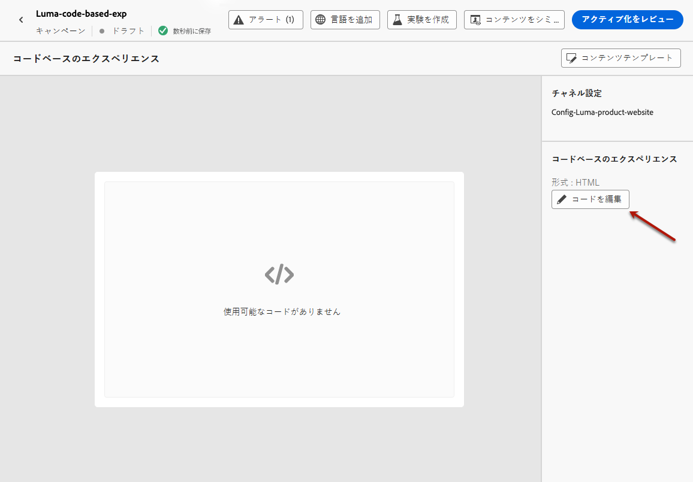
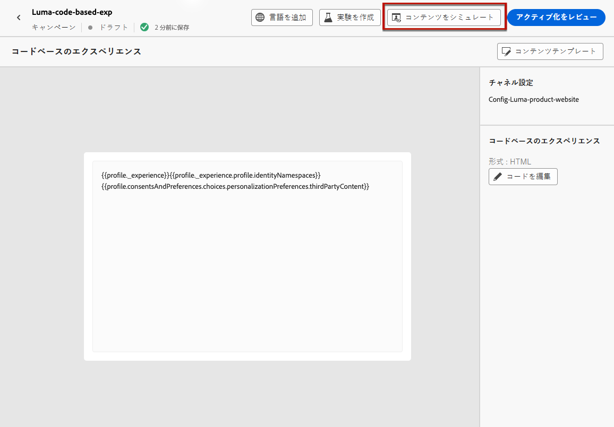

# コードベースのエクスペリエンスを作成 {#create-code-based}

>[!BEGINSHADEBOX]

このドキュメントガイドの内容は次のとおりです。

* [コードベースチャネルの基本を学ぶ](get-started-code-based.md)
* [コードベースの前提条件](code-based-prerequisites.md)
* [コードベースの実装サンプル](code-based-implementation-samples.md)
* **[コードベースのエクスペリエンスを作成](create-code-based.md)**

>[!ENDSHADEBOX]

>[!AVAILABILITY]
>
>現在、コードベースのエクスペリエンスチャネルは、一部のユーザーのみを対象としたベータ版として利用できます。ベータ版プログラムに参加するには、アドビカスタマーケアにお問い合わせください。

## コードベースのキャンペーンの作成 {#create-code-based-campaign}

キャンペーンを通じてコードベースのエクスペリエンスの構築を開始するには、次の手順に従います。

>[!CAUTION]
>
>現在の場所 [!DNL Journey Optimizer] コードベースのエクスペリエンスは、 **campaigns**.

1. キャンペーンの作成. [詳細情報](../campaigns/create-campaign.md)

1. を選択します。 **[!UICONTROL コードベースのエクスペリエンス（ベータ版）]** アクション。

1. コードベースのエクスペリエンスサーフェスを入力します。 [詳細情報](#surface-definition)

   

   >[!CAUTION]
   >
   >コードベースのキャンペーンで使用されるサーフェス URI が、独自の実装で使用される URI と一致していることを確認します。 そうしないと、変更は配信されません。

1. 「**[!UICONTROL 作成]**」を選択します。

1. キャンペーンのプロパティ、[オーディエンス](../audience/about-audiences.md)、[スケジュール](../campaigns/create-campaign.md#schedule)など、 キャンペーンを作成する手順を完了します。

   >[!NOTE]
   >
   >キャンペーンの設定方法について詳しくは、[このページ](../campaigns/get-started-with-campaigns.md)を参照してください。

1. 式エディターを使用して、必要に応じてコンテンツを編集します。 [詳細情報](#edit-code)

   

## コードコンテンツの編集 {#edit-code}

>[!CONTEXTUALHELP]
>id="ajo_code_based_experience"
>title="式エディターの使用"
>abstract="このコードベースのエクスペリエンスアクションの一部として配信するコードを挿入および編集します。"
>additional-url="https://experienceleague.adobe.com/docs/journey-optimizer/using/content-management/personalization/expression-editor/personalization-build-expressions.html" text="式エディターの基本を学ぶ"

1. キャンペーンの編集画面で、「 」を選択します。 **[!UICONTROL コードを編集]**.

   

1. The [式エディター](../personalization/personalization-build-expressions.md) が開きます。 これは、コードを作成できる非視覚的なエクスペリエンス作成インターフェイスです。

1. オーサリングモードをHTMLから JSON に切り替えることも、その逆も可能です。

   >[!CAUTION]
   >
   >オーサリングモードを変更すると、現在のコードがすべて失われるので、オーサリングを開始する前にモードを切り替えてください。

1. 必要に応じてコードを入力します。 次の条件を満たす場合に、 [!DNL Journey Optimizer] 式エディターには、パーソナライゼーションおよびオーサリング機能がすべて含まれています。 [詳細情報](../personalization/personalization-build-expressions.md)

   

1. コードベースのキャンペーンでは、エクスペリエンス判定機能を使用できます。 を選択します。 **[!UICONTROL 決定]** 左側のバーのアイコンをクリックし、 **[!UICONTROL 決定を作成]**. [詳細情報](../experience-decisioning/create-decision.md)

   

   >[!NOTE]
   >
   >エクスペリエンス判定機能は、現在、一部のユーザーのみが選択できるベータ版として使用できます。

1. クリック **[!UICONTROL 保存して閉じる]** をクリックして変更を確定します。

開発者が API または SDK 呼び出しを実行して、選択した表面のコンテンツを取得すると、変更が Web ページまたはアプリに適用されます。

## コードベースのキャンペーンのテスト {#test-code-based-campaign}

>[!CONTEXTUALHELP]
>id="ajo_code_based_preview"
>title="コードベースのエクスペリエンスのプレビュー"
>abstract="コードベースのエクスペリエンスがどのように表示されるかをシミュレーションで確認します。"

変更したコードベースのエクスペリエンスのプレビューを表示するには、次の手順に従います。

>[!CAUTION]
>
>どのオファーが配信されるかをシミュレートするには、使用可能なテストプロファイルがある必要があります。詳細は、[テストプロファイルを作成](../audience/creating-test-profiles.md)する方法を参照してください。

1. 式エディターまたはコンテンツを編集画面で、「 」を選択します。 **[!UICONTROL コンテンツをシミュレート]**.

   

1. 「**[!UICONTROL テストプロファイルを管理]**」をクリックして、1 つ以上のテストプロファイルを選択します。

1. 変更したコードベースのエクスペリエンスのプレビューが表示されます。

<!--
    

    You can also open it in the default browser, or copy the test URI to paste it in any browser. This allows you to share the link with your team and stakeholders who will be able to preview the new web experience in any browser before the campaign goes live.

    When copying the test URI, the content displayed is the one personalized for the test profile used when the content simulation was generated in [!DNL Journey Optimizer].-->

## コードベースのキャンペーンを有効化 {#activate-code-based-campaign}

コードベースのキャンペーンを定義し、必要に応じて [コードベースのエディター](#edit-code)を参照し、それを確認してアクティブ化することができます。 次の手順に従います。

>[!NOTE]
>
>アクティブ化する前に キャンペーンのコンテンツをプレビューすることもできます。[詳細情報](#test-code-based-campaign)

1. コードベースのキャンペーンから、 **[!UICONTROL 有効化するレビュー]**.

   

1. コンテンツ、プロパティ、サーフェス、オーディエンス、スケジュールを必要に応じて確認および編集します。

1. 「**[!UICONTROL アクティブ化]**」を選択します。

   

   >[!NOTE]
   >
   >次をクリックした後： **[!UICONTROL 有効化]**&#x200B;の場合、コードベースのキャンペーンの変更がその場所で有効になるまで、最大 1 分かかる場合があります。

コードベースのキャンペーンでは、 **[!UICONTROL ライブ]** ステータスで表示され、選択したオーディエンスに対して表示されます。 キャンペーンの各受信者に、変更内容が表示されます。

>[!NOTE]
>
>コードベースのキャンペーンのスケジュールを定義した場合、 **[!UICONTROL Scheduled]** 開始日時になるまでのステータス。
>
>既に実稼働中の別のキャンペーンと同じ場所に影響を与えるコードベースのキャンペーンをアクティブ化すると、すべての変更がロケーションに適用されます。

キャンペーンのアクティブ化について詳しくは、[この節](../campaigns/review-activate-campaign.md)を参照してください。

## コードベースのキャンペーンを停止する {#stop-code-based-campaign}

コードベースのキャンペーンがライブになっている場合は、そのキャンペーンを停止して、変更内容がオーディエンスに表示されないようにすることができます。 次の手順に従います。

1. リストからライブキャンペーンを選択します。

1. 上部のメニューから、「**[!UICONTROL キャンペーンを停止]**」を選択します。

   

1. 追加した変更は、定義したオーディエンスには表示されなくなります。

>[!NOTE]
>
>コードベースのキャンペーンが停止した後は、再び編集またはアクティブ化することはできません。 キャンペーンを複製し、複製したものをアクティブ化することのみ可能です。

## コードベースのキャンペーンレポート

キャンペーンの概要画面から、コードベースのキャンペーンレポートにアクセスできます。

グローバルレポートには、少なくとも 2 時間前に発生したイベントと、選択した期間のイベントが表示されます。 これに対し、ライブレポートには、過去 24 時間以内に発生したイベントが焦点となり、イベント発生から最小 2 分の時間間隔で表示されます。

### コードベースのライブレポート {#live-report-code-based}

キャンペーンから **[!UICONTROL ライブレポート]**、 **[!UICONTROL コードベースのエクスペリエンス]** 「 」タブには、アプリまたは web ページに関する主な情報の詳細が表示されます。 [ライブレポートの詳細を説明します](../reports/campaign-live-report.md)

+++コードベースのエクスペリエンスレポートで使用できる様々な指標およびウィジェットについて詳しく説明します。

The **[!UICONTROL コードベースのエクスペリエンスパフォーマンス]** KPI では、次のような、訪問者のコードベースのエクスペリエンスに対するエンゲージメントに関する主な情報の詳細を説明します。

* **[!UICONTROL インプレッション数]**：すべてのユーザーに配信された エクスペリエンスの合計数。

* **[!UICONTROL インタラクション]**：アプリ/ページでのアクション数の合計です。 これには、クリックやその他のインタラクションなど、ユーザーが実行したすべてのアクションが含まれます。

The **[!UICONTROL コードベースのエクスペリエンスの概要]** グラフには、過去 24 時間のエクスペリエンス（インプレッション数、個別インプレッション数およびインタラクション数）の変化が表示されます。

<!--The **[!UICONTROL Interactions by element]** table details the main information relative to your visitors' engagement with the various elements on your app/pages.-->
+++

### コードベースのグローバルレポート {#global-report-code-based}

コードベースのキャンペーンのグローバルレポートには、 **[!UICONTROL レポートを表示]** 」ボタンをクリックします。 [グローバルレポートの詳細を説明します](../reports/campaign-global-report.md)

キャンペーンから **[!UICONTROL グローバルレポート]**、 **[!UICONTROL コードベースのエクスペリエンス]** 「 」タブには、アプリまたは web ページに関する主な情報の詳細が表示されます。

<!--image-->

+++コードベースのエクスペリエンスレポートで使用できる様々な指標およびウィジェットについて詳しく説明します。

The **[!UICONTROL コードベースのエクスペリエンスパフォーマンス]** KPI では、次のような、訪問者のエンゲージメントに関する主な情報の詳細をエクスペリエンスに設定します。

* **[!UICONTROL ユニークインプレッション数]**： エクスペリエンスが配信されたユニークユーザーの数。

* **[!UICONTROL インプレッション数]**：すべてのユーザーに配信された エクスペリエンスの合計数。

* **[!UICONTROL インタラクション]**：アプリ/ページを使用したエンゲージメントの割合。 これには、クリックやその他のインタラクションなど、ユーザーが実行したすべてのアクションが含まれます。

The **[!UICONTROL コードベースのエクスペリエンスの概要]** グラフには、該当する期間のエクスペリエンス（個別インプレッション数、インプレッション数およびインタラクション数）の変化が表示されます。

<!--The **[!UICONTROL Interactions by element]** table details the main information relative to your visitors' engagement with the various elements on your apps/pages.-->
+++

<!--
## How-to video{#video}

The video below shows how to create a code-based campaign, configure its properties, review, and publish it.

>[!VIDEO]()

-->
