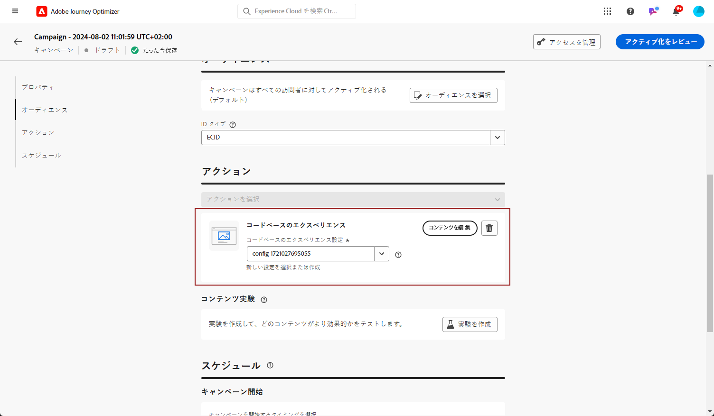
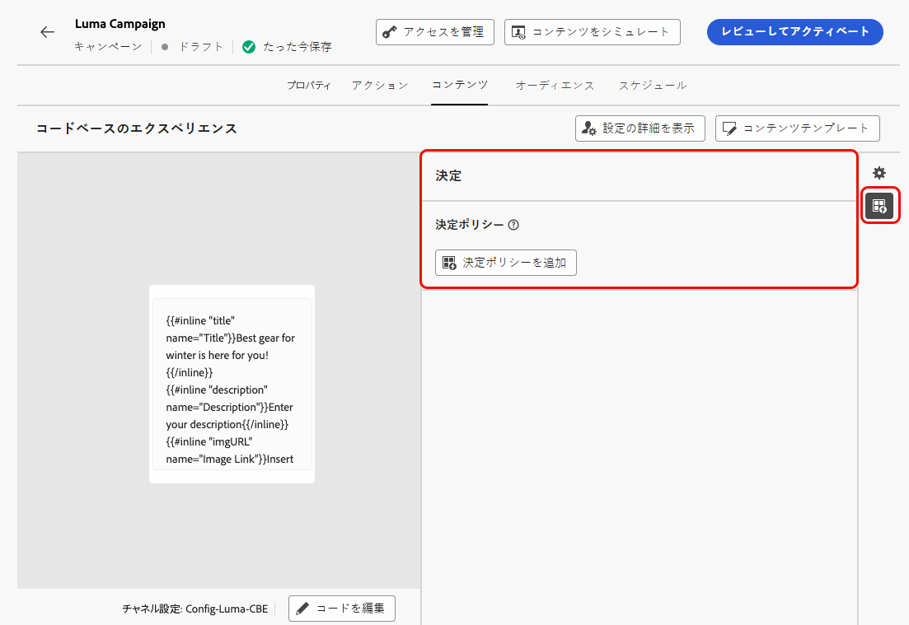

# コードベースエクスペリエンスを作成 {#create-code-based}

[!DNL Journey Optimizer] では、ジャーニーまたはキャンペーンでコードベースのエクスペリエンスを作成できます。

## ジャーニーまたはキャンペーンを通じてコードベースのエクスペリエンスを追加 {#create-code-based-experience}

ジャーニーまたはキャンペーンを通じてコードベースのエクスペリエンスの作成を開始するには、次の手順に従います。

>[!BEGINTABS]

>[!TAB ジャーニーにコードベースのエクスペリエンスを追加する]

**コードベースのエクスペリエンス**&#x200B;アクティビティをジャーニーに追加するには、次の手順に従います。

1. [ジャーニーを作成します](../building-journeys/journey-gs.md)。

1. ジャーニーを「[イベント](../building-journeys/general-events.md)」または「[オーディエンスを読み取り](../building-journeys/read-audience.md)」アクティビティで開始します。

1. パレットの&#x200B;**[!UICONTROL アクション]**&#x200B;セクションから&#x200B;**[!UICONTROL コードベースのエクスペリエンス]**&#x200B;アクティビティをドラッグ＆ドロップします。

   

   >[!NOTE]
   >
   >**コードベースのエクスペリエンス**&#x200B;はインバウンドエクスペリエンスアクティビティなので、3 日間の&#x200B;**待機**&#x200B;アクティビティが付随しています。[詳細情報](../building-journeys/wait-activity.md#auto-wait-node)

1. メッセージの「**[!UICONTROL ラベル]**」と「**[!UICONTROL 説明]**」を入力します。

1. 使用するコードベースのエクスペリエンス設定を選択または作成します。[詳細情報](code-based-configuration.md)

   

   >[!NOTE]
   >
   >同じチャネル設定を使用するコードベースのエクスペリエンスアクションが複数あるとき、ジャーニーの&#x200B;**[!UICONTROL 優先度スコア]**&#x200B;によって、エンドユーザーが複数のアクションの対象となった場合に配信される内容が決定されます。[優先度スコアの詳細情報](../conflict-prioritization/priority-scores.md)

1. 「**[!UICONTROL コンテンツを編集]**」ボタンを選択し、パーソナライゼーションエディターを使用して必要に応じてコンテンツを編集します。[詳細情報](#edit-code)

   また、コードコンテンツの基礎として既存のコンテンツテンプレートを使用することもできます。選択可能なテンプレートは、事前に選択したチャネル設定に基づいて、HTML または JSON のいずれかに限定されます。[詳しくは、コンテンツテンプレートの使用方法を参照してください。](../content-management/use-content-templates.md)

1. 必要に応じて、追加のアクションまたはイベントをドラッグ＆ドロップして、ジャーニーフローを完了します。[詳細情報](../building-journeys/about-journey-activities.md)

1. コードベースのエクスペリエンスの準備が整ったら、設定を完了し、ジャーニーを公開してアクティブ化します。 [詳細情報](../building-journeys/publish-journey.md)

ジャーニーの設定方法について詳しくは、[このページ](../building-journeys/journey-gs.md)を参照してください。

>[!TAB コードベースのエクスペリエンスキャンペーンの作成]

キャンペーンを通じて&#x200B;**コードベースのエクスペリエンス**&#x200B;の作成を開始するには、次の手順に従います。

1. キャンペーンの作成. [詳細情報](../campaigns/create-campaign.md)

1. キャンペーンのタイプとして&#x200B;**スケジュール済み - マーケティング**&#x200B;を選択します。

1. キャンペーンのプロパティ、[オーディエンス](../audience/about-audiences.md)、[スケジュール](../campaigns/create-campaign.md#schedule)など、キャンペーンを作成する手順を完了します。キャンペーンの設定方法について詳しくは、[このページ](../campaigns/get-started-with-campaigns.md)を参照してください。

1. **[!UICONTROL コードベースのエクスペリエンス]**&#x200B;アクションを選択します。

1. 使用するコードベースのエクスペリエンス設定を選択または作成します。[詳細情報](code-based-configuration.md)

   

   >[!NOTE]
   >
   >同じチャネル設定を使用するコードベースのエクスペリエンスアクションが複数ある場合、キャンペーンの&#x200B;**[!UICONTROL 優先度スコア]**&#x200B;によって、エンドユーザーが複数のアクションの対象となる場合に配信される内容が決定されます。[優先度スコアの詳細情報](../conflict-prioritization/priority-scores.md)

1. パーソナライゼーションエディターを使用して、必要に応じてコンテンツを編集します。[詳細情報](#edit-code)

   また、コードコンテンツの基礎として既存のコンテンツテンプレートを使用することもできます。選択可能なテンプレートは、事前に選択したチャネル設定に基づいて、HTML または JSON のいずれかに限定されます。[詳しくは、コンテンツテンプレートの使用方法を参照してください。](../content-management/use-content-templates.md)

   <!---->

キャンペーンの設定方法について詳しくは、[このページ](../campaigns/get-started-with-campaigns.md)を参照してください。

➡️ [コードベースのエクスペリエンスキャンペーンの作成方法について詳しくは、このビデオをご覧ください](#video)

>[!ENDTABS]

## コードコンテンツの編集 {#edit-code}

>[!CONTEXTUALHELP]
>id="ajo_code_based_experience"
>title="パーソナライゼーションエディターの使用"
>abstract="このコードベースのエクスペリエンスアクションの一部として配信するコードを挿入および編集します。"
>additional-url="https://experienceleague.adobe.com/ja/docs/journey-optimizer/using/content-management/personalization/personalization-build-expressions" text="パーソナライゼーションエディターの操作"

コードベースのエクスペリエンスのコンテンツを編集するには、次の手順に従います。

1. ジャーニーアクティビティまたはキャンペーン編集画面から、「**[!UICONTROL コードを編集]**」を選択します。

   

   >[!NOTE]
   >
   >事前定義済みの編集可能なフォームフィールドを含むコードベースのエクスペリエンスコンテンツテンプレートを使用している場合は、パーソナライゼーションエディターを開くことなく、これらのフィールドのコンテンツを管理できます。[詳細情報](code-based-form-fields.md)

1. [パーソナライゼーションエディター](../personalization/personalization-build-expressions.md)が開きます。これは、コードを作成できる非視覚的なエクスペリエンス作成インターフェイスです。

1. オーサリングモードを HTML から JSON に切り替えることも、その逆も可能です。

   

   >[!CAUTION]
   >
   >オーサリングモードを変更すると、現在のコードがすべて失われるので、作成を開始する前にモードを切り替えてください。

1. 必要に応じてコードを入力します。[!DNL Journey Optimizer] パーソナライゼーションエディターのすべてのパーソナライズ機能およびオーサリング機能を活用できます。[詳細情報](../personalization/personalization-build-expressions.md)

1. 必要に応じて、HTML または JSON 式フラグメントを追加できます。[方法についてはこちらを参照](../personalization/use-expression-fragments.md)

   また、コードコンテンツの一部をフラグメントとして保存することもできます。[方法についてはこちらを参照](../content-management/fragments.md#save-as-expression-fragment)

1. コードベースのエクスペリエンスでは、決定機能を使用できます。左側のバーから&#x200B;**[!UICONTROL 決定ポリシー]**&#x200B;アイコンを選択し、「**[!UICONTROL 決定ポリシーを追加]**」をクリックします。[詳細情報](../experience-decisioning/create-decision.md#add-decision)

   

   <!---->

   ジャーニーまたはキャンペーン編集画面から、パーソナライゼーションエディターを開くことなく、決定ポリシーを直接追加することもできます。右側のパネルの専用アイコンを使用して、「**[!UICONTROL 決定]**」セクションを表示します。

   <!---->

   決定ポリシーを作成する手順について詳しくは、[この節](../experience-decisioning/create-decision.md#add-decision)を参照してください。

1. 「**[!UICONTROL 保存して閉じる]**」をクリックして変更を確定します。

開発者が API または SDK 呼び出しを実行して、チャネル設定で定義されたサーフェスのコンテンツを取得すると、変更が web ページまたはアプリに適用されます。

## チュートリアルビデオ{#video}

以下のビデオでは、コードベースのエクスペリエンスキャンペーンの作成、プロパティの設定、テスト、公開の方法を確認できます。

>[!VIDEO](https://video.tv.adobe.com/v/3428868/?quality=12&learn=on)
