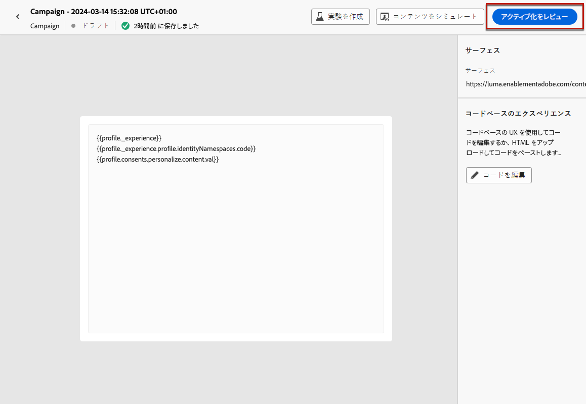
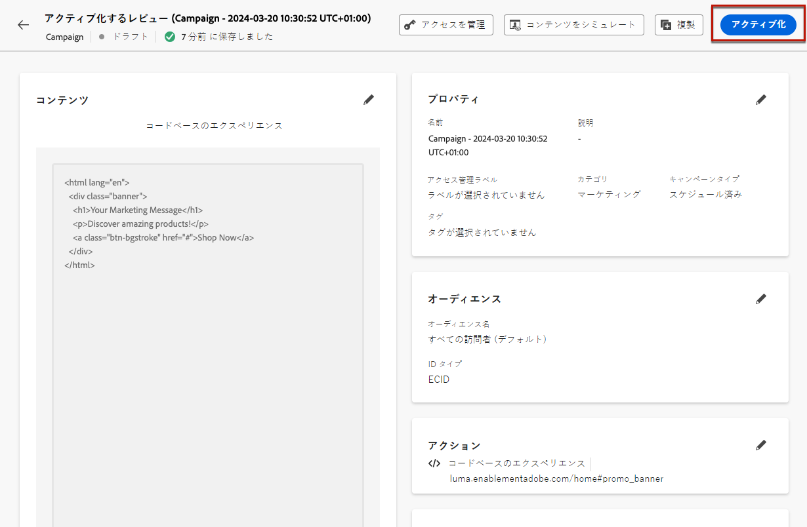
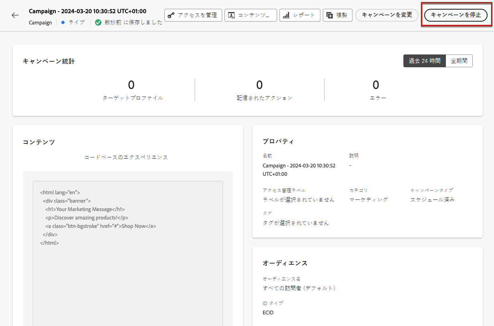

# コードベースのエクスペリエンスの管理 {#publish-code-based}

## コードベースのエクスペリエンスを公開 {#code-based-experience-live}

>[!IMPORTANT]
>
> キャンペーンが承認ポリシーの対象となっている場合、コードベースのエクスペリエンスをアクティベートできるようにするには、承認をリクエストする必要があります。[詳細情報](../test-approve/gs-approval.md)

コードベースのエクスペリエンスを定義し、[コードベースのエディター](create-code-based.md#edit-code)を使用して必要に応じてコンテンツを編集したら、ジャーニーまたはキャンペーンをアクティブ化して、変更をオーディエンスに表示できます。

公開する前にコードベースのエクスペリエンスのコンテンツをプレビューすることもできます。[詳細情報](test-code-based.md)

>[!NOTE]
>
>すでに公開されている別のジャーニーまたはキャンペーンと同じページに影響するコードベースのジャーニー／キャンペーンをアクティブ化すると、すべての変更がコンテンツに適用されます。
>
>複数のコードベースのジャーニーまたはキャンペーンが、コンテンツの同じ要素を更新する場合は、最も優先度の高いジャーニー／キャンペーンが優先されます。[優先度スコアの詳細情報](../conflict-prioritization/priority-scores.md)

コードベースのジャーニーまたはキャンペーンを公開すると、アプリ実装チームは、明示的な API または SDK 呼び出しを行って、選択した[コードベースのエクスペリエンス設定](code-based-configuration.md)で定義されたサーフェスのコンテンツを取得する責任があります。様々な顧客の実装について詳しくは、[この節](code-based-implementation-samples.md)を参照してください。

### コードベースのジャーニーの公開 {#publish-code-based-journey}

ジャーニーからコードベースのエクスペリエンスを公開するには、次の手順に従います。

1. ジャーニーが有効で、エラーがないことを確認します。[詳細情報](../building-journeys/troubleshooting.md#checking-for-errors-before-testing)

1. ジャーニーから、右上のドロップダウンメニューにある「**[!UICONTROL 公開]**」オプションを選択します。

   

   >[!NOTE]
   >
   >ジャーニーの公開について詳しくは、[この節](../building-journeys/publish-journey.md)を参照してください。

コードベースのジャーニーのステータスが「**[!UICONTROL ライブ]**」になり、選択したオーディエンスに対して表示されます。ジャーニーの各受信者に、変更内容が表示されます。

>[!NOTE]
>
>「**[!UICONTROL 公開]**」をクリックした後、変更が公開されるまでに最大 15 分かかる場合があります。

### コードベースキャンペーンのアクティブ化 {#activate-code-based-campaign}

1. コードベースキャンペーンから、「**[!UICONTROL アクティブ化するレビュー]**」を選択します。

   

1. コンテンツ、プロパティ、設定、オーディエンス、スケジュールを必要に応じて確認および編集します。

1. 「**[!UICONTROL アクティブ化]**」を選択します。

   

   >[!NOTE]
   >
   >キャンペーンのアクティブ化について詳しくは、[この節](../campaigns/review-activate-campaign.md)を参照してください。

コードベースキャンペーンのステータスが「**[!UICONTROL ライブ]**」になり、選択したオーディエンスに対して表示されます。キャンペーンの各受信者は、あなたがコンテンツに追加した変更を表示できます。

>[!NOTE]
>
>「**[!UICONTROL アクティブ化]**」をクリックした後、変更が公開されるまでに最大 15 分かかる場合があります。
>
>コードベースキャンペーンのスケジュールを定義した場合、開始日時になるまで、ステータスは&#x200B;**[!UICONTROL スケジュール済み]**&#x200B;になります。

## コードベースのジャーニーまたはキャンペーンの停止 {#stop-code-based-experience}

コードベースのエクスペリエンスがライブの場合、オーディエンスに変更が表示されないように停止することができます。次の手順に従います。

1. それぞれのリストから公開中のジャーニーまたはキャンペーンを選択します。

1. 必要に応じて、関連するアクションを実行します。

   * キャンペーンの上部メニューから、「**[!UICONTROL キャンペーンを停止]**」を選択します。

     

   * ジャーニーのトップメニューから、「**[!UICONTROL 詳細]**」ボタンをクリックし、「**[!UICONTROL 停止]**」を選択します。

     

1. 追加した変更は、定義したオーディエンスには表示されなくなります。

>[!NOTE]
>
>コードベースのジャーニーまたはキャンペーンが停止したら、それらを再び編集またはアクティブ化することはできません。ジャーニー／キャンペーンを複製し、複製したものをアクティブ化することがだけが可能です。

<!--Reporting TBC

## Check the code-based experience reports {#check-code-based-reports}

Once your code-based experience is live, you can check the **[!UICONTROL Code-based]** tab of the  [Journey report](../reports/journey-global-report-cja.md#web-cja) and [Campaign report](../reports/campaign-global-report-cja.md#web) to compare elements such as the number of experiences delivered to your audience, and the number of engagements with your content.-->

<!--## Code-based reports

You can access code-based journey or campaign reports from the summary screen.

Global reports display events that occurred at least two hours ago and cover events over a selected time period. In comparison, Live reports focus on events that took place within the past 24 hours, with a minimum time interval of two minutes from the event occurrence.

### Code-based live report {#live-report-code-based}

From your campaign **[!UICONTROL Live report]**, the **[!UICONTROL Code-based experience]** tab details the main information relative to your apps or web pages. [Learn more about live report](../reports/campaign-live-report.md)

+++Learn more about the different metrics and widgets available for the Code-based experience report.

The **[!UICONTROL Code-based experience performance]** KPIs detail the main information relative to your visitors' engagement with your code-based experiences, such as:

* **[!UICONTROL Impressions]**: total number of experiences delivered to all users.

* **[!UICONTROL Interactions]**:  total number of engagements with your app/page. This includes any actions taken by the users, such as clicks or any other interactions.

The **[!UICONTROL Code-based experience summary]** graph shows the evolution of your experiences (impressions, unique impressions and interactions) for the last 24 hours.

TBC: The **[!UICONTROL Interactions by element]** table details the main information relative to your visitors' engagement with the various elements on your app/pages.
+++

### Code-based global report {#global-report-code-based}

Code-based campaign global report can be accessed directly from your journey or campaign with the **[!UICONTROL View report]** button. [Learn more about global report](../reports/campaign-global-report-cja.md)

From your Campaign **[!UICONTROL Global report]**, the **[!UICONTROL Code-based experience]** tab details the main information relative to your apps or web pages.

Add image TBC

+++Learn more about the different metrics and widgets available for the Code-based experience report.

The **[!UICONTROL Code-based experience performance]** KPIs detail the main information relative to your visitors' engagement with your experiences, such as:

* **[!UICONTROL Unique impressions]**: number of unique users to whom the experience was delivered.

* **[!UICONTROL Impressions]**: total number of experiences delivered to all users.

* **[!UICONTROL Interactions]**: percentage of engagements with your app/page. This includes any actions taken by the users, such as clicks or any other interactions.

The **[!UICONTROL Code-based experience summary]** graph shows the evolution of your experiences (unique impressions, impressions and interactions) for the concerned period.

TBC: The **[!UICONTROL Interactions by element]** table details the main information relative to your visitors' engagement with the various elements on your apps/pages.
+++

-->
