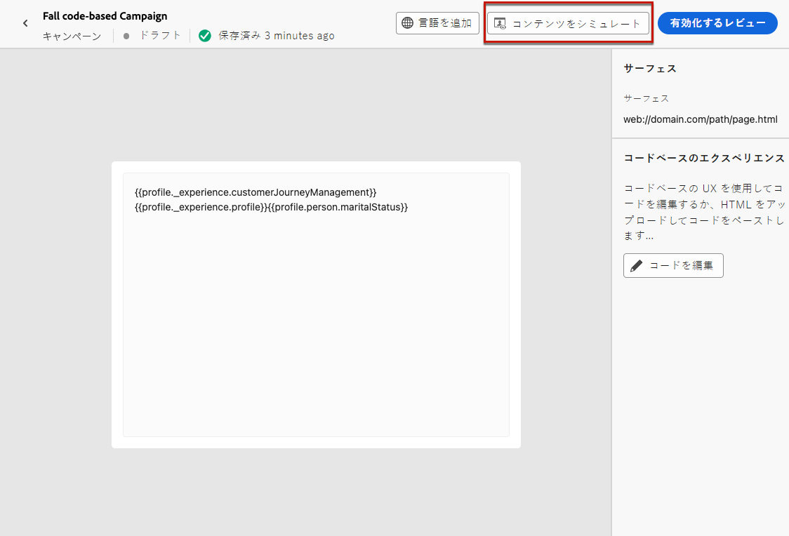
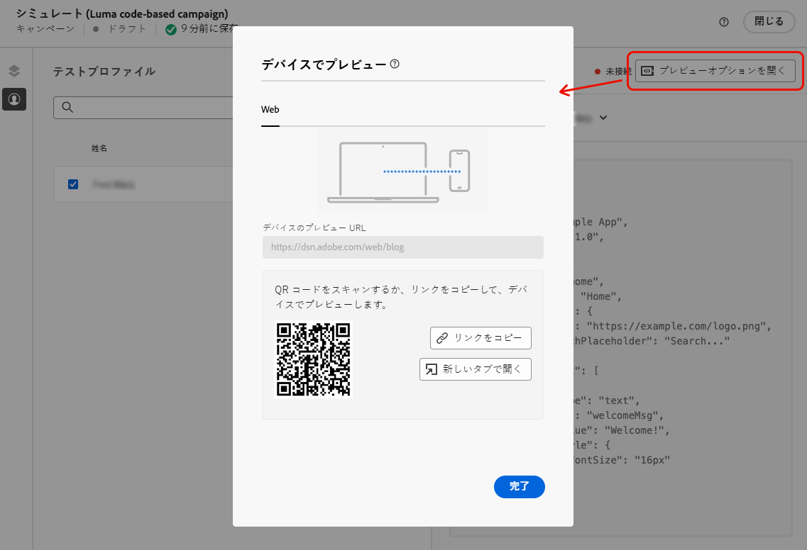
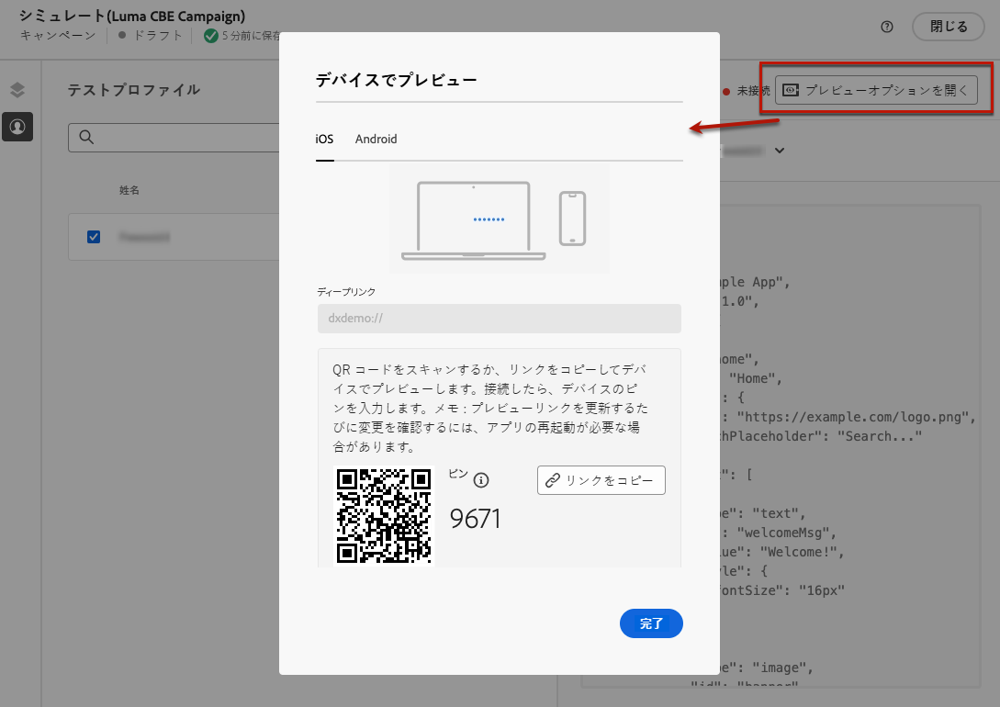
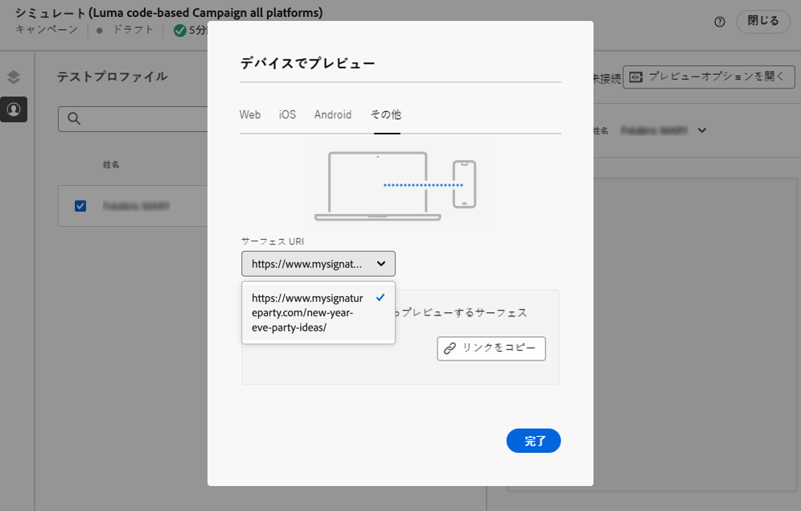
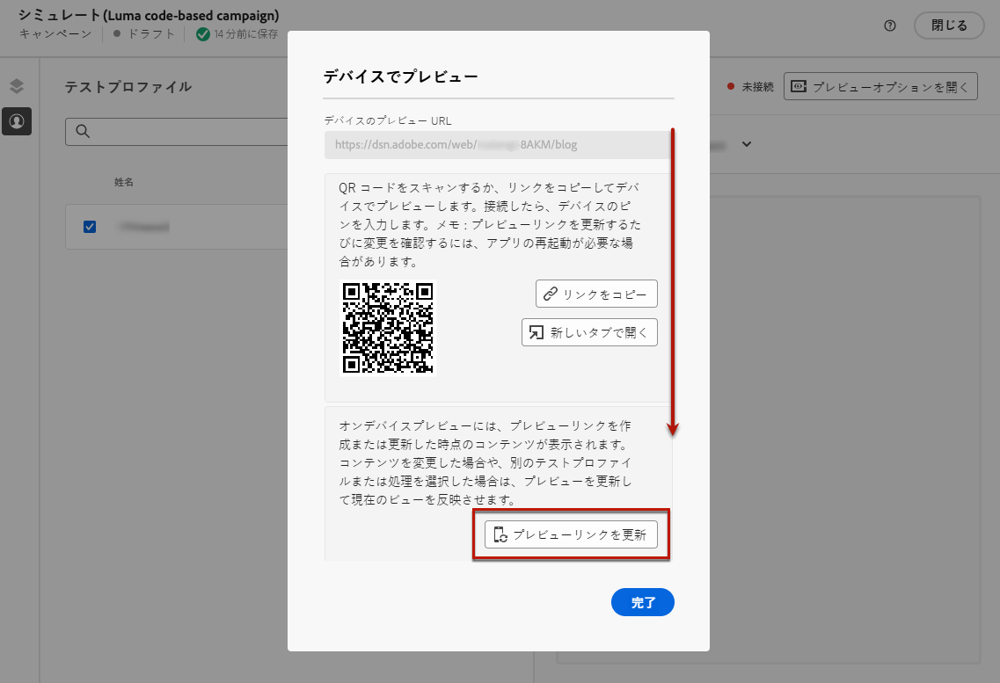

# コードベースのエクスペリエンスのテスト {#test-code-based}

>[!BEGINSHADEBOX]

**このページ：**&#x200B;公開前に、テストプロファイルとオンデバイスのプレビューを使用して、コードベースのエクスペリエンスをプレビューおよびテストする方法を説明します。

>[!ENDSHADEBOX]

## コードベースのエクスペリエンスのプレビュー {#preview-code-based}

>[!CONTEXTUALHELP]
>id="ajo_code_based_preview"
>title="コードベースのエクスペリエンスのプレビュー"
>abstract="コードベースエクスペリエンスがどのように表示されるかをシミュレーションで確認します。"

変更したコードベースエクスペリエンスのプレビューを表示するには、次の手順に従います。

>[!CAUTION]
>
>どのオファーが配信されるかをシミュレートするには、使用可能なテストプロファイルがある必要があります。 詳細は、[テストプロファイルを作成](../audience/creating-test-profiles.md)する方法を参照してください。

ジャーニーまたはキャンペーンの編集画面またはパーソナライゼーションエディターから、次のいずれかのシミュレーション方法を使用します。

* 「**[!UICONTROL コンテンツをシミュレート]**」をクリックして、サンプル入力データまたはAI自動生成を使用してコンテンツのバリエーションをテストします。 [コンテンツバリエーションのシミュレート方法を学ぶ](../test-approve/simulate-sample-input.md)
* 「**[!UICONTROL コンテンツをシミュレート]**」をクリックし、ドロップダウンから「**[!UICONTROL コンテンツをシミュレート（AEP プロファイル）]**」を選択して、テストプロファイルでプレビューします。

**テストプロファイル**&#x200B;でプレビューするには、次の手順に従います。

1. 「**[!UICONTROL テストプロファイルを管理]**」をクリックして、1 つ以上のテストプロファイルを選択します。

1. 変更したコードベースエクスペリエンスのプレビューが表示されます。

テストプロファイルの選択およびコンテンツのプレビュー方法に関する情報について詳しくは、[この節](../content-management/preview.md)を参照してください。

コードベースのエクスペリエンスで[Experience Decisioning](../experience-decisioning/gs-experience-decisioning.md)を使用する場合、配信される決定項目をプレビューできます。**[!UICONTROL コンテンツをシミュレート]**&#x200B;で1つ以上のテストプロファイルを選択すると、プレビューに各プロファイルに適格な決定項目が表示されます。

>[!NOTE]
>
>このプレビューは&#x200B;**コンテンツのプレビュー**&#x200B;のみです。選択したテストプロファイルに適格な決定項目と、オーサリングされたコンテンツのレンダリング方法が表示されます。 ライブ Edge リクエストで送信された&#x200B;**コンテキストデータ** （決定条件で使用されたデータやクライアント実装で参照されたデータなど）は、**[!UICONTROL コンテンツのシミュレーション]**&#x200B;のプレビューではシミュレートされません。

## デバイスでのプレビュー {#preview-on-device}

>[!CONTEXTUALHELP]
>id="ajo_code_based_preview_device"
>title="実際のデバイスでのコードベースエクスペリエンスのプレビュー"
>abstract="ブラウザーまたはモバイルデバイスでパーソナライズされたエクスペリエンスのプレビューを取得して、実際のデバイスでの外観を確認します。"

>[!CONTEXTUALHELP]
>id="ajo_code_based_preview_device_web"
>title="デバイスでのコードベースの web エクスペリエンスのプレビュー"
>abstract="QR コードをスキャンするか、リンクをコピーして、デバイスでプレビューします。"

>[!CONTEXTUALHELP]
>id="ajo_code_based_preview_device_mobile"
>title="デバイスでのコードベースのモバイルエクスペリエンスのプレビュー"
>abstract="QR コードをスキャンするか、リンクをコピーして、デバイスでプレビューします。 接続したら、デバイスでピンを入力します。 プレビューリンクを更新するたびに変更を確認するには、アプリを再起動する必要がある場合があります。"

>[!CONTEXTUALHELP]
>id="ajo_code_based_preview_device_refresh"
>title="プレビューリンクを更新して、現在のビューを反映"
>abstract="オンデバイスプレビューには、プレビューリンクを作成または更新した時点のコンテンツが表示されます。 コンテンツを変更した場合、または別のテストプロファイルや処理を選択した場合は、プレビューを更新して、現在の表示を反映させます。"

Web ページやモバイルアプリのコードベースのエクスペリエンスを作成する際、ブラウザーまたはモバイルデバイスでパーソナライズされたエクスペリエンスをプレビューして、実際のデバイスでこれらのエクスペリエンスがどのように表示されるかを確認できます。

>[!WARNING]
>
>[決定ポリシー](../experience-decisioning/create-decision.md)または[パーソナライゼーション](../personalization/personalization-build-expressions.md)のコンテキスト属性を使用する際、デバイスでのプレビューは使用できません。

1. **[!UICONTROL シミュレート]**&#x200B;画面で、「**[!UICONTROL プレビューオプションを開く]**」ボタンをクリックします。 プレビューオプションは、[コードベースの設定](code-based-configuration.md#create-code-based-configuration)で選択したプラットフォームによって異なります。

1. コードベースの設定で [web プラットフォーム](code-based-configuration.md#web)を使用している場合、「**[!UICONTROL デバイスのプレビュー URL]**」読み取り専用フィールドには、現在のチャネル設定に入力した URL が事前に入力されます。

   

   以下のいずれかを実行できます。

   * 「**[!UICONTROL リンクをコピー]**」ボタンを選択し、リンクをブラウザーのタブにペーストします。 また、変更の実施前に任意のブラウザーで新しいエクスペリエンスをプレビューできるチームや関係者とリンクを共有することもできます。

   * 「**[!UICONTROL 新しいタブで開く]**」をクリックして、現在のブラウザーでリンクを開きます。

   * モバイルデバイスで QR コードをスキャンし、モバイルブラウザーでプレビューリンクを開きます。

1. コードベースの設定で[モバイルプラットフォーム](code-based-configuration.md#mobile)（iOS／Android）を使用している場合、「**[!UICONTROL ディープリンク]**」読み取り専用フィールドには、選択したプラットフォームのチャネル設定で入力した&#x200B;**[!UICONTROL プレビュー URL]** の値が事前に入力されます。

   「**[!UICONTROL iOS]**」タブと「**[!DNL Android]**」タブを切り替えて、選択したプラットフォームでのエクスペリエンスをプレビューします。

   

   以下のいずれかを実行できます。

   * 「**[!UICONTROL リンクをコピー]**」ボタンを選択して、変更の実施前に任意のモバイルブラウザーで新しいエクスペリエンスをプレビューできるチームや関係者とリンクを共有します。

   * モバイルデバイスで QR コードをスキャンし、モバイルアプリケーションでプレビューリンクを直接開きます。 [Assurance](https://experienceleague.adobe.com/ja/docs/experience-platform/assurance/tutorials/implement-assurance){target="_blank"} セッションを確立するには、デバイスでPINを入力する必要があります。

     >[!NOTE]
     >
     >**Adobe Experience Platform Assurance**&#x200B;は、[!DNL Adobe CX Enterprise]の製品で、モバイルアプリでデータを収集したり、エクスペリエンスを提供したりする方法を調査、検証、シミュレーション、検証するのに役立ちます。 [詳細情報](https://experienceleague.adobe.com/ja/docs/experience-platform/assurance/home){target="_blank"}

1. コードベースの設定で[他のプラットフォーム](code-based-configuration.md#other)を使用している場合は、ドロップダウンリストからプレビューする[サーフェス URI](code-based-surface.md#surface-uri) を選択します。

   

   * 「**[!UICONTROL リンクをコピー]**」ボタンを選択して、リンクをブラウザーのタブにペーストしたり、チームや関係者とリンクを共有したりします。

   * 設定に複数の URI（最大 10 個）を追加した場合は、そのいずれかを選択してプレビューできます。

1. プレビューリンクは、選択したテストプロファイルに対して生成され、ジャーニーまたはキャンペーンで[コンテンツ実験](../content-management/content-experiment.md)を使用している場合は、選択した処理に対して生成されます。

   <!--
   If you have modified the content or selected a different treatment or test profile, scroll down to the bottom of the **[!UICONTROL Preview on device]** pop-up and click **[!UICONTROL Refresh preview link]** to reflect the current state.

   
   -->

   <!--When creating a content experiment, you need to select a given treatment and click the **[!UICONTROL Simulate content]** button to obtain the link corresponding to that treatment, then select another treatment, click the **[!UICONTROL Simulate content]** button to obtain a new preview link, and so on.-->

   コンテンツを更新する際や、別のテストプロファイルや処理を選択する際に、プレビューリンクが自動的に更新されます。 リンクを様々なブラウザータブにコピーして、エクスペリエンスを比較できます。
