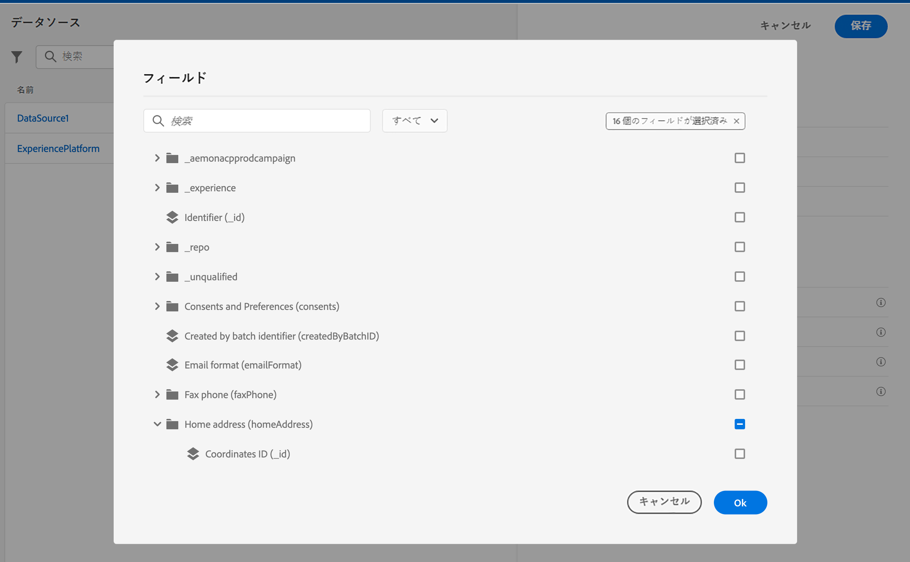

# ジャーニーの設定 {#configure-journeys}

>[!CONTEXTUALHELP]
>id="ajo_journey_configuration_dashboard"
>title="ジャーニー設定について"
>abstract="ジャーニーでメッセージを送信するには、データソース、イベント、アクションを設定する必要があります。データソースを使用すると、ジャーニーで使用する追加情報（例：条件）を取得するよう、システムへの接続を定義できます。イベントを使用すると、イベントを受信したときにジャーニーをトリガーすることができます。カスタムアクションを使用すると、サードパーティのシステムに接続してメッセージを送信できます。Journey Optimizer の組み込みメッセージ機能を使用している場合は、アクションを設定する必要はありません。"

ジャーニーでメッセージを送信するには、**[!UICONTROL データソース]**、**[!UICONTROL イベント]**、**[!UICONTROL アクション]**&#x200B;を設定する必要があります。

## データソース {#data-sources}

データソースを設定すると、システムへの接続を定義して、ジャーニーで使用する追加情報を取得することができます。[詳細](../../using/datasource/about-data-sources.md)

## イベント {#events}

イベントを使用すると、ジャーニーをまとめてトリガーし、ジャーニーの過程にある個人にリアルタイムでメッセージを送信できます。

イベントの設定では、ジャーニーで想定されるイベントを設定します。受信イベントのデータは、Adobe Experience Data Model（XDM）に従って正規化されます。イベントは、認証済みイベントと未認証イベント（Adobe Mobile SDK イベントなど）のストリーミング取り込み API から取り込みます。[詳細](../../using/event/about-events.md)

## アクション {#actions}

Journey Optimizer にはメッセージ機能があらかじめ組み込まれているので、ジャーニーにチャネルアクションアクティビティを追加するだけで済みます。サードパーティのシステムを使用してメッセージを送信する場合は、カスタムアクションを作成できます。[詳細情報](../../using/action/action.md)

## Adobe Experience Platform フィールドの参照 {#friendly-names-display}

定義時 [イベントペイロード](../event/about-creating.md#define-the-payload-fields), [フィールドグループペイロード](../datasource/configure-data-sources.md#define-field-groups) およびフィールドの選択 [式エディター](../building-journeys/expression/expressionadvanced.md)を選択すると、フィールド名に加えて表示名が表示されます。 この情報は、エクスペリエンスデータモデルのスキーマ定義から取得されます。

スキーマの設定中に「xdm:alternateDisplayInfo」などの記述子が指定されると、表示名がわかりやすい名前に置き換えられます。 この変数は、「eVar」および汎用フィールドを操作する場合に特に便利です。API 呼び出しを使用して、わかりやすい名前記述子を設定できます。詳しくは、[スキーマレジストリ開発者ガイド](https://experienceleague.adobe.com/docs/experience-platform/xdm/api/getting-started.html?lang=ja){target="_blank"}を参照してください。

わかりやすい名前を使用できる場合は、フィールドは次のように表示されます `<friendly-name>(<name>)`. わかりやすい名前がない場合は、例えば表示名が表示されます `<display-name>(<name>)`. いずれも定義されていない場合は、フィールドの技術的な名前のみ `<name>`.

>[!NOTE]
>
>スキーマの和集合からフィールドを選択した場合、わかりやすい名前は取得されません。
