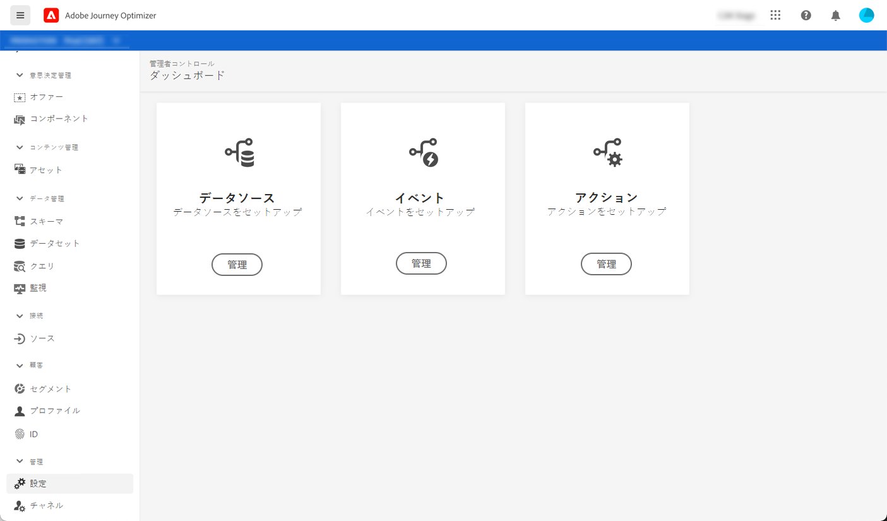
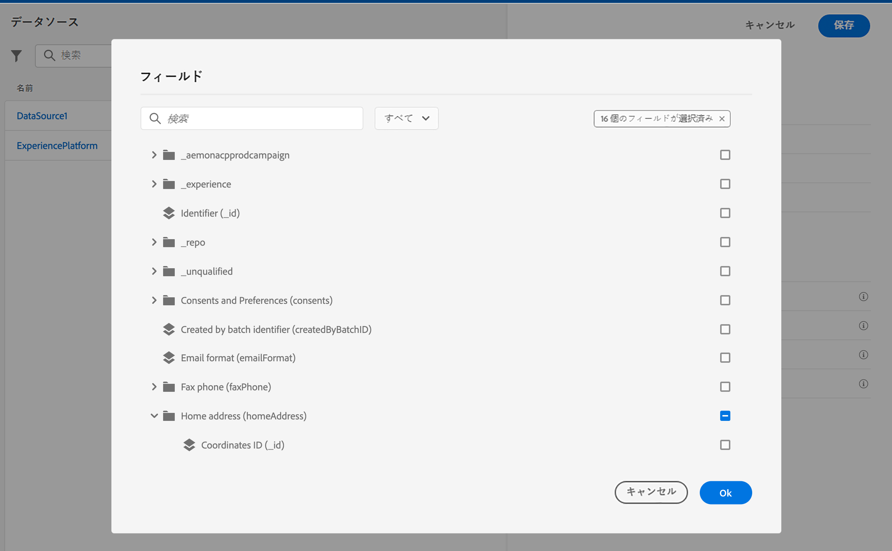

# ジャーニーの設定

ジャーニーを含むメッセージを送信するには、**[!UICONTROL データソース]**、**[!UICONTROL イベント]**、**[!UICONTROL アクション]**&#x200B;を設定する必要があります。

## データソース

データソースを設定すると、ジャーニーで使用される追加情報を取得するため、システムへの接続を定義できます。[詳細情報](../../using/datasource/about-data-sources.md)

## イベント

イベントを使用すると、ジャーニーをまとめてトリガーし、ジャーニーの過程にある個人にリアルタイムでメッセージを送信できます。

イベントの設定では、ジャーニーで必要なイベントを設定します。受信イベントのデータは、Adobe Experience Data Model（XDM）に従って正規化されます。イベントは、認証済みイベントと未認証イベント（Adobe Mobile SDK イベントなど）のストリーミング取得 API から取得します。[詳細情報](../../using/event/about-events.md)

## アクション

Journey Optimizerメッセージ機能は次の組み込み機能です。必要なのは、コンテンツのデザインとメッセージのパブリッシュだけです。 サードパーティシステムを使用してメッセージを送信する場合は、カスタムアクションを作成できます。[詳細情報](../../using/action/action.md)

## Adobe Experience Platform フィールドの参照 {#friendly-names-display}

[イベントペイロード](../event/about-creating.md#define-the-payload-fields)と[フィールドグループペイロード](../datasource/configure-data-sources.md#define-field-groups)を定義して[式エディター](https://experienceleague.adobe.com/docs/journeys/using/building-advanced-conditions-journeys/expressionadvanced.html?lang=ja)でフィールドを選択する際には、フィールド名に加えて表示名が表示されます。この情報は、エクスペリエンスデータモデルのスキーマ定義から取得されます。

スキーマの設定中に「xdm:alternateDisplayInfo」などの記述子が指定された場合、表示名はユーザーにわかりやすい名前に置き換えられます。この変数は、「eVar」および汎用フィールドを操作する場合に特に便利です。API 呼び出しを使用して、わかりやすい名前記述子を設定できます。詳しくは、[スキーマレジストリデベロッパーガイド](https://experienceleague.adobe.com/docs/experience-platform/xdm/api/getting-started.html?lang=ja)を参照してください。

わかりやすい名前が使用できる場合は、フィールドが `<friendly-name>(<name>)` と表示されます。わかりやすい名前がない場合は、表示名（例：`<display-name>(<name>)`）が表示されます。いずれも定義されていない場合は、フィールドの技術的な名前のみ（`<name>`）が表示されます。

>[!NOTE]
>
>スキーマの和集合からフィールドを選択した場合、わかりやすい名前は取得されません。