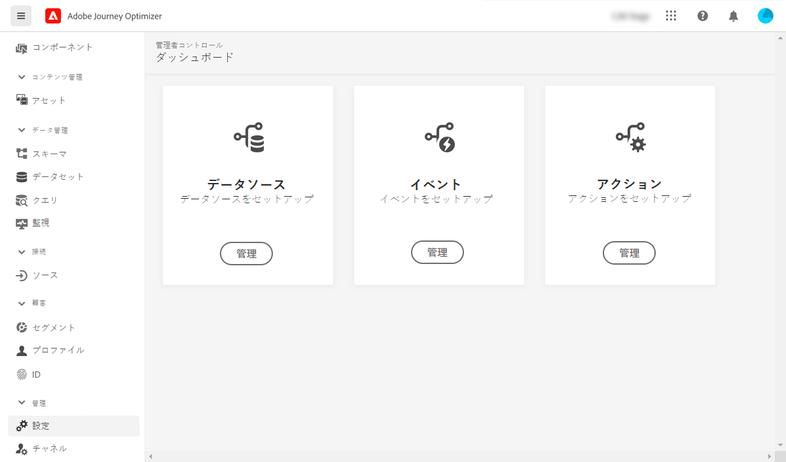
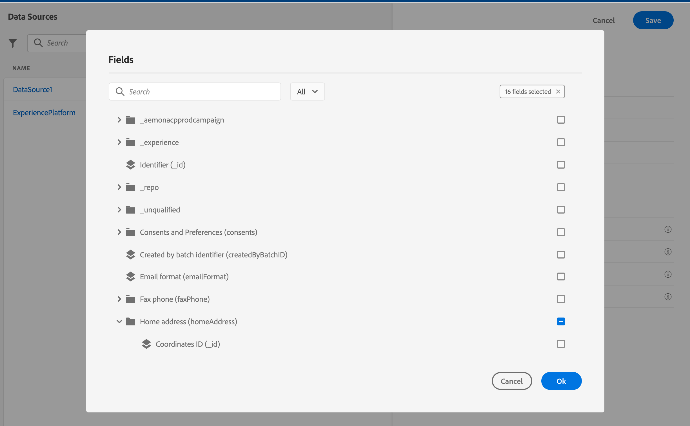

# ジャーニー設定の基本を学ぶ {#configure-journeys}

>[!BEGINSHADEBOX]

**このページ：**&#x200B;では、ジャーニーのトリガー化、外部データの拡充、Adobe Journey Optimizerでのメッセージ送信に必要なデータソース、イベント、アクションの設定方法について説明します。

>[!ENDSHADEBOX]

>[!CONTEXTUALHELP]
>id="ajo_journey_configuration_dashboard"
>title="ジャーニー設定について"
>abstract="ジャーニーでメッセージを送信するには、データソース、イベント、アクションを設定する必要があります。 データソースを使用すると、ジャーニーで利用する追加情報（例：条件）を取得するよう、システムへの接続を確立できます。 イベントを使用すると、イベントを受信したときにジャーニーをトリガーすることができます。 カスタムアクションを使用すると、サードパーティのシステムへの接続が容易になり、メッセージを送信できます。 Journey Optimizer のビルトインのメッセージ機能を使用している場合は、アクションを設定する必要はありません。"

ジャーニーでメッセージを送信するには、**[!UICONTROL データソース]**、**[!UICONTROL イベント]**、**[!UICONTROL アクション]**&#x200B;を設定する必要があります。 データソースを使用すると、ジャーニーで利用する追加情報（例：条件）を取得するよう、システムへの接続を確立できます。 イベントを使用すると、イベントを受信したときにジャーニーをトリガーすることができます。 カスタムアクションを使用すると、サードパーティのシステムへの接続が容易になり、メッセージを送信できます。 Journey Optimizer のビルトインのメッセージ機能を使用している場合は、アクションを設定する必要はありません。

また、カスタムデータソースとカスタムアクションを通じて、外部システムへの接続を設定することもできます。 これにより、例えば、外部の予約システムからのデータを使用してジャーニーを充実させたり、Epsilon や Facebook などのサードパーティシステムを使用してメッセージを送信したりできます。 方法について詳しくは、[Journey Optimizer と外部システムの統合](external-systems.md)を参照してください。

## データソース {#data-sources}

データソースを設定すると、システムへの接続を定義して、ジャーニーで使用する追加情報を取得することができます。 [詳細情報](../../using/datasource/about-data-sources.md)

## イベント {#events}

イベントを使用すると、ジャーニーをまとめてトリガーし、ジャーニーの過程にある個人にリアルタイムでメッセージを送信できます。

イベントの設定では、ジャーニーで想定されるイベントを設定します。 受信イベントのデータは、Adobe エクスペリエンスデータモデル（XDM）に従って正規化されます。 イベントは、認証済みイベントと未認証イベント（Adobe Mobile SDK イベントなど）のストリーミング取得 API から取り込みます。 [詳細情報](../../using/event/about-events.md)

## アクション {#actions}

Journey Optimizer にはビルトインのメッセージ機能があるので、ジャーニーにチャネルアクションアクティビティを追加するだけで済みます。 サードパーティのシステムを使用してメッセージを送信する場合は、カスタムアクションを作成できます。 [詳細情報](../../using/action/action.md)

## Adobe Experience Platform フィールドの参照 {#friendly-names-display}

[イベントペイロード](../event/about-creating.md#define-the-payload-fields)と[フィールドグループペイロード](../datasource/configure-data-sources.md#define-field-groups)を定義して[式エディター](../building-journeys/expression/expressionadvanced.md)でフィールドを選択する際には、フィールド名に加えて表示名が表示されます。 この情報は、エクスペリエンスデータモデルのスキーマ定義から取得されます。

スキーマの設定中に「xdm:alternateDisplayInfo」などの記述子が指定されている場合、ユーザーフレンドリーな名前が表示名に置き換えられます。 この変数は、「eVar」および汎用フィールドを操作する場合に特に便利です。 API 呼び出しを使用して、わかりやすい名前記述子を設定できます。 詳しくは、[スキーマレジストリデベロッパーガイド](https://experienceleague.adobe.com/docs/experience-platform/xdm/api/getting-started.html?lang=ja){target="_blank"}を参照してください。

わかりやすい名前が使用できる場合は、フィールドが `<friendly-name>(<name>)` と表示されます。 わかりやすい名前がない場合は、表示名（例：`<display-name>(<name>)`）が表示されます。 いずれも定義されていない場合は、フィールドの技術的な名前のみ（`<name>`）が表示されます。

>[!NOTE]
>
>スキーマの和集合からフィールドを選択した場合、わかりやすい名前は取得されません。
