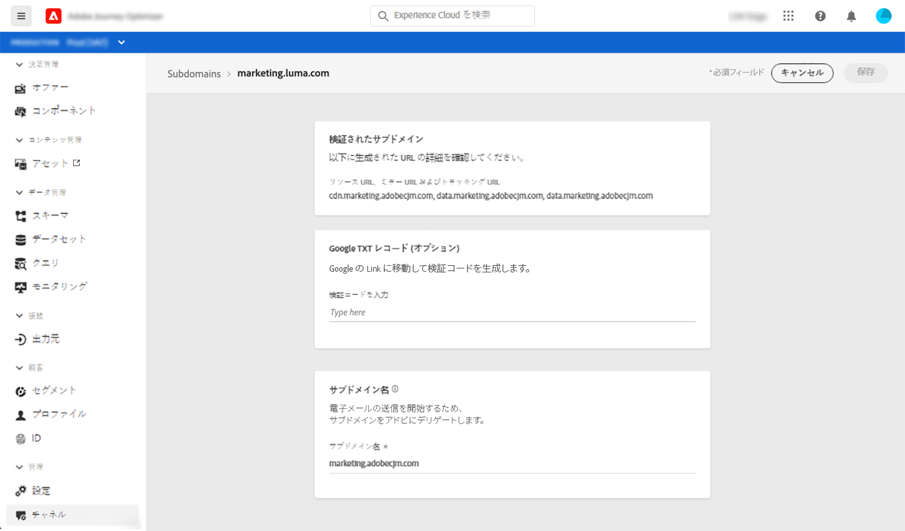

# デリゲートされたサブドメインへのアクセス {#access-delegated-subdomains}

デリゲートされたすべてのサブドメインが&#x200B;**[!UICONTROL チャネル]**／**[!UICONTROL サブドメイン]**&#x200B;メニューに表示されます。 フィルターを使用して、リスト（デリゲーション日、ユーザー、ステータス）を絞り込むことができます。

**[!UICONTROL ステータス]**&#x200B;列には、サブドメインのデリゲーションプロセスに関する情報が表示されます。

* **[!UICONTROL ドラフト]**：サブドメインのデリゲーションがドラフトとして保存されました。サブドメイン名をクリックして、デリゲーションプロセスを再開します。
* **[!UICONTROL 処理中]**：サブドメインを使用する前に、いくつかの設定確認がおこなわれます。
* **[!UICONTROL 成功]**：サブドメインは正常にチェックされ、メッセージの配信に使用できます。
* **[!UICONTROL 失敗]**：サブドメインのデリゲーションが送信された後、1 つ以上の確認が失敗しました。

サブドメインに関する詳細情報にアクセスするには、リストからサブドメインを開きます。 次のことができます。

* デリゲーションプロセス中に設定されたサブドメイン名（読み取り専用）と、生成された URL（リソース、ミラーページ、トラッキング URL）を取得します。

* Google サイト検証 TXT レコードをサブドメインに追加して、検証済みであることを確認します（[サブドメインに Google TXT レコードを追加する](google-txt.md)を参照）。

