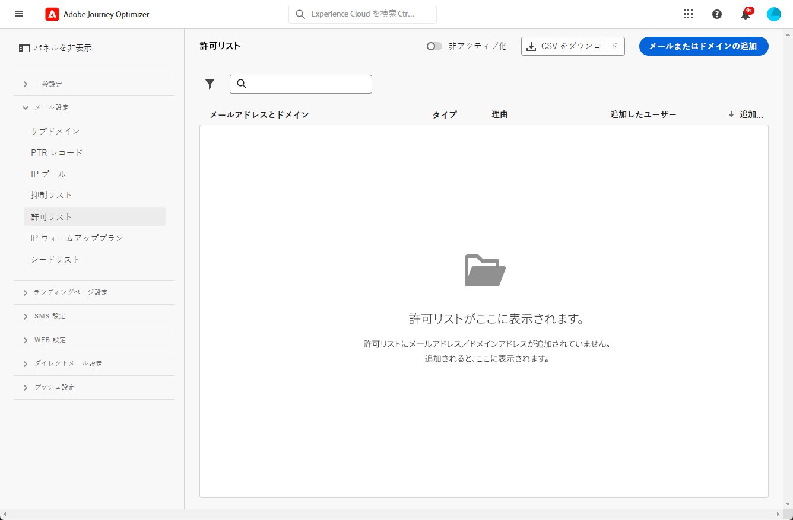

# 許可リスト {#allow-list}

[サンドボックス](../administration/sandboxes.md)レベルで特定の送信セーフリストを定義することが可能です。

この許可リストを使用すると、個々のメールアドレスまたはドメインを指定して、これらの受信者またはドメインでのみ、特定のサンドボックスから送信するメールの受信が許可されるようにすることができます。

>[!CAUTION]
>
>この機能はメールチャネルにのみ適用されます。これは、実稼動サンドボックスと実稼動以外のサンドボックスで使用できます。

例えば、ミスが発生する可能性がある非実稼働インスタンスでは、許可リストにより、不要なメッセージを実際の顧客アドレスに送信するリスクがなくなり、テスト目的で安全な環境が提供されます。

また、許可リストがアクティブでも空の場合は、メールは送信されません。 したがって、何らかの重大な問題が発生した場合、この機能を使用して、問題が解決するまで [!DNL Journey Optimizer] からのすべての発信を停止できます。詳しくは、[許可リスト論理](#logic)を参照してください。

また、Journey Optimizer の **Suppression REST API** を活用して、抑制リストと許可リストを使用して送信メッセージを制御できます。[Suppression REST API の使用方法を学ぶ](https://developer.adobe.com/journey-optimizer-apis/references/suppression/){target="_blank"}

## 許可リストへのアクセス {#access-allowed-list}

許可されたメールアドレスとドメインの詳細なリストにアクセスするには、**[!UICONTROL 管理]**／**[!UICONTROL チャネル]**／**[!UICONTROL メール設定]**&#x200B;に移動し、「**[!UICONTROL 許可リスト]**」を選択します。



>[!CAUTION]
>
>許可リストの表示、エクスポートおよび管理を行う権限は、[ジャーニー管理者](../administration/ootb-product-profiles.md#journey-administrator)にのみ付与されます。[!DNL Journey Optimizer] ユーザーのアクセス権の管理について詳しくは、[この節](../administration/permissions-overview.md)を参照してください。

許可リストを CSV ファイルとしてエクスポートするには、「**[!UICONTROL CSV をダウンロード]**」ボタンを選択します。

エントリを完全に削除するには、「**[!UICONTROL 削除]**」ボタンを使用します。

メールアドレスまたはドメインで検索し、**[!UICONTROL アドレスタイプ]**&#x200B;でフィルタリングできます。選択したら、リストの上部に表示されているフィルターをクリアできます。


## 許可リストをアクティブ化 {#enable-allow-list}

許可リストをアクティブ化するには、次の手順に従います。

1. **[!UICONTROL チャネル]**／**[!UICONTROL メール設定]**／**[!UICONTROL 許可リスト]**&#x200B;メニューにアクセスします。

1. 切り替えボタンを選択します。

   

1. 「**[!UICONTROL 許可リストをアクティブ化]**」を選択します。許可リストがアクティブになりました。

   

   >[!NOTE]
   >
   >許可リストをアクティブ化した後、ジャーニーとキャンペーンで有効になるまでに 5 分の待ち時間がかかります。

許可リストのロジックは、この機能がアクティブな場合に適用されます。詳しくは、[この節](#logic)を参照してください。

>[!NOTE]
>
>有効にすると、ジャーニーの実行時に許可リスト機能がアクティブになりますが、[配達確認](../content-management/proofs.md)を使用してメッセージをテストし、[テストモード](../building-journeys/testing-the-journey.md)を使用してジャーニーをテストする場合にも機能します。

## 許可リストを非アクティブ化 {#deactivate-allow-list}

許可リストを非アクティブ化するには、次の手順に従います。

1. **[!UICONTROL チャネル]**／**[!UICONTROL メール設定]**／**[!UICONTROL 許可リスト]**&#x200B;メニューにアクセスします。

1. 切り替えボタンを選択します。

   

1. 「**[!UICONTROL 許可リストを非アクティブ化]**」を選択します。許可リストがアクティブではなくなりました。

   

   >[!NOTE]
   >
   >許可リストを非アクティブ化した後、ジャーニーとキャンペーンで有効になるまでに 5 分の待ち時間がかかります。

許可リストロジックは、機能が非アクティブ化された場合は適用されません。詳しくは、[この節](#logic)を参照してください。

## 許可リストへのエンティティの追加 {#add-entities}

特定のサンドボックスの許可リストに新しいメールアドレスまたはドメインを追加するには、[リストに手動で入力](#manually-populate-list)するか、[API 呼び出し](#api-call-allowed-list)を使用します。

>[!NOTE]
>
>許可リストには、最大 1,000 個のエントリを含めることができます。

### 許可リストへの手動入力 {#manually-populate-list}

>[!CONTEXTUALHELP]
>id="ajo_admin_allowed_list_add_header"
>title="許可リストへのアドレスまたはドメインの追加"
>abstract="新しいメールアドレスまたはドメインを 1 つずつ選択して、許可リストに手動で追加できます。"

>[!CONTEXTUALHELP]
>id="ajo_admin_allowed_list_add"
>title="許可リストへのアドレスまたはドメインの追加"
>abstract="新しいメールアドレスまたはドメインを 1 つずつ選択して、許可リストに手動で追加できます。"

ユーザーインターフェイスを介してメールアドレスまたはドメインを追加することで、[!DNL Journey Optimizer] 許可リストに手動で入力できます。

>[!NOTE]
>
>メールアドレスまたはドメインは一度に 1 つだけ追加できます。

それには、次の手順に従います。

1. 「**[!UICONTROL メールまたはドメインの追加]**」ボタンを選択します。

   

1. アドレスタイプとして、「**[!UICONTROL メールアドレス]**」または「**[!UICONTROL ドメインアドレス]**」を選択します。

1. メールの送信先となるメールアドレスまたはドメインを入力します。

   >[!NOTE]
   >
   >必ず有効なメールアドレス（abc@company.com など）または有効なドメイン（abc.company.com など）を入力してください。

1. 必要に応じて理由を指定します。

   

   >[!NOTE]
   >
   >ASCII 文字はすべて 32 ～ 126 文字から成り、「**[!UICONTROL 理由]**」フィールドに入力できます。完全なリストは、例えば[このページ](https://en.wikipedia.org/wiki/ASCII#Printable_characters){target="_blank"}で確認することができます。

1. 「**[!UICONTROL 送信]**」をクリックします。

### API 呼び出しを使用したエンティティの追加 {#api-call-allowed-list}

許可リストに入力するには、`listType` 属性に `ALLOWED` 値を指定して抑制 API を呼び出すこともできます。例：


「**追加**」、「**削除**」および「**取得**」の操作を実行できます。

API 呼び出しについて詳しくは、 [Adobe Experience Platform API](https://experienceleague.adobe.com/docs/experience-platform/landing/platform-apis/api-guide.html?lang=ja){target="_blank"} リファレンスドキュメントを参照してください。

## 許可リストのダウンロード {#download-allowed-list}

許可リストを CSV ファイルとして書き出すには、次の手順に従います。

1. 「**[!UICONTROL CSV をダウンロード]**」ボタンを選択します。 

   

1. ファイルが生成されるまで待ちます。

   

   >[!NOTE]
   >
   >ダウンロード時間は、ファイルサイズ（許可リストにあるアドレスの数）によって異なります。
   >
   >特定のサンドボックスに対して、一度に 1 つのダウンロードリクエストを処理できます。

1. ファイルが生成されると、通知が届きます。 画面の右上にあるベルアイコンをクリックして、表示します。

1. 通知自体をクリックして、ファイルをダウンロードします。

   

   >[!NOTE]
   >
   >リンクは 24 時間有効です。

## 許可リストのロジック {#logic}

>[!CONTEXTUALHELP]
>id="ajo_admin_allowed_list_logic"
>title="許可リストの管理"
>abstract="許可リストをアクティブ化すると、許可リストに含まれる受信者にのみ、このサンドボックスからメールメッセージが届きます。非アクティブ化すると、すべての受信者にメールが届きます。"

許可リストが[有効](#enable-allow-list)の場合、次のロジックが適用されます。

* 許可リストが&#x200B;**空**&#x200B;の場合、メールは送信されません。

* エンティティが&#x200B;**許可リストに登録され**、抑制リストには登録されていない場合、対応する受信者にメールが送信されます。ただし、エンティティが[抑制リスト](../reports/suppression-list.md)にも登録されている場合、対応する受信者にはメールは届きません（**[!UICONTROL 抑制されている]**&#x200B;ことが理由）。

* エンティティが&#x200B;**許可リストに登録されていない**（かつ抑制リストにも登録されていない）場合、対応する受信者にはメールは届きません（**[!UICONTROL 許可されていない]**&#x200B;ことが理由）。

>[!NOTE]
>
>「**[!UICONTROL 許可されていない]**」のステータスを持つプロファイルは、メッセージ送信プロセス中に除外されます。したがって、**ジャーニーレポート**&#x200B;では、これらのプロファイルがジャーニー（[オーディエンスを読み取り](../building-journeys/read-audience.md)アクティビティと[メッセージアクティビティ](../building-journeys/journeys-message.md)）内を移動したものとして表示されますが、これらはメール送信前に除外されるので、**メールレポート**&#x200B;では、**[!UICONTROL 送信済み]**&#x200B;指標に含まれません。
>
>詳しくは、[ライブレポート](../reports/live-report.md)と[グローバルレポート](../reports/global-report.md)を参照してください。

許可リストが[無効化](#deactivate-allow-list)されると、現在のサンドボックスから送信しているすべてのメールが、実際の顧客アドレスを含むすべての受信者（その受信者が抑制リストにない場合）に送信されます。

## 除外レポート {#reporting}

許可リストがアクティブな場合は、許可リスト上になかったので、送信から除外されたメールアドレスまたはドメインを取得できます。それには、[Adobe Experience Platform Query Service](https://experienceleague.adobe.com/docs/experience-platform/query/api/getting-started.html?lang=ja){target="_blank"} を使用して、以下の API 呼び出しを行います。

受信者が許可リストに登録されていなかったので送信されなかった&#x200B;**メールの数**&#x200B;を取得するには、次のクエリを使用します。

```sql
SELECT count(distinct _id) from cjm_message_feedback_event_dataset WHERE
_experience.customerJourneyManagement.messageExecution.messageExecutionID = '<MESSAGE_EXECUTION_ID>' AND
_experience.customerJourneyManagement.messageDeliveryfeedback.feedbackStatus = 'exclude' AND
_experience.customerJourneyManagement.messageDeliveryfeedback.messageExclusion.reason = 'EmailNotAllowed'
```

受信者が許可リストに登録されていなかったので送信されなかった&#x200B;**メールアドレスのリスト**&#x200B;を取得するには、次のクエリを使用します。

```sql
SELECT distinct(_experience.customerJourneyManagement.emailChannelContext.address) from cjm_message_feedback_event_dataset WHERE
_experience.customerJourneyManagement.messageExecution.messageExecutionID IS NOT NULL AND
_experience.customerJourneyManagement.messageDeliveryfeedback.feedbackStatus = 'exclude' AND
_experience.customerJourneyManagement.messageDeliveryfeedback.messageExclusion.reason = 'EmailNotAllowed'
```
