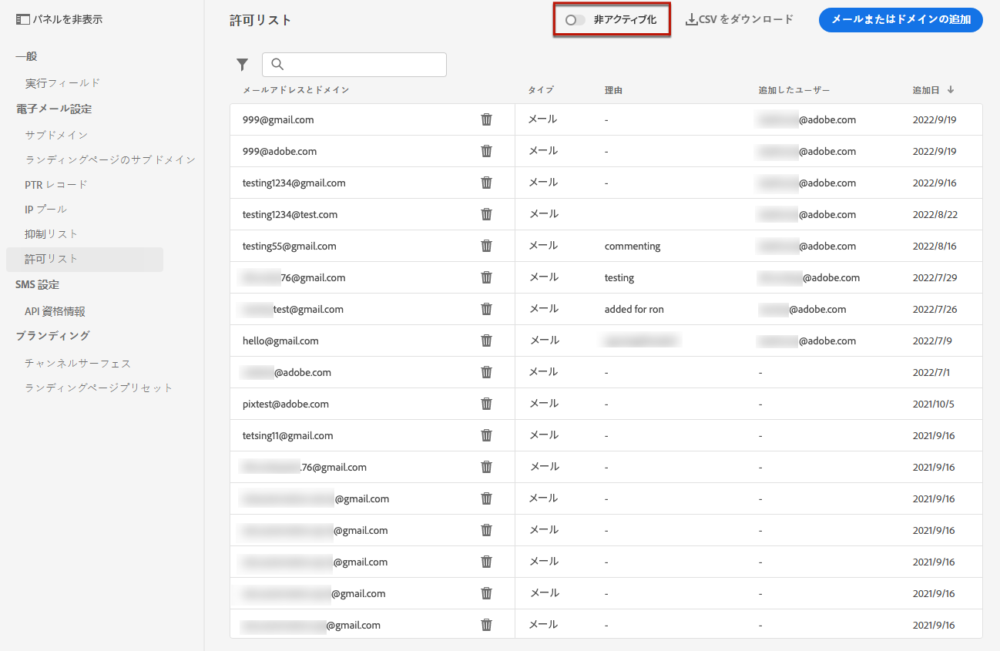

# 許可リスト {#allow-list}

特定の送信セーフリストを [サンドボックス](../administration/sandboxes.md) レベルを設定し、テスト用の保護された環境を保持します。

ミスが発生する可能性のある非実稼動インスタンスでは、許可リストにより、不要なメッセージが顧客に送信されるリスクがなくなります。

>[!NOTE]
>
>この機能は、実稼動用サンドボックスと非実稼動用サンドボックスで使用できます。

許可リストを使用すると、特定のサンドボックスから送信するメールを受信する権限のある唯一の受信者またはドメインとなる個々のメールアドレスまたはドメインを指定できます。これにより、テスト環境で実際の顧客アドレスに誤ってメールを送信するのを防ぐことができます。

>[!CAUTION]
>
>これはメールチャネルにのみ適用されます。

## 許可リスト {#access-allowed-list}

許可されている電子メールアドレスとドメインの詳細なリストにアクセスするには、以下に移動します。 **[!UICONTROL 管理]** > **[!UICONTROL チャネル]** > **[!UICONTROL 電子メール設定]**&#x200B;を選択し、 **[!UICONTROL 許可リスト]**.


>[!CAUTION]
>
>許可リストを表示、エクスポートおよび管理する権限は、次のものに制限されます。 [ジャーニー管理者](../administration/ootb-product-profiles.md#journey-administrator). [!DNL Journey Optimizer] ユーザーのアクセス権の管理について詳しくは、[この節](../administration/permissions-overview.md)を参照してください。

許可リストを CSV ファイルとして書き出すには、 **[!UICONTROL CSV をダウンロード]** 」ボタンをクリックします。

以下を使用： **[!UICONTROL 削除]** ボタンをクリックして、エントリを完全に削除します。

E メールアドレスやドメインを検索し、 **[!UICONTROL アドレスタイプ]**. 選択したら、リストの上部に表示されるフィルターをクリアできます。


## 許可リストの有効化 {#enable-allow-list}

許可リストを有効にするには、次の手順に従います。

1. **[!UICONTROL チャネル]**／**[!UICONTROL メール設定]**／**[!UICONTROL 許可リスト]**&#x200B;メニューにアクセスします。

1. クリック **[!UICONTROL 有効/無効許可リスト]**.

   

1. 「**[!UICONTROL 許可リストを有効化]**」を選択します。

   

1. 「**[!UICONTROL 保存]**」をクリックします。この許可リストは有効です。

許可リストロジックは、この機能が有効な場合に適用されます。 詳しくは、[この節](#logic)を参照してください。

>[!NOTE]
>
>有効にすると、ジャーニーの実行時に許可リスト機能がアクティブになりますが、[配達確認](../design/preview.md#send-proofs)を使用してメッセージをテストし、[テストモード](../building-journeys/testing-the-journey.md)を使用してジャーニーをテストする場合にも機能します。

## 許可リストへのエンティティの追加 {#add-entities}

特定のサンドボックス用に新しい電子メールアドレスまたはドメインを許可リストに追加するには、次のいずれかを実行します。 [リストに手動で入力](#manually-populate-list)または [API 呼び出し](#api-call-allowed-list).

>[!NOTE]
>
>許可リストには、最大 1,000 個のエントリを含めることができます。

### 許可リスト {#manually-populate-list}

>[!CONTEXTUALHELP]
>id="ajo_admin_allowed_list_add"
>title="アドレスまたはドメインを許可リストに追加"
>abstract="新しい E メールアドレスまたはドメインを 1 つずつ選択して、許可リストに手動で追加できます。"

手動で [!DNL Journey Optimizer] 許可リストインターフェイスを使用して電子メールアドレスまたはドメインを追加する。

>[!NOTE]
>
>一度に追加できる電子メールアドレスまたはドメインは 1 つだけです。

それには、次の手順に従います。

1. を選択します。 **[!UICONTROL メールまたはドメインを追加]** 」ボタンをクリックします。

   

1. アドレスタイプとして、「**[!UICONTROL メールアドレス]**」または「**[!UICONTROL ドメインアドレス]**」を選択します。

1. 電子メールを送信する電子メールアドレスまたはドメインを入力します。

   >[!NOTE]
   >
   >有効な電子メールアドレス (abc@company.comなど ) またはドメイン（abc.company.com など）を必ず入力してください。

1. 必要に応じて理由を指定します。

   

   >[!NOTE]
   >
   >ASCII 文字はすべて 32 ～ 126 文字から成り、「**[!UICONTROL 理由]**」フィールドに入力できます。完全なリストは、例えば[このページ](https://en.wikipedia.org/wiki/Wikipedia:ASCII#ASCII_printable_characters){target=&quot;_blank&quot;}で確認することができます。

1. 「**[!UICONTROL 送信]**」をクリックします。

### API 呼び出しを使用したエンティティの追加 {#api-call-allowed-list}

許可リストに値を入力するには、 `ALLOWED` の値 `listType` 属性。 例えば：


「**追加**」、「**削除**」および「**取得**」の操作を実行できます。

API 呼び出しについて詳しくは、 [Adobe Experience Platform API](https://experienceleague.adobe.com/docs/experience-platform/landing/platform-apis/api-guide.html?lang=ja){target=&quot;_blank&quot;} リファレンスドキュメントを参照してください。

## 許可リストロジック {#logic}

許可リストが [有効](#enable-allow-list)の場合、次のロジックが適用されます。

* 許可リストが **空**&#x200B;に含めないと、E メールは送信されません。

* エンティティが **許可リストで**&#x200B;抑制リストにはないので、E メールを対応する受信者に送信できます。 ただし、エンティティが [抑制リスト](../reports/suppression-list.md)に設定されている場合、対応する受信者は E メールを受信しません ( 理由は **[!UICONTROL 抑制済み]**.

* エンティティが **許可リスト** （また、抑制リストにはない）、対応する受信者は E メールを受信しません ( 理由は **[!UICONTROL 許可されていません]**.

>[!NOTE]
>
>「**[!UICONTROL 許可されていない]**」のステータスを持つプロファイルは、メッセージ送信プロセス中に除外されます。したがって、 **ジャーニーレポート** これらのプロファイルがジャーニーを通じて移動したとして表示されます ([セグメントを読み取り](../building-journeys/read-segment.md) および [メッセージアクティビティ](../building-journeys/journeys-message.md))、 **メールレポート** は、 **[!UICONTROL 送信済み]** 指標は、E メール送信前に除外されるので、ご注意ください。
>
>詳しくは、[ライブレポート](../reports/live-report.md)と[グローバルレポート](../reports/global-report.md)を参照してください。

## 除外レポート {#reporting}

実稼働以外のサンドボックスでこの機能を有効にすると、許可リストに登録されていなかったので送信から除外されたメールアドレスやドメインを取得できます。それには、[Adobe Experience Platform Query Service](https://experienceleague.adobe.com/docs/experience-platform/query/api/getting-started.html?lang=ja){target=&quot;_blank&quot;} を使用して、以下の API 呼び出しを行います。

受信者が許可リストに登録されていなかったので送信されなかった&#x200B;**メールの数**&#x200B;を取得するには、次のクエリを使用します。

```sql
SELECT count(distinct _id) from cjm_message_feedback_event_dataset WHERE
_experience.customerJourneyManagement.messageExecution.messageExecutionID = '<MESSAGE_EXECUTION_ID>' AND
_experience.customerJourneyManagement.messageDeliveryfeedback.feedbackStatus = 'exclude' AND
_experience.customerJourneyManagement.messageDeliveryfeedback.messageExclusion.reason = 'EmailNotAllowed'
```

受信者が許可リストに登録されていなかったので送信されなかった&#x200B;**メールアドレスのリスト**&#x200B;を取得するには、次のクエリを使用します。

```sql
SELECT distinct(_experience.customerJourneyManagement.emailChannelContext.address) from cjm_message_feedback_event_dataset WHERE
_experience.customerJourneyManagement.messageExecution.messageExecutionID IS NOT NULL AND
_experience.customerJourneyManagement.messageDeliveryfeedback.feedbackStatus = 'exclude' AND
_experience.customerJourneyManagement.messageDeliveryfeedback.messageExclusion.reason = 'EmailNotAllowed'
```
