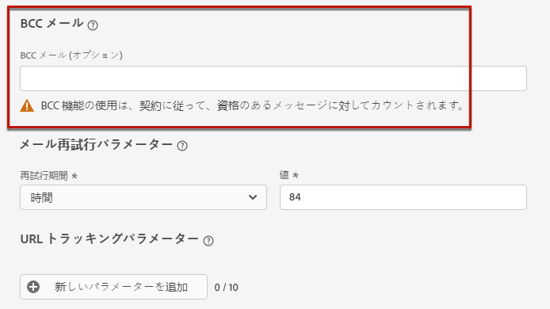
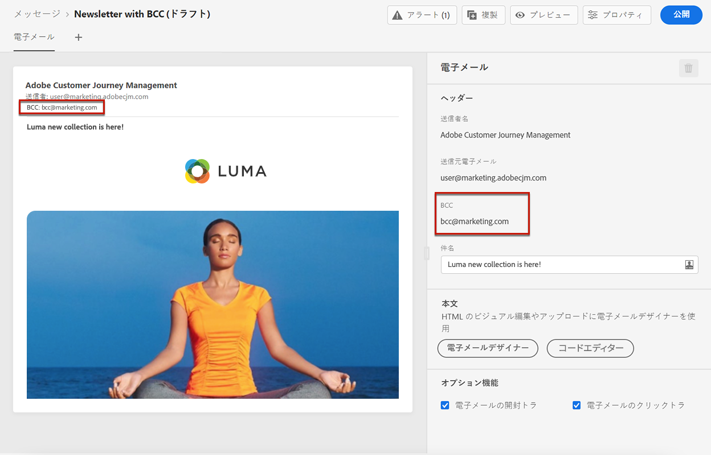
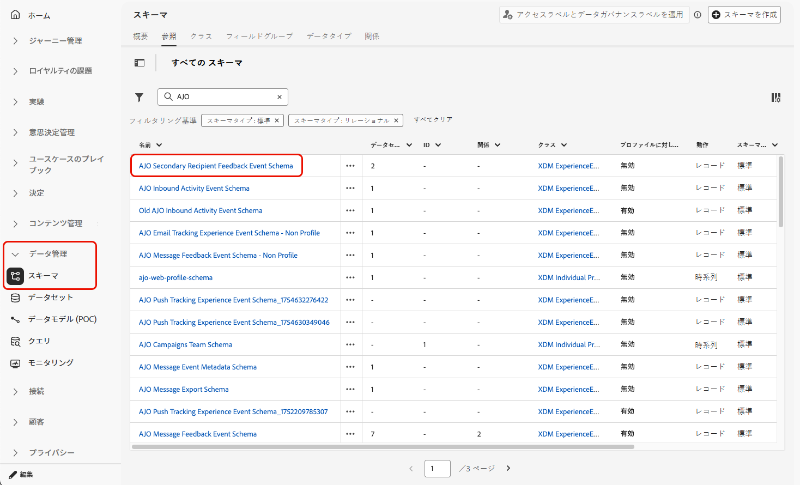
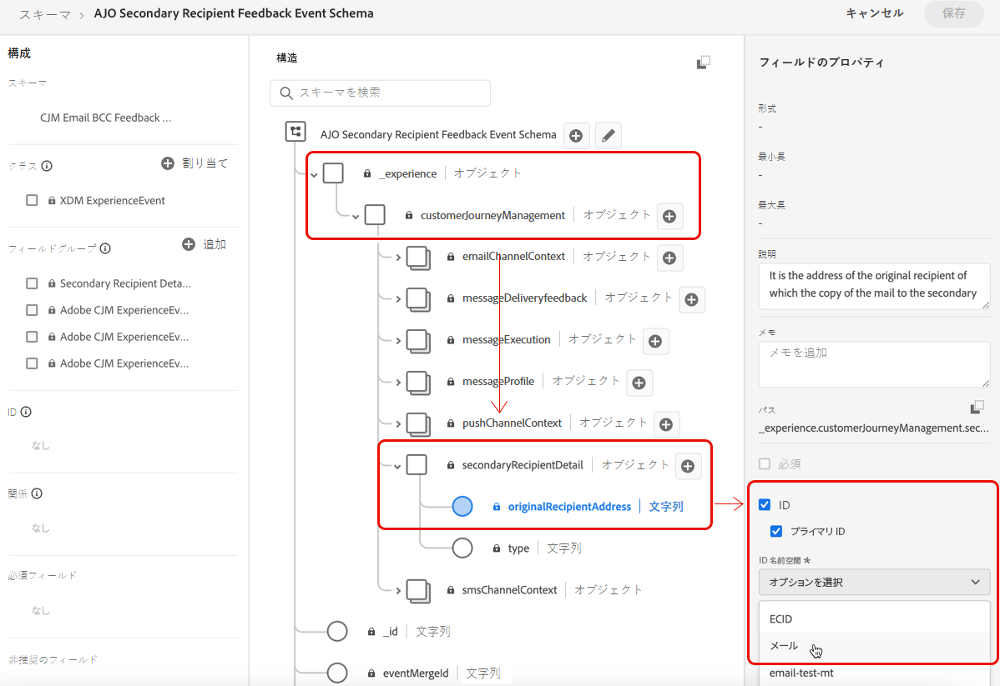
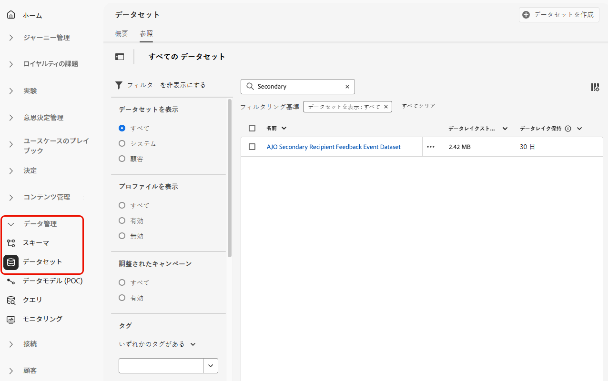
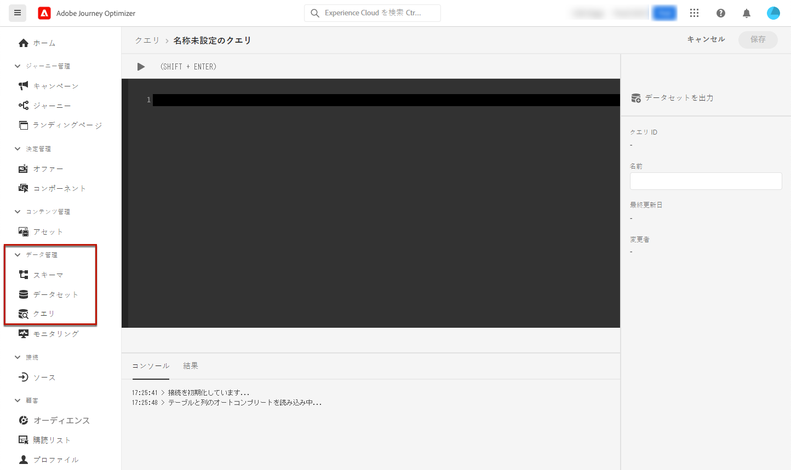
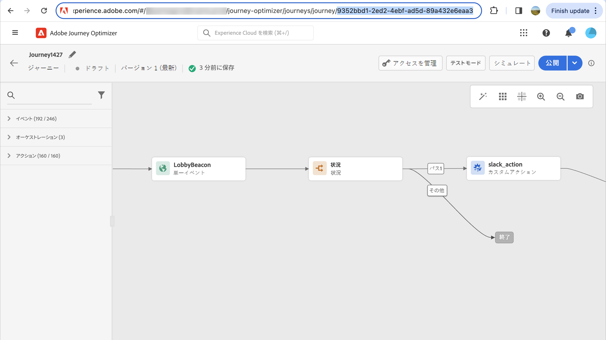

# アーカイブのサポート {#archiving-support}

## メッセージのアーカイブ方法 {#about-archiving}

HIPAA などの規制では、[!DNL Journey Optimizer] が個人に送信されたメッセージをアーカイブする方法を提供する必要があります。 実際、顧客が申し立てを行った場合、確認のために送信されたメッセージのコピーを取得できる必要があります。

* メールチャネルの場合、[!DNL Journey Optimizer] には、ビルトインの BCC メール機能が用意されています。 [詳細情報](#bcc-email)

* さらに、すべてのチャネルの場合、パーソナライズされていないメッセージテンプレートの詳細を含む&#x200B;**エンティティデータセット**&#x200B;の「テンプレート」フィールドを使用できます。 このフィールドを使用してデータセットをエクスポートすると、メッセージの送信者、送信先および送信時間などのメタデータを保存できます。 パーソナライズされたデータはエクスポートされず、テンプレート （メッセージの形式と構造）のみが考慮されます。 [詳細情報](../data/datasets-query-examples.md#entity-dataset)

>[!NOTE]
>
>[!DNL Journey Optimizer] は、SMS アーカイブ要件を独自にサポートしていません。 専用のアーカイブサポートについては、SMS ベンダー（Synch、Infobip または Twilio）と協力してください。

## メールに BCC を使用する方法 {#bcc-email}

>[!CONTEXTUALHELP]
>id="ajo_admin_preset_bcc"
>title="BCC メールアドレスの定義"
>abstract="BCC インボックスに送信することで、送信済みメールのコピーを保持できます。 送信されたすべてのメールがこの BCC アドレスにブラインドコピーされるように、目的のメールアドレスを入力します。 BCC アドレスのドメインは、アドビにデリゲートされたサブドメインとは異なる必要があります。 この機能はオプションです。"

[!DNL Journey Optimizer] から送信されたメールのブラインドカーボンコピー（BCC）を専用の BCC アドレスに送信できます。 このオプション機能を使用すると、ユーザーに送信するメール通信のコピーをコンプライアンスやアーカイブの目的で保持できます。 BCC アドレスは、メッセージの他の受信者には表示されません。

### BCC メールの有効化 {#enable-bcc}

**[!UICONTROL BCC メール]** オプションを有効にするには、[ チャネル設定](channel-surfaces.md)の専用フィールドに任意のメールアドレスを入力します。 アドビにデリゲートしたサブドメインで定義されたメールアドレスを除き、正しい形式で任意の外部アドレスを指定できます。 例えば、*marketing.luma.com* サブドメインをアドビにデリゲートした場合、*abc@marketing.luma.com* のようなアドレスは禁止されます。

>[!CAUTION]
>
>* BCC に設定できるメールアドレスは 1 つだけです。 現在のチャネル設定を使用して送信されたすべてのメールを保存するのに十分な受信容量があることを確認してください。 その他のレコメンデーションの一覧について詳しくは、[この節](#bcc-recommendations-limitations)を参照してください。
>* Healthcare Shield アドオンオファーを購入した場合は、BCC アドレスのISPがTLS 1.2 プロトコルをサポートしていることを確認してください。



設定が完了すると、この設定に基づくすべてのメールメッセージは、入力した BCC メールアドレスにブラインドコピーされます。 そこから、外部システムを使用してメッセージを処理およびアーカイブできます。

>[!CAUTION]
>
>BCC 機能の使用状況は、ライセンスを取得したメッセージ数に照らしてカウントされます。 したがって、アーカイブする重要な通信に使用される設定内でのみ有効にします。 ライセンスを取得したボリュームを契約書で確認します。

BCC メールアドレスの設定は、設定レベルで直ちに保存および処理されます。 この設定を使用して新しいメッセージを作成すると、BCC メールアドレスが自動的に表示されます。



ただし、BCC アドレスは、[こちら](../email/email-settings.md)で説明しているロジックに従って、コミュニケーションを送信するために取得されます。

### レコメンデーションと制限事項 {#bcc-recommendations-limitations}

* プライバシー上の理由から、BCC メールは、個人を特定できる情報（PII）を安全に保存できるアーカイブシステムで処理する必要があります。

* メッセージには、個人を特定できる情報（PII）などの機密データや非公開データを含めることができるので、BCC アドレスが正しいことを確認し、メッセージへのアクセスを保護します。

* BCC に使用するインボックスは、領域と配信について適切に管理される必要があります。 インボックスがバウンスを返した場合、一部のメールが受信されないのでアーカイブに失敗する可能性があります。

* メッセージは、ターゲット受信者よりも前に、BCC メールアドレスに配信される場合があります。 BCC メッセージは、元のメッセージが[バウンス](../reports/suppression-list.md#delivery-failures)された場合でも送信できます。

  <!--OR: Only successfully sent emails are taken in account. [Bounces](../reports/suppression-list.md#delivery-failures) are not. TO CHECK -->

* BCC アドレスに送信されたメールを開いたり、クリックしたりしないでください。送信分析の合計開封数とクリック数に考慮され、[レポート](../reports/report-gs-cja.md)で計算ミスが起きる可能性があります。

* BCC インボックスでメッセージをスパムとしてマークしないでください。このアドレスに送信される他のすべてのメールに影響を与えます。

>[!CAUTION]
>
>対応する受信者を直ちに登録解除する際には、BCC アドレスに送信されたメールの登録解除リンクをクリックしないようにしてください。

### GDPR への準拠 {#gdpr-compliance}

GDPR などの規制では、データ主体はいつでも同意を変更できると規定されています。 Journey Optimizerで送信するBCC メールには、安全に個人を特定できる情報（PII）が含まれているため、GDPRなどの規制に準拠してこれらのPIIを管理するには、**[!UICONTROL AJO セカンダリ Recipient Feedback Event Schema]**&#x200B;を編集する必要があります。

それには、次の手順に従います。

1. **[!UICONTROL Data management]** > **[!UICONTROL Schemas]** > **[!UICONTROL Browse]**&#x200B;に移動し、**[!UICONTROL AJO セカンダリ Recipient Feedback Event Schema]**&#x200B;を選択します。

   {width="95%"}

1. **[!UICONTROL _experience]**、**[!UICONTROL customerJourneyManagement]**、その後 **[!UICONTROL secondaryRecipientDetail]** をクリックして展開します。

1. **[!UICONTROL originalRecipientAddress]** を選択します。

1. 右側の&#x200B;**[!UICONTROL フィールドプロパティ]**&#x200B;で、「**[!UICONTROL ID]**」チェックボックスまで下にスクロールします。

1. そのチェックボックスで「**[!UICONTROL プライマリ ID]**」を選択します。

1. ドロップダウンリストから名前空間を選択します。

   {width="85%"}

1. 「**[!UICONTROL 適用]**」をクリックします。

>[!NOTE]
>
>プライバシーの管理と適用される規制について詳しくは、[Experience Platform ドキュメント](https://experienceleague.adobe.com/docs/experience-platform/privacy/home.html?lang=ja){target="_blank"}を参照してください。

### BCC レポートデータ {#bcc-reporting}

BCC に関するレポート自体は、ジャーニーレポートとメッセージレポートでは使用できません。 ただし、情報は、**[!UICONTROL AJO セカンダリ Recipient Feedback Event Dataset]**&#x200B;というシステム データセットに保存されます。 このデータセットに対してクエリを実行すると、デバッグ目的などに役立つ情報を見つけることができます。

ユーザーインターフェイスからこのデータセットにアクセスするには、**[!UICONTROL データ管理]**／**[!UICONTROL データセット]**／**[!UICONTROL 参照]**&#x200B;を選択します。 データセットにアクセスする方法について詳しくは、[この節](../data/get-started-datasets.md#access-datasets)を参照してください。

{width="85%"}

このデータセットに対してクエリを実行するには、[Adobe Experience Platform クエリサービス](https://experienceleague.adobe.com/docs/experience-platform/query/api/getting-started.html?lang=ja){target="_blank"}で提供されるクエリエディターを使用できます。 これにアクセスするには、**[!UICONTROL データ管理]**／**[!UICONTROL クエリ]**&#x200B;を選択し、「**[!UICONTROL クエリを作成]**」をクリックします。 [詳細情報](../data/get-started-queries.md)

{width="100%"}

どの情報を探しているかに応じて、次のクエリを実行できます。

1. 以下に示すその他すべてのクエリには、ジャーニーアクション ID が必要です。 このクエリを実行して、過去 2 日間に特定のジャーニーバージョン ID に関連付けられたすべてのアクション ID を取得します。

   ```
   SELECT
   DISTINCT
   CAST(TIMESTAMP AS DATE) AS EventTime,
   _experience.journeyOrchestration.stepEvents.journeyVersionID,
   _experience.journeyOrchestration.stepEvents.actionName, 
   _experience.journeyOrchestration.stepEvents.actionID 
   FROM journey_step_events 
   WHERE 
   _experience.journeyOrchestration.stepEvents.journeyVersionID = '<journey version id>' AND 
   _experience.journeyOrchestration.stepEvents.actionID is not NULL AND 
   TIMESTAMP > NOW() - INTERVAL '2' DAY 
   ORDER BY EventTime DESC;
   ```

   >[!NOTE]
   >
   >`<journey version id>` パラメーターを取得するには、**[!UICONTROL ジャーニー管理]**／**[!UICONTROL ジャーニー]**&#x200B;メニューから、対応するジャーニーバージョンを選択します。 ジャーニーバージョン ID は、web ブラウザーに表示される URL の末尾に表示されます。 [ジャーニーバージョンの詳細情報](../building-journeys/publish-journey.md#journey-versions)
   >
   >{width="85%"}

1. このクエリを実行すると、過去 2 日間に特定のユーザーをターゲットとした特定のメッセージに対して生成されたすべてのメッセージフィードバックイベント（特にフィードバックステータス）を取得できます。

   ```
   SELECT  
   _experience.customerJourneyManagement.messageExecution.journeyVersionID AS JourneyVersionID, 
   _experience.customerJourneyManagement.messageExecution.journeyActionID AS JourneyActionID, 
   timestamp AS EventTime, 
   _experience.customerJourneyManagement.emailChannelContext.address AS RecipientAddress, 
   _experience.customerjourneymanagement.messagedeliveryfeedback.feedbackStatus AS FeedbackStatus,
   CASE _experience.customerjourneymanagement.messagedeliveryfeedback.feedbackStatus
       WHEN 'sent' THEN 'Sent'
       WHEN 'delay' THEN 'Retry'
       WHEN 'out_of_band' THEN 'Bounce' 
       WHEN 'bounce' THEN 'Bounce'
   END AS FeedbackStatusCategory
   FROM cjm_message_feedback_event_dataset 
   WHERE  
       timestamp > now() - INTERVAL '2' day  AND
       _experience.customerJourneyManagement.messageExecution.journeyVersionID = '<journey version id>' AND 
       _experience.customerJourneyManagement.messageExecution.journeyActionID = '<journey action id>' AND  
       _experience.customerJourneyManagement.emailChannelContext.address = '<recipient email address>'
       ORDER BY EventTime DESC;
   ```

   >[!NOTE]
   >
   >`<journey action id>` パラメーターを取得するには、上記の最初のクエリを、ジャーニーバージョン ID を使用して実行します。 `<recipient email address>` パラメーターは、ターゲットとなる、または実際の受信者のメールアドレスです。

1. このクエリを実行すると、過去 2 日間に特定のユーザーをターゲットとした特定のメッセージに対して生成されたすべての BCC メッセージフィードバックイベントを取得できます。

   ```
   SELECT   
   _experience.customerJourneyManagement.messageExecution.journeyVersionID AS JourneyVersionID, 
   _experience.customerJourneyManagement.messageExecution.journeyActionID AS JourneyActionID, 
   _experience.customerJourneyManagement.emailChannelContext.address AS BccEmailAddress,
   timestamp AS EventTime, 
   _experience.customerJourneyManagement.secondaryRecipientDetail.originalRecipientAddress AS RecipientAddress, 
   _experience.customerjourneymanagement.messagedeliveryfeedback.feedbackStatus AS FeedbackStatus,
   CASE _experience.customerjourneymanagement.messagedeliveryfeedback.feedbackStatus
               WHEN 'sent' THEN 'Sent'
               WHEN 'delay' THEN 'Retry'
               WHEN 'out_of_band' THEN 'Bounce' 
               WHEN 'bounce' THEN 'Bounce'
           END AS FeedbackStatusCategory 
   FROM ajo_bcc_feedback_event_dataset  
   WHERE  
   timestamp > now() - INTERVAL '2' day  AND
   _experience.customerJourneyManagement.messageExecution.journeyVersionID = '<journey version id>' AND 
   _experience.customerJourneyManagement.messageExecution.journeyActionID = '<journeyaction id>' AND 
   _experience.customerJourneyManagement.secondaryRecipientDetail.originalRecipientAddress = '<recipient email address>'
   ORDER BY EventTime DESC;
   ```

1. このクエリを実行すると、過去 30 日以内に BCC エントリが存在するにもかかわらずメッセージを受信しなかったすべての受信者アドレスを取得できます。

   ```
    SELECT
        DISTINCT 
    bcc._experience.customerJourneyManagement.secondaryRecipientDetail.originalRecipientAddress AS RecipientAddressesNotRecievedMessage
    FROM ajo_bcc_feedback_event_dataset bcc
    LEFT JOIN cjm_message_feedback_event_dataset mfe
    ON 
   bcc._experience.customerJourneyManagement.messageExecution.journeyVersionID =
            mfe._experience.customerJourneyManagement.messageExecution.journeyVersionID AND    bcc._experience.customerJourneyManagement.messageExecution.journeyActionID = mfe._experience.customerJourneyManagement.messageExecution.journeyActionID AND 
   bcc._experience.customerJourneyManagement.secondaryRecipientDetail.originalRecipientAddress = mfe._experience.customerJourneyManagement.emailChannelContext.address AND
   mfe._experience.customerJourneyManagement.messageExecution.journeyVersionID = '<journey version id>' AND 
   mfe._experience.customerJourneyManagement.messageExecution.journeyActionID = '<journey action id>' AND
   mfe.timestamp > now() - INTERVAL '30' DAY AND
   mfe._experience.customerjourneymanagement.messagedeliveryfeedback.feedbackstatus IN ('bounce', 'out_of_band') 
    WHERE bcc.timestamp > now() - INTERVAL '30' DAY;
   ```

### メッセージヘッダーを使用して BCC のコピーと送信済みメール情報を紐付け {#bcc-header}

例えば、メールの BCC コピーが外部システムにアーカイブされている場合、メッセージに含まれるヘッダーを使用して、対応する送信済みメールに関する情報を取得できます。

すべてのメールメッセージに、`x-message-profile-id` というヘッダーが含まれるようになりました。 このヘッダーの値は各プロファイルで異なり、送信された各メールとそれに対応する BCC メールコピーに固有です。

`x-message-profile-id` ヘッダーは、次のシステムデータセットにも保存されます。[AJO Message Feedback Event Dataset](../data/datasets-query-examples.md#message-feedback-event-dataset) （送信済みメール）と[AJO セカンダリ Recipient Feedback Event Dataset](#bcc-reporting) （BCC コピー）。 これらのデータセットに対してクエリを実行して、BCC コピーと対応する実際のメールを紐付けることができます。

* ユーザーインターフェイスを通じてこれらのデータセットにアクセスするには、**[!UICONTROL データ管理]**／**[!UICONTROL データセット]**／**[!UICONTROL 参照]**&#x200B;を選択します。 データセットにアクセスする方法について詳しくは、[この節](../data/get-started-datasets.md#access-datasets)を参照してください。

* [Adobe Experience Platform クエリサービス](https://experienceleague.adobe.com/docs/experience-platform/query/api/getting-started.html?lang=ja){target="_blank"}で提供されるクエリエディターを使用します。 これにアクセスするには、**[!UICONTROL データ管理]**／**[!UICONTROL クエリ]**&#x200B;を選択し、「**[!UICONTROL クエリを作成]**」をクリックします。 [詳細情報](../data/get-started-queries.md)

以下に、BCC コピーに対応する情報の取得に実行できるサンプルクエリを示します。

**クエリ 1**

BCC イベントを、キャンペーンアクションの詳細を含む実際のメールに対応するフィードバックイベントに関連付けるには：

```
SELECT
  mfe.timestamp AS OriginalRecipientFeedbackEventTime,
  mfe._experience.customerJourneyManagement.emailChannelContext.address AS OriginalRecipientEmailAddress,
  bcc._experience.customerJourneyManagement.emailChannelContext.address AS BCCEmailAddress,
  mfe._experience.customerjourneymanagement.messagedeliveryfeedback.feedbackstatus AS OriginalRecipientMessageFeedbackStatus,
  mfe._experience.customerJourneyManagement.messageExecution.campaignID AS CampaignID,
  mfe._experience.customerJourneyManagement.messageExecution.campaignActionID AS CampaignActionID,
  mfe._experience.customerJourneyManagement.messageExecution.batchInstanceID AS BatchInstanceID,
  mfe._experience.customerJourneyManagement.messageExecution.messageID AS MessageID
FROM ajo_bcc_feedback_event_dataset bcc
LEFT JOIN ajo_message_feedback_event_dataset mfe
ON bcc._experience.customerJourneyManagement.messageProfile.messageProfileID =
    mfe._experience.customerJourneyManagement.messageProfile.messageProfileID AND 
    mfe.timestamp > now() - INTERVAL '30' day
WHERE 
  bcc.timestamp > now() - INTERVAL '30' DAY AND 
  bcc._experience.customerJourneyManagement.messageProfile.messageProfileID = '<x-message-profile-id>'
ORDER BY mfe.timestamp DESC;
```

**クエリ 2**

BCC イベントを、ジャーニーアクションの詳細を含む実際のメールに対応するフィードバックイベントに関連付けるには：

```
SELECT
  mfe.timestamp AS OriginalRecipientFeedbackEventTime,
  mfe._experience.customerJourneyManagement.emailChannelContext.address AS OriginalRecipientEmailAddress,
  bcc._experience.customerJourneyManagement.emailChannelContext.address AS BCCEmailAddress,
  mfe._experience.customerjourneymanagement.messagedeliveryfeedback.feedbackstatus AS OriginalRecipientMessageFeedbackStatus,
  mfe._experience.customerJourneyManagement.messageExecution.journeyActionID AS journeyActionID,
  mfe._experience.customerJourneyManagement.messageExecution.journeyVersionID AS JourneyVersionID,
  mfe._experience.customerJourneyManagement.messageExecution.journeyVersionInstanceID AS JourneyVersionInstanceID,
  mfe._experience.customerJourneyManagement.messageExecution.batchInstanceID AS BatchInstanceID,
  mfe._experience.customerJourneyManagement.messageExecution.messageID AS MessageID
FROM ajo_bcc_feedback_event_dataset bcc
LEFT JOIN ajo_message_feedback_event_dataset mfe
ON bcc._experience.customerJourneyManagement.messageProfile.messageProfileID =
    mfe._experience.customerJourneyManagement.messageProfile.messageProfileID AND 
    mfe.timestamp > now() - INTERVAL '30' day
WHERE 
  bcc.timestamp > now() - INTERVAL '30' DAY AND 
  bcc._experience.customerJourneyManagement.messageProfile.messageProfileID = '<x-message-profile-id>'
ORDER BY mfe.timestamp DESC;
```
