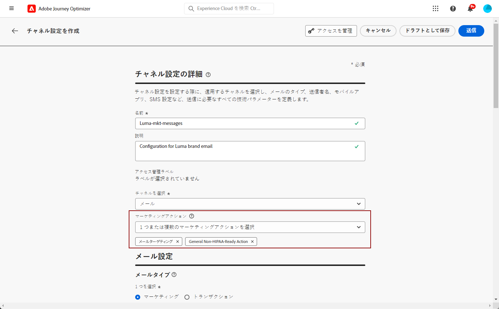

# チャネル設定の指定 {#set-up-channel-surfaces}

>[!CONTEXTUALHELP]
>id="ajo_admin_channel_surfaces"
>title="チャネル設定"
>abstract="チャネル設定は、システム管理者によって定義された設定です。 ヘッダーパラメーター、サブドメイン、モバイルアプリなど、メッセージを送信するすべての技術的なパラメーターが含まれています。"

>[!CONTEXTUALHELP]
>id="ajo_admin_marketing_action"
>title="マーケティングアクション"
>abstract="この設定を使用して同意ポリシーをメッセージにリンクするには、マーケティングアクションを選択します。 マーケティングアクションに接続されたすべての同意ポリシーは、顧客の環境設定に従って使用されます。"

[!DNL Journey Optimizer] では、チャネル設定（メッセージプリセットなど）を設定して、メッセージに必要なすべての技術パラメーター（メールのタイプ、送信者のメールと名前、モバイルアプリ、SMS 設定など）を定義しておくことができます。

>[!CAUTION]
>
> * チャネル設定を作成、編集および削除するには、[ メッセージプリセットの管理 ](../administration/high-low-permissions.md#administration-permissions) 権限が必要です。
>
> * チャネル設定を作成する前に、[ メール設定 ](../email/get-started-email-config.md)、[ プッシュ設定 ](../push/push-configuration.md)、[SMS 設定 ](../sms/sms-configuration.md)、[ アプリ内設定 ](../in-app/inapp-configuration.md)、[ コードベースの設定 ](../code-based/code-based-configuration.md)、[web 設定 ](../web/web-configuration.md)、[ ダイレクトメール設定 ](../direct-mail/direct-mail-configuration.md) の手順を実行する必要があります。

チャネル設定を行うと、ジャーニーまたはキャンペーンからメッセージを作成する際にチャネル設定を選択できるようになります。

<!--
➡️ [Learn how to create and use email configurations in this video](#video-presets)
-->

## チャネル設定の作成 {#create-channel-surface}

>[!CONTEXTUALHELP]
>id="ajo_admin_message_presets_header"
>title="チャネル設定"
>abstract="チャネル設定を設定する際に、適用するチャネルを選択し、メールのタイプ、送信者名、モバイルアプリ、SMS 設定など、送信に必要なすべての技術パラメーターを定義します。"

>[!CONTEXTUALHELP]
>id="ajo_admin_message_presets"
>title="チャネル設定"
>abstract="ジャーニーやキャンペーンからのメールなどのアクションを作成できるようにするには、まず、メッセージに必要なすべての技術設定を定義するチャネル設定を作成する必要があります。 チャネル設定を作成、編集および削除するには、メッセージプリセットの管理権限が必要です。"

>[!CONTEXTUALHELP]
>id="ajo_surface_marketing_action"
>title="マーケティングアクションを選択"
>abstract="メッセージに同意ポリシーを関連付けるために、設定でマーケティングアクションを選択します。"

チャネル設定を作成するには、次の手順に従います。

1. **[!UICONTROL チャネル]**/**[!UICONTROL 一般設定]**/**[!UICONTROL チャネル設定]** メニューにアクセスし、「**[!UICONTROL チャネル設定を作成]**」をクリックします。

   

1. 設定の名前と説明（オプション）を入力し、設定するチャネルを選択します。

   

   >[!NOTE]
   >
   > 名前は、文字（A ～ Z）で始める必要があります。使用できるのは英数字のみです。アンダースコア（`_`）、ドット（`.`）、ハイフン（`-`）も使用できます。

1. 設定にカスタムデータ使用ラベルまたはコアデータ使用ラベルを割り当てるには、「**[!UICONTROL アクセスを管理]**」を選択します。 [オブジェクトレベルのアクセス制御（OLAC）について詳しくは、こちらを参照してください](../administration/object-based-access.md)。

1. チャネルを選択します。

1. **[!UICONTROL マーケティングアクション]** を選択し、この設定を使用してメッセージに同意ポリシーを関連付けます。 マーケティングアクションに関連するすべての同意ポリシーは、顧客の環境設定に従って活用されます。 [詳細情報](../action/consent.md#surface-marketing-actions)

   >[!NOTE]
   >
   >同意ポリシーは、現在、**Healthcare Shield** および **Privacy and Security Shield** アドオン製品を購入した組織でのみ利用できます。

   

1. すべてのパラメーターを設定したら、「**[!UICONTROL 送信]**」をクリックして確定します。なお、チャネル設定をドラフトとして保存し、後で設定を再開することもできます。

   

   >[!NOTE]
   >
   >選択した IP プールが [ 編集中 ](ip-pools.md#edit-ip-pool) （**[!UICONTROL 処理中]** ステータス）となっており、選択したサブドメインに関連付けられていない場合は、メール設定の作成を続行できません。 [詳細情報](#subdomains-and-ip-pools)
   >
   >設定をドラフトとして保存し、IP プールが **[!UICONTROL 成功]** ステータスになるまで待機して、設定の作成を再開します。

1. チャネル設定が作成されると、リストに「**[!UICONTROL 処理中]**」のステータスで表示されます。

   この段階では、メッセージプリセットが適切に設定されていることを確かめるために、いくつかのチェックが実行されます。<!--The processing time is around **48h-72h**, and can take up to **7-10 business days**.-->

   >[!NOTE]
   > サブドメイン用のメール設定を作成する場合、処理時間は、以下のように異なります。
   >
   > * **新規サブドメイン** の場合、最初のチャネル設定を作成するプロセスには **10 分～10 日** かかる場合があります。
   > * **非実稼動サンドボックス** の場合、または選択したサブドメインが別の承認済みチャネル設定で **既に使用** されている場合、プロセスは最大 **3 時間** しかかかりません。

   このチェックには、アドビチームが行う設定および技術テストが含まれています。

   * SPF 検証
   * DKIM 検証
   * MX レコードの検証
   * 拒否リストへの IP 登録の検証
   * Helo ホストの検証
   * IP プールの検証
   * A/PTR レコード、t/m/res サブドメインの検証
   * FBL 登録（このチェックは、特定のサブドメインに対してメール設定を初めて作成したときにのみ実行されます）

   >[!NOTE]
   >
   >チェックが成功しなかった場合、考えられる失敗理由について詳しくは[この節](#monitor-channel-surfaces)を参照してください。

1. チェックが正常に完了すると、チャネル設定のステータスが **[!UICONTROL アクティブ]** になります。 メッセージの配信に使用する準備が整いました。

   

## チャネル設定の監視 {#monitor-channel-surfaces}

すべてのチャネル設定が **[!UICONTROL チャネル]**/**[!UICONTROL チャネル設定]** メニューに表示されます。 リスト（チャネル、ユーザー、ステータス）の参照に役立つフィルターを使用できます。

作成されると、チャネル設定は次のステータスになります。

* **[!UICONTROL ドラフト]**：チャネル設定は下書きとして保存されており、まだ送信されていません。 設定を再開するには、これを開きます。
* **[!UICONTROL 処理中]**：チャネル設定が送信され、いくつかの検証手順を実行中です。
* **[!UICONTROL アクティブ]**：チャネル設定は検証済みであり、選択してメッセージを作成できます。
* **[!UICONTROL 失敗]**：チャネル設定の検証中に、1 つ以上のチェックが失敗しました。
* **[!UICONTROL 非アクティブ]**：チャネル設定が非アクティブ化されています。 新しいメッセージの作成には使用できません。

チャネル設定の作成に失敗した場合、考えられる各エラー理由の詳細は次のとおりです。

これらのエラーのいずれかが発生した場合は、[アドビカスタマーケア](https://helpx.adobe.com/jp/enterprise/admin-guide.html/enterprise/using/support-for-experience-cloud.ug.html){target="_blank"}にご連絡ください。

* **SPF 検証に失敗しました**：SPF（Sender Policy Framework）はメール認証プロトコルで、特定のサブドメインからメールを送信できる承認済み IP を指定できます。SPF 検証エラーは、SPF レコードの IP アドレスが、メールボックスプロバイダーへのメール送信に使用される IP アドレスと一致しないことを意味します。

* **DKIM 検証に失敗しました**：DKIM（DomainKeys Identified Mail）を使用すると、受信したメッセージが関連ドメインの正規の送信者によって送信されたこと、および元のメッセージの内容が途中で改変されていないことを受信サーバーが検証できます。DKIM 検証の失敗は、メッセージコンテンツの信頼性とメッセージコンテンツの送信ドメインとの関連付けを受信メールサーバーが検証できないことを意味します。

* **MX レコードの検証に失敗しました**：MX（Mail eXchange）レコードの検証の失敗は、特定のサブドメインに代わって受信メールを受け取るべきメールサーバーが正しく設定されていないことを意味します。

* **配信品質の設定に失敗しました**：配信品質の設定の失敗は、次のいずれかの理由で起こる可能性があります。
   * 割り当てられた IP がブロックリストに登録されている
   * `helo` 名が無効
   * 対応する設定の IP プールで指定された IP 以外の IP からメールが送信される
   * 主要な ISP の受信ボックスにメールを配信できない

## チャネル設定の編集 {#edit-channel-surface}

チャネル設定を編集するには、次の手順に従います。

>[!NOTE]
>
>**[!UICONTROL プッシュ通知設定]**&#x200B;は編集できません。チャネル設定がプッシュ通知チャネル用にのみ設定されている場合は、編集できません。

1. リストでチャネル設定名をクリックして開きます。

   

1. そのプロパティを必要に応じて編集します。

   >[!NOTE]
   >
   >チャネル設定のステータスが **[!UICONTROL アクティブ]** の場合、「**[!UICONTROL 名前]**」、「**[!UICONTROL チャネルを選択]**」および「**[!UICONTROL サブドメイン]**」フィールドは灰色表示になっており、編集できません。

1. 「 **[!UICONTROL 送信]**」をクリックして、変更を確定します。

   >[!NOTE]
   >
   >なお、チャネル設定をドラフトとして保存し、後で更新を再開することもできます。

変更が送信されると、チャネル設定は、「チャネル設定の作成 [ 時と同じような検証サイクルを経 ](#create-channel-surface) します。 編集の処理時間は、最大で **3 時間**&#x200B;かかる場合があります。

>[!NOTE]
>
>編集するフィールドが「**[!UICONTROL 説明]**」、「**[!UICONTROL メールタイプ]**」または「**[!UICONTROL メールの再試行パラメーター]**」のみの場合、更新は即時に行われます。

### 更新の詳細 {#update-details}

ステータスが **[!UICONTROL アクティブ]** のチャネル設定の場合は、更新詳細を確認できます。 それには、以下の手順を実行します。

アクティブな設定名の横に表示されている **[!UICONTROL 最新の更新]** アイコンをクリックします。

<!--You can also access the update details from an active channel configuration while update is in progress.-->

**[!UICONTROL 最新の更新]**&#x200B;画面には、更新ステータスやリクエストされた変更のリストなどの情報が表示されます。

<!---->

### 更新ステータス {#update-statuses}

チャネル設定の更新には、次のステータスがあります。

* **[!UICONTROL 処理中]**：チャネル設定の更新が送信され、いくつかの検証ステップを実行中です。
* **[!UICONTROL 成功]**：更新されたチャネル設定が検証済みであり、それを選択してメッセージを作成できます。
* **[!UICONTROL 失敗]**：チャネル設定の更新を検証中に、1 つ以上のチェックが失敗しました。

各ステータスについて以下で詳しく説明します。

#### 処理中 {#surface-processing}

設定が正しく更新されていることを検証するために、いくつかの配信品質チェックが実行されます。

>[!NOTE]
>
>編集するフィールドが「**[!UICONTROL 説明]**」、「**[!UICONTROL メールタイプ]**」または「**[!UICONTROL メールの再試行パラメーター]**」のみの場合、更新は即時に行われます。

処理時間は、最大で **3 時間**&#x200B;かかる場合があります。検証サイクルで実行されるチェックについて詳しくは、[この節](#create-channel-surface)を参照してください。

既にアクティブになっている設定を編集した場合：

* 検証プロセスが進行中の間は、ステータスは&#x200B;**[!UICONTROL アクティブ]**&#x200B;のまま変わりません。

* チャネル設定リスト内の設定名の横に「**[!UICONTROL 最新の更新]**」アイコンが表示されます。

* 検証プロセス中は、この設定を使用してメッセージが設定されても、古いバージョンの設定が使用されます。

>[!NOTE]
>
>更新中は、チャネル設定を変更できません。 名前はクリックできますが、フィールドはすべて灰色表示になっています。変更は、更新が正常に完了するまで反映されません。

#### 成功 {#success}

検証プロセスが正常に完了すると、この設定を使用するすべてのメッセージで、新しいバージョンの設定が自動的に使用されます。 ただし、次の待機時間が必要になることがあります。
* 単一メッセージで使用されるまでに数分間
* 設定の次のバッチがバッチメッセージで有効になるまで

#### 失敗 {#failed}

検証プロセスが失敗した場合は、古いバージョンの設定が引き続き使用されます。

考えられる失敗理由について詳しくは、[この節](#monitor-channel-surfaces)を参照してください。

更新に失敗すると、設定が再び編集可能になります。 サーフェスの名前をクリックし、修正する必要のある設定を更新できます。

## チャネル設定の非アクティブ化 {#deactivate-a-surface}

**[!UICONTROL アクティブ]** チャネル設定を新しいメッセージの作成に使用できないようにするには、その設定を非アクティブにします。 ただし、この設定を現在使用しているジャーニーのメッセージは影響を受けず、引き続き機能します。

>[!NOTE]
>
>更新の処理中にチャネル設定をディアクティベートすることはできません。 更新が正常に完了するか失敗するまで待つ必要があります。詳しくは、[ チャネル設定の編集 ](#edit-channel-surface) および [ 更新ステータス ](#update-statuses) を参照してください。

1. チャネル設定リストにアクセスします。

1. 対象となるアクティブな設定で、「その他のアクション **[!UICONTROL ボタンをクリックし]** す。

1. 「**[!UICONTROL 非アクティブ化]**」を選択します。

   

>[!NOTE]
>
>非アクティブ化されたチャネル設定は削除できません。メッセージの送信にその設定を使用しているジャーニーで問題が発生しないようにするためです。

非アクティブ化されたチャネル設定は直接編集できません。 ただし、プリセットのコピーを作成し編集して新しいバージョンを作成し、それを使用して新しいメッセージを作成することはできます。また、プリセットを再度アクティブにし、更新が正常に完了するまで待って編集することもできます。

<!--
## How-to video{#video-presets}

Learn how to create channel configurations, how to use them and how to delegate a subdomain and create an IP pool.

>[!VIDEO](https://video.tv.adobe.com/v/334343?quality=12)
-->
