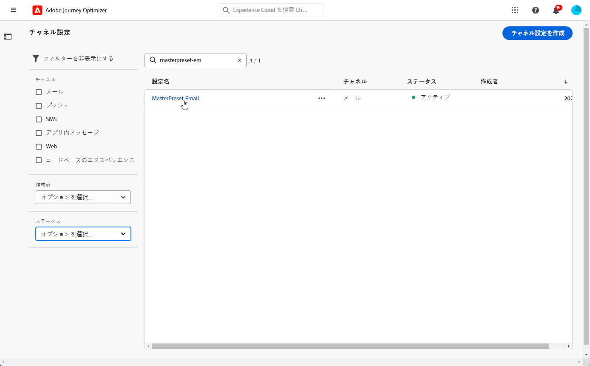
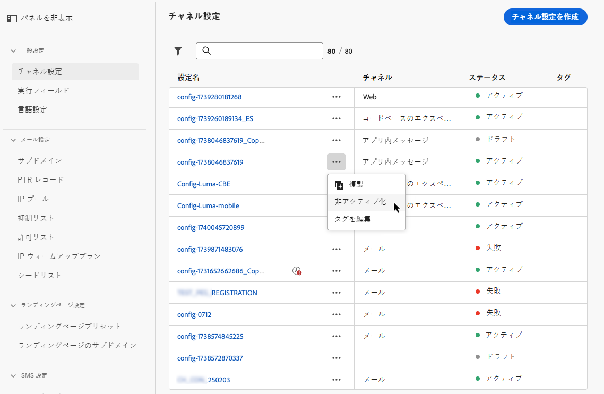

# チャンネルサーフェスの設定 {#set-up-channel-surfaces}

>[!CONTEXTUALHELP]
>id="ajo_admin_channel_surfaces"
>title="アプリケーションサーフェス"
>abstract="サーフェスは、システム管理者によって定義された設定です。 このファイルには、ヘッダパラメーター、サブドメイン、モバイルアプリケーションなど、メッセージを送信するためのすべての技術的なパラメーターが含まれています。"

で [!DNL Journey Optimizer] は、メッセージに必要なすべての技術パラメーターを定義するチャンネルサーフェス (メッセージプリセット) を設定できます。これは、電子メールタイプ、送信者の電子メールと名前、モバイルアプリ、SMS 設定など、メッセージに必要なすべての技術パラメーターです。

>[!CAUTION]
>
> * チャンネルサーフェスを作成、編集および削除するには、「チャンネル ](../administration/high-low-permissions.md#manage-channel-surface) の [ 管理」権限が必要です。
>
> * チャネルサーフェスを作成する前に、電子メール設定 ](../email/get-started-email-config.md) 、 [ プッシュ設定 ](../push/push-configuration.md) [ 、SMS 設定 ](../sms/sms-configuration.md) の [ 各手順を実行する必要があります。

チャネルサーフェスを設定すると、それを選択して、旅またはキャンペーンからメッセージを作成することができます。

<!--
➡️ [Learn how to create and use email surfaces in this video](#video-presets)
-->

## チャンネルサーフェスの作成 {#create-channel-surface}

>[!CONTEXTUALHELP]
>id="ajo_admin_message_presets_header"
>title="チャンネルサーフェス設定"
>abstract="チャンネルサーフェスを設定する場合は、適用されるチャンネルを選択し、電子メールタイプ、送信者の名前、モバイルアプリ、SMS 設定など、送信に必要なすべての技術パラメーターを定義します。"

>[!CONTEXTUALHELP]
>id="ajo_admin_message_presets"
>title="チャンネルサーフェス設定"
>abstract="旅やキャンペーンからの電子メールなどのアクションを作成できるようにするには、まずメッセージに必要なすべての技術設定を定義したチャンネルサーフェスを作成する必要があります。 チャンネルのサーフェスを作成、編集および削除するには、「チャンネルを管理」を使用している必要があります。"

チャンネルサーフェスを作成するには、以下の手順を実行します。

1. **[!UICONTROL Channels]**> **[!UICONTROL Branding]** > **[!UICONTROL Channel surfaces]** メニューにアクセスし、をクリック **[!UICONTROL Create channel surface]** します。

   

1. サーフェスの名前と説明 (オプション) を入力してから、設定するチャンネルを選択します。

   

   >[!NOTE]
   >
   > 名前の先頭には「A-z」の文字を使用する必要があります。 英数字のみを使用できます。 アンダースコア `_` 、ドット `.` 、ハイフン `-` 文字を使用することもできます。

1. チャンネルを選択した場合は、この節 ](../email/email-settings.md) で [ 説明さ **[!UICONTROL Email]** れている手順に従って設定を行います。

   

1. **[!UICONTROL Push Notification]**&#x200B;チャネルについては、少なくとも **1 つのプラットフォーム (** iOS **および Android** )、および各プラットフォーム用に使用するモバイルアプリケーションを選択します。

   

   >[!NOTE]
   >
   >プッシュ通知を送信するように環境を設定する方法について詳しくは、次の項 ](../push/push-gs.md) を [ 参照してください。

1. **[!UICONTROL SMS]**&#x200B;チャネルについては、このセクション ](../sms/sms-configuration.md#message-preset-sms) で [ 詳しく説明しているように設定を定義します。

   

   >[!NOTE]
   >
   >環境を設定して SMS メッセージを送信する方法について詳しくは、次の項 ](../sms/sms-configuration.md) を [ 参照してください。

1. すべてのパラメーターの設定が完了したら、「確認」をクリック **[!UICONTROL Submit]** します。 また、チャンネルサーフェスをドラフトとして保存し、その設定を後で再開することもできます。

   

   >[!NOTE]
   >
   >選択された IP プールが [ エディション ](ip-pools.md#edit-ip-pool) ( **[!UICONTROL Processing]** ステータス) で、選択されたサブドメインに対してまだ関連付けられていない場合は、サーフェスの作成を続行することはできません。 [詳細情報](#subdomains-and-ip-pools)
   >
   >サーフェスをドラフトとして保存し、IP プールの状態が **[!UICONTROL Success]** 完了するまで待ちます。これにより、サーフェイスの作成が再開されます。

1. 作成されたチャンネルは、状態と共 **[!UICONTROL Processing]** にリストに表示されます。

   この手順では、正しく設定されているかどうかを確認するためのいくつかのチェックが実行されます。 <!--The processing time is around **48h-72h**, and can take up to **7-10 business days**.-->

   >[!NOTE]
   >指定されたサブドメインの最初の電子メールの領域を作成する場合、処理時間は 10 ~ 10 日 **になり** ます。選択されているサブドメインが別の電子メールのサーフェスで既に使用されている場合は、最大3時間しか消費されません。

   このチェックには、Adobe team によって実行される設定および技術テストが含まれています。

   * SPF 検証
   * DKIM 検証
   * MX レコードの検証
   * IPs denylisting の確認
   * Helo ホストチェック
   * IP プールの検証
   * A/PTR レコード、t/m/res サブドメイン検証
   * FBL registration (このチェックは、指定されたサブドメインに対して電子メールサーフェスが最初に作成されたときにのみ実行されます)

   >[!NOTE]
   >
   >確認が成功しなかった場合は、この節 ](#monitor-channel-surfaces) で [ 説明する失敗の理由について詳しく説明しています。

1. チェックが成功すると、チャネルサーフェスはステータスを取得 **[!UICONTROL Active]** します。 このような場合は、メッセージを配信するために使用することができます。

   

## チャンネルサーフェスの監視 {#monitor-channel-surfaces}

> **[!UICONTROL Channel surfaces]** メニューには、すべてのチャンネルのサーフェスが **[!UICONTROL Channels]** 表示されます。フィルターを使用して、リスト内を参照 (チャネル、ユーザー、ステータス) することができます。

チャネルサーフェスを作成すると、次のステータスが設定されます。

* **[!UICONTROL Draft]**: チャンネルサーフェスはドラフトとして保存されており、まだ送信されていません。 このファイルを開いて、設定を再開します。
* **[!UICONTROL Processing]**: チャンネルサーフェスが送信され、複数の検証ステップが実行されています。
* **[!UICONTROL Active]**: チャンネルサーフェスが検証され、メッセージを作成するように選択することができます。
* **[!UICONTROL Failed]**: チャンネルサーフェスの検証中に1つまたは複数のチェックが失敗しました。
* **[!UICONTROL Deactivated]**: チャンネルサーフェスが非アクティブ化されています。 新規メッセージの作成には使用できません。

チャネルサーフェスの作成に失敗した場合は、発生する可能性のある各失敗の理由について詳しく説明します。

このようなエラーが発生した場合は、Adobe カスタマーケア ](https://helpx.adobe.com/enterprise/admin-guide.html/enterprise/using/support-for-experience-cloud.ug.html) {target = &quot;_blank 「}」にアクセスして [ ください。

* **SPF 検証に失敗しました** : spf (Sender Policy Framework) は、指定されたサブドメインから電子メールを送信することができる認証済みの ip を指定することを可能にする電子メール認証プロトコルです。 SPF 検証に失敗した場合は、SPF レコード内の IP アドレスが、メールボックスプロバイダーに電子メールを送信する際に使用した IP アドレスと一致していないことを意味します。

* **DKIM 検証に失敗しました** 。これにより、受信したメッセージが、関連付けられたドメインの正規の送信者によって送信されたかどうか、および元のメッセージの内容が変更されていないかどうかを受信者が確認することができます。 DKIM 検証に失敗した場合は、受信側のメールサーバーは、メッセージの内容と送信元のドメインとの関連付けを確認できないことを意味します。

* **MX レコード検証に失敗しました** : mx (メールエクスチェンジ) レコード検証エラーは、指定されたサブドメインを使用して、着信電子メールを受信するメールサーバーが正しく設定されていないことを意味します。

* **Deliverability 設定に失敗しました** : Deliverability 構成エラーは、次のいずれかの理由により発生する可能性があります。
   * 割り当てられた Ip の blocklisting
   * 無効な `helo` 名前
   * 電子メールは、対応するサーフェスの IP プールに指定されているもの以外の IPs から送信されます。
   * 主要な Isp の受信ボックスに電子メールを配信できない

## チャンネルサーフェスの編集 {#edit-channel-surface}

チャンネルサーフェスを編集するには、次の手順に従います。

>[!NOTE]
>
>を編集 **[!UICONTROL Push notification settings]** することはできません。 プッシュ通知チャネルに対してのみ設定されているチャンネルサーフェスは編集できません。

1. リストからチャネルを開くには、そのチャンネルのサーフェス名をクリックします。

   

1. 必要に応じて、プロパティを編集します。

   >[!NOTE]
   >
   >チャンネルサーフェス **[!UICONTROL Active]** に状態 **[!UICONTROL Name]** **[!UICONTROL Select channel]** がある場合、、、および **[!UICONTROL Subdomain]** フィールドはグレー表示になっており、編集することはできません。

1. 変更を確認するには、をクリックし **[!UICONTROL Submit]** ます。

   >[!NOTE]
   >
   >また、チャンネルサーフェスをドラフトとして保存して、後で更新を再開することもできます。

変更が送信されると、チャネルサーフェスの作成 ](#create-channel-surface) 時 [ に設定されていたのと同じような検証サイクルが実行されます。エディションの処理時間が最大3時間 **に** なることがあります。

>[!NOTE]
>
>、フィールド、フィールド、または **[!UICONTROL Email retry parameters]** その両方を編集 **[!UICONTROL Description]** **[!UICONTROL Email type]** した場合、アップデートは即時に反映されます。

### 更新プログラムの詳細 {#update-details}

状態が設定 **[!UICONTROL Active]** されているチャンネルサーフェスの場合は、更新の詳細を確認することができます。 これを実行するには:

**[!UICONTROL Recent update]**&#x200B;アクティブなサーフェス名の横に表示されているアイコンをクリックします。

<!--You can also access the update details from an active channel surface while update is in progress.-->

**[!UICONTROL Recent update]**&#x200B;画面には、更新状況や要求された変更のリストなどの情報が表示されます。

<!---->

### 状態の更新 {#update-statuses}

チャンネルのサーフェスアップデートには、次のステータスがあります。

* **[!UICONTROL Processing]**: チャンネルのサーフェスアップデートが送信され、いくつかの検証ステップが実行されています。
* **[!UICONTROL Success]**: 更新されたチャンネルサーフェスが検証され、メッセージを作成するように選択することができます。
* **[!UICONTROL Failed]**: チャンネルサーフェス更新検証中に1つまたは複数のチェックが失敗しました。

各ステータスについて詳しくは、以下を参照してください。

#### 処理 {#surface-processing}

サーフェスが適切に更新されたかどうかを確認するために、いくつかの deliverability チェックが実行されます。

>[!NOTE]
>
>、フィールド、フィールド、または **[!UICONTROL Email retry parameters]** その両方を編集 **[!UICONTROL Description]** **[!UICONTROL Email type]** した場合、アップデートは即時に反映されます。

処理時間は最大3時間 **に** なる場合があります。この節 ](#create-channel-surface) で [ は、検証サイクル中に実行されるチェックについて詳しく説明しています。

既にアクティブなサーフェスを編集した場合は、次のようになります。

* 検証プロセスが進行中の間は、ステータスが残り **[!UICONTROL Active]** ます。

* 「チャンネルサーフェス」リストで、 **[!UICONTROL Recent update]** サーフェスの名前の横にアイコンが表示されます。

* 検証プロセス中、このサーフェスを使用して設定されたメッセージは、以前のバージョンのサーフェスを使用したままになります。

>[!NOTE]
>
>更新中にチャンネルサーフェスを変更することはできません。 名前をクリックしても、すべてのフィールドがグレー表示になります。 変更は、更新が成功するまで反映されません。

#### 時 {#success}

検証プロセスが正常に完了すると、このサーフェスを使用しているすべてのメッセージについて、新しいバージョンのサーフェスが自動的に使用されます。 ただし、次のような待機が必要な場合があります。
* 数分前に、ユニタリメッセージによって使用されます。
* 、そのサーフェスがバッチメッセージに効果的に機能するようになるまで、次のバッチが開始されます。

#### し {#failed}

検証処理が失敗した場合でも、以前のバージョンのサーフェスが使用されます。

問題が発生する可能性がある場合について詳しくは、ここを  参照してください。

アップデートが失敗すると、そのサーフェスは再び編集可能になります。 その名前をクリックして、修正する必要がある設定を更新することができます。

## チャンネルサーフェスの非アクティブ化 {#deactivate-a-surface}

新しいメッセージを作成するためにチャンネルサーフェスを使用できないよう **[!UICONTROL Active]** にするには、そのチャンネルを非アクティブにします。 ただし、このサーフェスを使用している journeys のメッセージは影響を受けないので、動作を続けます。

>[!NOTE]
>
>更新処理中にチャンネルサーフェスを非アクティブ化することはできません。 アップデートが正常に終了するまで待つか、失敗したことを示します。 チャンネルのサーフェス ](#edit-channel-surface) の編集と更新状態 ](#update-statuses) について詳しくは、 [ こちらを [ 参照してください。

1. 「チャンネルのサーフェス」リストにアクセスします。

1. 選択されているアクティブなサーフェスについては、ボタンをクリック **[!UICONTROL More actions]** します。

1. を選択 **[!UICONTROL Deactivate]** します。

   

>[!NOTE]
>
>非アクティブ化されたチャンネルサーフェスは、これらのサーフェスを使用してメッセージを送信する journeys の問題を回避するために削除することはできません。

非アクティブ化したチャンネルサーフェスを直接編集することはできません。 ただし、ファイルを複製してコピーを編集すると、新しいメッセージを作成するために使用する新しいバージョンを作成できます。 この機能は、再アクティブ化することもできます。その後、更新が編集されるまで待ちます。

<!--
## How-to video{#video-presets}

Learn how to create channel surfaces, how to use them and how to delegate a subdomain and create an IP pool.

>[!VIDEO](https://video.tv.adobe.com/v/334343?quality=12)
-->
