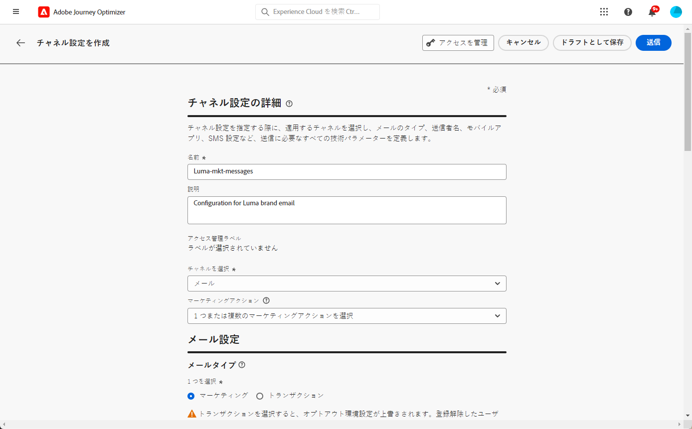

# チャネルサーフェスの設定 {#set-up-channel-surfaces}

>[!CONTEXTUALHELP]
>id="ajo_admin_channel_surfaces"
>title="チャネルサーフェス"
>abstract="チャネルサーフェスは、システム管理者によって定義された設定です。ヘッダーパラメーター、サブドメイン、モバイルアプリなど、メッセージを送信するためのすべての技術的なパラメーターが含まれています。 "

[!DNL Journey Optimizer] では、チャネルサーフェス（例：メッセージプリセット）を設定して、メッセージに必要なすべての技術パラメーター（メールのタイプ、送信者のメールと名前、モバイルアプリ、SMS 設定など）を定義しておくことができます。

>[!CAUTION]
>
> * チャネルサーフェスを作成、編集、削除するには、[メッセージプリセットを管理](../administration/high-low-permissions.md#administration-permissions)権限が必要です。
>
> * チャネルサーフェスを作成する前に、[メール設定](../email/get-started-email-config.md)、[プッシュ設定](../push/push-configuration.md)、[SMS 設定](../sms/sms-configuration.md)、および[ダイレクトメール設定](../direct-mail/direct-mail-configuration.md)の手順を実行する必要があります。

チャネルサーフェスを設定すると、ジャーニーまたはキャンペーンからメッセージを作成する際にチャネルサーフェスを選択できるようになります。

<!--
➡️ [Learn how to create and use email surfaces in this video](#video-presets)
-->

## チャネルサーフェスを作成 {#create-channel-surface}

>[!CONTEXTUALHELP]
>id="ajo_admin_message_presets_header"
>title="チャネルサーフェスの設定"
>abstract="チャネルサーフェスを設定する際に、適用するチャネルを選択し、メールのタイプ、送信者名、モバイルアプリ、SMS 設定など、送信に必要なすべての技術パラメーターを定義します。"

>[!CONTEXTUALHELP]
>id="ajo_admin_message_presets"
>title="チャネルサーフェスの設定"
>abstract="ジャーニーやキャンペーンからのメールなどのアクションを作成できるようにするには、まず、メッセージに必要なすべての技術設定を定義するチャネルサーフェスを作成する必要があります。チャネルサーフェスを作成、編集、削除するには、メッセージプリセットを管理権限が必要です。"

チャネルサーフェスを作成するには、次の手順に従います。

1. **[!UICONTROL チャネル]**／**[!UICONTROL ブランディング]**／**[!UICONTROL チャネルサーフェス]**&#x200B;メニューにアクセスし、「**[!UICONTROL チャネルサーフェスを作成]**」をクリックします。

   

1. サーフェスの名前と説明（オプション）を入力し、設定するチャネルを選択します。

   

   >[!NOTE]
   >
   > 名前は、文字（A ～ Z）で始める必要があります。使用できるのは英数字のみです。アンダースコア（`_`）、ドット（`.`）、ハイフン（`-`）も使用できます。

1. **[!UICONTROL メール]**&#x200B;チャネルを選択した場合は、[この節](../email/email-settings.md)の説明に従って設定を行ってください。

   

1. **[!UICONTROL プッシュ通知]**&#x200B;チャネルの場合は、少なくとも 1 つのプラットフォーム（**iOS** または **Android**）を選択し、各プラットフォームで使用するモバイルアプリケーションを選択します。

   

   >[!NOTE]
   >
   >プッシュ通知を送信するための環境の設定方法について詳しくは、[この節](../push/push-gs.md)を参照してください。

1. **[!UICONTROL SMS]** チャネルの場合は、[この節](../sms/sms-configuration.md#message-preset-sms)の説明に従って設定を定義します。

   

   >[!NOTE]
   >
   >SMS メッセージを送信するための環境の設定方法について詳しくは、[この節](../sms/sms-configuration.md)を参照してください。

1. すべてのパラメーターを設定したら、「**[!UICONTROL 送信]**」をクリックして確定します。なお、チャネルサーフェスをドラフトとして保存し、後で設定を再開することもできます。

   

   >[!NOTE]
   >
   >選択した IP プールが以下の場合は、メールの表面の作成を続行できません [版](ip-pools.md#edit-ip-pool) (**[!UICONTROL 処理中]** ステータス ) と、選択したサブドメインに関連付けられていないステータス。 [詳細情報](#subdomains-and-ip-pools)
   >
   >サーフェスをドラフトとして保存し、IP プールが&#x200B;**[!UICONTROL 成功]**&#x200B;ステータスになるまで待機して、サーフェスの作成を再開します。

1. チャネルサーフェスが作成されると、リストに「**[!UICONTROL 処理中]**」のステータスで表示されます。

   この段階では、メッセージプリセットが適切に設定されていることを確かめるために、いくつかのチェックが実行されます。<!--The processing time is around **48h-72h**, and can take up to **7-10 business days**.-->

   >[!NOTE]
   > サブドメインのメールサーフェスを作成する場合、処理時間は次に示すように異なります。
   >
   > * **新しいサブドメイン**&#x200B;の場合、最初のチャネルサーフェスを作成するプロセスには **10 分から 10 日**&#x200B;かかる場合があります。
   > * **非実稼動用サンドボックス**&#x200B;の場合や、選択したサブドメインが別の承認されたチャネルサーフェスで&#x200B;**既に使用**&#x200B;されている場合、このプロセスにかかる時間は最大 **3 時間**&#x200B;になります。

   このチェックには、アドビチームが行う設定および技術テストが含まれています。

   * SPF 検証
   * DKIM 検証
   * MX レコードの検証
   * 拒否リストへの IP 登録の検証
   * Helo ホストの検証
   * IP プールの検証
   * A/PTR レコード、t/m/res サブドメインの検証
   * FBL 登録（このチェックは、特定のサブドメインに対してメールサーフェスを初めて作成したときにのみ実行されます）

   >[!NOTE]
   >
   >チェックが成功しなかった場合、考えられる失敗理由について詳しくは[この節](#monitor-channel-surfaces)を参照してください。

1. チェックが正常に完了すると、チャネルサーフェスのステータスが「**[!UICONTROL アクティブ]**」になります。メッセージの配信に使用する準備が整いました。

   

## チャネルサーフェスの監視 {#monitor-channel-surfaces}

すべてのチャネルサーフェスが&#x200B;**[!UICONTROL チャネル]**／**[!UICONTROL チャネルサーフェス]**&#x200B;メニューに表示されます。リスト（チャネル、ユーザー、ステータス）の参照に役立つフィルターを使用できます。

作成されると、チャネルサーフェスは次のステータスになります。

* **[!UICONTROL ドラフト]**：チャネルサーフェスは下書きとして保存されており、まだ送信されていません。設定を再開するには、これを開きます。
* **[!UICONTROL 処理中]**：チャネルサーフェスが送信され、いくつかの検証手順を実行中です。
* **[!UICONTROL アクティブ]**：チャネルサーフェスは検証済みであり、選択してメッセージを作成できます。
* **[!UICONTROL 失敗]**：チャネルサーフェスの検証中に、1 つ以上のチェックが失敗しました。
* **[!UICONTROL 非アクティブ]**：チャネルサーフェスは非アクティブ化されています。新しいメッセージの作成には使用できません。

チャネルサーフェスの作成に失敗した場合、考えられる各エラー理由の詳細は次のとおりです。

これらのエラーのいずれかが発生した場合は、[アドビカスタマーケア](https://helpx.adobe.com/jp/enterprise/admin-guide.html/enterprise/using/support-for-experience-cloud.ug.html){target="_blank"}にご連絡ください。

* **SPF 検証に失敗しました**：SPF（Sender Policy Framework）はメール認証プロトコルで、特定のサブドメインからメールを送信できる承認済み IP を指定できます。SPF 検証エラーは、SPF レコードの IP アドレスが、メールボックスプロバイダーへのメール送信に使用される IP アドレスと一致しないことを意味します。

* **DKIM 検証に失敗しました**：DKIM（DomainKeys Identified Mail）を使用すると、受信したメッセージが関連ドメインの正規の送信者によって送信されたこと、および元のメッセージの内容が途中で改変されていないことを受信サーバーが検証できます。DKIM 検証の失敗は、メッセージコンテンツの信頼性とメッセージコンテンツの送信ドメインとの関連付けを受信メールサーバーが検証できないことを意味します。

* **MX レコードの検証に失敗しました**：MX（Mail eXchange）レコードの検証の失敗は、特定のサブドメインに代わって受信メールを受け取るべきメールサーバーが正しく設定されていないことを意味します。

* **配信品質の設定に失敗しました**：配信品質の設定の失敗は、次のいずれかの理由で起こる可能性があります。
   * 割り当てられた IP がブロックリストに登録されている
   * `helo` 名が無効
   * 対応するサーフェスの IP プールで指定された IP 以外の IP からメールが送信される
   * 主要な ISP の受信ボックスにメールを配信できない

## チャネルサーフェスの編集 {#edit-channel-surface}

チャネルサーフェスを編集するには、次の手順に従います。

>[!NOTE]
>
>**[!UICONTROL プッシュ通知設定]**&#x200B;は編集できません。チャネルサーフェスがプッシュ通知チャネル用にのみ設定されている場合は、編集できません。

1. リストでチャネルサーフェス名をクリックして開きます。

   

1. そのプロパティを必要に応じて編集します。

   >[!NOTE]
   >
   >チャネルサーフェスのステータスが&#x200B;**[!UICONTROL アクティブ]**&#x200B;の場合、「**[!UICONTROL 名前]**」、「**[!UICONTROL チャネルを選択]**」および「**[!UICONTROL サブドメイン]**」フィールドは灰色表示になっており、編集できません。

1. 「 **[!UICONTROL 送信]**」をクリックして、変更を確定します。

   >[!NOTE]
   >
   >なお、チャネルサーフェスをドラフトとして保存し、後で更新を再開することもできます。

変更が送信されると、チャネルサーフェスは、[チャネルサーフェスの作成](#create-channel-surface)時と同じような検証サイクルを経ます。編集の処理時間は、最大で **3 時間**&#x200B;かかる場合があります。

>[!NOTE]
>
>編集するフィールドが「**[!UICONTROL 説明]**」、「**[!UICONTROL メールタイプ]**」または「**[!UICONTROL メールの再試行パラメーター]**」のみの場合、更新は即時に行われます。

### 更新の詳細 {#update-details}

ステータスが&#x200B;**[!UICONTROL アクティブ]**&#x200B;のチャネルサーフェスの場合は、更新内容の詳細を確認できます。それには、以下の手順を実行します。

アクティブなサーフェスの名前の横に表示されている「**[!UICONTROL 最新の更新]**」アイコンをクリックします。

<!--You can also access the update details from an active channel surface while update is in progress.-->

**[!UICONTROL 最新の更新]**&#x200B;画面には、更新ステータスやリクエストされた変更のリストなどの情報が表示されます。

<!---->

### 更新ステータス {#update-statuses}

チャネルサーフェスの更新には、次のステータスがあります。

* **[!UICONTROL 処理中]**：チャネルサーフェスの更新が送信され、いくつかの検証ステップを実行中です。
* **[!UICONTROL 成功]**：更新されたチャネルサーフェスが検証済みであり、選択してメッセージを作成できます。
* **[!UICONTROL 失敗]**：チャネルサーフェスの更新を検証中に、1 つ以上のチェックが失敗しました。

各ステータスについて以下で詳しく説明します。

#### 処理中 {#surface-processing}

いくつかの配信品質チェックが実行されて、サーフェスが正しく更新されたかどうかが検証されます。

>[!NOTE]
>
>編集するフィールドが「**[!UICONTROL 説明]**」、「**[!UICONTROL メールタイプ]**」または「**[!UICONTROL メールの再試行パラメーター]**」のみの場合、更新は即時に行われます。

処理時間は、最大で **3 時間**&#x200B;かかる場合があります。検証サイクルで実行されるチェックについて詳しくは、[この節](#create-channel-surface)を参照してください。

既にアクティブになっているサーフェスを編集する場合：

* 検証プロセスが進行中の間は、ステータスは&#x200B;**[!UICONTROL アクティブ]**&#x200B;のまま変わりません。

* チャネルサーフェスリスト内のサーフェス名の横に「**[!UICONTROL 最新の更新]**」アイコンが表示されます。

* 検証プロセス中は、このサーフェスを使用してメッセージを設定しても、古いバージョンのサーフェスが引き続き使用されます。

>[!NOTE]
>
>更新中は、チャネルサーフェスを変更できません。名前はクリックできますが、フィールドはすべて灰色表示になっています。変更は、更新が正常に完了するまで反映されません。

#### 成功 {#success}

検証プロセスが正常に完了すると、このサーフェスを使用するすべてのメッセージで、新しいバージョンのサーフェスが自動的に使用されます。ただし、次の待機時間が必要になることがあります。
* 単一メッセージで使用されるまでに数分間
* サーフェスの次のバッチがバッチメッセージで有効になるまで

#### 失敗 {#failed}

検証プロセスが失敗した場合は、古いバージョンのサーフェスが引き続き使用されます。

考えられる失敗理由について詳しくは、[この節](#monitor-channel-surfaces)を参照してください。

更新が失敗すると、サーフェスが再び編集可能になります。サーフェスの名前をクリックし、修正する必要のある設定を更新できます。

## チャネルサーフェスの非アクティブ化 {#deactivate-a-surface}

**[!UICONTROL アクティブ]**&#x200B;なチャネルサーフェスを新しいメッセージの作成に使用できないようにするには、そのサーフェスを非アクティブにします。ただし、このサーフェスを現在使用しているジャーニーのメッセージは影響を受けず、引き続き機能します。

>[!NOTE]
>
>更新の処理中にチャネルサーフェスを非アクティブ化することはできません。更新が正常に完了するか失敗するまで待つ必要があります。詳しくは、[チャネルサーフェスの編集](#edit-channel-surface)およびその中の[更新ステータス](#update-statuses)を参照してください。

1. チャネルサーフェスリストにアクセスします。

1. 対象となるアクティブなサーフェスで、「**[!UICONTROL その他のアクション]**」ボタンをクリックします。

1. 「**[!UICONTROL 非アクティブ化]**」を選択します。

   

>[!NOTE]
>
>非アクティブ化されたチャネルサーフェスは削除できません。メッセージの送信にそのサーフェスを使用しているジャーニーで問題が発生しないようにするためです。

非アクティブ化されたチャネルサーフェスは直接編集できません。ただし、プリセットのコピーを作成し編集して新しいバージョンを作成し、それを使用して新しいメッセージを作成することはできます。また、プリセットを再度アクティブにし、更新が正常に完了するまで待って編集することもできます。

<!--
## How-to video{#video-presets}

Learn how to create channel surfaces, how to use them and how to delegate a subdomain and create an IP pool.

>[!VIDEO](https://video.tv.adobe.com/v/334343?quality=12)
-->
