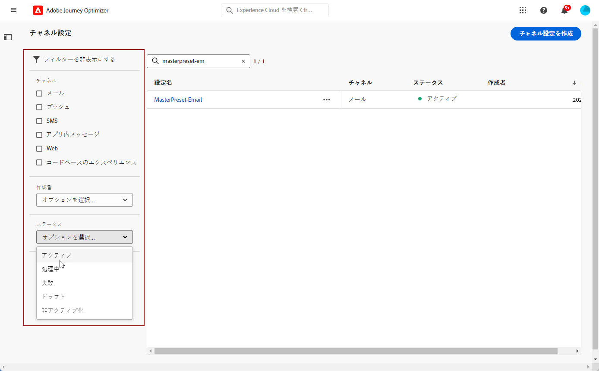
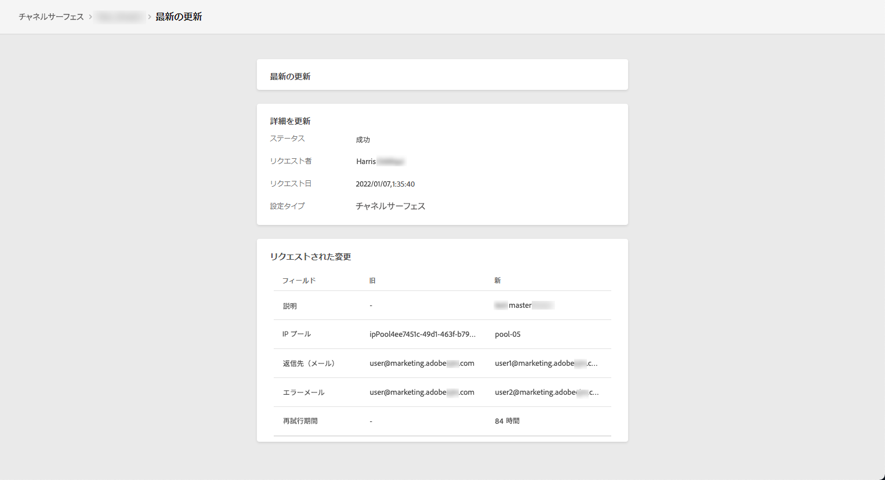

# チャネルサーフェスの設定 {#set-up-channel-surfaces}

を使用 [!DNL Journey Optimizer]を使用する場合は、メッセージに必要なすべての技術パラメーターを定義するチャネルサーフェス（メッセージプリセット）を設定できます。e メールのタイプ、送信者の e メールと名前、モバイルアプリなど。

>[!CAUTION]
>
> * チャネルサーフェスを作成、編集、削除するには、 [チャンネルサーフェスを管理](../administration/high-low-permissions.md#manage-channel-surface) 権限。
>
> * 次の操作を実行する必要があります。 [電子メール設定](#configure-email-settings), [プッシュ設定](../configuration/push-configuration.md) および [SMS 設定](../configuration/sms-configuration.md) チャネルサーフェスを作成する前の手順です。

チャネルサーフェスを設定したら、ジャーニーからメッセージを作成する際に、チャネルサーフェスを選択できます。

<!--
➡️ [Learn how to create and use email surfaces in this video](#video-presets)
-->

## チャネルサーフェスを作成する {#create-channel-surface}

>[!CONTEXTUALHELP]
>id="ajo_admin_message_presets"
>title="チャンネルサーフェス設定"
>abstract="チャネルサーフェスを設定する際に、適用するチャネルを選択し、メッセージのタイプ、サブドメイン、送信者名、モバイルアプリなど、メッセージに必要なすべての技術的パラメーターを定義します。"

チャネルサーフェスを作成するには、次の手順に従います。

1. 次にアクセス： **[!UICONTROL チャネル]** > **[!UICONTROL ブランディング]** > **[!UICONTROL チャンネルサーフェス]** メニュー、次に「 **[!UICONTROL チャンネルサーフェスを作成]**.

   

1. サーフェスの名前と説明（任意）を入力し、設定するチャネルを選択します。

   

   >[!NOTE]
   >
   > 名前は、文字（A ～ Z）で始める必要があります。使用できるのは英数字のみです。アンダースコア（`_`）、ドット（`.`）、ハイフン（`-`）も使用できます。

1. **[!UICONTROL メール]**&#x200B;チャネルを選択した場合は、[この節](email-settings.md)の説明に従って設定を行ってください。

   

1. の **[!UICONTROL プッシュ通知]** チャネル、少なくとも 1 つのプラットフォームを選択してください —  **iOS** および/または **Android** - 、および各プラットフォームで使用するモバイルアプリケーション。

   

   >[!NOTE]
   >
   >プッシュ通知を送信するための環境の設定方法について詳しくは、[この節](push-gs.md)を参照してください。

1. の **[!UICONTROL SMS]** チャネルで、設定を定義します ( [この節](sms-configuration.md#message-preset-sms).

   

   >[!NOTE]
   >
   >SMS メッセージを送信するための環境の設定方法について詳しくは、[この節](sms-configuration.md)を参照してください。

1. すべてのパラメーターを設定したら、「**[!UICONTROL 送信]**」をクリックして確定します。また、チャンネルサーフェスをドラフトとして保存し、後で設定を再開することもできます。

   

   >[!NOTE]
   >
   >選択した IP プールが下にある間は、サーフェスの作成を続行できません [版](ip-pools.md#edit-ip-pool) (**[!UICONTROL 処理中]** ステータス ) と、選択したサブドメインに関連付けられていないステータス。 [詳細情報](#subdomains-and-ip-pools)
   >
   >サーフェスをドラフトとして保存し、IP プールに **[!UICONTROL 成功]** サーフェスの作成を再開するステータス。

1. チャネルサーフェスが作成されると、リストには次の情報が表示されます。 **[!UICONTROL 処理中]** ステータス。

   この段階では、メッセージプリセットが適切に設定されていることを確かめるために、いくつかのチェックが実行されています。処理時間はおよそ **48～72 時間**&#x200B;で、最長で **7～10 営業日**&#x200B;かかることがあります。

   このチェックには、アドビチームが行う設定および技術テストが含まれています。

   * SPF 検証
   * DKIM 検証
   * MX レコードの検証
   * 拒否リストへの IP 登録の検証
   * Helo ホストの検証
   * IP プールの検証
   * A/PTR レコード、t/m/res サブドメインの検証

   >[!NOTE]
   >
   >チェックが成功しなかった場合、考えられる失敗理由について詳しくは[この節](#monitor-channel-surfaces)を参照してください。

1. チェックが正常に完了すると、チャネルサーフェスは **[!UICONTROL アクティブ]** ステータス。 メッセージの配信に使用する準備が整いました。

   

## チャネルサーフェスの監視 {#monitor-channel-surfaces}

すべてのチャンネルサーフェスが **[!UICONTROL チャネル]** > **[!UICONTROL チャンネルサーフェス]** メニュー リスト（チャネル、ユーザー、ステータス）の参照に役立つフィルターを使用できます。

チャネルサーフェスを作成すると、次のステータスになります。

* **[!UICONTROL ドラフト]**:チャネルサーフェスはドラフトとして保存されたので、まだ送信されていません。 設定を再開するには、これを開きます。
* **[!UICONTROL 処理中]**:チャネルサーフェスが送信され、いくつかの検証手順を実行しています。
* **[!UICONTROL アクティブ]**:チャネルサーフェスは検証済みで、メッセージを作成するために選択できます。
* **[!UICONTROL 失敗]**:チャネルサーフェスの検証中に、1 つ以上のチェックに失敗しました。
* **[!UICONTROL 非アクティブ]**:チャネルサーフェスが非アクティブ化されます。 新しいメッセージの作成には使用できません。

チャネルサーフェスの作成に失敗した場合、考えられる各失敗理由の詳細を以下に示します。

これらのエラーのいずれかが発生した場合は、[アドビカスタマーケア](https://helpx.adobe.com/jp/enterprise/admin-guide.html/enterprise/using/support-for-experience-cloud.ug.html){target=&quot;_blank&quot;} にご連絡ください。

* **SPF 検証に失敗しました**：SPF（Sender Policy Framework）はメール認証プロトコルで、特定のサブドメインからメールを送信できる承認済み IP を指定できます。SPF 検証エラーは、SPF レコードの IP アドレスが、メールボックスプロバイダーへのメール送信に使用される IP アドレスと一致しないことを意味します。

* **DKIM 検証に失敗しました**：DKIM（DomainKeys Identified Mail）を使用すると、受信したメッセージが関連ドメインの正規の送信者によって送信されたこと、および元のメッセージの内容が途中で改変されていないことを受信サーバーが検証できます。DKIM 検証の失敗は、メッセージコンテンツの信頼性とメッセージコンテンツの送信ドメインとの関連付けを受信メールサーバーが検証できないことを意味します。

* **MX レコードの検証に失敗しました**：MX（Mail eXchange）レコードの検証の失敗は、特定のサブドメインに代わって受信メールを受け取るべきメールサーバーが正しく設定されていないことを意味します。

* **配信品質の設定に失敗しました**：配信品質の設定の失敗は、次のいずれかの理由で起こる可能性があります。
   * 割り当てられた IP がブロックリストに登録されている
   * `helo` 名が無効
   * 対応するサーフェスの IP プールで指定された IP 以外の IP から送信されるメール
   * Gmail や Yahoo などの主要な ISP の受信ボックスにメールを配信できない

## チャネルサーフェスを編集する {#edit-channel-surface}

チャンネルサーフェスを編集するには、次の手順に従います。

>[!NOTE]
>
>**[!UICONTROL プッシュ通知設定]**&#x200B;は編集できません。チャネルサーフェスがプッシュ通知チャネル用にのみ設定されている場合は、編集できません。

1. リストで、チャネルサーフェス名をクリックして開きます。

   

1. そのプロパティを必要に応じて編集します。

   >[!NOTE]
   >
   >チャネルサーフェスに **[!UICONTROL アクティブ]** ステータス、 **[!UICONTROL 名前]**, **[!UICONTROL チャネルを選択]** および **[!UICONTROL サブドメイン]** フィールドは灰色表示になっており、編集できません。

1. 「 **[!UICONTROL 送信]**」をクリックして、変更を確定します。

   

   >[!NOTE]
   >
   >また、チャンネルサーフェスをドラフトとして保存し、後で更新を再開することもできます。

変更が送信されると、チャネルサーフェスは、次の場合と同様に検証サイクルを経ます。 [チャネルサーフェスの作成](#create-channel-surface). 編集の処理時間は、最大で **3 時間**&#x200B;かかる場合があります。

>[!NOTE]
>
>編集するフィールドが「**[!UICONTROL 説明]**」、「**[!UICONTROL メールタイプ]**」または「**[!UICONTROL メールの再試行パラメーター]**」のみの場合、更新は即時に行われます。

### 更新の詳細 {#update-details}

チャネルサーフェスに **[!UICONTROL アクティブ]** のステータスを確認すると、更新の詳細を確認できます。 それには、以下の手順を実行します。

次をクリック： **[!UICONTROL 最近の更新]** アクティブなサーフェス名の横に表示されるアイコン。

<!--You can also access the update details from an active channel surface while update is in progress.-->

**[!UICONTROL 最新の更新]**&#x200B;画面には、更新ステータスやリクエストされた変更のリストなどの情報が表示されます。

### 更新ステータス {#update-statuses}

チャネルサーフェスの更新には、次のステータスがあります。

* **[!UICONTROL 処理中]**:チャネルサーフェスの更新が送信され、いくつかの検証手順を実行しています。
* **[!UICONTROL 成功]**:更新されたチャネルサーフェスが検証され、メッセージを作成するために選択できます。
* **[!UICONTROL 失敗]**:チャネルサーフェスの更新の検証中に、1 つ以上のチェックに失敗しました。

各ステータスについて以下で詳しく説明します。

#### 処理中 {#surface-processing}

いくつかの配信品質チェックが実行され、サーフェスが正しく更新されたことが検証されます。

>[!NOTE]
>
>編集するフィールドが「**[!UICONTROL 説明]**」、「**[!UICONTROL メールタイプ]**」または「**[!UICONTROL メールの再試行パラメーター]**」のみの場合、更新は即時に行われます。

処理時間は、最大で **3 時間**&#x200B;かかる場合があります。検証サイクルで実行されるチェックについて詳しくは、[この節](#create-channel-surface)を参照してください。

既にアクティブであったサーフェスを編集する場合：

* 検証プロセスが進行中の間は、ステータスは&#x200B;**[!UICONTROL アクティブ]**&#x200B;のまま変わりません。

* この **[!UICONTROL 最近の更新]** チャンネルサーフェスリストのサーフェス名の横にアイコンが表示されます。

* 検証プロセス中、このサーフェスを使用して設定されたメッセージは、サーフェスの古いバージョンを引き続き使用します。

>[!NOTE]
>
>更新中は、チャンネルサーフェスを修正できません。 名前はクリックできますが、フィールドはすべて灰色表示になっています。変更は、更新が正常に完了するまで反映されません。

#### 成功 {#success}

検証プロセスが正常に完了すると、サーフェスの新しいバージョンが、このサーフェスを使用するすべてのメッセージで自動的に使用されます。 ただし、次の待機時間が必要になることがあります。
* 単一メッセージで使用されるまでに数分間
* 次のバッチまで、サーフェスがバッチメッセージで有効になるまで。

#### 失敗 {#failed}

検証プロセスが失敗した場合でも、サーフェスの古いバージョンは引き続き使用されます。

考えられる失敗理由について詳しくは、[この節](#monitor-channel-surfaces)を参照してください。

更新が失敗すると、サーフェスは再び編集可能になります。 プリセットの名前をクリックし、修正する必要のある設定を更新できます。

## チャネルサーフェスを非アクティブ化する {#deactivate-a-surface}

を作成するには、以下を実行します。 **[!UICONTROL アクティブ]** 新しいメッセージを作成するには、チャネルサーフェスを使用できません。このチャネルサーフェスを非アクティブにすることができます。 ただし、現在このサーフェスを使用しているジャーニーのメッセージは影響を受けず、引き続き機能します。

>[!NOTE]
>
>更新の処理中は、チャンネルサーフェスを非アクティブにすることはできません。 更新が正常に完了するか失敗するまで待つ必要があります。詳細情報： [チャンネルサーフェスの編集](#edit-channel-surface) そして [ステータスを更新](#update-statuses).

1. チャネルサーフェスリストにアクセスします。

1. 選択したサーフェスの場合は、 **[!UICONTROL その他のアクション]** 」ボタンをクリックします。

1. 「**[!UICONTROL 非アクティブ化]**」を選択します。

   

>[!NOTE]
>
>非アクティブ化されたチャネルサーフェスは、これらのサーフェスを使用してメッセージを送信するジャーニーで発生する問題を回避するために、削除できません。

非アクティブなチャンネルサーフェスは直接編集できません。 ただし、プリセットのコピーを作成し編集して新しいバージョンを作成し、それを使用して新しいメッセージを作成することはできます。また、プリセットを再度アクティブにし、更新が正常に完了するまで待って編集することもできます。

<!--
## How-to video{#video-presets}

Learn how to create channel surfaces, how to use them and how to delegate a subdomain and create an IP pool.

>[!VIDEO](https://video.tv.adobe.com/v/334343?quality=12)
-->
