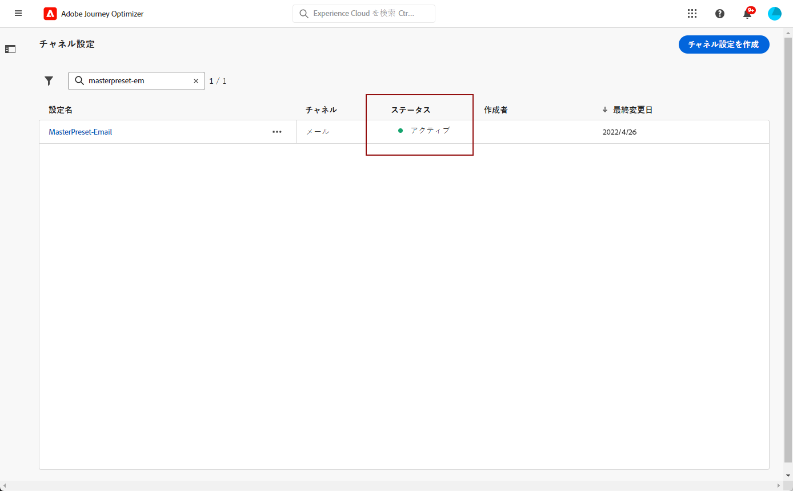

# チャネルサーフェスの設定 {#set-up-channel-surfaces}

を使用 [!DNL Journey Optimizer]を使用する場合は、メッセージに必要なすべての技術パラメーターを定義するチャネルサーフェス（メッセージプリセット）を設定できます。電子メールのタイプ、送信者の電子メールと名前、モバイルアプリ、SMS 設定など。

>[!CAUTION]
>
> * チャネルサーフェスを作成、編集、削除するには、[チャネルサーフェスの管理](../administration/high-low-permissions.md#manage-channel-surface)権限が必要です。
>
> * チャネルサーフェスを作成する前に、[メール設定](#configure-email-settings)、[プッシュ設定](../configuration/push-configuration.md)および [SMS 設定](../configuration/sms-configuration.md)の手順を実行する必要があります。

チャネルサーフェスを設定すると、ジャーニーからメッセージを作成する際にチャネルサーフェスを選択できるようになります。

<!--
➡️ [Learn how to create and use email surfaces in this video](#video-presets)
-->

## チャネルサーフェスの作成 {#create-channel-surface}

>[!CONTEXTUALHELP]
>id="ajo_admin_message_presets_header"
>title="チャネルサーフェスの設定"
>abstract="チャネルサーフェスを設定する際に、適用するチャネルを選択し、E メールのタイプ、サブドメイン、送信者名、モバイルアプリ、SMS 設定など、メッセージに必要なすべての技術的パラメーターを定義します。"

>[!CONTEXTUALHELP]
>id="ajo_admin_message_presets"
>title="チャネルサーフェスの設定"
>abstract="チャネルサーフェスを設定する際に、適用するチャネルを選択し、E メールのタイプ、送信者名、モバイルアプリ、SMS 設定など、メッセージに必要なすべての技術的パラメーターを定義します。"

<!--New contextual help content for September release: A channel surface defines all the technical parameters required for your messages (email type, sender name, mobile apps, SMS configuration, etc.): once configured, you will be able to select it when creating actions from a journey or a campaign. Note that you must have the Manage channel surface permission to create, edit and delete channel surfaces.

To create a channel surface, follow these steps:

1. Access the **[!UICONTROL Channels]** > **[!UICONTROL Branding]** > **[!UICONTROL Channel surfaces]** menu, then click **[!UICONTROL Create channel surface]**.

    

1. Enter a name and a description (optional) for the surface, then select the channel(s) to configure.

    

    >[!NOTE]
    >
    > Names must begin with a letter (A-Z). It can only contain alpha-numeric characters. You can also use underscore `_`, dot`.` and hyphen `-` characters. 

1. If you selected the **[!UICONTROL Email]** channel, configure your settings as described in [this section](email-settings.md).

    

1. For the **[!UICONTROL Push Notification]** channel, select at least one platform  -  **iOS** and/or **Android** -, and the mobile applications to use for each platform.

    
        
    >[!NOTE]
    >
    >For more on how to configure your environment to send push notifications, refer to [this section](push-gs.md).

1. For the **[!UICONTROL SMS]** channel, define your settings as detailed in [this section](sms-configuration.md#message-preset-sms).

    

    >[!NOTE]
    >
    >For more on how to configure your environment to send SMS messages, refer to [this section](sms-configuration.md).

1. Once all the parameters have been configured, click **[!UICONTROL Submit]** to confirm. You can also save the channel surface as draft and resume its configuration later on.

    

    >[!NOTE]
    >
    >You cannot proceed with surface creation while the selected IP pool is under [edition](ip-pools.md#edit-ip-pool) (**[!UICONTROL Processing]** status), and has never been associated with the selected subdomain. [Learn more](#subdomains-and-ip-pools)
    >
    >Save the surface as draft and wait until the IP pool has the **[!UICONTROL Success]** status to resume surface creation.
    
1. Once the channel surface has been created, it displays in the list with the **[!UICONTROL Processing]** status.

    During this step, several checks will be performed to verify that it has been configured properly. The processing time is around **48h-72h**, and can take up to **7-10 business days**.

    These checks include configuration and technical tests that are performed by the Adobe team:

    * SPF validation
    * DKIM validation
    * MX record validation
    * Check IPs denylisting
    * Helo host check
    * IP pool verification
    * A/PTR record, t/m/res subdomain verification

    >[!NOTE]
    >
    >If the checks are not successful, learn more on the possible failure reasons in [this section](#monitor-channel-surfaces).  

1. Once the checks are successful, the channel surface gets the **[!UICONTROL Active]** status. It is ready to be used to deliver messages.

    

## Monitor channel surfaces {#monitor-channel-surfaces}

All your channel surfaces display in the **[!UICONTROL Channels]** > **[!UICONTROL Channel surfaces]** menu. Filters are available to help you browse through the list (channel, user, status).

Once created, channel surfaces can have the following statuses:

* **[!UICONTROL Draft]**: The channel surface has been saved as a draft and has not been submitted yet. Open it to resume the configuration.
* **[!UICONTROL Processing]**: The channel surface has been submitted and is going through several verifications steps.
* **[!UICONTROL Active]**: The channel surface has been verified and can be selected to create messages.
* **[!UICONTROL Failed]**: One or several checks have failed during the channel surface verification.
* **[!UICONTROL Deactivated]**: The channel surface is deactivated. It cannot be used to create new messages.

In case a channel surface creation fails, the details on each possible failure reason are described below.

If one of these errors occurs, contact [Adobe Customer Care](https://helpx.adobe.com/enterprise/admin-guide.html/enterprise/using/support-for-experience-cloud.ug.html){target="_blank"} to get assistance.

* **SPF validation failed**: SPF (Sender Policy Framework) is an email authentication protocol that allows to specify authorized IPs that can send emails from a given subdomain. SPF validation failure means that the IP addresses in the SPF record do not match the IP addresses used for sending emails to the mailbox providers. 

* **DKIM validation failed**: DKIM (DomainKeys Identified Mail) allows the recipient server to verify that the received message was sent by the genuine sender of the associated domain and that the content of the original message was not altered on its way. DKIM validation failure means that the receiving mail servers are unable to verify the authenticity of the message content and its association with the sending domain.:

* **MX record validation failed**: MX (Mail eXchange) record validation failure means that the mail servers responsible for accepting inbound emails on behalf of a given subdomain are not correctly configured.

* **Deliverability configurations failed**: Deliverability configurations failure can happen due to any of the following reasons:
    * Blocklisting of the allocated IPs
    * Invalid `helo` name
    * Emails being sent from IPs other than the ones specified in the IP pool of the corresponding surface
    * Unable to deliver emails to inboxes of major ISPs like Gmail and Yahoo

## Edit a channel surface {#edit-channel-surface}

To edit a channel surface, follow the steps below.

>[!NOTE]
>
>You cannot edit the **[!UICONTROL Push notification settings]**. If a channel surface is only configured for the Push notification channel, it is not editable.

1. From the list, click a channel surface name to open it.

    

1. Edit its properties as desired.

    >[!NOTE]
    >
    >If a channel surface has the **[!UICONTROL Active]** status, the **[!UICONTROL Name]**, **[!UICONTROL Select channel]** and **[!UICONTROL Subdomain]** fields are greyed out and cannot be edited.

1. Click **[!UICONTROL Submit]** to confirm your changes.

    >[!NOTE]
    >
    >You can also save the channel surface as draft and resume update later on.

Once the changes are submitted, the channel surface will go through a validation cycle similar to the one in place when [creating a channel surface](#create-channel-surface). The edition processing time can take up to **3 hours**.

>[!NOTE]
>
>If you only edit the **[!UICONTROL Description]**, **[!UICONTROL Email type]** and/or **[!UICONTROL Email retry parameters]** fields, the update is instantaneous.

### Update details {#update-details}

For channel surfaces that have the **[!UICONTROL Active]** status, you can check the details of the update. To do so:

Click the **[!UICONTROL Recent update]** icon that is displayed next to the active surface name.

<!--You can also access the update details from an active channel surface while update is in progress.-->

**[!UICONTROL 最新の更新]**&#x200B;画面には、更新ステータスやリクエストされた変更のリストなどの情報が表示されます。

<!---->

### 更新ステータス {#update-statuses}

チャネルサーフェスの更新には、次のステータスがあります。

* **[!UICONTROL 処理中]**：チャネルサーフェスの更新が送信され、いくつかの検証ステップを実行中です。
* **[!UICONTROL 成功]**：更新されたチャネルサーフェスが検証済みであり、選択してメッセージを作成できます。
* **[!UICONTROL 失敗]**：チャネルサーフェスの更新を検証中に、1 つ以上のチェックが失敗しました。

各ステータスについて以下で詳しく説明します。

#### 処理中 {#surface-processing}

いくつかの配信品質チェックが実行されて、サーフェスが正しく更新されたかどうかが検証されます。

>[!NOTE]
>
>編集するフィールドが「**[!UICONTROL 説明]**」、「**[!UICONTROL メールタイプ]**」または「**[!UICONTROL メールの再試行パラメーター]**」のみの場合、更新は即時に行われます。

処理時間は、最大で **3 時間**&#x200B;かかる場合があります。検証サイクルで実行されるチェックについて詳しくは、[この節](#create-channel-surface)を参照してください。

既にアクティブになっているサーフェスを編集する場合：

* 検証プロセスが進行中の間は、ステータスは&#x200B;**[!UICONTROL アクティブ]**&#x200B;のまま変わりません。

* チャネルサーフェスリスト内のサーフェス名の横に「**[!UICONTROL 最新の更新]**」アイコンが表示されます。

* 検証プロセス中は、このサーフェスを使用してメッセージを設定しても、古いバージョンのサーフェスが引き続き使用されます。

>[!NOTE]
>
>更新中は、チャネルサーフェスを変更できません。名前はクリックできますが、フィールドはすべて灰色表示になっています。変更は、更新が正常に完了するまで反映されません。

#### 成功 {#success}

検証プロセスが正常に完了すると、このサーフェスを使用するすべてのメッセージで、新しいバージョンのサーフェスが自動的に使用されます。ただし、次の待機時間が必要になることがあります。
* 単一メッセージで使用されるまでに数分間
* サーフェスの次のバッチがバッチメッセージで有効になるまで

#### 失敗 {#failed}

検証プロセスが失敗した場合は、古いバージョンのサーフェスが引き続き使用されます。

考えられる失敗理由について詳しくは、[この節](#monitor-channel-surfaces)を参照してください。

更新が失敗すると、サーフェスが再び編集可能になります。サーフェスの名前をクリックし、修正する必要のある設定を更新できます。

## チャネルサーフェスの非アクティブ化 {#deactivate-a-surface}

**[!UICONTROL アクティブ]**&#x200B;なチャネルサーフェスを新しいメッセージの作成に使用できないようにするには、そのサーフェスを非アクティブにします。ただし、このサーフェスを現在使用しているジャーニーのメッセージは影響を受けず、引き続き機能します。

>[!NOTE]
>
>更新の処理中にチャネルサーフェスを非アクティブ化することはできません。更新が正常に完了するか失敗するまで待つ必要があります。詳しくは、[チャネルサーフェスの編集](#edit-channel-surface)およびその中の[更新ステータス](#update-statuses)を参照してください。

1. チャネルサーフェスリストにアクセスします。

1. 対象となるアクティブなサーフェスで、「**[!UICONTROL その他のアクション]**」ボタンをクリックします。

1. 「**[!UICONTROL 非アクティブ化]**」を選択します。

   

>[!NOTE]
>
>非アクティブ化されたチャネルサーフェスは削除できません。メッセージの送信にそのサーフェスを使用しているジャーニーで問題が発生しないようにするためです。

非アクティブ化されたチャネルサーフェスは直接編集できません。ただし、プリセットのコピーを作成し編集して新しいバージョンを作成し、それを使用して新しいメッセージを作成することはできます。また、プリセットを再度アクティブにし、更新が正常に完了するまで待って編集することもできます。

<!--
## How-to video{#video-presets}

Learn how to create channel surfaces, how to use them and how to delegate a subdomain and create an IP pool.

>[!VIDEO](https://video.tv.adobe.com/v/334343?quality=12)
-->
