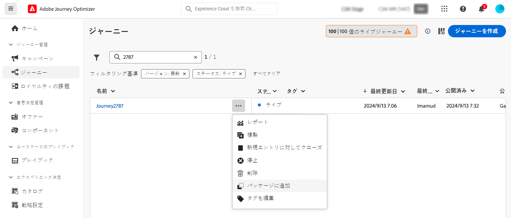
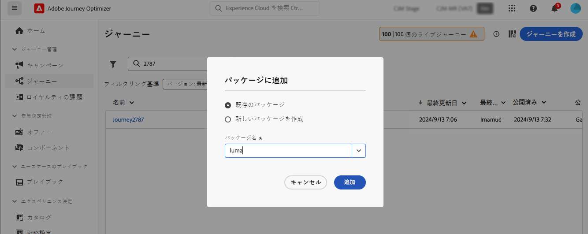
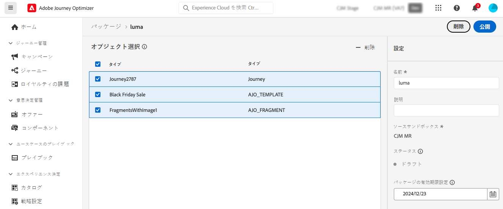
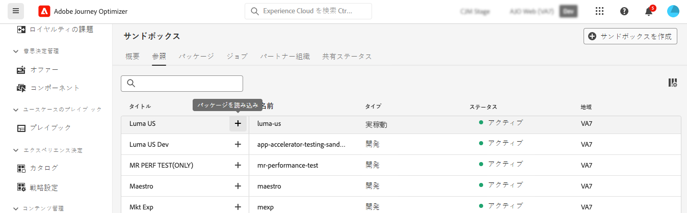
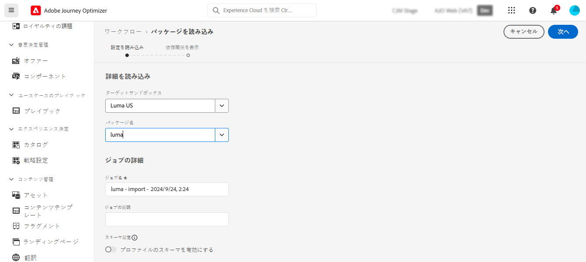
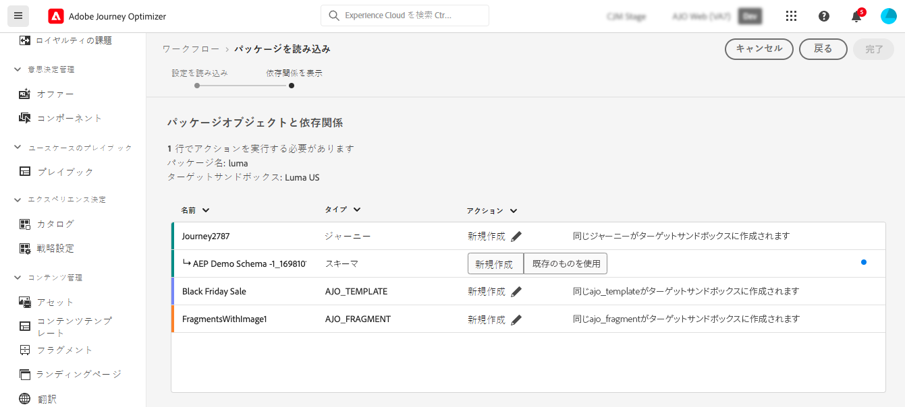

# 別のサンドボックスへのオブジェクトの書き出し {#copy-to-sandbox}

パッケージの書き出しと読み込み機能を使用して、複数のサンドボックス間でジャーニー、コンテンツテンプレート、フラグメントなどのオブジェクトをコピーできます。パッケージは、1 つのオブジェクトまたは複数のオブジェクトで構成できます。パッケージに含まれるオブジェクトは、同じサンドボックスからのものである必要があります。

このページでは、Journey Optimizer のコンテキストにおけるサンドボックスツールのユースケースについて説明します。機能自体について詳しくは、[Experience Platform ドキュメント](https://experienceleague.adobe.com/docs/experience-platform/sandbox/ui/sandbox-tooling.html?lang=ja)を参照してください。

>[!NOTE]
>
>この機能には、**サンドボックス管理**&#x200B;機能の権限（サンドボックスの管理（またはサンドボックスの表示）とパッケージの管理）が必要です。[詳細情報](../administration/ootb-permissions.md)

コピープロセスは、ソースサンドボックスとターゲットサンドボックス間のパッケージの書き出しおよび読み込みを介して実行されます。1 つのサンドボックスから別のサンドボックスにジャーニーをコピーする一般的な手順を以下に示します。

1. パッケージとして書き出すオブジェクトをソースサンドボックスに追加します。
1. パッケージをターゲットサンドボックスに書き出します。

## 書き出したオブジェクトとベストプラクティス {#objects}

Journey Optimizer では、ジャーニー、コンテンツテンプレートおよびフラグメントを別のサンドボックスに書き出すことができます。次の節では、各タイプのオブジェクトに関する情報とベストプラクティスについて説明します。

### 一般的なベストプラクティス {#global}

* オブジェクトをコピーすると、依存関係（ネストされたフラグメント、ジャーニーオーディエンス、アクションなど）が親オブジェクトで正しく更新され、ターゲットサンドボックスに適切にマッピングされます。

* 書き出したオブジェクトにプロファイルのパーソナライゼーションが含まれている場合は、パーソナライゼーションの問題を回避するのに、適切なスキーマがターゲットサンドボックスに存在することを確認します。

### ジャーニー {#journeys}

* ジャーニーを書き出すと、Journey Optimizer では、ジャーニー自体に加えて、ジャーニーに必要なほとんどのオブジェクト（オーディエンス、スキーマ、イベントおよびアクション）もコピーします。コピーされたオブジェクトについて詳しくは、この[節](https://experienceleague.adobe.com/docs/experience-platform/sandbox/ui/sandbox-tooling.html?lang=ja#abobe-journey-optimizer-objects)を参照してください。

* リンクされたすべての要素が宛先サンドボックスにコピーされるとは限りません。例えば、ジャーニーを公開する前に、徹底的に確認することを強くお勧めします。これにより、欠けている可能性のあるオブジェクトを特定できます。

* ターゲットサンドボックスにコピーされたオブジェクトは一意で、既存の要素が上書きされるリスクはありません。ジャーニーとジャーニー内のあらゆるメッセージは、両方ともドラフトモードで引き継がれます。これにより、ターゲットサンドボックスで公開する前に、徹底的な検証を実行できます。

* コピープロセスでは、ジャーニーとそのジャーニー内のオブジェクトに関するメタデータのみをコピーします。プロファイルまたはデータセットのデータは、このプロセスの一環としてコピーされません。

### キャンペーン （#campaigns）

キャンペーンが、プロファイル、オーディエンス、スキーマ、インラインメッセージおよび依存オブジェクトに関連するすべての項目と共にコピーされます。

ただし、次の項目はコピーされ **せん**。

* 多言語バリアントと言語設定
* 実験のバリアント
* 決定ポリシーと決定項目
* ビジネスルール
* タグ
* データ使用のラベル付けと適用（DULE）ラベル

キャンペーンをコピーしたら、チャネル設定を手動で選択する必要があります。

### コンテンツテンプレート {#content-templates}

* コンテンツテンプレートを書き出す際、ネストされたすべてのフラグメントも一緒にコピーされます。

* コンテンツテンプレートを書き出すと、フラグメントが重複する場合があります。例えば、2 つのテンプレートが同じフラグメントを共有し、別々のパッケージにコピーされた場合、両方のテンプレートはターゲットサンドボックスで同じフラグメントを再利用する必要があります。重複を回避するには、読み込みプロセス中に「既存のものを使用」オプションを選択します。[詳しくは、パッケージの読み込み方法を参照してください。](#import)

* 重複をさらに回避するには、コンテンツテンプレートを 1 つのパッケージで書き出すことをお勧めします。こうすることで、システムでは重複排除を効率的に管理できます。

### フラグメント {#fragments}

* フラグメントには、ライブ、ドラフト、ドラフトが進行中のライブなど、複数のステータスがあります。フラグメントを書き出す際、最新のドラフト状態がターゲットサンドボックスにコピーされます。

* フラグメントを書き出す際、ネストされたすべてのフラグメントも一緒にコピーされます。

## パッケージとしてのオブジェクトの追加{#export}

オブジェクトを別のサンドボックスにコピーするには、まずオブジェクトをパッケージとしてソースサンドボックスに追加する必要があります。次の手順に従います。

1. ジャーニーリストなど、コピーする最初のオブジェクトが保存されているインベントリに移動します。**その他のアクション**&#x200B;アイコン（オブジェクト名の横にある 3 つのドット）をクリックし、「**パッケージに追加**」をクリックします。

   

1. **パッケージに追加**&#x200B;ウィンドウで、オブジェクトを既存のパッケージに追加するか、新しいパッケージを作成するかを選択します。

   

   * **既存のパッケージ**：ドロップダウンメニューからパッケージを選択します。
   * **新しいパッケージを作成**：パッケージ名を入力します。説明を追加することもできます。

1. これらの手順を繰り返して、パッケージと共に書き出すすべてのオブジェクトを追加します。

>[!NOTE]
>
>ジャーニーの書き出しでは、Journey Optimizer では、ジャーニー自体に加えて、ジャーニーに必要なほとんどのオブジェクト（オーディエンス、スキーマ、イベントおよびアクション）もコピーします。ジャーニーの書き出しについて詳しくは、[この節](../building-journeys/copy-to-sandbox.md)を参照してください。

## 書き出すパッケージの公開 {#publish}

パッケージを書き出す準備が整ったら、次の手順に従って公開します。

1. **[!UICONTROL 管理]**／**[!UICONTROL サンドボックス]**&#x200B;メニューに移動し、「**パッケージ**」タブを選択します。

1. 書き出すパッケージを開き、書き出すオブジェクトを選択して、「**公開**」をクリックします。

   この例では、ジャーニー、コンテンツテンプレートおよびフラグメントを書き出します。

   

1. 「**[!UICONTROL ジョブ]**」タブからパッケージの公開ステータスを追跡します。ジョブについて詳しくは、リストからジョブを選択し、「**[!UICONTROL 読み込みの詳細を表示]**」ボタンをクリックします。

   

## ターゲットサンドボックスへのパッケージの読み込み {#import}

パッケージを公開したら、ターゲットサンドボックスに読み込む必要があります。次の手順に従います。

1. **[!UICONTROL サンドボックス]**&#x200B;メニューに移動し、「**[!UICONTROL 参照]**」タブを選択します。

1. パッケージを読み込むサンドボックスを検索し、名前の横にある「+」アイコンをクリックします。

   

   >[!NOTE]
   >
   >組織内のサンドボックスのみ使用できます。

1. 「**ターゲットサンドボックス**」フィールドで、正しいターゲットサンドボックスが選択されていることを確認し、**[!UICONTROL パッケージ名]**&#x200B;ドロップダウンリストから読み込むパッケージを選択します。「**次へ**」をクリックします。

   

1. パッケージオブジェクトと依存関係を確認します。これは、パッケージに追加したオブジェクトと、オーディエンス、スキーマ、イベント、アクションなど、ジャーニーが依存するその他のオブジェクトのリストです。

   各オブジェクトに対して、新しいオブジェクトを作成するか、ターゲットサンドボックス内の既存のオブジェクトを使用するかを選択できます。これにより、例えば、共通のフラグメントを使用してコンテンツテンプレートを読み込む際に発生する場合があるフラグメントの重複を回避できます。

   

1. 右上隅の「**終了**」ボタンをクリックして、ターゲットサンドボックスへのパッケージのコピーを開始します。コピー処理は、オブジェクトの複雑さや、コピーする必要のあるオブジェクトの数によって異なります。

1. 読み込みジョブをクリックして、コピー結果を確認します。

   * 「**読み込み済みオブジェクトを表示**」ボタンをクリックし、コピーした個々のオブジェクトを表示します。
   * 「**読み込みの詳細を表示**」ボタンをクリックして、各オブジェクトの読み込み結果を確認します。

   

1. ターゲットサンドボックスにアクセスし、コピーしたすべてのオブジェクトを徹底的に確認します。
