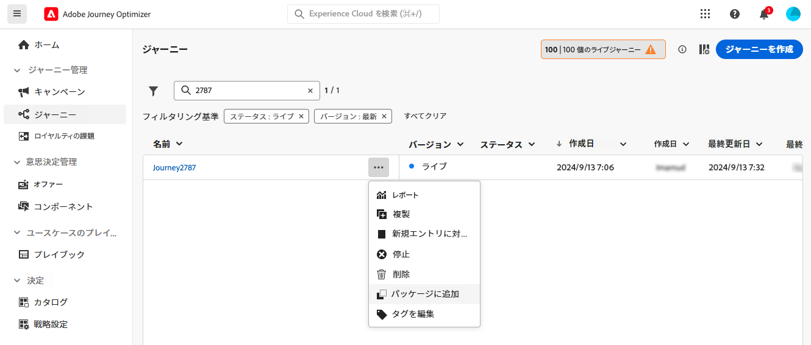
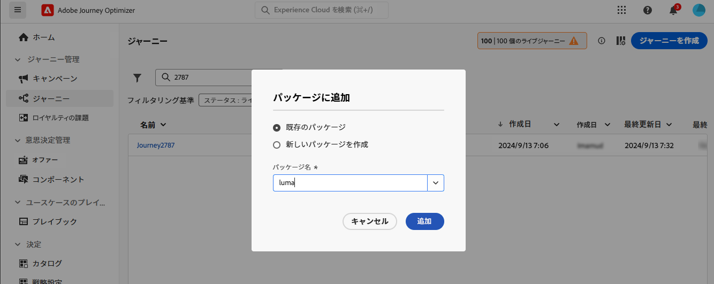
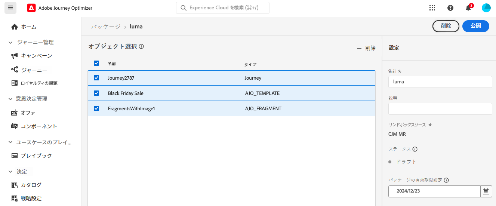
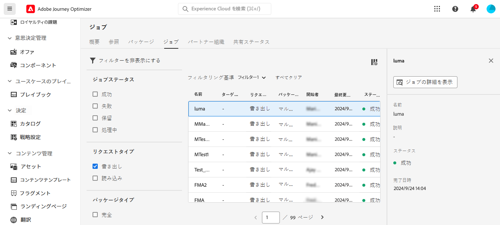
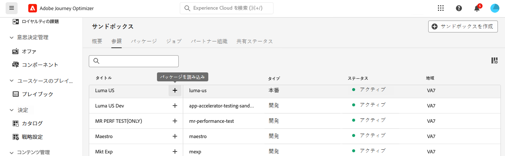
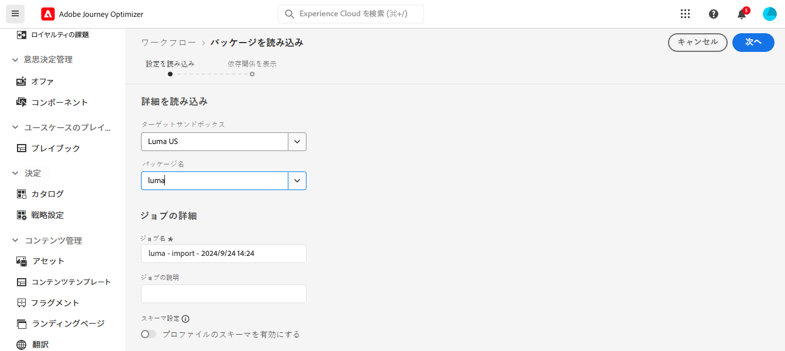
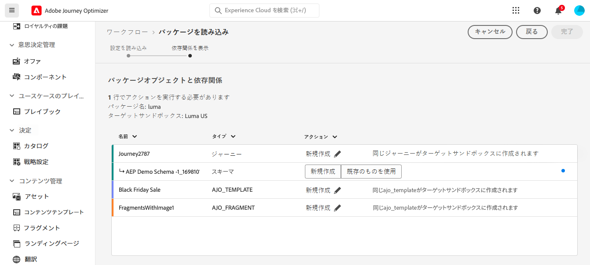
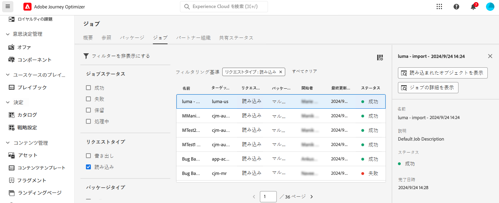

# 別のサンドボックスへのオブジェクトのエクスポート {#copy-to-sandbox}

パッケージの書き出しおよび読み込み機能を使用して、ジャーニー、キャンペーン、カスタムアクション、コンテンツテンプレート、フラグメントなどのオブジェクトを複数のサンドボックス間でコピーできます。 パッケージは、1 つのオブジェクトまたは複数のオブジェクトで構成できます。 パッケージに含まれるオブジェクトは、同じサンドボックスからのものである必要があります。

このページでは、Journey Optimizer のコンテキストにおけるサンドボックスツールのユースケースについて説明します。 機能自体について詳しくは、Adobe Experience Platform [サンドボックスツールガイド](https://experienceleague.adobe.com/docs/experience-platform/sandbox/ui/sandbox-tooling.html?lang=ja#abobe-journey-optimizer-objects){target="_blank"}を参照してください。

>[!NOTE]
>
>この機能には、**サンドボックス管理**&#x200B;機能の権限（サンドボックスの管理（またはサンドボックスの表示）とパッケージの管理）が必要です。 [詳細情報](../administration/ootb-permissions.md)

コピープロセスは、ソースサンドボックスとターゲットサンドボックス間のパッケージのエクスポートおよびインポートを介して実行されます。 1 つのサンドボックスから別のサンドボックスにジャーニーをコピーする一般的な手順を以下に示します。

1. [パッケージとして書き出すオブジェクトをソースサンドボックスに追加](#export)
1. [パッケージの公開](#publish)
1. [ターゲットサンドボックスへのパッケージの読み込み](#import)

>[!NOTE]
>
>決定管理オブジェクトをDecisioningに移行するには、専用の[決定移行API](../experience-decisioning/decisioning-migration-api.md)を使用します。このAPIは、エンティティ移行を決定するために特別に設計された自動の依存関係の解決機能とロールバック機能を提供します。

## 書き出したオブジェクトとベストプラクティス {#objects}

Journey Optimizerを使用すると、ジャーニー、キャンペーン（アクション、API トリガー、オーケストレーション）、カスタムアクション、コンテンツテンプレート、フラグメント、およびその他のオブジェクトを別のサンドボックスに書き出すことができます。 次の節では、各タイプのオブジェクトに関する情報とベストプラクティスについて説明します。

### 一般的なベストプラクティス {#global}

* オブジェクトをコピーすると、依存関係（ネストされたフラグメント、ジャーニーオーディエンス、アクションなど）が親オブジェクトで正しく更新され、ターゲットサンドボックスに適切にマッピングされます。

* エクスポートしたオブジェクトにプロファイルのパーソナライゼーションが含まれている場合は、パーソナライゼーションの問題を回避するのに、適切なスキーマがターゲットサンドボックスに存在することを確認します。

* ランディングページは現在、サンドボックス間の移行ではサポートされていません。 ジャーニーを別のサンドボックスにコピーすると、ジャーニーまたはメールコンテンツ内のランディングページへの参照は、引き続き元の（ソース）サンドボックスランディングページ ID を指します。 移行後、ターゲット（宛先）サンドボックスの正しいランディングページ ID を使用するには、ジャーニーとメールコンテンツ内のすべてのランディングページ参照を手動で更新する必要があります。 [ランディングページの作成と公開](../landing-pages/create-lp.md)を参照してください。

+++ ジャーニー

* **コピーされた依存関係** - ジャーニーを書き出すと、Journey Optimizer では、ジャーニー自体に加えて、ジャーニーに必要なほとんどのオブジェクト（オーディエンス、カスタムアクション、スキーマ、イベントおよびアクション）もコピーします。 コピーされたオブジェクトについて詳しくは、Adobe Experience Platform [サンドボックスツールガイド](https://experienceleague.adobe.com/docs/experience-platform/sandbox/ui/sandbox-tooling.html?lang=ja#abobe-journey-optimizer-objects){target="_blank"}を参照してください。

* **推奨された手動検証** - リンクされたすべての要素が宛先サンドボックスにコピーされるとは限りません。 例えば、ジャーニーを公開する前に、徹底的に確認することを強くお勧めします。 これにより、欠けている可能性のあるオブジェクトを特定できます。

* **ドラフトモードと一意性** - ターゲットサンドボックスにコピーされたオブジェクトは一意で、既存の要素が上書きされるリスクはありません。 ジャーニーとジャーニー内のあらゆるメッセージは、両方ともドラフトモードで引き継がれます。 これにより、ターゲットサンドボックスで公開する前に、徹底的な検証を実行できます。

* **メタデータ** - コピープロセスでは、ジャーニーとそのジャーニー内のオブジェクトに関するメタデータのみをコピーします。 プロファイルまたはデータセットのデータは、このプロセスの一環としてコピーされません。

* **カスタムアクション**

   * カスタムアクションをエクスポートすると、URL 設定とペイロードパラメーターがコピーされます。 ただし、セキュリティ上の理由から、認証パラメーターはコピーされず、「INSERT SECRET HERE」に置き換えられます。 また、定数リクエストヘッダーとクエリパラメーター値も「INSERT SECRET HERE」に置き換えられます。

     これには、特別な目的のカスタムアクション（[!DNL Adobe Campaign Standard]、[!DNL Campaign Classic]、[!DNL Marketo Engage]）が含まれます。

   * ジャーニーを別のサンドボックスにコピーする際に、インポートプロセス中にカスタムアクションに対して「既存を使用」を選択した場合、選択する既存のカスタムアクションはソースカスタムアクションと同じにする必要があります（例：同じ設定、パラメーターなど）。 それ以外の場合は、新しいジャーニーのコピーにキャンバスで解決できないエラーが発生します。

* **データソース、フィールドグループ、イベント** - イベント、データソース、フィールドグループを使用するジャーニーをコピーする際、読み込みプロセスによって、同じ名前とタイプのコンポーネントがターゲットサンドボックスに既に存在するかどうかが自動的に確認されます。 例えば、単一イベントは、ターゲットサンドボックス内の同じ名前の単一イベントに置き換えられます。 同じことが、ビジネスイベント、カスタムデータソース、ジャーニーで使用される API ベースとスキーマベースの両方のフィールドグループに当てはまります。 ソースサンドボックスからの単一イベントの名前がビジネスイベントの宛先サンドボックスと同じ場合、そのイベントはコピーも作成もされません。これは、他のすべてのコンポーネントにも適用されます。

+++

+++ アクションとAPI トリガーによるキャンペーン

パッケージの書き出しと読み込みを使用すると、サンドボックス間で&#x200B;**アクション** キャンペーン、**API トリガー** キャンペーンをコピーできます。

これらのタイプのキャンペーンは、プロファイル、オーディエンス、スキーマ、インラインメッセージ、依存オブジェクトに関連するすべてのアイテムとともにコピーされます。

ただし、次の項目はコピーされません。

* 多言語バリアントと言語設定、
* ビジネスルール、
* タグ、
* データ使用のラベル付けと適用（DULE）ラベル。

**アクション**&#x200B;または&#x200B;**API トリガー** キャンペーンをコピーする場合は、設定ミスを避けるために、以下に示すオブジェクトがターゲットサンドボックスで検証されていることを確認してください。

* **チャネル設定**：チャネル設定は、キャンペーンと共にコピーされます。 キャンペーンをコピーしたら、ターゲットサンドボックスでチャネル設定を手動で選択する必要があります。
* **実験のバリアントと設定**：実験のバリアントと設定は、キャンペーンのコピープロセスに含まれます。 インポート後、ターゲットサンドボックスでこれらの設定を検証します。
* **統合決定**：決定ポリシーと決定項目は、エクスポートとインポートでサポートされています。 決定関連の依存関係がターゲットサンドボックスで正しくマッピングされていることを確認します。

+++

+++オーケストレーションキャンペーン

パッケージの書き出しと読み込みを使用して、サンドボックス間でオーケストレーションされたキャンペーンをコピーできます。 オーケストレーションされたキャンペーンは、他のオブジェクトと同じ全体的なパターンに従いますが、パッケージに含まれるもの、およびターゲットサンドボックスで準備する必要があるものは、アクションまたはAPI トリガーキャンペーンとは異なります。

オーケストレーションされたキャンペーンを書き出すには、[ ソースサンドボックスのサンドボックスパッケージ ](#add-objects-as-a-package-export)に追加し（ステータスに関係なく）、[ パッケージを公開し](#publish)、次に[ パッケージ ](#import)をターゲットサンドボックスに読み込みます。

>[!IMPORTANT]
>
>読み込み直後に、[ オーケストレーションされたキャンペーン ](../campaigns/manage-campaigns.md#duplicate-a-campaign)をターゲットサンドボックスに複製し、その複製を設定、テスト、実行に使用します。 読み込んだコピーを代わりに実行または公開すると、キャンペーンレポートにフィードバックとトラッキングデータが表示されない場合があります。 この制限は、今後のリリースで削除されます。

本番環境にインポートする前に、次の動作と制限を考慮してください。

* **ドラフトコピー** - インポートされたオーケストレーション済みキャンペーンは、ソースのオーケストレーション済みキャンペーンのステータスに関係なく、常にターゲットサンドボックスのドラフトに作成されます。

* **各インポートの新しいオブジェクト** - パッケージを再度インポートすると、新しいオーケストレーションされたキャンペーンが作成されます。 以前に読み込んだキャンペーンは上書きまたは更新されません。

* **同じパッケージの再エクスポートはサポートされていません** – 同じパッケージを既にエクスポートしてから2回目に公開すると、インポートしたキャンペーン内のアクティビティがエラー状態になります。 この場合、影響を受けるアクティビティを削除し、手動で再作成する必要があります。 この制限は、今後のリリースで対応する予定です。

* **依存関係がすべて自動的にコピーされるわけではありません** - パッケージにオーケストレーションされたキャンペーンのみを追加すると、完全な依存関係チェーンが単独で含まれません。 チャネル設定、リレーショナルストアスキーマ、データセット、ビジネスルールは、明示的に対処しない限り含まれません（詳しくは、次の箇条書きを参照してください）。

  [ パッケージの読み込み](#import)中、Journey Optimizerは対象サンドボックスで解決するオブジェクトを一覧表示します。 次のルールは、最も一般的なオブジェクトに適用されます。

   * **キャンペーン** – 常に&#x200B;**新規作成**&#x200B;を選択します。
   * **オーディエンス** — Adobe Experience Platform オーディエンスの場合、**新規作成**&#x200B;または&#x200B;**既存の**&#x200B;を使用できます。 オーケストレーションされたキャンペーンオーディエンスの場合は、**既存の**&#x200B;を使用を選択し、ターゲットサンドボックス内の対応するオーディエンスにマッピングする必要があります。
   * **結合ポリシー** — **既存の**&#x200B;を選択して適切な結合ポリシーにマッピングするか、ターゲットサンドボックスでデフォルトの結合ポリシーを使用します。

  読み込み後、オーケストレーションされたキャンペーンでアラートを使用して、残りのギャップを見つけます（例えば、ターゲットサンドボックスにまだ存在しないプロファイルやターゲティングリソースは、修正するまで空のターゲットを持つアクティビティを残す可能性があります）。

* **個別に追加または調整する必要があるもの** – 以下は、オーケストレーションされたキャンペーンの書き出しに含まれていません。

   * **チャネル設定** — パッケージと共にエクスポートまたはインポートされません。 電子メールやその他のチャネルアクティビティを手動による修正なしで機能させるには、ターゲットサンドボックスに既に、名前がソースとまったく一致し（大文字と小文字が区別される）、同じチャネルを使用するチャネル設定が必要です。 そうしないと、読み込み後にアクティビティに関するアラートが表示されます。 影響を受ける各アクティビティを開き、正しいチャネル設定を選択または作成します。

   * **リレーショナルストアスキーマとデータセット** — キャンペーンが特定のデータモデルに依存している場合、スキーマとデータセットの書き出し/読み込み順序を計画し、それらを必要なときに依存関係が存在するようにします（データセットの書き出しは通常、関連するスキーマのニーズを引き出します。スキーマの書き出しだけでは、そのデータセットは含まれません）。 読み込んだデータセットは、オーケストレーションされたキャンペーンに対して自動的に有効にはなりません。読み込み後は、ターゲットサンドボックスで手動で有効にする必要があります。

   * **ビジネスルールと類似のポリシーオブジェクト** — オーケストレーションされたキャンペーンの書き出し内に含まれていません。 キャンペーンが顧客に依存している場合は、ターゲットサンドボックスにその顧客が存在することを確認するか、そこで再作成します。

   * **プロファイルターゲットディメンション** — プロファイルターゲットディメンションは書き出しに含まれていません。 ターゲットサンドボックスに存在しない場合、手動で設定するまで、インポートされたオーケストレーションされたキャンペーン内の対応するアクティビティは空になります。

+++

+++ 決定

* 決定オブジェクトをコピーする前に、以下のオブジェクトが宛先サンドボックスに存在している必要があります。

   * 決定オブジェクト全体で使用されるプロファイル属性、
   * カスタムオファー属性のフィールドグループ、
   * ルール、ランキングまたはキャップをまたいだコンテキスト属性に使用されるデータストリームのスキーマ。

* AI モデルを使用したランキング式のサンドボックスコピーは、現在サポートされていません。

* キャンペーンをコピーする際、決定項目（オファー項目）は自動的にはコピーされません。 「パッケージに追加」オプションを使用して、個別にコピーしてください。

* 決定ポリシーに選択戦略がある場合は、決定項目を別途追加する必要があります。 手動／フォールバック決定項目がある場合は、直接依存関係として自動的に追加されます。

* 決定エンティティをコピーする際は、他のオブジェクトの&#x200B;**前**&#x200B;に決定項目をコピーします。 例えば、最初にコレクションをコピーし、新しいサンドボックスにオファーがない場合、その新しいコレクションは空のままになります。

* 依存関係のあるエンティティ（スキーマ、セグメントなど）をコピーする際、エンティティに対して「新規作成」をクリックして選択解除し、依存アーティファクトの「既存を使用」オプションを表示します。 追加の依存関係がある場合は、階層の下でこの手順を繰り返す必要があります。

  例：キャンペーンの読み込み中に、ルール内のデータストリームスキーマを再利用するには、DECISIONING_STRATEGY に対して「新規作成」をクリックし、次に DECISIONING_RULES に対してもう一度クリックして、データストリームスキーマの「既存を使用」オプションを表示します。

* データストリームコンテキストスキーマに依存するエンティティの場合は、データストリームが事前に作成されていることを確認し、そのデータストリームの既存のスキーマを選択します。

* 読み込み中に「終了」を直接クリックすると、すべての依存関係が新たに作成されます。

+++

+++ コンテンツテンプレート

* コンテンツテンプレートをエクスポートする際、ネストされたすべてのフラグメントも一緒にコピーされます。

* コンテンツテンプレートをエクスポートすると、フラグメントが重複する場合があります。 例えば、2 つのテンプレートが同じフラグメントを共有し、別々のパッケージにコピーされた場合、両方のテンプレートはターゲットサンドボックスで同じフラグメントを再利用する必要があります。 重複を回避するには、読み込みプロセス中に「既存のものを使用」オプションを選択します。 [詳しくは、パッケージの読み込み方法を参照してください。](#import)

* 重複をさらに回避するには、コンテンツテンプレートを 1 つのパッケージでエクスポートすることをお勧めします。 こうすることで、システムでは重複排除を効率的に管理できます。

+++

+++ フラグメント

* フラグメントには、ライブ、ドラフト、ドラフトが進行中のライブなど、複数のステータスがあります。 フラグメントをエクスポートする際、最新のドラフト状態がターゲットサンドボックスにコピーされます。

* フラグメントをエクスポートする際、ネストされたすべてのフラグメントも一緒にコピーされます。

+++

+++ ジャーニーフラグ

* サンドボックスツールでは、[ジャーニーフラグメント ](../building-journeys/journey-fragments.md) （ジャーニーノードの再利用可能なセット）がサポートされています。 ジャーニーフラグメントを書き出すと、最新のドラフト状態がターゲットサンドボックスにコピーされます。

+++

## パッケージとしてのオブジェクトの追加 {#export}

オブジェクトを別のサンドボックスにコピーするには、まずオブジェクトをパッケージとしてソースサンドボックスに追加する必要があります。 次の手順に従います。

1. ジャーニーリストなど、コピーする最初のオブジェクトが保存されているインベントリに移動します。 **その他のアクション**&#x200B;アイコン（オブジェクト名の横にある 3 つのドット）をクリックし、「**パッケージに追加**」をクリックします。

   

1. **パッケージに追加**&#x200B;ウィンドウで、オブジェクトを既存のパッケージに追加するか、新しいパッケージを作成するかを選択します。

   

   * **既存のパッケージ**：ドロップダウンメニューからパッケージを選択します。
   * **新しいパッケージを作成**：パッケージ名を入力します。 説明を追加することもできます。

1. これらの手順を繰り返して、パッケージと共にエクスポートするすべてのオブジェクトを追加します。

## エクスポートするパッケージの公開 {#publish}

パッケージをエクスポートする準備が整ったら、次の手順に従って公開します。

1. **[!UICONTROL 管理]**／**[!UICONTROL サンドボックス]**&#x200B;メニューに移動し、「**パッケージ**」タブを選択します。

1. エクスポートするパッケージを開き、エクスポートするオブジェクトを選択して、「**公開**」をクリックします。

   この例では、ジャーニー、コンテンツテンプレートおよびフラグメントをエクスポートします。

   

1. 「**[!UICONTROL ジョブ]**」タブからパッケージの公開ステータスを追跡します。 ジョブについて詳しくは、リストからジョブを選択し、「**[!UICONTROL 読み込みの詳細を表示]**」ボタンをクリックします。

   

## ターゲットサンドボックスへのパッケージの読み込み {#import}

パッケージを公開したら、ターゲットサンドボックスに読み込む必要があります。 次の手順に従います。

1. **[!UICONTROL サンドボックス]**&#x200B;メニューに移動し、「**[!UICONTROL 参照]**」タブを選択します。

1. パッケージを読み込むサンドボックスを検索し、名前の横にある「+」アイコンをクリックします。

   

   >[!NOTE]
   >
   >組織内のサンドボックスのみ使用できます。

1. 「**ターゲットサンドボックス**」フィールドで、正しいターゲットサンドボックスが選択されていることを確認し、**[!UICONTROL パッケージ名]**&#x200B;ドロップダウンリストから読み込むパッケージを選択します。 「**次へ**」をクリックします。

   

1. パッケージオブジェクトと依存関係を確認します。 これは、パッケージに追加したオブジェクトと、オーディエンス、スキーマ、イベント、アクションなど、ジャーニーが依存するその他のオブジェクトのリストです。

   各オブジェクトに対して、新しいオブジェクトを作成するか、ターゲットサンドボックス内の既存のオブジェクトを使用するかを選択できます。 これにより、例えば、共通のフラグメントを使用してコンテンツテンプレートを読み込む際に発生する場合があるフラグメントの重複を回避できます。

   

1. 右上隅の「**終了**」ボタンをクリックして、ターゲットサンドボックスへのパッケージのコピーを開始します。 コピー処理は、オブジェクトの複雑さや、コピーする必要のあるオブジェクトの数によって異なります。

1. 読み込みジョブをクリックして、コピー結果を確認します。

   * 「**読み込み済みオブジェクトを表示**」ボタンをクリックし、コピーした個々のオブジェクトを表示します。
   * 「**読み込みの詳細を表示**」ボタンをクリックして、各オブジェクトの読み込み結果を確認します。

   

1. ターゲットサンドボックスにアクセスし、コピーしたすべてのオブジェクトを徹底的に確認します。
